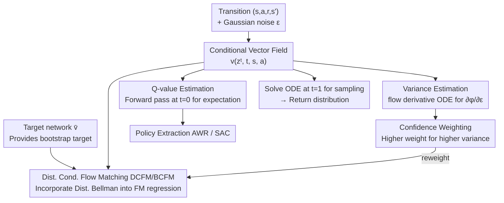

# Value Flows

**Conference**: ICLR 2026  
**arXiv**: [2510.07650](https://arxiv.org/abs/2510.07650)  
**Code**: [GitHub](https://github.com/chongyi-zheng/value-flows)  
**Area**: Reinforcement Learning / Distributional RL / Generative Models  
**Keywords**: distributional RL, flow matching, return distribution, uncertainty quantification, OGBench

## TL;DR
Value Flows introduces flow matching to distributional RL for the first time by learning a vector field where the generated probability density paths automatically satisfy the distributional Bellman equation. By efficiently estimating return variance via a flow derivative ODE, it enables confidence-weighted prioritized learning, achieving a 1.3× average success rate improvement on 62 OGBench tasks and over 3× better return distribution estimation accuracy than C51/CODAC.

## Background & Motivation
**Background**: Standard RL compresses future returns into a single scalar Q-value. Distributional RL (C51, QR-DQN, IQN) models the full return distribution, providing stronger learning signals and supporting applications in exploration and safe RL.

**Limitations of Prior Work**:
   - **C51**: Discretizes the return distribution into fixed bins → limited resolution, unable to capture fine-grained distributional structures.
   - **IQN/QR-DQN**: Approximates using finite quantiles → distribution information between quantiles is lost.
   - **Difficulty in Variance Estimation**: Discretization methods struggle to precisely estimate return variance, which is crucial for uncertainty quantification.
   - Modern generative models (Diffusion/Flow Matching) have succeeded in trajectory/policy modeling but have not yet been applied to return distribution modeling.

**Key Challenge**: How to learn a full continuous return distribution (rather than a discretized approximation) and efficiently extract expectation and variance to improve policy learning?

**Core Idea**: Use flow matching to learn the vector field $v(z^t | t, s, a)$ of the return distribution. Construct a flow matching objective (DCFM loss) that satisfies the distributional Bellman equation, and estimate variance through a flow derivative ODE without backpropagation.

## Method

### Overall Architecture
Value Flows addresses how to directly learn a **continuous return distribution** for a state-action pair without discretization, while simultaneously extracting expectation and variance. It assigns this task to flow matching: starting from standard Gaussian noise $\epsilon$, a conditional vector field $v(z^t | t, s, a)$ drives a flow ODE to transport noise into return samples along time $t$. This ODE induces a probability density path $p(z^t | t, s, a)$ that converges to the true return distribution $p_{Z^\pi}(z | s, a)$ at $t=1$. During training, instead of using ground truth distributions from sampled trajectories, a regression objective (DCFM loss) similar to TD learning is constructed to ensure vector field consistency.

Once the vector field is learned, the same components are reused: a single forward pass at $t=0$ reads the expectation (Q-value) for the critic; solving the ODE at $t=1$ samples the entire return distribution; and a parallel flow derivative ODE estimates return variance. This variance is used to weight training samples, tilting the learning budget toward transitions with high uncertainty—this weighting flows back into the DCFM loss, forming a "variance estimation $\rightarrow$ re-training" loop.

### Key Designs

**1. Distributed Conditional Flow Matching (DCFM) Loss: Turning the Distributive Bellman Equation into a Regressible Flow Matching Objective**

The fundamental pain point is the lack of ground truth return distributions for supervision. Value Flows' solution is to incorporate the distributional Bellman operator $\mathcal{T}^\pi$ into the flow matching update: construct the next-round vector field $v_{k+1}(z^t|t,s,a)$ such that the density it generates equals the result of applying $\mathcal{T}^\pi$ to the current density $p_k$. The final loss is a least-squares regression:

$$\mathcal{L}_{DCFM}(v, v_k) = \mathbb{E}_{(s,a,r,s') \sim D}\Big[\big(v(z^t|t,s,a) - v_k(\tfrac{z^t-r}{\gamma}|t,s',a')\big)^2\Big].$$

The elegance lies in the regression target $v_k(\frac{z^t-r}{\gamma}|t,s',a')$ acting as the bootstrap target in TD learning—corresponding to $r + \gamma Q(s',a')$ in scalar Q-learning, but bootstrapping the entire distribution. The vector field of the next state, evaluated on scaled and shifted inputs, is used as the target for the current state. The paper proves via Proposition 2 that the gradient of this conditional DCFM loss is identical to the theoretical Distributed Flow Matching (DFM) loss, utilizing the "conditional expectation omission" trick of CFM. To prevent distribution collapse during bootstrapping, a target network $\bar v$ provides the target, resulting in the Bootstrapped BCFM loss.

**2. Q-value Estimation (Proposition 3): Critic usage via a single forward pass**

If calculating a Q-value required integrating the ODE from $t=0$ to $t=1$ for every sample, it would be too slow for actor-critic frameworks. Proposition 3 provides a shortcut: the expected return can be directly read from the expectation of the vector field relative to the noise at $t=0$:

$$\hat{\mathbb{E}}[Z^\pi(s,a)] \approx \mathbb{E}_{\epsilon \sim \mathcal{N}}\big[v(\epsilon \mid 0, s, a)\big].$$

Consequently, expected returns do not require solving the ODE; they only require averaging a few noise samples passed through the network at the initial time step. This reduces the computational cost of the Value Flows critic to the same level as standard Q-networks. Full ODE solving is only used when the entire distribution (sampling, variance estimation) is needed, allowing it to integrate seamlessly into actor-critic frameworks like Advantage-Weighted Regression or SAC.

**3. Variance Estimation (Flow Derivative ODE): Uncertainty as a free byproduct of Flow Matching**

While expectations are easy to obtain, variance is what is truly desired for uncertainty quantification. Discretization methods (C51/IQN) usually require calculating second moments or using ensembles. Value Flows notes that variance information is hidden in the flow's sensitivity to initial noise: define a companion ODE parallel to the main ODE:

$$\frac{d}{dt}\Big(\frac{\partial \phi}{\partial \epsilon}\Big) = \frac{\partial v}{\partial z}\cdot \frac{\partial \phi}{\partial \epsilon},$$

where $\partial\phi/\partial\epsilon$ is the derivative of the generative mapping $\phi$ with respect to initial noise $\epsilon$. At $t=1$, $|\partial\phi/\partial\epsilon|$ reflects the degree of local density stretching/compression—more intense stretching indicates a wider distribution and higher variance. Crucially, this companion ODE can be integrated forward alongside the main ODE (or using forward-mode automatic differentiation) **without backpropagating through the ODE solver**, making variance estimation a highly efficient byproduct of the framework.

**4. Confidence-Weighted Training: Tilting the learning budget to high-uncertainty transitions**

With the per-sample variance proxy $|\partial\phi/\partial\epsilon|$, principled prioritized replay is possible. The training weight for each transition is:

$$w = \sigma\!\big(-\tau / |\partial\phi/\partial\epsilon|\big) + 0.5,$$

where higher $|\partial\phi/\partial\epsilon|$ indicates more drastic local density changes and higher return uncertainty, leading to higher weights. Unlike classic PER, priority here stems from the data's aleatoric uncertainty (return distribution width caused by environmental stochasticity) rather than bootstrapped TD error, making it more stable on data with non-uniform coverage.

### Loss & Training
The total loss is the BCFM loss (bootstrapped DCFM, structurally similar to fitted Q-learning) combined with the confidence weights. The target network is updated slowly via EMA to provide stable targets. Policy extraction follows Advantage-Weighted Regression or SAC. The method supports both pure offline and offline-to-online settings.

## Key Experimental Results

### Main Results: OGBench (62 tasks, 37 state-based + 25 image-based)

| OGBench Domain | BC | IQL | ReBRAC | FQL | **Ours (Value Flows)** |
|---|---|---|---|---|---|
| cube-double-play | 2 | 6 | 12 | 29 | **69±4** |
| puzzle-3x3-play | 2 | 9 | 22 | 30 | **87±13** |
| scene-play | 5 | 28 | 41 | 56 | **59±4** |
| **Avg. Success Rate** | — | — | — | — | **1.3× Gain** |

### Distribution Accuracy

| Method | 1-Wasserstein Distance ↓ |
|------|---------------------|
| C51 | ~0.09 |
| CODAC | ~0.06 |
| **Ours (Value Flows)** | **~0.02** |

Value Flows' distribution estimation is 4.5× more accurate than C51 and 3× more accurate than CODAC.

### Ablation Study

| Configuration | Effect | Description |
|------|------|------|
| W/o Confidence Weighting | Performance Drop | Necessity of prioritized learning for high-uncertainty transitions |
| W/o Bootstrapped Target | Degradation/Collapse | DCFM alone is insufficient for stability |
| Q Estimation vs. Ensemble | Ours is more accurate | Single network estimation is sufficient |
| Offline-to-online fine-tune | Further improvement | Variance estimation naturally supports online exploration |

### Key Findings
- Flow matching provides **significantly more precise** return distribution estimates than discretization (C51) or quantile (IQN) methods.
- Q-value estimation only requires a forward pass at $t=0$—computational cost is comparable to standard Q-networks (full ODE solving not required).
- Confidence weighting brings consistent performance gains, particularly on "play" datasets with non-uniform coverage.
- Effectiveness on image-based tasks (improvement across 25 image tasks) indicates compatibility with vision backbones.
- In offline-to-online settings, variance estimation naturally provides exploration signals without separate exploration policies.

## Highlights & Insights
- **Elegant correspondence between Flow Matching and Distributional Bellman**: DCFM loss is a continuous generative model version of distributional TD learning—the vector field is the "critic," and flow ODE is the "rollout."
- **Variance as a Byproduct**: Traditional distributional RL variance estimation requires additional means (e.g., ensembles, second-moment networks). Value Flows obtains it naturally via the flow derivative ODE—a unique advantage of the flow matching framework.
- **Q-value via Single Forward Pass** (Proposition 3) is a critical practical feature—inference is no slower than standard Q-networks, with ODE solving reserved for full distribution requirements.

## Limitations & Future Work
- Cannot distinguish between epistemic uncertainty (from insufficient data) and aleatoric uncertainty (from environmental stochasticity)—confidence weights only reflect aleatoric.
- ODE solving adds computational overhead during training and distribution sampling (though not for Q-estimation).
- Tested only on continuous control (OGBench + D4RL); no benchmarks for discrete action spaces like Atari.
- Generative modeling of a 1D return scalar is relatively simple—flow matching's advantages might be near their ceiling here.
- Scalability to larger action spaces and longer horizons requires further validation.

## Related Work & Insights
- **vs. C51**: Discretizes returns into 51 bins with KL divergence optimization; Value Flows uses continuous FM to model density directly, increasing accuracy by 4.5×.
- **vs. IQN**: Approximates with finite quantiles; Value Flows learns the full continuous distribution.
- **vs. CODAC**: Uses ODEs for distribution modeling but not based on flow matching; Value Flows is theoretically more natural and 3× more accurate.
- **Insights for Generative Models in RL**: Following trajectory generation (Diffuser) and policy generation (DDPO), Value Flows demonstrates generative models' application on the critic side (Value Function)—completing the "generative modeling" of the actor-critic framework.

## Rating
- Novelty: ⭐⭐⭐⭐⭐ Brand new combination of flow matching and distributional RL with elegant theoretical links.
- Experimental Thoroughness: ⭐⭐⭐⭐⭐ 62 tasks (state + image) × 8 seeds × multiple baselines × distribution accuracy × ablations.
- Writing Quality: ⭐⭐⭐⭐⭐ Rigorous derivations; the step-by-step progression from DFM → DCFM → BCFM is clear.
- Value: ⭐⭐⭐⭐⭐ Opens a new path for generative models in distributional RL; variance as a byproduct has broad application potential.

<!-- RELATED:START -->

## Related Papers

- [\[ICLR 2026\] ReFORM: Reflected Flows for On-support Offline RL via Noise Manipulation](reform_reflected_flows_for_on-support_offline_rl_via_noise_manipulation.md)
- [\[ICLR 2026\] From Ticks to Flows: Dynamics of Neural Reinforcement Learning in Continuous Environments](from_ticks_to_flows_dynamics_of_neural_reinforcement_learning_in_continuous_envi.md)
- [\[ICLR 2026\] Relative Value Learning](relative_value_learning.md)
- [\[ICLR 2026\] Universal Value-Function Uncertainties](universal_value-function_uncertainties.md)
- [\[ICLR 2026\] Offline Preference-based Value Optimization](offline_preference-based_value_optimization.md)

<!-- RELATED:END -->
