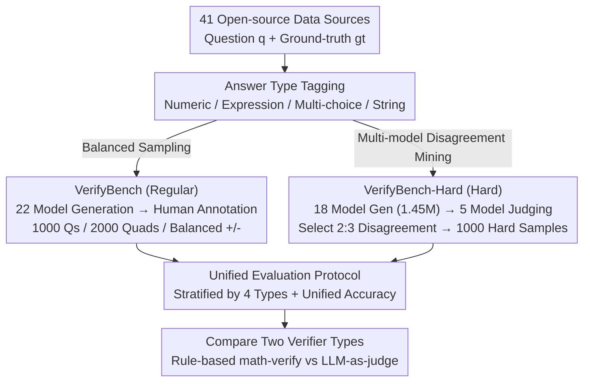

# VerifyBench: Benchmarking Reference-based Reward Systems for Large Language Models

**Conference**: ICLR 2026  
**arXiv**: [2505.15801](https://arxiv.org/abs/2505.15801)  
**Code**: [GitHub](https://github.com/ZJU-REAL/VerifyBench)  
**Area**: Reinforcement Learning  
**Keywords**: reward model, benchmark, verification, LLM, reinforcement-learning

## TL;DR

Addressing the reference-based reward systems widely used in Large Reasoning Model (LRM) training, this work constructs two benchmarks, VerifyBench and VerifyBench-Hard. Through rigorous human annotation to evaluate the accuracy of various verification systems, it finds that even the strongest models achieve only approximately 88% accuracy on difficult samples, revealing significant room for improvement in current verification systems.

## Background & Motivation

**LRM training relies on reference-based rewards**: Reasoning models such as OpenAI o1 and DeepSeek-R1 utilize reference-based reward systems during RL training, where rewards are assigned based on the consistency between the model output and the ground-truth answer.

**Existing benchmarks focus on preference comparison**: Current reward model evaluations (e.g., RewardBench) primarily assess pairwise preference judgments—choosing the better of two responses—rather than determining whether a single response is correct.

**Disconnection between evaluation and actual usage**: Reward systems in LRM training need to judge the consistency between a response and a reference answer (absolute correctness) rather than comparing two responses (relative preference), representing a fundamental difference.

**Limitations of rule-based methods**: Rule-based methods like math-verify used in SimpleRL exhibit obvious flaws in mathematical expression matching, but standardized evaluations to quantify these deficiencies are lacking.

**Demand for difficult samples**: Models perform well on simple verification tasks (~95%), but the gap is significant on truly ambiguous hard samples (~70-88%), requiring specialized difficult benchmarks to drive progress.

## Method

### Overall Architecture

VerifyBench redefines "evaluating reward systems" from the mainstream preference comparison as an absolute correctness judgment task: given a question $q$, a ground-truth answer $gt$, and a model response $r$, the verification system $R_\phi$ only needs to determine whether $r$ is consistent with $gt$, rather than picking the better one between two responses—this is the actual function of reward systems in LRM RL training. Around this definition, the authors started from 41 open-source data sources to parallelly construct two datasets: VerifyBench, a regular set with a natural distribution and balanced positive/negative samples created via "answer type tagging → 22 model generations → balanced downsampling," and VerifyBench-Hard, a difficult set identifying ambiguous samples through "massive generation from 18 models → judgment by 5 top models → selecting samples with model disagreement." Labels for both sets were locked through independent dual-human annotation + meta-annotator adjudication. Finally, a unified evaluation protocol was applied, stratifying by four answer types and using a unified accuracy metric to test both rule-based (math-verify) and LLM-as-judge verifiers.

### Key Designs

**1. VerifyBench Regular Set: Eliminating Evaluation Bias with Balanced Sampling**

Existing reward model evaluations are mostly pairwise comparisons, which are disconnected from the real need of "judging whether a single response is correct" in LRM training. VerifyBench therefore uses Llama-3.3-70B to automatically tag questions into four answer types: numeric, algebraic expression, multi-choice, and free text. 2,000 questions were randomly sampled per type to form 8,000 candidates, followed by 176,000 response generations from 22 open/closed-source models. In the final step, the authors found that model predictions were biased in terms of answer types and correctness, so they performed controlled downsampling—keeping 250 questions per type, each with one correct and one incorrect response. This resulted in 1,000 questions and 2,000 $(q, gt, r, y)$ quadruplets (where $y$ is the human-annotated correctness label), which are uniform across types and balanced between positive and negative samples. Consequently, final scores reflect verification capability itself without being skewed by specific answer types or sample balances.

**2. VerifyBench-Hard: Mining Controversial Samples via Multi-model Disagreement**

On regular verification tasks, major models already achieve 93–95% accuracy, making it difficult to distinguish methods. The authors first used 18 open-source models to generate approximately 1.45 million responses for the same batch of questions, then had 5 of the best-performing LLMs from VerifyBench judge them individually. They specifically picked "2:3 disagreement" samples—where two models judged one way and three judged the other. These cases are truly ambiguous and highlight the weaknesses of verification systems. After stratified sampling across data domains and sources, 2,000 samples were manually annotated to yield 1,000 hard samples. Unlike the regular set, a natural distribution was adopted here; thus, correct answers account for only 29.1%. This skew later revealed the tendency of LLMs to "false accept" incorrect answers.

**3. Unified Evaluation Protocol: Comparing Verifiers via Stratification and Unified Metrics**

In real training, two verification routes coexist—DeepSeek-R1 uses rule-based methods to prevent reward hacking, while Seed1.5-Thinking uses model-based methods for more precise signals—but fair comparisons have been lacking. VerifyBench integrates both systems into a single accuracy metric:

$$\text{Accuracy} = \frac{1}{|\mathcal{D}|} \sum_{(q,gt,r,y) \in \mathcal{D}} \mathbb{I}[E(R_\phi(q, gt, r)) = y]$$

where $R_\phi$ is the verification system output, $E(\cdot)$ extracts its judgment, and $y$ is the human label. Crucially, the benchmark reports accuracy for four answer types separately: Numeric (straightforward), Algebraic Expression (requires mathematical equivalence), Multi-choice (requires semantic understanding), and String (hardest for exact matching). This stratified perspective exposed systematic flaws in the rule-based math-verify on Multi-choice (55.00%) and String (51.60%) tasks, where it performed near random chance—deficiencies invisible when looking only at total scores.

### Key Experimental Results

#### Main Results

**VerifyBench Overall Accuracy (%)**:

| Model/Method | Numeric | Expression | MC | String | AVG |
|----------|---------|-----------|-----|--------|-----|
| math-verify (Rule) | 85.60 | 75.60 | 55.00 | 51.60 | **66.95** |
| GPT-4o | 94.80 | 90.20 | 96.80 | 90.80 | 93.15 |
| DeepSeek-V3 | 96.80 | 93.00 | 97.60 | 91.60 | 94.75 |
| DeepSeek-R1 | 98.00 | 92.60 | 98.00 | 92.00 | **95.15** |
| Qwen3-32B | 97.60 | 94.00 | 99.00 | 92.60 | 95.80 |
| gpt-oss-120b | 98.00 | 94.80 | 99.20 | 91.40 | **95.85** |

**VerifyBench-Hard Overall Accuracy (%)**:

| Model/Method | Numeric | Expression | MC | String | AVG |
|----------|---------|-----------|-----|--------|-----|
| math-verify (Rule) | 84.52 | 82.95 | 68.37 | 78.26 | **76.00** |
| GPT-4o | 71.43 | 65.91 | 75.35 | 71.30 | 72.60 |
| DeepSeek-R1 | 82.14 | 81.82 | 90.93 | 85.22 | **86.60** |
| gpt-oss-120b | 84.13 | 80.68 | 92.56 | 86.09 | **87.90** |
| Llama-3.2-1B | 44.40 | 41.00 | 37.60 | 53.60 | 44.15 |

#### Ablation Study

**Difficulty Analysis by Answer Type (VB-Hard)**:

| Answer Type | VB Max | VB-Hard Max | Decrease |
|---------|----------------|-------------|---------|
| Numeric | 98.00% | 84.52% | -13.5% |
| Expression | 94.80% | 82.95% | -11.9% |
| Multi-choice | 99.20% | 92.56% | -6.6% |
| String | 92.60% | 86.09% | -6.5% |

**Model Scaling Effects (Llama Series, VB-Hard)**:

| Model | Params | VB-Hard AVG |
|------|--------|------------|
| Llama-3.2-1B | 1B | 25.60% |
| Llama-3.2-3B | 3B | 33.90% |
| Llama-3.1-8B | 8B | 43.20% |
| Llama-3.3-70B | 70B | 54.70% |

### Key Findings

1.  **Rule-based methods are severely insufficient**: math-verify achieved only 66.95% on VerifyBench, performing near random on Multi-choice (55.00%) and String (51.60%), indicating significant flaws in the rule-based rewards used in models like DeepSeek-R1.
2.  **Huge gap between VB and VB-Hard**: Top models reached 95%+ on VerifyBench but only 87-88% on VB-Hard, proving that hard verification tasks are the current bottleneck.
3.  **LLMs are prone to "false acceptance"**: In VB-Hard, where correct answers were only 29.1%, larger models tended to incorrectly judge wrong answers as correct—a dangerous trait for RL training that leads to false positive rewards.
4.  **Limited gains from scaling**: On VB-Hard, accuracy improved from 25.6% (1B) to 54.7% (70B) for Llama models but remained far from reliable, suggesting scaling alone is insufficient.
5.  **Reasoning capability aids verification**: DeepSeek-R1's reasoning capability provided a distinct advantage on VB-Hard (86.60% vs. 72.60% for GPT-4o).

## Highlights & Insights

1.  **Filling the evaluation gap**: The first benchmark specifically evaluating reference-based reward systems, directly corresponding to actual LRM RL training scenarios.
2.  **Ingenious construction of VerifyBench-Hard**: Leveraging multi-model disagreement to identify difficult samples ensures the benchmark's discriminative power.
3.  **Systematic weaknesses in rule-based methods**: Quantifying math-verify's performance across answer types provides empirical guidance for selecting reward systems in RL training.
4.  **Discovery of "false acceptance" bias**: The finding that LLMs tend to accept incorrect answers serves as a critical warning against reward hacking in RL training.
5.  **Rigorous quality assurance**: Utilizes dual-human annotation + meta-annotator arbitration with large-scale coverage of 41 data sources and 22 models.

## Limitations & Future Work

1.  **Focus on reasoning tasks**: VerifyBench focuses on math and logic, excluding verification in scenarios like code generation or creative writing.
2.  **Limited answer types**: Excludes proof-based and open-ended questions, which are equally important in research.
3.  **Static benchmark**: As model capabilities improve, VB-Hard may quickly saturate, requiring continuous updates.
4.  **Single evaluation mode**: Only explores prompt-based LLM-as-judge without investigating specifically trained verification models.
5.  **Downstream impact of verification failure**: Empirical analysis on how inaccurate verification specifically impacts RL training quality (e.g., reward hacking, training instability) is not yet conducted.

## Related Work & Insights

*   **RewardBench**: A benchmark for evaluating pairwise preference judgments; VerifyBench is complementary by evaluating absolute correctness.
*   **DeepSeek-R1**: Uses rule-based rewards to prevent reward hacking, but VerifyBench reveals significant rule-based deficiencies (66.95%), suggesting a combination with model-based methods.
*   **Seed1.5-Thinking**: Uses model-based methods for more precise reward signals; VerifyBench provides a standardized tool to evaluate such methods.
*   **Insight**: Verification accuracy in RL training directly impacts the upper bound of model reasoning. The ~88% accuracy on VB-Hard implies that approximately 12% of reward signals are incorrect, which systematically degrades RL effectiveness. Building more accurate verification systems may be a key bottleneck for advancing reasoning models.

## Rating

*   **Novelty**: ⭐⭐⭐⭐ First to systematically isolate reference-based reward evaluation from preference comparison; creative construction of VB-Hard.
*   **Experimental Thoroughness**: ⭐⭐⭐⭐⭐ Covers 20+ models, 4 answer types, two difficulty levels, with rigorous human annotation.
*   **Writing Quality**: ⭐⭐⭐⭐ Problem definition is clear, benchmark construction is sound, and data statistics are detailed.
*   **Value**: ⭐⭐⭐⭐ Directly guides the design of reward systems in LRM RL training, highlighting the limits of rule-based and model-based verification.

<!-- RELATED:START -->

## Related Papers

- [\[ICLR 2026\] On Predictability of Reinforcement Learning Dynamics for Large Language Models](on_predictability_of_reinforcement_learning_dynamics_for_large_language_models.md)
- [\[ICLR 2026\] AWM: Accurate Weight-Matrix Fingerprint for Large Language Models](awm_accurate_weight-matrix_fingerprint_for_large_language_models.md)
- [\[ICLR 2026\] Robust Multi-Objective Controlled Decoding of Large Language Models](robust_multi-objective_controlled_decoding_of_large_language_models.md)
- [\[ICLR 2026\] Revolutionizing Reinforcement Learning Framework for Diffusion Large Language Models](revolutionizing_reinforcement_learning_framework_for_diffusion_large_language_mo.md)
- [\[ICLR 2026\] Using Reinforcement Learning to Train Large Language Models to Explain Human Decisions](using_reinforcement_learning_to_train_large_language_models_to_explain_human_dec.md)

<!-- RELATED:END -->
