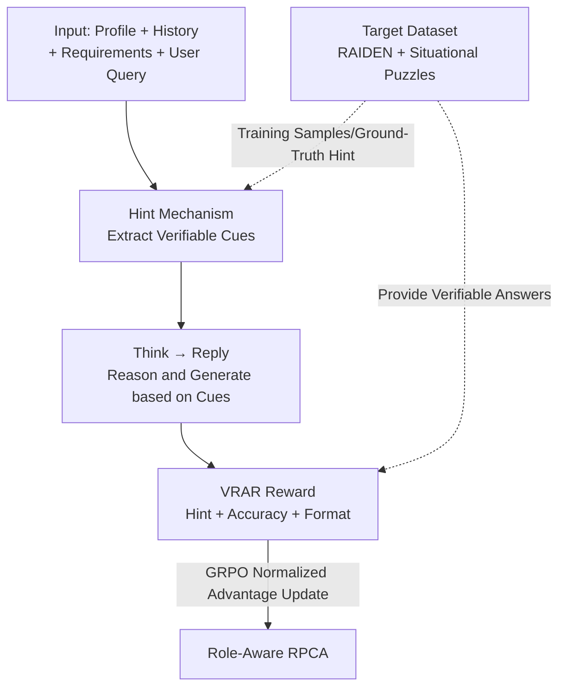

# VeriRole: Verifiable Role-Awareness through Hint-Guided Reinforcement Learning

**Conference**: ICLR 2026  
**OpenReview**: [https://openreview.net/forum?id=lW7kMpMj9K](https://openreview.net/forum?id=lW7kMpMj9K)  
**Code**: https://github.com/FrontierLabs/VeriRole  
**Area**: Alignment RLHF / Reinforcement Learning / Role-Playing  
**Keywords**: Role-playing dialogue, verifiable rewards, Hint mechanism, GRPO, role-awareness

## TL;DR
Focusing on the open-ended task of role-playing, which lacks standard answers and verifiable rewards, this paper introduces a **Hint mechanism** to extract deterministic cues from role profiles, dialogue history, and playing requirements. These cues serve as anchors for a designed **Verifiable Role-Awareness Reward (VRAR)** used in GRPO training. This approach improves Qwen2.5-32B's average score on RAIDEN by 18.9% and CharacterEval by 4.55%, while preserving the creativity and stylistic diversity of role-playing.

## Background & Motivation
**Background**: Role-Playing Conversational Agents (RPCA, e.g., Character.ai, Talkie) are already industrial-grade applications. Mainstream improvement paths include synthesizing higher-quality dialogue corpora for data-driven training or drawing on Chain-of-Thought (CoT) from OpenAI-o1 / DeepSeek-R1 to enhance reasoning and maintain "role-awareness" under misleading questions or complex contexts.

**Limitations of Prior Work**: Directly applying CoT/RL to role-playing faces two barriers. First is **non-verifiability**—role-playing is open-ended generation where a single query often lacks a unique correct answer (e.g., Figure 1: if a user incorrectly states Harry Potter learned the Patronus Charm at age 11, the model might accept the false premise for narrative flow, provide a dull but factually correct answer, or be both accurate and creative), making it impossible for RL to define objective reward signals. Second is **reasoning backfiring on style**—existing research found that reasoning capabilities trained on general tasks can damage role-playing performance, as overly formal and verbose thinking chains sacrifice stylistic expression and response quality (replicated in this paper's experiments).

**Key Challenge**: There is a direct trade-off between verifiability (requiring objective rewards and deterministic answers) and creativity (the soul of role-playing being diverse styles and emotional richness)—scoring purely based on "standard answers" forces the model into formulaic responses, while allowing total creativity makes RL impossible.

**Goal**: Design a **reasoning form specifically for role-playing** that provides verifiable reward signals for RL without sacrificing creative elements like stylistic diversity.

**Key Insight**: The authors observe that while role-playing encourages diverse responses, it is still bound by a set of **non-negotiable factual constraints**—character biographies, profile settings, and behavioral boundaries. These facts are "definite and verifiable against the original text." By extracting these deterministic cues separately, verifiable rewards can be applied to this portion, while leaving the open-ended generation to loose constraints.

**Core Idea**: Insert a **Hint pre-reasoning step** before thinking and generation to extract verifiable cues (aiming for exact snippets from source text for objective scoring via ROUGE). This anchors reasoning in verifiable facts, followed by designing VRAR rewards around the Hint and optimizing with GRPO.

## Method

### Overall Architecture
VeriRole transforms a role-playing response into a structured **Hint → Think → Reply** generation: given character info (Profile + History + Requirements) and a user query, the model first extracts deterministic cues in `<hint>...</hint>`, performs brief reasoning in `<think>...</think>` based on those cues, and finally produces a persona-consistent reply. During training, the system decomposes the output and uses **VRAR (Verifiable Role-Awareness Reward)** to score Hint quality, answer accuracy, and format. The sum is sent to **GRPO** for policy optimization. The pipeline's key is that rewards strictly score the "verifiable Hint and deterministic answer," while applying light, loose constraints to the final open-ended reply, decoupling verifiability from creativity.

### Key Designs

**1. Hint Mechanism: Anchoring Open-Ended Role-Play to Verifiable Cues**

This is the core of the framework, addressing the "non-verifiability" pain point. The Hint mechanism is a **pre-reasoning step** that extracts cues from three sources: character profiles, dialogue history, and role-playing requirements. For example, if a user asks for Sherlock Holmes's address, the ideal Hint is `<hint>[profile] 221B Baker Street</hint>`, matching the profile exactly. If a user asks an Out-of-Character (OOC) fashion question, cues regarding "responses must respect character boundaries" should be extracted. Hints must satisfy two properties: **verifiability** (preferring exact copies of source text for objective ROUGE scoring) and **context specificity** (generic instructions like "stay in character" are not valid Hints; only cues truly relevant to the current context are selected). This step makes "which fact to reference" explicit and verifiable, providing a handle for RL without constraining the phrasing of the final response.

**2. Two Specialized Datasets: RAIDEN + Situational Puzzles (Lateral Thinking)**

To support Hint module training, the authors constructed two types of samples. The first is from the **RAIDEN** benchmark—where each dialogue turn is labeled with evaluation goals. The authors selected 7 categories and aligned them with Hint sources: SBK (Script Knowledge), SCK (Script Conflict Knowledge), and CM (Conversation Memory) map to "Profile/History" Hints; RCB (Role Cognitive Boundary), TS (Topic Shift), and TA (Topic Achievement) map to "Requirements" Hints; CC (Chitchat) teaches the model to output an **empty Hint** when no constraints exist. For precision, they filtered simple samples that a baseline (Qwen2.5-14B) could easily answer, then used multi-step refinement (Question-Type Filtering, Entity-Type Validation, Cardinality Constraint) and required consistency across multiple models (GPT-4/MiniMax, etc.) for a Hint to be valid. The second is a newly constructed **Situational Puzzle Dataset** ("Sea Turtle Soup"): these puzzles have unique final solutions, providing verifiable accuracy rewards and requiring complex reasoning. Data was generated via human double-annotation and LLM extraction of "key questions leading to the solution" as Ground-Truth Hints, with role-playing adaptation to avoid OOC risks. These datasets are complementary: Situational Puzzles focus on logic/fact skills, while RAIDEN provides gains across all dimensions.

**3. VRAR (Verifiable Role-Awareness Reward): Hint / Accuracy / Format Components**

VRAR converts "non-verifiable" tasks into "quantifiable signals" by summing three parts: $r_i = R_{hint} + R_{acc} + R_{format}$.

**Hint Reward** evaluates the alignment between the model's Hint and the Ground-Truth. First, it checks **extraction and structure** (failure to extract $H_{gen}$ from tags results in 0; missing any required source type results in 0). Then, it performs a **per-source content evaluation** using a composite score:

$$R_{source} = P_{len}(H_{gen}, H_{gt}) \times \big(\alpha \cdot Sim_{cos}(H_{gen}, H_{gt}) + (1-\alpha)\cdot S_{ROUGE}(H_{gen}, H_{gt})\big)$$

Where $S_{ROUGE} = \beta\cdot\text{ROUGE-1} + (1-\beta)\cdot\text{ROUGE-L}$ measures literal precision, $Sim_{cos}$ is cosine similarity of sentence embeddings (allowing partial credit for semantic accuracy with different phrasing), and $P_{len}=1-\frac{||H_{gen}|-|H_{gt}||}{||H_{gen}|-|H_{gt}||+|H_{gt}|}$ penalizes length deviations. Finally, it uses **aggregation and discretization**: averaging $N$ sources $R_{avg}=\frac{1}{N}\sum R_{source,i}$ and discretizing by step $1/D$ as $R_{hint}=\text{round}(R_{avg}\times D)/D$ to prevent the model from over-optimizing for negligible score differences.

**Accuracy Reward** evaluates final response correctness: Deterministic subcategories in RAIDEN (SBK/SCK/CM) use **keyword matching** (1.0 for match, 0.0 otherwise); Situational Puzzles use **LLM-as-judge** with three tiers (Correct=1.0 / Partially Correct=0.3 / Incorrect=0.0). Note that open-ended categories (RCB/TS/TA) **do not** receive accuracy rewards to preserve creativity. **Format Reward** enforces the `Hint-Think-Answer` structure: 0.6 for basic structure, reduced to 0 for violations like multiple tags. The 0.6 cap prevents format signals from overshadowing Hint/Accuracy rewards.

**4. GRPO Optimization: Converting Verifiable Signals to Policy Gradients**

The framework uses **GRPO**. For each query, a group of $G$ outputs is sampled. The total reward $r_i$ is normalized within the group to obtain the advantage $A_i = \frac{r_i - \text{mean}(\{r\})}{\text{std}(\{r\})}$. An objective with clipping and KL regularization $-\gamma D_{KL}(\pi_\theta\|\pi_{ref})$ is optimized. Choosing GRPO over PPO eliminates the need for a separate value network; compared to SFT, it uses explicit rewards to teach abstract skills (like topic achievement) rather than just mimicking style.

### Loss & Training
The training goal is to maximize the GRPO objective, driven by the sum of VRAR components. Training data: 2,197 RAIDEN samples (CM/SBK/SCK with Hints), 567 open-ended samples (RCB/TS/TA, no accuracy reward), 500 CC chitchat samples; 737 Situational Puzzle samples. Hint hyperparameters default to $\alpha=\beta=0.5$. Accuracy rewards for puzzles are judged by Claude 3.5.

## Key Experimental Results

### Main Results
Baselines include Qwen2.5-14B/32B-Instruct, Qwen3-32B, and Peach-9B (role-play specialized). Evaluation uses RAIDEN (483 unseen samples, Claude 3.5 + GPT-4o) and CharacterEval.

| Model | RAIDEN Avg | Gain |
|------|-----------|----------|
| Qwen2.5-32B-Instruct | 0.6953 | — |
| Qwen2.5-32B-GRPO (Ours) | **0.8268** | **+18.9%** |
| Qwen2.5-14B-Instruct | 0.6302 | — |
| Qwen2.5-14B-GRPO (Ours) | **0.7725** | Large Gain |
| Peach-9B-Raw | 0.3611 | — |
| Peach-9B-GRPO (Ours) | **0.6183** | +71% |

On CharacterEval, Qwen2.5-32B-GRPO scored 3.482 vs. 3.330 baseline (**+4.55%**), with significant gains in Persona Consistency and Engagingness.

### Ablation Study

| Configuration (Qwen2.5-32B-GRPO) | RAIDEN Avg | Description |
|------|---------|------|
| Full model | 0.8268 | Complete model |
| w/o Hint Reward | 0.6598 | Lowest performance; TA crashes significantly |
| w/o Accuracy Reward | 0.8061 | SBK/CM performance drops |
| RAIDEN-Only | 0.8143 | Gains across all dimensions |
| Situational-Puzzle-Only | 0.7111 | Gains in logic/fact (SBK/CM/SCK), but not abstract types |
| SFT-reply | 0.6809 | SFT on reply only; TA is only 0.2835 |
| SFT-hint-and-reply | 0.7179 | SFT on both; still far inferior to GRPO |

### Key Findings
- **Hint Mechanism is the biggest contributor**: Removing Hint reward drops the average score from 0.8268 to 0.6598, and abstract skills like TA (Topic Achievement) crash—indicating Hints guide more than just fact retrieval.
- **GRPO outperforms SFT**: SFT mimics style but fails to learn abstract skills (TA only 0.2835); GRPO pushes TA to 0.6865. In post-training experiments with a psychotherapist role, the GRPO model retains role-playing ability better than the Instruct baseline.
- **Complementary Datasets**: Situational Puzzles improve logic/facts, while RAIDEN improves all dimensions.
- **Strong Generalization**: Improvements seen across Peach-9B, Qwen3-32B, and MoE models. Qwen3's native reasoning did not inherently help role-playing, supporting the "reasoning backfire" hypothesis.
- **Hint Score Correlates with Accuracy**: Higher Hint Reward scores directly correlate with higher final accuracy judged by GPT-4o.

## Highlights & Insights
- **Decomposition into "Verifiable Anchor + Open Generation"**: The core ingenuity is not demanding verifiability for the whole response, but isolating deterministic cues (Hints) for strict verifiable rewards while keeping the reply constraints loose—gracefully resolving the verifiability vs. creativity trade-off.
- **Exact Copy Requirements for Hints**: This allows traditional ROUGE metrics to provide objective, low-cost RL rewards without constant reliance on LLM-as-judge.
- **Injecting Verifiable Reasoning via Situational Puzzles**: Using lateral thinking puzzles as a reasoning testbed with ground-truth solutions is an efficient way to provide verifiable reasoning data.
- **Empty Hint Design**: Teaches the model not to hallucinate cues when none exist, preventing over-extraction.

## Limitations & Future Work
- **Reliance on High-Quality Annotation and Filtering**: Ground-truth Hint construction requires multi-model consistency and human annotation (for puzzles), which is costly to scale.
- **Verifiability Bias**: The mechanism is more effective for fact-based scenarios; for purely emotional or stylistic dialogue without extractable cues, VRAR regresses mostly to Format rewards.
- **Metric Comparability**: Qwen3 series saw a slight TA dip after GRPO, attributed to the original model's preference for long, question-heavy responses (favored by TA metrics); this highlights a sensitivity to response length.
- **LLM-as-judge Bias**: Heavy reliance on Claude 3.5/GPT-4o for scoring may introduce systematic evaluative biases.
- **Future Directions**: Automating Hint annotation and extending verifiable anchors to multimodal or long-term memory role-playing.

## Related Work & Insights
- **vs. General CoT / o1-style Reasoning**: These work for tasks with ground truth (math/code), but this paper shows general reasoning can be detrimental to role-play (responses become too formal); VeriRole designs role-play-specific structured reasoning.
- **vs. SFT Role-Playing**: SFT mimics style but fails abstract skills like consistency or guided dialogue. VeriRole uses RL to optimize these skills directly and shows better robustness in post-training.
- **vs. Direct RL on Open Responses**: Open responses lack objective standards, leading to noisy rewards; VeriRole applies rewards to verifiable Hints, resulting in cleaner and more stable signals.

## Rating
- Novelty: ⭐⭐⭐⭐⭐ "Hint Anchor + VRAR" elegantly solves non-verifiability in role-playing RL.
- Experimental Thoroughness: ⭐⭐⭐⭐ Covers 5 baselines and multiple architectures, though relies heavily on LLM-as-judge.
- Writing Quality: ⭐⭐⭐⭐ Clear motivation-method-experiment chain with complete formulas.
- Value: ⭐⭐⭐⭐⭐ Directly addresses persona consistency in industry RPCA; data is open-sourced and practical.

<!-- RELATED:START -->

## Related Papers

- [\[ICLR 2026\] LongRLVR: Long-Context Reinforcement Learning Requires Verifiable Context Rewards](longrlvr_long-context_reinforcement_learning_requires_verifiable_context_rewards.md)
- [\[ICLR 2026\] RLVMR: Reinforcement Learning with Verifiable Meta-Reasoning Rewards for Robust Long-Horizon Agents](rlvmr_reinforcement_learning_with_verifiable_meta-reasoning_rewards_for_robust_l.md)
- [\[ICLR 2026\] Rubrics as Rewards: Reinforcement Learning Beyond Verifiable Domains](rubrics_as_rewards_reinforcement_learning_beyond_verifiable_domains.md)
- [\[ICLR 2026\] Towards High Data Efficiency in Reinforcement Learning with Verifiable Reward](towards_high_data_efficiency_in_reinforcement_learning_with_verifiable_reward.md)
- [\[ICLR 2026\] RLVER: Reinforcement Learning with Verifiable Emotion Rewards for Empathetic Agents](rlver_reinforcement_learning_with_verifiable_emotion_rewards_for_empathetic_agen.md)

<!-- RELATED:END -->
