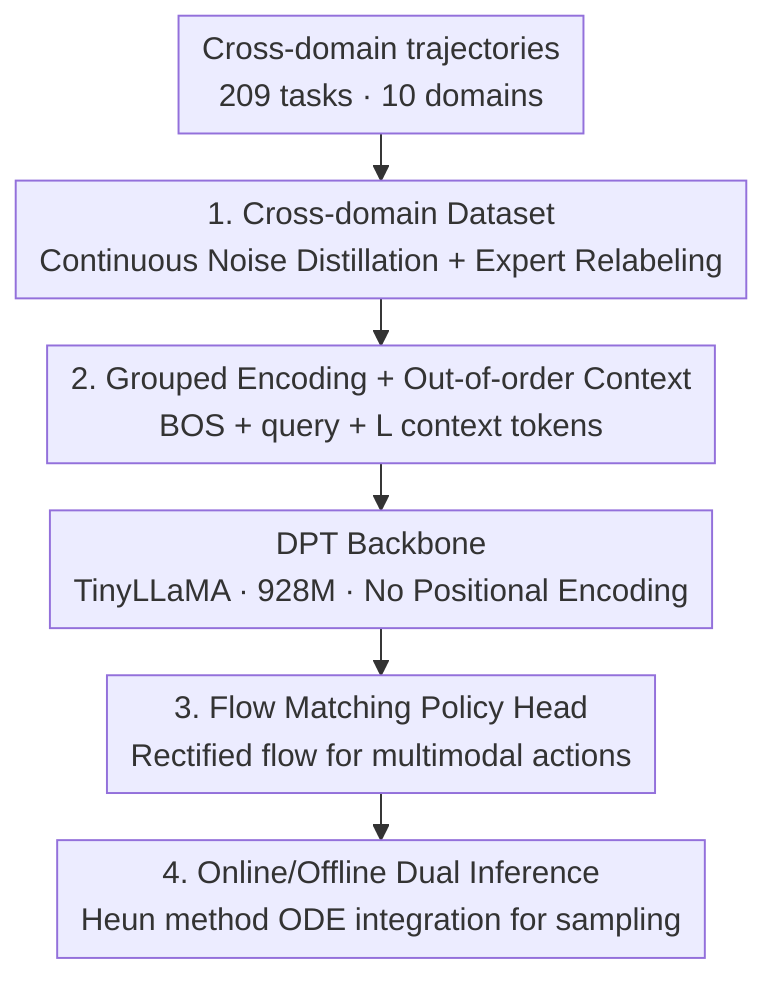

# Vintix II: Decision Pre-Trained Transformer is a Scalable In-Context Reinforcement Learner

**Conference**: ICLR 2026  
**OpenReview**: [https://openreview.net/forum?id=t6roJiPN6Y](https://openreview.net/forum?id=t6roJiPN6Y)  
**Code**: To be open-sourced (the paper promises to provide it to reviewers during the rebuttal phase and eventually open-source the data and code)  
**Area**: Reinforcement Learning / In-Context RL  
**Keywords**: In-Context Reinforcement Learning, Decision Pre-Trained Transformer, Flow Matching, Posterior Sampling, Generalist Agent

## TL;DR
This paper scales the Decision Pre-Trained Transformer (DPT) from simplified discrete environments to cross-domain continuous control scenarios involving 10 domains and 209 tasks. By replacing the Gaussian head with a rectified flow strategy head to model multimodal action distributions—while preserving the interpretation of DPT as "Bayesian posterior sampling"—the authors train a 928M-parameter universal Large Action Model capable of simultaneous online/offline operation. It significantly outperforms the previous Vintix and REGENT on 46 unseen tasks.

## Background & Motivation

**Background**: Building cross-task generalist agents is a core objective of AI. While significant progress has been made in NLP/CV through "Transformer + large-scale offline pre-training," Large Action Models in the RL field still lag behind. Prevailing approaches involve training Transformers on offline trajectories like LLMs (Gato, JAT) and extending them with retrieval-augmentation (REGENT) during inference. However, these systems **hardly utilize external reward signals for real-time policy correction**.

**Limitations of Prior Work**: In-Context RL (ICRL) aims to migrate the "behavior change via few-shot examples without parameter updates" property of LLMs to RL. Two flagship routes each have drawbacks: Algorithm Distillation (AD), after being scaled to multiple domains by Vintix (Polubarov 2025), is strong on training tasks but **shows limited generalization to unseen tasks**. DPT is theoretically more elegant (interpreting in-context learning as posterior sampling of actions) and demonstrates stronger ICRL capabilities in simplified domains, **but it has never been verified to scale to multi-domain continuous control**.

**Key Challenge**: As task diversity increases, a more expressive policy class is required to distill increasingly multimodal behaviors. However, the original DPT and its variants primarily target discrete actions (where sampling is a simple argmax). The few versions handling continuous actions use Gaussian heads—which **cannot characterize multimodal action posteriors, causing a likelihood mismatch** and resulting in only mediocre performance.

**Goal**: To scale DPT to cross-domain continuous control, enabling both online zero-shot self-correction and offline adaptation to unseen tasks and their parametric variants using a small number of expert examples.

**Key Insight**: Continuous, multimodal action distributions are exactly what generative models like flow matching or diffusion excel at. Furthermore, flow matching naturally supports inference-time sampling while preserving the DPT semantics of "sampling actions from the posterior."

**Core Idea**: Replace the Gaussian head of DPT with a **rectified-flow policy head**, combined with a cross-domain dataset expanded by 3.2x (700M+ transitions, 209 training tasks, 46 unseen tasks), to truly scale up posterior-sampling-based ICRL.

## Method

### Overall Architecture
The input to Vintix II is a batch of cross-domain interaction trajectories, and the output is a generalist policy that directly produces actions based on the context. The entire pipeline is linked in four steps: First, "Continuous Noise Distillation" is used to collect data covering both good and bad states, relabeling them with expert optimal actions according to the DPT specification. Second, tasks are grouped by action-observation structure, encoded/decoded via MLPs, and concatenated into a "BOS + query + L out-of-order context tokens" sequence fed into a position-encoding-free TinyLLaMA backbone. Third, the latent states of the backbone condition a flow matching policy head, which is trained with a rectified flow objective to transport noise to expert actions. Fourth, during inference, actions are solved via Heun's second-order method to integrate the ODE from Gaussian noise in both online (sliding FIFO context) and offline (fixed expert prompt) modes.

### Key Designs

**1. Cross-domain Dataset: Covering bad states via Continuous Noise Distillation and relabeling with optimal actions**

The DPT training paradigm requires feeding the triplet of "query observation + context + optimal action for that query" to the model, allowing it to learn to infer the posterior optimum from the context. However, using only expert trajectories prevents the model from seeing failure states, leading to poor generalization. This paper adopts the **Continuous Noise Distillation (CND)** from Vintix: action noise is gradually injected into the demonstrator policy to cover the entire quality spectrum from random to expert, significantly expanding the distribution of visited $\{s,a,r\}$ tuples. After collection, these (potentially suboptimal) state-action pairs are **uniformly relabeled with the demonstrator's optimal actions**, satisfying the DPT requirement that "context can be of any quality, but the supervision signal is always the optimal action." The dataset is expanded 3.2x relative to Vintix—700M+ transitions across 209 training tasks spanning 10 domains (robot manipulation, HVAC control, PDE optimization, autonomous driving, etc.), with 46 tasks set aside for validation. Covering bad states is the data prerequisite for the model's "online zero-shot self-correction."

**2. Grouped Encoding + Out-of-order Context: Enforcing context dependency over task ID memorization**

Action and observation dimensions vary wildly across domains, making a single encoder unfeasible. This paper partitions all tasks into non-overlapping groups based on "identical action-observation structure," with each group assigned its own MLP encoder and decoder. This makes the model **task-agnostic within a group**—it cannot distinguish specific tasks based on input dimensions and must infer the current task from the context. The input sequence consists of a BOS token, a query token, and $L$ **randomly permuted** context tokens, where each context element is $(o_i,a_i,r_i)$ (unlike the original DPT, experiments found that removing the next-observation $o'$ does not degrade performance, so it is omitted). Permutation is key: it removes temporal sequence clues, forcing the model to treat the context as an "unordered set of task evidence" for posterior inference, rather than an extrapolatable trajectory, which aligns with DPT's posterior sampling semantics.

**3. Flow Matching Policy Head: Replacing the Gaussian head with rectified flow for native multimodal sampling**

This is the core of the paper. Given the latent state $h\in\mathbb{R}^d$ output by the backbone at a certain position, the paper parameterizes a **context-dependent vector field** $u(t,h,x_t):[0,1]\times\mathbb{R}^d\times\mathbb{R}^a\to\mathbb{R}^a$ using a time encoder $\gamma$ and an MLP $v_\eta$. The flow $\psi(t,h,x_0)$ it defines is the solution to the ODE $\dot{x}_t=v(t,h,x_t)$, where the policy $\pi(\cdot\mid h)=\psi(1,h,\cdot)$ is at the terminal $t=1$. Training uses the rectified-flow matching objective, regressing the linear velocity on the linear interpolation path $x_{t,j}=(1-t_j)x_{0,j}+t_j a^\star$:

$$\mathcal{L}_{RF}=\mathbb{E}_{t_j\sim U(0,1),\,x_{0,j}\sim\mathcal{N}(0,I_a)}\big\|v_\eta(h_j,x_{t,j},\gamma(t_j))-(a^\star-x_{0,j})\big\|_2^2$$

Time is encoded using learned-frequency sinusoidal encoding $\gamma(t_j)=[\sin(t_jf);\cos(t_jf)]$, with the frequency vector $f$ initialized logarithmically over $[f_{\min},f_{\max}]$. Unlike Gaussian heads which can only output unimodal distributions and suffer from likelihood mismatch for multimodal posteriors, the flow matching head explicitly models any complex action posterior as a process of "transporting from noise to target," thus preserving the upper bound of DPT's expressiveness. Supervision is applied at all $L+1$ positions, ensuring predictions at every context length are trained.

**4. Online/Offline Dual Inference: Zero-shot self-correction and prompt-based adaptation in one model**

During inference for a task group $g$ (action dimension $g_a$), a sample is drawn from the base distribution $x_0\sim\mathcal{N}(0,I_{g_a})$. The learned vector field $v_\eta$ is integrated from $t=0$ to $t=1$ using **Heun’s second-order Runge–Kutta method** with $M$ uniform steps $\Delta t=1/M$; the resulting $x_1$ is the action. The vector field is conditioned on the latent state $h_L$ of the last Transformer token. Two deployment modes share this decoder: **Online** mode starts from an empty context and appends $(o_q,a,r)$ during interaction, using a FIFO strategy to drop the oldest elements once the maximum length $L$ is exceeded (equivalent to a sliding attention window), enabling self-correction during deployment. **Offline** mode uses a fixed set of demonstrator examples as context, which remains unchanged. To the authors' knowledge, this is the first Large Action Model capable of working in both modes simultaneously.

### Loss & Training
The sole training objective is the rectified-flow matching loss $\mathcal{L}_{RF}$ described above. The backbone is a causal Transformer implemented via TinyLLaMA, with **all positional encodings removed** (unnecessary for DPT). It features 16 layers, 24 heads, an embedding size of 1536, and an FFN hidden layer of 6144, totaling 928M parameters. It was trained on 8 H100 GPUs with a batch size of 64 and a sequence length of 4096.

## Key Experimental Results

The evaluation metric is the episode return normalized by random/expert performance: $\text{score}_{\text{norm}}=\frac{\text{score}_{\text{raw}}-\text{score}_{\text{rand}}}{\text{score}_{\text{demo}}-\text{score}_{\text{rand}}}$. Domain-level aggregation uses the IQM (inter-quartile mean). Baselines include Vintix (multi-domain AD version) and REGENT (retrieval-augmented).

### Main Results

**Offline evaluation on unseen tasks (46 held-out)**—Key gains over baselines under the same prompt budget:

| Comparison | Domain / Split | Gain (Vintix II Relative) |
|------|------------|----------|
| vs Vintix (prompted) | Bi-DexHands | +17% |
| vs Vintix (prompted) | MuJoCo (Parametric variants) | +4% |
| vs Vintix (prompted) | Meta-World ML45 | +63% |
| vs REGENT (25 demos) | Meta-World ML45 (5 unseen) | +8.2% |

On unseen tasks, Vintix II in offline mode achieved normalized scores of **102% / 78% / 92% / 100%** in MetaDrive / CityLearn / SinerGym / ControlGym respectively (i.e., $\ge$ 75% of demonstrator level). For online zero-shot (starting with empty context), it achieved an **85%** normalized score on the Meta-World **ML1** split without any examples, which is **3%** higher than REGENT using 100 expert episodes.

### Ablation Study

| Configuration / Analysis | Observation | Explanation |
|------|------|------|
| Training tasks Online vs Offline | Offline average +4.1% | Online performance on training tasks is already near the demonstrator; adding 2500 transitions as a prompt further improves it across all 10 domains. |
| Context length 0 $\to$ 500 | Monotonic decrease in action entropy | Short context is broad/uncertain; long context converges to a peak, consistent with posterior sampling contraction. |
| Demo count 500 $\to$ 4000 trans. | Growth with prompt in Meta-World/IB/SinerGym | Adding examples "improves or at least doesn't hurt," limited by the 4096 context length. |

### Key Findings
- **Flow matching head is the source of generalization leaps**: The authors attribute the emergence of "fully parameterized in-context imitation" on unseen tasks to the strong inductive bias provided by flow-based DPT, which is the primary reason for the large improvement over previous action models.
- **Empirical validation of posterior sampling behavior**: Using Truncated SVD to project action samples at different context lengths into 2D, KDE shows the distribution narows from wide to tight as the context grows, with entropy decreasing monotonically. This matches the theoretical prediction of DPT's in-context posterior sampling (a generalization of Thompson sampling to MDPs).
- **Online zero-shot = deployment-time self-correction**: Near-demonstrator performance in the first episode on Kinetix / ControlGym / MuJoCo / MetaDrive indicates that DPT infers a strong prior, requiring only a few episodes to correct.
- **Challenges in high-dimensional/target adaptation**: Performance in zero-shot mode significantly lags behind prompted mode in Meta-World ML45 and Bi-DexHands ML20. The former is considered difficult to adapt to without extra information, while the latter has high control dimensions, variable structures, and fewer training tasks.

## Highlights & Insights
- **Head replacement preserving posterior sampling semantics**: Switching the Gaussian head to rectified flow is not just for expressiveness; it's because the "noise $\to$ action" sampling of flow matching perfectly extends the "sampling from the posterior" interpretation of DPT—a self-consistent design choice.
- **Combination of out-of-order context and grouped encoding**: By using "temporal shuffling + wiping dimension clues," the model is forced from two directions to rely solely on context evidence for inference. This design is transferable to any scenario requiring in-context inference where task ID memorization is a concern.
- **First online/offline dual-mode LAM**: The same weights can perform both zero-shot self-correction and prompt-based adaptation, eliminating the need for extra retrieval modules like those in REGENT, leading to a cleaner, fully parameterized inference design.
- **Bad state coverage as a prerequisite for self-correction**: CND allows the model to see failure states, providing the capability to recover from bad states during deployment—breaking "self-correction" down into a property supported by data engineering.

## Limitations & Future Work
- **Severe under-token training**: Even with a 3.2x expansion, the token-to-parameter ratio remains $< 1$, whereas scaling laws for large models suggest $\approx 20$. This means the model is far from saturated, highlighting the need for more data and scaling law research specific to Large Action Models.
- **Weak zero-shot exploration**: Demonstration-less evaluation still lags behind prompted results, suggesting that ICRL models "know how to utilize, but not how to explore," with limited test-time exploration capabilities.
- **Dimension agnosticism remains unresolved**: The model still relies on grouped encoding/decoding to handle heterogeneous spaces and cannot transfer to entirely new domain structures, limiting true cross-domain generalization and deployment.
- Self-assessment: Horizontal comparisons require caution—different domains vary in task difficulty, prompt budgets (this paper uses 2500 vs Vintix's 5000 transitions), and episode lengths, meaning absolute normalized scores are not always directly comparable.

## Related Work & Insights
- **vs Vintix (Polubarov 2025)**: Both follow the route of "scaling offline memory-based Meta-RL to cross-domain," but Vintix uses AD (distilling policy improvements from history), while this paper uses DPT (posterior sampling on relabeled optimal action examples) + a flow matching head; Vintix has limited generalization to unseen tasks, while this paper shows +4% to +63% gains on shared domains.
- **vs REGENT (Sridhar 2025)**: REGENT is semi-parametric, relying on an extra retrieval module for inference-time expansion; this paper is fully parametric, has a simpler inference design, and outperforms REGENT on Meta-World ML45/ML1 by +8.2%/+3% respectively (the latter without needing examples).
- **vs Original/Gaussian DPT (Lee 2023; Dong 2025)**: The original was for discrete actions, and continuous variants using Gaussian heads achieved only mediocre results; this paper uses a rectified flow head to resolve likelihood mismatch for multimodal actions, verifying DPT for the first time as a scalable cross-domain continuous control backbone.
- **vs VLA Flow Policies ($\pi_0$, etc.)**: These also use flow matching as an action expert, but VLAs condition on vision-language representations via imitation; this paper conditions on in-context interaction history via reward-driven posterior sampling self-correction.

## Rating
- Novelty: ⭐⭐⭐⭐ The link between the flow matching head and DPT posterior sampling semantics is well-spotted; first to scale DPT to cross-domain continuous control.
- Experimental Thoroughness: ⭐⭐⭐⭐ Covers 10 domains, 209+46 tasks, online/offline dual modes, plus posterior contraction and demo count ablations; however, only compares against 2 baselines.
- Writing Quality: ⭐⭐⭐⭐ Clear chain of motivation, self-consistent design choices, well-documented formulas and protocols.
- Value: ⭐⭐⭐⭐ Open-sourcing a 700M+ cross-domain dataset + dual-mode LAM provides a strong push for the ICRL generalist agent direction.

<!-- RELATED:START -->

## Related Papers

- [\[ICLR 2026\] Scalable In-Context Q-Learning](scalable_in-context_q-learning.md)
- [\[ICLR 2026\] Reward is Enough: LLMs are In-Context Reinforcement Learners](reward_is_enough_llms_are_in-context_reinforcement_learners.md)
- [\[ICLR 2026\] LongRLVR: Long-Context Reinforcement Learning Requires Verifiable Context Rewards](longrlvr_long-context_reinforcement_learning_requires_verifiable_context_rewards.md)
- [\[ICLR 2026\] Scalable Offline Model-Based RL with Action Chunks](scalable_offline_model-based_rl_with_action_chunks.md)
- [\[ICLR 2026\] The State of Reinforcement Finetuning for Transformer-based Agents](the_state_of_reinforcement_finetuning_for_transformer-based_agents.md)

<!-- RELATED:END -->
