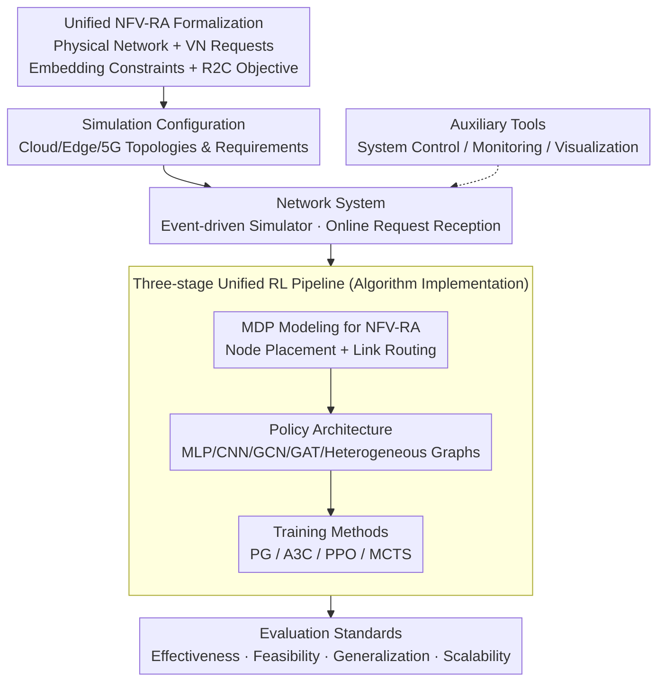

# Virne: A Comprehensive Benchmark for RL-based Network Resource Allocation in NFV

## Paper Information
- **Conference**: ICLR 2026
- **arXiv**: [2507.19234](https://arxiv.org/abs/2507.19234)
- **Code**: [https://github.com/GeminiLight/Virne](https://github.com/GeminiLight/Virne)
- **Area**: Reinforcement Learning / Network Resource Allocation / Combinatorial Optimization
- **Keywords**: NFV-RA, Virtual Network Embedding, Benchmark Framework, GNN, PPO, Scalability

## TL;DR
The authors propose Virne, a comprehensive benchmark framework for Network Function Virtualization Resource Allocation (NFV-RA), which integrates 30+ algorithms and gym-style environments to support systematic evaluation across multiple scenarios including cloud, edge, and 5G.

## Background & Motivation

### Core Problem
The Network Function Virtualization Resource Allocation (NFV-RA) problem is an NP-hard combinatorial optimization problem that involves mapping virtual network requests onto physical network infrastructure. Although deep RL has shown potential in this field, there is a lack of systematic benchmarks for comprehensive simulation and rigorous evaluation.

### Limitations of Prior Work
1. Existing benchmarks only cover specific scenarios (e.g., cloud) and lack support for edge computing and 5G slicing.
2. Only a few non-RL methods (3-5 types) are implemented, without a unified RL pipeline.
3. Evaluation is often limited to online effectiveness, missing practical dimensions such as feasibility, generalization, and scalability.
4. Problem definitions are fragmented, making fair comparison difficult.

## Method

### Overall Architecture

Virne does not invent new algorithms; rather, it addresses the issue where "30+ NFV-RA methods are implemented disjointly, making fair comparison impossible." The core methodology is as follows: first, a **unified formalization** is used to consolidate fragmented problem definitions into a common "problem language." Then, the execution processes of all methods are integrated into a reproducible workflow. **Simulation configurations** generate network topologies and resource requirements according to cloud, edge, or 5G scenarios. The **network system** serves as an event-driven simulator that receives virtual network requests online. The **algorithm implementation** deconstructs each RL method into three pluggable components: "MDP Modeling + Policy Architecture + Training Method" to solve each request. Finally, **Evaluation Standards** score the methods across four dimensions: effectiveness, feasibility, generalization, and scalability. **Auxiliary tools** (system control, solution monitoring, visualization) support the entire simulation process. The three core contributions—unified formalization, MDP modeling, and the three-stage RL pipeline—provide the foundation for single-variable comparisons, such as "changing a GNN encoder" or "replacing PPO with A3C."

### Key Designs

**1. Unified NFV-RA Formalization: Ending Fragmented Problem Definitions**

Previously, each work defined its own states, constraints, and objectives, making horizontal comparison impossible. This is the first obstacle Virne eliminates. Virne defines the physical network as $\mathcal{G}_p = (\mathcal{N}_p, \mathcal{L}_p)$ and virtual network requests as $\mathcal{G}_v = (\mathcal{N}_v, \mathcal{L}_v, \omega, \varpi)$, and fixes two types of embedding constraints: node mapping $f_\mathcal{N}$ requires virtual nodes to be mapped one-to-one to physical nodes satisfying resource capacity $C(n_v) \leq C(n_p)$, and link mapping $f_\mathcal{L}$ routes virtual links to physical paths where bandwidth satisfies $B(l_v) \leq B(l_p)$. The optimization objective is unified using the revenue-to-cost ratio $\max \text{R2C}(S) = \varkappa \cdot \text{REV}(S) / \text{COST}(S)$, which reflects the benefits of accepting requests while penalizing the physical resource consumption for routing. With this common "problem language," simulation configurations and the network system can generate reproducible instances, allowing 30+ algorithms to run on the same benchmark.

**2. MDP Modeling for NFV-RA: Converting Combinatorial Optimization into Sequential Decision Making**

Solving the entire embedding at once is NP-hard. Virne instead models it as an MDP $(\mathcal{S}, \mathcal{A}, P, R, \lambda)$, allowing the agent to place nodes one by one on the instances provided by the network system. The state $\mathcal{S}$ encodes the embedding progress of the current virtual and physical networks, the action $\mathcal{A}$ selects a physical node for the pending virtual node, and the reward $R$ provides feedback to guide optimization. Each step follows a cycle: "select physical node $\rightarrow$ attempt placement $\rightarrow$ route virtual links using a shortest path algorithm $\rightarrow$ update remaining resources upon success," until the entire request is embedded or a constraint is violated. This preserves the temporal structure of online request processing while allowing deep RL's exploration capabilities to function within a vast combinatorial solution space. The framework is also compatible with Constraint MDPs and Multi-task MDPs to handle constraint processing and generalization.

**3. Three-stage Unified RL Pipeline: Making Any Method Modular and Swappable**

To ensure 30+ algorithms are not disparate black boxes, Virne deconstructs each RL method into three orthogonal components: MDP Modeling (including reward design and feature engineering), Policy Architecture (MLP, CNN, GCN, GAT, Dual-GAT, Heterogeneous GAT, etc., covering the spectrum from non-graph to heterogeneous graphs), and Training Methods (PG, A3C, PPO, MCTS). These are assembled from customizable modules such as instance-level environments, feature constructors, neural policies, and experience replay. Any component can be independently replaced, enabling single-variable ablations like "changing a GNN encoder" or "replacing PPO with A3C." This pluggable design supports the systematic quantitative analysis of implementation details such as reward functions, feature engineering, and action masking.

## Key Experimental Results

### Implementation Technique Exploration

The authors systematically evaluated key implementation choices on the WX100 topology:

| Technique | Best Configuration | Key Finding |
|-----------|--------------------|-------------|
| Reward Function | fixed=0.1 | Moderately fixed intermediate rewards outperform adaptive rewards |
| Feature Engineering | Status + Topological | Topological features provide valuable enhancements |
| Action Masking | Enabled | Improves RAC by up to 5.3% |
| RL Algorithm | PPO | Fastest convergence and highest performance |

### Main Results

| Method | WX100 RAC↑ | GEANT RAC↑ | BRAIN RAC↑ |
|--------|-----------|------------|------------|
| PPO-MLP | 71.90 | 55.80 | 51.30 |
| PPO-GCN | 66.80 | - | - |
| PPO-DualGAT | **78.10** | - | - |
| D-Vine | - | - | - |

### Evaluation Dimensions

1. **Effectiveness**: Online acceptance rate, long-term revenue-to-cost ratio.
2. **Feasibility**: Constraint satisfaction rate of the solutions.
3. **Generalization**: Reliability under different network conditions.
4. **Scalability**: Performance changes as the problem scale grows.

### Key Findings

1. PPO-DualGAT combined with optimal implementation techniques performs best in most settings.
2. Moderate fixed rewards (0.1) > adaptive rewards > excessively large/small fixed rewards.
3. Action masking is crucial for handling the complex constraints of NFV-RA.
4. The performance of Graph Neural Network architectures depends on the scenario complexity.

## Highlights & Insights

1. **Most Comprehensive NFV-RA Benchmark**: 30+ algorithms, gym-style environment, and multi-scenario support.
2. **Systematic Implementation Analysis**: Quantitative impact of key choices like rewards, features, and masks.
3. **Multi-dimensional Evaluation Protocol**: Goes beyond online effectiveness to include feasibility, generalization, and scalability.
4. **Modular Design**: Facilitates community expansion with new methods.

## Limitations & Future Work

1. A gap still exists between simulation and real-world network environments.
2. The credit assignment problem for RL methods in large-scale problems is not fully resolved.
3. Support for emerging scenarios (e.g., 6G network slicing) is under development.
4. Some RL methods may be sensitive to hyperparameters.

## Related Work & Insights

- **Traditional Benchmarks**: VNE-Sim (2014), ALEVIN (2016) — Limited to cloud scenarios with few heuristics.
- **RL-based NFV-RA**: Various variants using neural policy architectures like CNN, GCN, and GAT.
- **Combinatorial Optimization RL**: Methodological connections with RL approaches for TSP, VRP, etc.

## Rating
- **Novelty**: ⭐⭐⭐ — The core contribution lies in systems engineering rather than algorithmic innovation.
- **Experimental Thoroughness**: ⭐⭐⭐⭐⭐ — Very comprehensive experiments and ablations.
- **Writing Quality**: ⭐⭐⭐⭐ — Clearly structured organization.
- **Value**: ⭐⭐⭐⭐⭐ — A highly valuable benchmark tool for the community.

<!-- RELATED:START -->

## Related Papers

- [\[ICLR 2026\] Sample-efficient and Scalable Exploration in Continuous-Time RL](sample-efficient_and_scalable_exploration_in_continuous-time_rl.md)
- [\[ICLR 2026\] Shop-R1: Rewarding LLMs to Simulate Human Behavior in Online Shopping via Reinforcement Learning](shop-r1_rewarding_llms_to_simulate_human_behavior_in_online_shopping_via_reinfor.md)
- [\[ICLR 2026\] Unsupervised Learning of Efficient Exploration: Pre-training Adaptive Policies via Self-Imposed Goals](unsupervised_learning_of_efficient_exploration_pre-training_adaptive_policies_vi.md)
- [\[ICLR 2026\] RuleReasoner: Reinforced Rule-based Reasoning via Domain-aware Dynamic Sampling](rulereasoner_reinforced_rule-based_reasoning_via_domain-aware_dynamic_sampling.md)
- [\[ICLR 2026\] SPELL: Self-Play Reinforcement Learning for Evolving Long-Context Language Models](spell_self-play_reinforcement_learning_for_evolving_long-context_language_models.md)

<!-- RELATED:END -->
