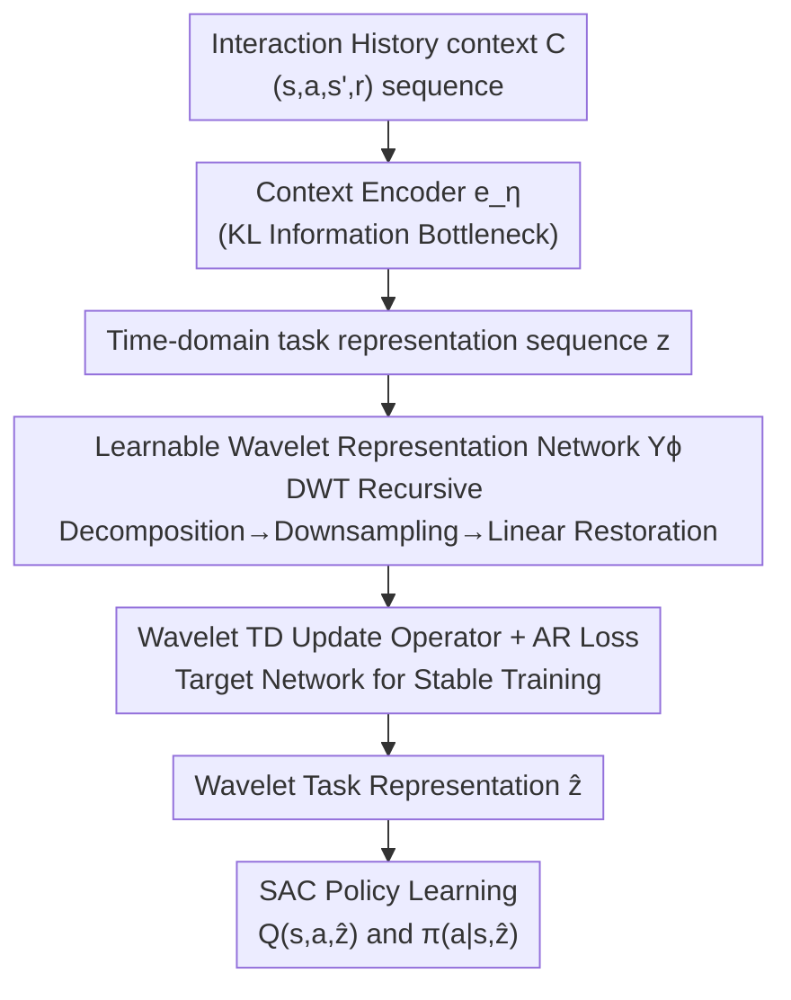

# Wavelet Predictive Representations for Non-Stationary Reinforcement Learning

**Conference**: ICLR 2026  
**OpenReview**: [https://openreview.net/forum?id=UPEwYJn2mm](https://openreview.net/forum?id=UPEwYJn2mm)  
**Code**: https://github.com/MinWangcs/WISDOM  
**Area**: Reinforcement Learning  
**Keywords**: Non-Stationary Reinforcement Learning, Wavelets, Task Representation, Temporal Difference, Meta-RL

## TL;DR
WISDOM treats the sequence of "evolving tasks" in non-stationary RL as a non-stationary signal. It uses a learnable wavelet representation network to transform task representation sequences into the wavelet domain, combined with a wavelet TD update operator and an autoregressive loss to capture multi-scale evolutionary trends. This enables the policy to adapt rapidly in environments with random periods and sharp transitions, significantly outperforming baselines in sample efficiency and final performance.

## Background & Motivation

**Background**: Real-world environments are inherently non-stationary (weather, traffic, patient diets change over time). Non-Stationary Reinforcement Learning (NSRL) aims to train agents capable of tracking a sequence of different MDPs. The mainstream approach builds on context-based meta-RL: using a context encoder to infer a task representation $z$ from historical transitions, feeding $z$ into a policy $\pi(a|s,z)$, and modeling the evolution of the $z$ sequence to predict trends.

**Limitations of Prior Work**: Most existing methods assume that tasks evolve in a "regular, fixed-period" pattern. One class of work (Xie et al. 2021; Ren et al. 2022) explicitly models task evolution as a first-order Markov chain, which can only handle smoothly changing tasks and accumulates prediction errors during sudden shifts. Another class (Poiani et al. 2021; Chen et al. 2022) assumes history-dependent evolution processes, approximating them with Gaussian Processes (GP) or latent space planning; however, GP non-stationary kernels require prior knowledge and introduce numerous parameters. These methods generally overlook the **temporal correlation** between tasks, leading to poor performance in highly dynamic scenarios.

**Key Challenge**: The period/frequency of real non-stationary tasks is **time-varying** (with random periods), yet current methods only handle regular patterns with fixed periods. Crucially, the paper uses an illustrative example to highlight that three non-stationary signals with near-identical mean and variance are indistinguishable in the time domain. While Fourier spectra can identify different dominant frequencies, they **lose temporal information regarding "when each frequency occurs"**—reversing a sequence (fast-to-slow versus slow-to-fast) yields identical Fourier spectra. Thus, Fourier transforms cannot characterize how frequencies change over time.

**Goal**: To find a representation that preserves temporal information while decoupling multi-scale frequency trends to track and predict non-stationary task evolution with random periods, allowing the policy to pre-adjust and adapt quickly.

**Key Insight**: Wavelet Transform (WT) is inherently adept at processing non-stationary signals—it preserves both time and frequency information and iteratively separates features of different frequencies through layer-wise decomposition. Low-frequency approximation coefficients reflect overall evolutionary trends, while high-frequency detail coefficients reflect local rapid changes. Moreover, according to the sampling theorem, each decomposition halves the sequence length, compressing data without losing essential features. This aligns perfectly with the observation that "task evolution is a non-stationary signal with random frequencies."

**Core Idea**: This is the first work to propose "perceiving task evolution in the wavelet domain" to solve non-stationary RL. The task representation sequence is transformed into the wavelet domain to obtain multi-resolution features, integrated with a provably convergent wavelet TD update operator to explicitly track MDP structural changes. Finally, the wavelet task representations, restored to the time domain, are injected into policy learning.

## Method

### Overall Architecture

The WISDOM pipeline consists of three modules. The input is the transition history (context $C$, where each transition $c=(s,a,s',r)$) generated by the agent interacting with a series of MDPs $M_{\omega_0}, M_{\omega_1}, \dots, M_{\omega_H}$. The output is a policy that pre-adjusts according to non-stationary trends. **Module A** uses a context encoder to infer historical transitions into a time-domain task representation sequence $z=[z_0,\dots,z_T]$. **Module B** uses a learnable wavelet representation network $Y_\phi$ to transform $z$ into the wavelet domain, decouple multi-scale features, and restore them to the time domain as more intrinsic wavelet task representations $\hat z$. **Module C** injects $\hat z$ into SAC-based policy iteration, conditioning both the Critic and Actor on the predicted evolutionary trend. The training of Module B is optimized by two objectives: a **wavelet TD loss** (with an explicit TD update using target networks) and an **autoregressive (AR) loss**.

### Key Designs

**1. Learnable Wavelet Representation Network $Y_\phi$: Moving Task Evolution into the Wavelet Domain**

**Design Motivation**: Addressing the pain points where Fourier loses time and Markov chains fail at sudden changes. WISDOM treats the task representation sequence $z$ as a multivariate non-stationary signal and applies Discrete Wavelet Transform (DWT) via $Y_\phi$. $Y_\phi$ consists of two dilated causal convolutional networks, Conv1 and Conv2, plus a linear layer, implementing DWT through recursive convolution:

$$g_m = \text{Conv1}(u_{m-1}, y_1; M),\quad u_m = \text{Conv2}(u_{m-1}, y_0; M),\quad u_0=z$$

Where $y_0$ is a low-pass filter (initialized with the Haar wavelet $y_0=[1/\sqrt2,\,1/\sqrt2]$ to average adjacent elements and smooth the sequence) allowing the approximation coefficients $u_m$ to capture the overall evolutionary trend. $y_1$ is a high-pass filter ($y_1=[1/\sqrt2,\,-1/\sqrt2]$ for Haar, capturing differences to highlight local changes) allowing detail coefficients $g_m$ to capture rapid details. Unlike traditional fixed basis functions, these convolutional kernels are **learnable**—starting from classical wavelets and adapting during training. Each decomposition downsamples $u_m$, retaining only the most recent detail coefficients $\tilde g_m$ (removing high-frequency noise while preserving task shifts). After $M$ layers, a linear layer restores $\tilde g_{1:M}$ and $u_M$ back to the time domain, yielding the more expressive wavelet task representation $\hat z$. This naturally decomposes different evolution patterns with random periods into a series of resolutions/frequencies, letting the model adjust behavior dynamically.

**2. Wavelet TD Update Operator + AR Loss: Convergence Guarantees and Error Suppression**

**Mechanism**: Transforming $z$ is insufficient; $Y_\phi$ must learn to track structural changes stably. The paper defines a TD-style update operator $\mathcal F W(z_t)=z_t+\Gamma\,\mathbb E_\pi[W(z_{t+1})]$ (where $\Gamma$ is a diagonal discount matrix) on the wavelet features learned by Conv2 (denoted as the $W$ network), similar to how successor features satisfy the Bellman equation. **Theorem 1 proves that $\mathcal F$ is a contraction mapping**, ensuring wavelet representation updates converge and training remains consistent. Unlike most approaches that use TD loss on value functions to implicitly update representation networks, this explicit TD update **does not ignore low-reward but critical features**—even with sparse or delayed rewards, the learned representations remain dense and informative. The total optimization objective combines the wavelet TD loss and AR loss:

$$J_\phi = \alpha_Y\,\mathbb E_{c\sim B}\!\Big[\tfrac12\big(W_\phi(z_t)-(z_t+\Gamma\,\mathbb E_\pi[W_{\bar\mu}(z_{t+1})])\big)^2\Big] - \mathbb E_{\hat z\sim Y_\phi}\Big[\log\textstyle\prod_{t=0}^{T} P(\hat z_t|\hat z_{<t})\Big]$$

Where $W_{\bar\mu}$ is a target network maintained via Exponential Moving Average (EMA). The two losses serve distinct roles: the wavelet TD loss depends only on the single-step future representation $z_{t+1}$, providing a concise target and mitigating error propagation via the target network; the AR loss imposes stricter temporal constraints to prevent time-misalignment of trends if learnable filters lose orthogonality, while strengthening long-range dependencies and granting $Y_\phi$ predictive capabilities. $Y_\phi$ uses dilated causal convolutions to ensure the $i$-th output only depends on the previous $i$ inputs, maintaining the conditional dependency required for AR modeling.

**3. Driving SAC Policy with Wavelet Task Representations: Aligning Policy with Evolutionary Trends**

**Function**: Finally, the predicted $\hat z$ from $Y_\phi$ is injected into policy iteration. WISDOM uses Soft Actor-Critic as the backbone: the context Critic $Q_\upsilon(s,a,\hat z)$ minimizes the squared residual $J_\upsilon=\mathbb E[\tfrac12(Q_\upsilon(s,a,\hat z)-Q_{\text{target}})^2]$, with $Q_{\text{target}}=r+\gamma\,\mathbb E[Q_{\bar\zeta}(s',a',\hat z)]$. The context policy $\pi_\theta$ optimizes $J_\theta=\mathbb E[\alpha\log\pi_\theta(a|s,\hat z)-Q_\upsilon(s,a,\hat z)]$. Two theoretical supports are provided: **Theorem 2** shows that performance differences in the wavelet domain bound the performance difference of the corresponding policies, and **Theorem 3** proves that $\hat z$ restored to the time domain leads to policy improvement ($J_{\text{WISDOM}}\ge J_{\pi_h}$). Intuitively, the wavelet transform increases the signal-to-noise ratio by separating frequencies; $\hat z$ filters out task-irrelevant information, allowing the policy to focus on essential non-stationary features and providing a clearer optimization direction.

### Loss & Training
- Context Encoder $e_\eta$: Trained using Variational Approximation with a KL divergence information bottleneck, $J_\eta=\mathbb E_{C\sim B}[D_{KL}(e_\eta(z|C)\|p(z))]$, where $p(z)$ is a Gaussian prior.
- Wavelet Representation Network $Y_\phi$: Jointly optimized by Wavelet TD loss and AR loss (see formula above), with $\alpha_Y$ balancing the two. Target network $W_{\bar\mu}$ is updated via EMA.
- Policy: Standard SAC Critic/Actor objectives, both conditioned on $\hat z$. Target Critic uses EMA and gradient stopping.

## Key Experimental Results

### Main Results

Evaluated on three benchmarks: Meta-World (50 robot manipulation tasks with target locations changing continuously over time), Type-1 Diabetes (regulating insulin based on meal changes), and MuJoCo (parameterized non-stationarity, e.g., Walker-Vel reward changes, Cheetah-Damping dynamics changes). Random periods $T_h$ are sampled from a Gaussian distribution ($\mu=60, \sigma=20$). Compared against NSRL baselines CEMRL / TRIO / SeCBAD / COREP, and SAC / PEARL / RL2. The table below shows convergence success rates (%) for Meta-World (6 seeds):

| Method | Door-Unlock | Button-Press | Plate-Slide | Plate-Slide-Back |
|------|------|------|------|------|
| CEMRL | 4.08 | 1.83 | 0.00 | 0.00 |
| TRIO | 3.92 | 10.42 | 6.42 | 0.20 |
| PEARL | 10.25 | 39.42 | 73.50 | 82.50 |
| SeCBAD | 11.58 | 36.58 | 71.50 | 79.53 |
| COREP | 67.50 | 96.83 | 64.17 | 43.00 |
| SAC | 1.67 | 62.83 | 50.00 | 90.03 |
| **Ours (WISDOM)** | **91.58** | **99.42** | **96.50** | 90.57 |

WISDOM achieves the highest success rate with the smallest variance in most environments, especially in the challenging Door-Unlock, jumping from 67.5% to 91.6%. In Type-1 Diabetes and MuJoCo, WISDOM also demonstrates faster convergence and higher final performance.

### Ablation Study

| Configuration | Effect | Explanation |
|------|------|------|
| Full (WISDOM) | Optimal | MLP Encoder + Y network + Wavelet TD + AR |
| w/o Y Network | Significant drop | Proves wavelet representations effectively reflect non-stationary trends |
| w/o AR Loss | Slower convergence | AR loss accelerates convergence and improves final performance |
| w/o Wavelet TD | Unstable training | Wavelet TD loss stabilizes training and reduces variance |
| RNN Encoder | Worse | Prone to forgetting historical changes and vanishing gradients |
| VWE (Variable-wise) | Slower/Worse | DWT on independent variables destroys cross-variable interaction dependencies |

### Key Findings
- **The Y Network (Wavelet Representation) is the main performance driver**: Removing it leads to significant performance degradation.
- **The two losses have clear roles**: AR loss handles convergence speed and performance upper bounds; Wavelet TD loss handles stability and variance.
- **Superiority increases with non-stationarity**: Under non-stationarity degrees of 0.99/0.97/0.7, while most models decline, WISDOM maintains stable adaptation.
- **Robust to Noise**: After injecting $\mathcal N(0,1)$ noise into states, baselines slow down, while WISDOM maintains high success rates due to wavelet de-noising capabilities.

## Highlights & Insights
- **Reformulating "Task Evolution" as "Non-Stationary Signal Processing"**: This is a brilliant perspective shift. Once task sequences are recognized as non-stationary signals with varying frequencies, Wavelet Multi-Resolution Analysis becomes the natural tool, fitting the nature of "time-varying periods" better than Markov chains or GP.
- **Learnable Wavelet Kernels**: Initializing with classical Haar bases and fine-tuning during training combines the inductive bias of wavelets with the flexibility of deep learning.
- **Explicit Wavelet TD Update vs. Implicit Value TD**: Directly performing TD updates on representations avoids losing critical features under sparse reward conditions.
- **Theoretical and Practical Closed-Loop**: Theorems 1, 2, and 3 provide solid theoretical support for the method rather than relying purely on empirical results.

## Limitations & Future Work
- The authors acknowledge limitations regarding compactness.
- Hyperparameters like decomposition levels $M$ and TD loss weight $\alpha_Y$ may require tuning across benchmarks; sensitivity analysis is not fully detailed.
- Evaluation is focused on simulation; transfer to real robots or high-dimensional visual inputs remains to be verified.
- Learnable filters relax orthogonality; while AR loss mitigates this, the limits of this relaxation under extreme abrupt changes are open questions.

## Related Work & Insights
- **vs. First-order Markov Modeling (Xie et al. 2021 / Ren et al. 2022)**: These model smooth transitions and accumulate error on jumps; WISDOM is more robust to random periods and abrupt shifts via frequency decomposition.
- **vs. GP-based Methods (Poiani et al. 2021 / SeCBAD)**: GP kernels require priors and SeCBAD fails in complex reward settings; WISDOM tracks structure in the wavelet domain without reward-dependency for change detection.
- **vs. Causal Graphs (COREP)**: COREP relies on causal graphs which may not be as effective in multi-task robot setups; WISDOM’s frequency decomposition makes no assumptions about task distribution shapes.

## Rating
- Novelty: ⭐⭐⭐⭐⭐ First to use wavelet domain task representations for NSRL.
- Experimental Thoroughness: ⭐⭐⭐⭐ Three benchmarks + multiple baselines + robustness analysis.
- Writing Quality: ⭐⭐⭐⭐ Clear motivation using the Fourier vs. Wavelet example.
- Value: ⭐⭐⭐⭐ Provides a transferable frequency-domain representation learning paradigm for NSRL.

<!-- RELATED:START -->

## Related Papers

- [\[ICLR 2026\] TD-JEPA: Latent-predictive Representations for Zero-Shot Reinforcement Learning](td-jepa_latent-predictive_representations_for_zero-shot_reinforcement_learning.md)
- [\[ICML 2026\] Tracking Drift: Variation-Aware Entropy Scheduling for Non-Stationary Reinforcement Learning](../../ICML2026/reinforcement_learning/tracking_drift_variation-aware_entropy_scheduling_for_non-stationary_reinforceme.md)
- [\[ICLR 2026\] Predictive CVaR Q-Learning](predictive_cvar_q-learning.md)
- [\[NeurIPS 2025\] Forecasting in Offline Reinforcement Learning for Non-stationary Environments](../../NeurIPS2025/reinforcement_learning/forecasting_in_offline_reinforcement_learning_for_non-stationary_environments.md)
- [\[ICML 2026\] Space-sampled Value Decay: Forgetting Mechanisms for Non-stationary Deep Reinforcement Learning](../../ICML2026/reinforcement_learning/space-sampled_value_decay_forgetting_mechanisms_for_non-stationary_deep_reinforc.md)

<!-- RELATED:END -->
## Related Papers

- [\[ICLR 2026\] Predictive CVaR Q-Learning](predictive_cvar_q-learning.md)
- [\[ICML 2026\] Tracking Drift: Variation-Aware Entropy Scheduling for Non-Stationary Reinforcement Learning](../../ICML2026/reinforcement_learning/tracking_drift_variation-aware_entropy_scheduling_for_non-stationary_reinforceme.md)
- [\[NeurIPS 2025\] Forecasting in Offline Reinforcement Learning for Non-stationary Environments](../../NeurIPS2025/reinforcement_learning/forecasting_in_offline_reinforcement_learning_for_non-stationary_environments.md)
- [\[ICLR 2026\] Model Predictive Adversarial Imitation Learning for Planning from Observation](model_predictive_adversarial_imitation_learning_for_planning_from_observation.md)
- [\[ICML 2026\] Space-sampled Value Decay: Forgetting Mechanisms for Non-stationary Deep Reinforcement Learning](../../ICML2026/reinforcement_learning/space-sampled_value_decay_forgetting_mechanisms_for_non-stationary_deep_reinforc.md)

<!-- RELATED:END -->
