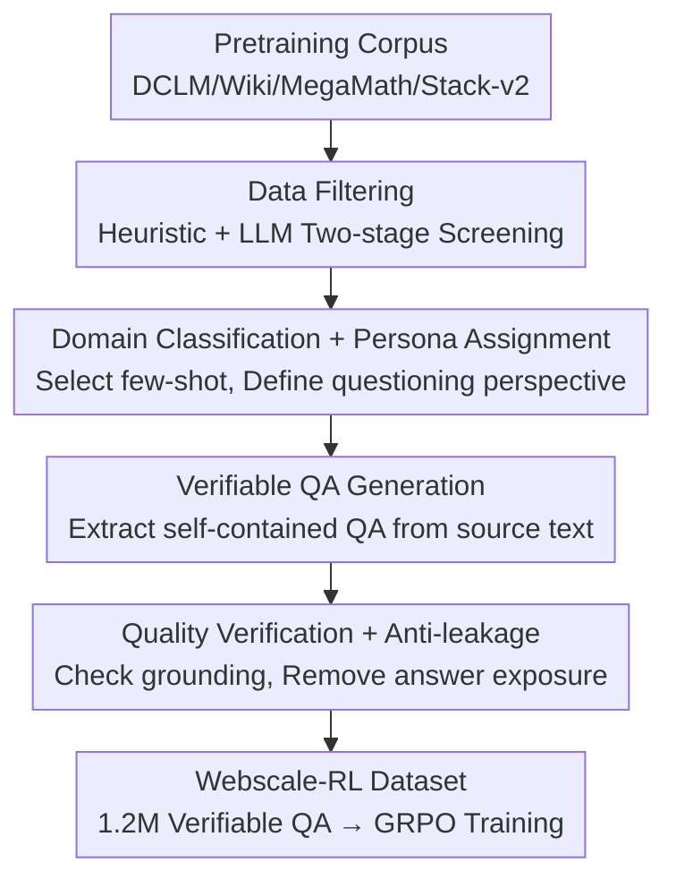

# Webscale-RL: Automated Data Pipeline for Scaling RL Data to Pretraining Levels

**Conference**: ICLR 2026  
**Paper**: [OpenReview](https://openreview.net/forum?id=webscale-rl) (Note: Link as per original)  
**Code**: https://github.com/SalesforceAIResearch/PretrainRL-pipeline  
**Dataset**: https://huggingface.co/datasets/Salesforce/Webscale-RL  
**Area**: Reinforcement Learning / RL Data Synthesis / LLM Training  
**Keywords**: RL Data Scaling, Verifiable QA, Pretraining Corpus Transformation, Data Diversity, GRPO

## TL;DR
This paper proposes the Webscale-RL automated data pipeline, which systematically converts trillion-token pretraining corpora into millions of "verifiable QA pairs" for RL training. By constructing a 1.2-million-sample RL dataset covering 9+ domains, GRPO training significantly outperforms continued pretraining and various data refinement baselines across multiple benchmarks, achieving comparable effects to continued pretraining with up to 100× fewer tokens.

## Background & Motivation
**Background**: The current mainstream LLM training paradigm (next-token pretraining + SFT) is essentially "imitation learning"—forcing the model to fit the next-token distribution of static, offline corpora. This teacher-forcing approach ensures the model only sees "standard answers" and never experiences the distribution it enters during its own generation.

**Limitations of Prior Work**: Imitation learning leads to two structural problems: first, **distribution shift** (once the model deviates from the standard trajectory during inference, errors compound); second, the **train-generation gap** (the model is always fed ground-truth prefixes during training but must continue autonomously during generation). Consequently, models lack robustness in complex reasoning. RL naturally bridges this gap through "self-generation + online reward feedback," offering higher data efficiency.

**Key Challenge**: Despite the advantages of RL, it is hindered by a **data bottleneck**. Pretraining corpora often exceed 1T+ tokens, while existing RL datasets are orders of magnitude smaller (typically $< 10$B tokens) and highly concentrated in math and code. The root cause is the extremely high cost of constructing "verifiable QA pairs," which requires either manual annotation (e.g., competition problems) or distillation from strong teacher models (where quality is capped by the teacher and query sources are limited). This restricts RL to a few reasoning tasks in the post-training stage, failing to realize its potential for general capability enhancement.

**Goal**: To scale RL training data to pretraining levels without **sacrificing the diversity of web data**.

**Key Insight**: The authors observe that pretraining corpora themselves conceal vast amounts of facts and knowledge that can be queried. Rather than paying high costs for strong models to "solve problems," it is more effective to have generative models **extract** "question + verifiable short answer" pairs from the original text. Thus, answers are naturally grounded in the source text, making them inexpensive, reliable, and capable of scaling linearly with the corpus size.

**Core Idea**: A four-stage automated pipeline—"Filtering → Domain/Persona Assignment → Verifiable QA Generation → Quality Verification"—is used to batch-convert narrative pretraining documents into verifiable QA pairs, aligning the scale and diversity of RL data with pretraining corpora.

## Method

### Overall Architecture
Webscale-RL is a data factory pipeline: the **input** is raw pretraining corpora across multiple domains (approx. 1 million documents from DCLM, Wikipedia, MegaMath, Stack-v2, etc.), and the **output** is 1.2 million RL training samples consisting of "self-contained questions + verifiable short answers." It does not train new models itself but uses existing LLMs (GPT-4.1 / GPT-4.1-mini) as tools to refine documents into RL-ready data across four stages.

The design emphasizes two main threads for diversity: ① maintaining a **domain-specific demonstration library** to provide different few-shot examples for each domain; ② assigning **multiple personas** to each document to elicit questions from different perspectives. Ultimately, each sample is paired with a binary reward (1 for a match with ground-truth, 0 otherwise), making every entry verifiable.

### Key Designs

**1. Data Filtering: Removing noise while maximizing diversity**

This stage addresses a specific pain point: to produce high-quality verifiable questions, one must first remove documents that are "unquestionable." However, traditional pipelines often filter strictly by difficulty, format, or reasoning traces, **consequently stripping away the diversity of the original corpus**. The authors do the opposite—filtering serves "subsequent stages" rather than "purification." Specifically, it involves two levels: first, heuristic rules to remove short documents ($< 50$ tokens); second, LLM-based fine-grained filtering to exclude only two types: (i) uninformative pages (web navigation, headers/footers) and (ii) non-self-contained fragments that lack context for verification. Otherwise, as much is kept as possible to ensure the documents are informative and convertible without damaging the domain breadth of the web corpus.

**2. Domain Classification + Persona Assignment: Enhancing diversity via domain-specific few-shots and multi-perspective personas**

Pretraining data is highly diverse. Using a single set of few-shot examples for all documents leads to "mismatched" or monotonous questions. This design first uses an LLM classifier to categorize each document into a specific domain (commerce / healthcare / social science, etc.). The domain label is used to **retrieve corresponding few-shot examples from a domain-specific library**, ensuring questions are appropriate and verifiable—a feature missing in existing pipelines. Furthermore, each document is assigned **up to 3 personas**, defining "who cares about this content and from what perspective they would ask." For instance, a healthcare document might be assigned "Medical Expert / Patient / Health Journalist" personas, allowing one document to generate multiple questions based on different information needs, thereby enriching data diversity.

**3. Verifiable QA Generation: "Extraction" from source text over "Distillation" from strong models**

This is the core of the pipeline. Given the source document, domain label, and assigned persona, an LLM generator samples few-shot examples and generates QA pairs based on templates. Two deliberate designs are included: First, questions can "extract existing problems" or "create new problems answerable by the text"; since the model does not see the source document during RL training, the generator must provide necessary context to ensure the question is **self-contained**. Second, only a **short, verifiable ground-truth** (a number, name, or phrase) is required, rather than long-form reasoning from a strong LLM. This shifts the task from "solving a problem" to "finding the answer in a document," significantly reducing complexity and dependency on backend strong models. This allows for cheaper LLMs and scaling to open-source models, while ensuring data quality is grounded in the source text and scales naturally.

**4. Quality Verification + Anti-Leakage: Double LLM verification to ensure clean reward signals**

Since RL is sensitive to noise (incorrect ground-truth feeds wrong rewards), this stage uses an LLM verifier for multi-level checks: ① **Correctness verification**—verifying if the extracted QA is "grounded" in the source document, which is less subjective than checking correctness alone; ② **Anti-leakage**—ensuring the question does not reveal the answer (ground-truth cannot be trivially embedded in the prompt), ensuring the model is not just "retrieving" but using knowledge or reasoning. Failed QA pairs are filtered. Finally, lm-eval-harness is used for decontamination against evaluation sets.

### Mechanism
A walkthrough with a "healthcare" pretraining document: ① **Filtering**—Document $> 50$ tokens, self-contained, non-boilerplate; kept. ② **Domain + Persona**—Classified as healthcare; domain few-shot retrieved; "Medical Expert / Patient / Health Journalist" personas assigned. ③ **QA Generation**—From a "Patient" perspective: "What are the common side effects of [Drug]?" with context; answer extracted as "dizziness, nausea"; self-contained. ④ **Verification**—Verifier confirms the answer is grounded in text and not in the prompt; passed. One document produces up to 3 diverse QA pairs, contributing to the 1.2M dataset, with 150K sampled for GRPO training.

## Key Experimental Results

### Main Results
Using Qwen2.5-3B as a base, trained with GRPO on Webscale-RL, compared against Continued Pretraining and three data refinement baselines (QuRating / ProX / GDR). To eliminate bias from instruction following, all baselines received an additional 10K high-quality SFT samples.

| Method | MMLU-pro | BigBench | GPQA-D | MATH500 | GSM8K | MBPP | EvalPlus | Average |
| :--- | :--- | :--- | :--- | :--- | :--- | :--- | :--- | :--- |
| Qwen2.5-3B (base) | 37.8 | 41.2 | 20.8 | 47.6 | 74.2 | 54.6 | 57.3 | 47.6 |
| Cont. Pretrain | 39.9 | 45.1 | 18.6 | 44.0 | 77.4 | 55.2 | 57.8 | 48.3 |
| QuRating | 39.7 | 44.9 | 19.4 | 44.6 | 76.8 | 54.8 | 57.6 | 48.3 |
| ProX | 40.0 | 46.0 | 19.5 | 44.4 | 77.3 | 54.2 | 57.5 | 48.4 |
| GDR (Strongest) | 39.9 | 46.0 | 20.8 | 44.4 | 77.4 | 55.0 | 57.6 | 48.7 |
| **Webscale-RL** | **43.7** | **48.3** | **23.2** | **58.0** | **78.5** | 55.0 | 57.8 | **52.1** |
| Qwen2.5-7B (Ref) | 48.3 | 58.7 | 29.6 | 60.8 | 84.4 | 63.4 | 62.2 | 58.2 |

The average score is **3.4** points higher than the strongest baseline (GDR), narrowing the gap between 3B and 7B models from 10.6 points to 6.1. MATH500 jumped from 47.6 to 58.0 (approaching the 7B model's 60.8).

### Dataset Diversity Comparison

| Dataset | Type | Scale | Domain | Source | Scalability |
| :--- | :--- | :--- | :--- | :--- | :--- |
| DeepScaler | RL | 40K | Math | Human + Math data | Low (Manual) |
| OpenR1-Math | SFT/RL | 220K | Math | DeepSeek-R1 Distill | Medium |
| OpenThoughts3 | SFT | 1.2M | Math/Code/Sci | QwQ-32B Distill | Medium |
| Nemotron | SFT/RL | 3.9M | Math/Code/Sci | Multi-model Distill | Medium |
| **Webscale-RL** | RL | 1.2M | **Multi-domain (9+)** | **Pretrain Conversion** | **High** |

Key difference: Other large datasets rely on human effort or distillation (limited by teacher quality and query sources). Webscale-RL converts from pretraining documents with verification, scaling naturally to pretraining levels. UMAP visualizations show its question embeddings are more uniform and diverse than Nemotron.

### Key Findings
- **Staggering Data Efficiency**: On MMLU-pro, RL achieve the same effect as 1B tokens of continued pretraining with only roughly 10M tokens, representing a $> 100\times$ efficiency gain. At 100M tokens, RL improves by 4.4% over base, while continued pretraining shows almost no gain.
- **Largest gains in general knowledge/reasoning** (MMLU-pro, BigBench, GPQA-D), benefiting from the breadth of inherited pretraining data.
- **Significant math improvement** (MATH500 +10.4), confirming RL encourages mathematical reasoning more effectively than imitation; GSM8K gains are smaller due to base model saturation.
- **Code improvement is marginal**, reflecting the low proportion of code in the pretraining corpus—noted as a limitation.
- RL advantages do not stem solely from improved instruction following (as baselines were SFT-aligned) but from reward-driven online learning signals. RL exhibits a steeper scaling curve than teacher-forcing.

## Highlights & Insights
- **"Extraction over Distillation" Paradigm Shift**: Reducing QA generation from "problem solving" to "answer extraction" solves cost, reliability, and scalability simultaneously—the most clever aspect, as data quality is no longer capped by the teacher model.
- **Diversity as a First-Class Citizen**: The filtering phase deliberately "removes noise without purifying," which, combined with domain few-shots and personas, preserves web data breadth, tackling the "narrowness" of existing RL data.
- **Grounding-based Denoising**: Verifying "if the document supports the answer" rather than "if the answer is correct" avoids reward signal pollution from LLM preferences.
- **Portability**: The "Document → Verifiable QA" pipeline is not limited to general corpora; it can be used on code repositories or medical literature for targeted capability enhancement.

## Limitations & Future Work
- **Insufficient code coverage**: Admitedly leads to smaller gains in code benchmarks; future work could rebalance domain distributions (e.g., adding repo-level code).
- **High Inference Overhead**: Generative binary rewards are stable but introduce significant overhead, creating a bottleneck for scaling; more efficient reward models are needed.
- **Scale Verification**: Experiments only went up to Qwen2.5-3B; whether the "100× efficiency" holds for larger models remains unknown. Binary rewards might be too coarse for open-ended tasks requiring long reasoning chains.
- **GPT-4 Dependency**: The pipeline relies heavily on the GPT-4.1 series; stability with open-source models needs further validation.

## Related Work & Insights
- **vs. Distilled Data (OpenThoughts3 / Nemotron / NaturalReasoning)**: These rely on teacher models for answers, limiting quality and scalability. This work extracts from source text, allowing natural scaling.
- **vs. Data Refinement Baselines (QuRating / ProX / GDR)**: These remain in the "refine text + continued imitation" framework. This work proves that reward-driven online learning on the same data yields higher gains than imitation.
- **vs. Human/Competition RL Data (DeepScaler)**: Limited by manual annotation; this work automates conversion to align scale and diversity with pretraining.

## Rating
- Novelty: ⭐⭐⭐⭐ The "Extraction over Distillation" perspective and the goal of scaling RL data to pretraining levels are impactful.
- Experimental Thoroughness: ⭐⭐⭐⭐ Extensive benchmarks, baselines, and diversity analysis provided, though limited to 3B models.
- Writing Quality: ⭐⭐⭐⭐ Clear motivation, well-explained pipeline, and strong visual support.
- Value: ⭐⭐⭐⭐⭐ Open-source dataset and pipeline directly address the RL data bottleneck with practical community value.

<!-- RELATED:START -->

## Related Papers

- [\[ICLR 2026\] APC-RL: Exceeding Data-Driven Behavior Priors with Adaptive Policy Composition](apc-rl_exceeding_data-driven_behavior_priors_with_adaptive_policy_composition.md)
- [\[ICLR 2026\] AutoTool: Automatic Scaling of Tool-Use Capabilities in RL via Decoupled Entropy Constraints](autotool_automatic_scaling_of_tool-use_capabilities_in_rl_via_decoupled_entropy_.md)
- [\[ICLR 2026\] Towards High Data Efficiency in Reinforcement Learning with Verifiable Reward](towards_high_data_efficiency_in_reinforcement_learning_with_verifiable_reward.md)
- [\[ICLR 2026\] Prosperity before Collapse: How Far Can Off-Policy RL Reach with Stale Data on LLMs?](prosperity_before_collapse_how_far_can_off-policy_rl_reach_with_stale_data_on_ll.md)
- [\[ICLR 2026\] R-Zero: Self-Evolving Reasoning LLM from Zero Data](r-zero_self-evolving_reasoning_llm_from_zero_data.md)

<!-- RELATED:END -->
