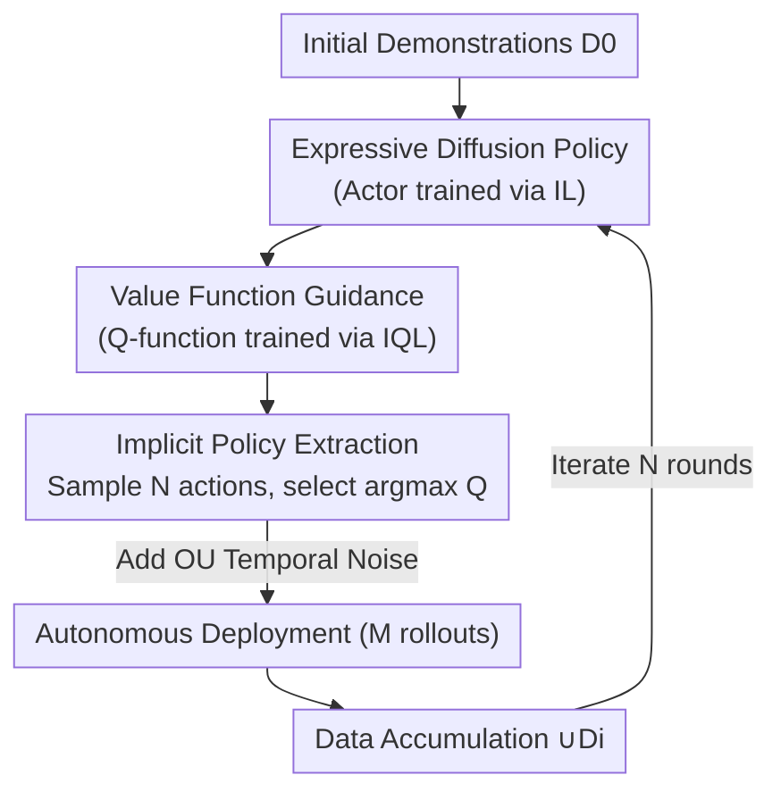

# What Matters for Batch Online Reinforcement Learning in Robotics?

**Conference**: ICLR 2026  
**OpenReview**: [https://openreview.net/forum?id=usw1NVkczu](https://openreview.net/forum?id=usw1NVkczu)  
**Code**: https://pd-perry.github.io/batch-online-rl/ (Project page, promised open-source)  
**Area**: Reinforcement Learning  
**Keywords**: Batch Online RL, Robot Self-Improvement, Value Guidance, Implicit Policy Extraction, Diffusion Policy

## TL;DR
This paper provides a systematic empirical study. The authors decompose the paradigm where robots iteratively self-improve using large batches of self-collected data (batch online RL) into three axes: algorithm category, policy extraction method, and policy expressivity. They derive a robust "recipe": Value-based guidance (IQL) + Implicit Policy Extraction (sampling multiple actions and selecting the one with the highest Q-value) + Expressive Diffusion Policy, supplemented with temporal Ornstein–Uhlenbeck (OU) noise. This approach achieves up to 2× performance gains over imitation learning methods in six simulated manipulation tasks and improves the success rate of a real-world "tape-hanging" task by 30% over three iterations.

## Background & Motivation

**Background**: Robot learning has long been hindered by data scarcity, as human demonstrations are extremely costly. An attractive alternative is robot **self-improvement**: deploying an initial policy, autonomously collecting large batches of rollouts, and then refining the policy offline, repeating this process. The authors define this "freeze policy → collect batch → offline update → redeploy" paradigm as **batch online RL**. It sits between pure offline RL (no new data) and pure online RL (update while executing), avoiding engineering challenges like the coupling of training and execution or unstable/unsafe behaviors on hardware.

**Limitations of Prior Work**: Most prior works in batch online RL utilize imitation learning (IL) or filtered imitation learning (filtered-IL), which only retrains on successful trajectories. While intuitive, these methods perform poorly: pure IL fits even the failed trajectories in autonomous rollouts, while filtered-IL often converges to sub-optimal points and hits a performance plateau (saturation) as the volume of autonomous data increases.

**Key Challenge**: In autonomously collected data, **valuable signals are often hidden within suboptimal or failed trajectories**. IL and filtered-IL only "copy success." They fail to learn "which state-actions are actually good" from failures, and the collected trajectories themselves lack diversity. To truly leverage autonomous data, a policy must be capable of both **collecting diverse trajectories** and **learning from that diversity**.

**Goal**: Instead of inventing a new algorithm, this paper aims to answer an urgent engineering question: **Which components** make batch online RL actually work? The authors decompose the design space into three independently ablatable axes: (i) algorithm category (IL / filtered-IL / Value-based RL), (ii) policy extraction method (explicit / implicit), and (iii) policy expressivity (Gaussian / Diffusion).

**Core Idea**: Utilize a **value function** to identify "good state-actions even within failed trajectories," turning failures into learning signals. Furthermore, the Q-function is used only at **deployment time** to select the best action from the policy distribution (implicit extraction), decoupling value learning from policy training for stability. Combining these three axes results in a reproducible recipe.

## Method

### Overall Architecture

The backbone of batch online RL (Algorithm 1) is straightforward: train a policy $\pi_0$ (and value function $Q_0$) using an initial offline dataset $D_0$. Then enter a loop: in each iteration $i$, use $\pi_{i-1}$ to collect $M$ rollouts to form $D_i$, merge it into the cumulative dataset $\cup_i D_i$, and retrain the value function $Q_i$ and policy $\pi_i$. The contribution of this paper lies in finding the correct implementation for two components typically filled arbitrarily: `UpdatePolicy` (which algorithm and expressivity) and `Rollout` (how to extract actions from the Q-function). The identified recipe is: **Train an expressive diffusion policy as the actor using IL, train a Q-function on autonomous data using IQL, and use implicit policy extraction (sampling $N$ actions and choosing $\arg\max Q$) during rollout**, optionally adding temporal OU noise for enhanced diversity.

### Key Designs

**1. Value Function Guidance: Turning failures into signals**

The first axis is the algorithm category. The fundamental flaw of IL/filtered-IL is that they only "copy success." The authors advocate for **Value-based RL**, specifically training a Q-function on cumulative data to judge "which state-actions are worth pursuing, even if they appear in failed trajectories." This paper primarily uses IQL (Implicit Q-Learning) objectives:

$$L_Q(\phi) = \mathbb{E}_{(s,a,r,s')\sim D}\big[(r + \gamma V_\psi(s') - Q_\phi(s,a))^2\big]$$
$$L_V(\psi) = \mathbb{E}_{(s,a)\sim D}\big[L_2^\tau(Q_{\phi'}(s,a) - V_\psi(s))\big],\quad L_2^\tau(x)=|\tau - \mathbb{1}(x<0)|\,x^2$$

where $\tau$ is the expectile hyperparameter; larger $\tau$ values cause the value function to approximate the upper bound of $Q$. Experimentally, value-based RL significantly outperforms IL/filtered-IL. State occupancy heatmaps show it collects trajectories with **significantly higher diversity** and **continuous performance gains** as data scales, whereas IL/filtered-IL saturate.

**2. Implicit Policy Extraction: Decoupling value and policy training**

The second axis is how to derive the rollout policy from the value function. **Explicit extraction** (traditional in offline RL, e.g., AWR) optimizes an objective $J_\pi(\theta)=\mathbb{E}_{(s,a)\sim D}[e^{\beta(Q(s,a)-V(s))}\log\pi_\theta(a|s)]$ to "bake" the Q-signal into the policy parameters. **Implicit extraction** does not train a separate extraction policy; instead, it samples multiple actions $\{a_i\}$ from the base policy and selects $\arg\max_{a_i} Q(s,a_i)$ during **deployment**.

The experiments yield a counter-intuitive but crucial finding: while explicit extraction is often stronger initially, **implicit extraction wins significantly after batch online iterations, while explicit extraction fails to improve the policy across all tasks**. This occurs because explicit extraction "bakes" signals into parameters that cannot adapt when the action distribution shifts due to new diverse data; implicit extraction is naturally more robust to distribution shifts.

**3. Expressive Diffusion Policy: Collecting and modeling diversity**

The third axis is the expressivity of the policy class, comparing Gaussian vs. Diffusion policies (both using IL + IQL objectives). Gaussian policies only model the mean and variance of $\pi(a|s)$, which is fast and sufficient for pure online RL. However, **Diffusion policies** model action distributions through Markovian de-noising, capturing multi-modal distributions and fitting perfectly with implicit extraction (high expressivity is needed to sample truly diverse candidate actions).

The experiments show Diffusion + Implicit Extraction is superior. The authors provide a precise explanation: in pure online RL, $\pi(a|s)$ changes at every step, allowing for new actions to emerge constantly; in batch online RL, the policy is **frozen** during a batch of deployment. To leverage diversity, the initial model must **capture the expert action distribution well enough** to sample useful trajectories first—making expressivity indispensable in this setting.

**4. Temporal Noise: Extracting more diversity via OU Processes**

A common theme across the axes is better utilization of collected diversity. The authors add a simple optional enhancement: adding **temporal noise** (modeled as an Ornstein–Uhlenbeck process) to actions during rollout. While it provides performance gains across **all data scales**, it **does not improve the data scaling curve**, as the noise's role in expanding distribution can be naturally achieved with more data.

### Loss & Training
The value function is trained using IQL's $L_Q$ and $L_V$ objectives (expectile $\tau$). The policy actor is trained using a Diffusion model with an IL (Behavior Cloning) objective. During deployment, implicit extraction is used (sampling $N$ actions and choosing $\arg\max Q$). This instantiation is equivalent to IDQL (Implicit Diffusion Q-Learning) in a single iteration, but the recipe itself defines a category of methods. In simulations, $D_0$ consists of 5–100 demonstrations, $M=200$ rollouts per round, for $N=10\!-\!20$ rounds.

## Key Experimental Results

### Main Results

Six continuous control manipulation tasks (Robomimic: Lift/Can/Square; MimicGen: Threading/Stack; Adroit: Pen). Metric: Normalized Return (3 seeds × 100 evals/round).

| Dimension | Weaker Choice | Recipe Choice (Ours) | Conclusion |
|-----------|---------------|----------------------|------------|
| Algorithm Category | IL / filtered-IL | Value-based (IQL) | Value-based is significantly better and scales with data. |
| Policy Extraction | Explicit (AWR) | Implicit ($\arg\max Q$) | Explicit leads to zero improvement; Implicit wins significantly. |
| Policy Expressivity | Gaussian | Diffusion | Diffusion is superior; Gaussian + Implicit is still inferior to Diffusion. |
| Overall Recipe | Prior Methods | Recipe (+OU Noise) | Up to **2×** performance gain and better scaling. |

Real-world task (7-DoF Franka robot picking tape and hanging it; RGB + Proprioception, ResNet-18 backbone): $D_0=5$ demos, $N=3$ rounds, $M=30$ rollouts/round.

| Method | Real-world Result |
|--------|-------------------|
| **Ours** | **30% success rate improvement over initial policy within 3 rounds** |
| filtered-IL | Failed to improve (initial policy already fitted $D_0$ distribution) |
| steering (Nakamoto 2024) | Lowest performance; proves retraining the policy is necessary |

### Ablation Study

| Configuration | Key Finding |
|---------------|-------------|
| Value-based vs filtered-IL | More dispersed state occupancy heatmaps | Value-based RL ingests significantly higher diversity. |
| Implicit vs Explicit | Explicit is stronger initially but hits a ceiling | Explicit is "locked" by distribution shift; Implicit stays adjustable. |
| Gaussian + Implicit vs Diffusion + Implicit | Gaussian + Implicit > Explicit but << Diffusion | Proves gain is not just the extraction method; expressivity is key. |
| +OU Noise vs None | Performance ↑ at all scales, scaling curve unchanged | Noise expands distribution, similar to naturally having more data. |

### Key Findings
- **The three axes are not equal**: Value-based RL is "necessary but not sufficient"—this explains why previous attempts at value-based RL in this setting failed (when the other axes were wrong). All three are needed for the 2× gain.
- **Implicit > Explicit is counter-intuitive**: Explicit extraction's inability to adapt to the distribution shifts caused by new data is the root cause of its zero-improvement.
- **Why expressivity matters for batch online**: Because the policy is frozen during deployment, the initial model must capture enough of the distribution to sample the trajectories needed for subsequent learning.

## Highlights & Insights
- **The "Recipe" as a contribution**: Rather than a new algorithm, the contribution is a systematic reduction of a vague design space into an actionable formula.
- **Decoupling Value and Policy via Implicit Extraction**: Using the Q-function only at deployment time to pick actions makes the method naturally robust to distribution shifts.
- **Honest Appraisal of OU Noise**: The authors clarify that noise improves performance but not scaling, avoiding the pitfall of over-claiming its importance.

## Limitations & Future Work
- **Limited to continuous action spaces**: The recipe might change for discrete or discretized action spaces.
- **Dependency on a "decent" initial policy**: Initial success rates were 30–65%; cold-starting from 0% remains an open problem.
- **OU Noise is not universal**: Adding noise to actions may not be suitable for all deployment scenarios.
- **Upper bound of Q-functions**: Whether pessimistic Q-learning is optimal and whether better implicit extraction methods exist (beyond argmax) are left for future work.

## Related Work & Insights
- **vs IL / filtered-IL (Liu 2023, Ahn 2024)**: Those rely on copying success; Ours uses Q-functions to extract signals even from failures.
- **vs steering / value guidance (Nakamoto 2024)**: They do not retrain the policy; real-world experiments prove that "retraining is necessary."
- **vs offline-to-online fine-tuning**: Those methods suffer from distribution shift and catastrophic forgetting; Ours decouples collection and training to ensure stability.
- **vs IDQL (Hansen-Estruch 2023)**: Ours effectively generalizes IDQL to the multi-round self-improvement/scaling setting and proves its superiority there.

## Rating
- Novelty: ⭐⭐⭐⭐ (Solid empirical contribution through axis decomposition)
- Experimental Thoroughness: ⭐⭐⭐⭐ (Extensive simulation + real-world verification)
- Writing Quality: ⭐⭐⭐⭐⭐ (Clear problem decomposition and honest reasoning)
- Value: ⭐⭐⭐⭐⭐ (High engineering value for robot self-improvement)

<!-- RELATED:START -->

## Related Papers

- [\[ICLR 2026\] Learning What Matters Now: Dynamic Preference Inference under Contextual Shifts](learning_what_matters_now_dynamic_preference_inference_under_contextual_shifts.md)
- [\[ICLR 2026\] Who Matters Matters: Agent-Specific Conservative Offline MARL](who_matters_matters_agent-specific_conservative_offline_marl.md)
- [\[AAAI 2026\] Where and What Matters: Sensitivity-Aware Task Vectors for Many-Shot Multimodal In-Context Learning](../../AAAI2026/reinforcement_learning/where_and_what_matters_sensitivity-aware_task_vectors_for_many-shot_multimodal_i.md)
- [\[ICLR 2026\] Stackelberg Coupling of Online Representation Learning and Reinforcement Learning](stackelberg_coupling_of_online_representation_learning_and_reinforcement_learnin.md)
- [\[ICLR 2026\] The Sample Complexity of Online Reinforcement Learning: A Multi-Model Perspective](the_sample_complexity_of_online_reinforcement_learning_a_multi-model_perspective.md)

<!-- RELATED:END -->
