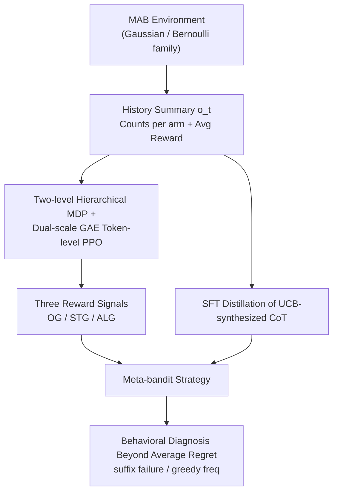

# When Greedy Wins: Emergent Exploitation Bias in Meta-Bandit LLM Training

**Conference**: ICLR 2026  
**Paper**: [OpenReview](https://openreview.net/) ⚠️ Subject to the original text  
**Code**: https://github.com/sanxing-chen/meta-bandit-llm  
**Area**: LLM Reasoning / Reinforcement Learning / In-Context RL  
**Keywords**: Multi-Armed Bandit, Exploration-Exploitation, meta-bandit, SFT vs RL, Reward Design

## TL;DR
The authors train LLMs as meta-bandit agents for Multi-Armed Bandit (MAB) tasks. Systematic comparisons between SFT and RL with three reward types reveal that while both can reduce cumulative regret to levels comparable to UCB/Thompson Sampling and generalize to $6\times$ longer horizons, behavioral analysis shows these "improvements" largely stem from a more sophisticated yet greedier exploitation strategy. The agents are more prone to premature abandonment of exploration (increased suffix failure) compared to pre-trained models, even outperforming the UCB teacher they mimic by being "lazily greedy."

## Background & Motivation
**Background**: The core of sequential decision-making is the exploration-exploitation tradeoff, for which MAB is a classic testbed. Placing an LLM into an MAB setting to make decisions based on interaction history constitutes In-Context RL (ICRL). When the training and test distributions differ, the trained LLM effectively becomes a **meta-bandit agent**—it learns a meta-strategy for exploration in new environments rather than memorizing the optimal arm of a specific environment.

**Limitations of Prior Work**: Pre-trained LLMs perform poorly on MAB, tending toward short-sighted greedy behavior by over-exploiting known rewards at the expense of exploration. Two training routes have been explored: SFT (imitating expert trajectories like UCB) and RL (learning directly from environmental rewards). However, previous work focused only on "who achieves lower in-distribution regret" (concluding SFT is more stable), without clarifying the **mechanistic** impact of these paradigms on strategy or their generalization to longer horizons and out-of-distribution (OOD) environments.

**Key Challenge**: Average regret, as an aggregate metric, masks behavioral details. A high-risk strategy prone to catastrophic failure might achieve lower average regret due to luck. Thus, lower average regret does not necessarily equate to having learned a robust exploration strategy.

**Goal**: This paper aims to answer three questions within a unified framework: (1) Are the mechanisms of strategies induced by SFT and RL fundamentally different? (2) How do they generalize to longer horizons and OOD environments? (3) Behind low average regret, has the agent learned robust exploration or just more shrewd exploitation?

**Key Insight**: Beyond aggregate regret, the authors introduce proxy statistics from Krishnamurthy et al. (2024), such as the suffix failure rate, to diagnose long-term exploration failures, decoupling "performance improvement" from "behavioral quality."

**Core Idea**: A meta-bandit LLM is trained using token-level PPO with a set of carefully designed reward signals. **Behavioral auditing beyond average regret** reveals that training gains often originate from an "emergent exploitation bias," i.e., "When Greedy Wins."

## Method

### Overall Architecture
In each turn $t$, the LLM agent receives a sufficient statistic observation $o_t$ (compressing history into "pull counts per arm + average reward") rather than raw action-reward sequences, which have been proven harder to learn. It performs CoT reasoning in `<think>` and provides the arm $a_t$ in `<answer>`. The environment returns a stochastic reward $r_t\sim R_{a_t}$, and history is updated as $o_{t+1}=f(o_t,a_t,r_t)$, repeating for $T$ turns. Since the agent must build beliefs about the environment (distribution family, variance) over the history, the process is a POMDP, and an amortized exploration strategy is learned via on-policy RL.

Two paradigms are trained in parallel: **RL** (token-level PPO with three reward options: OG/STG/ALG) and **SFT** (supervised distillation on UCB-synthesized CoT). The trained meta-bandit strategies are then analyzed in a **behavioral diagnosis** module using proxy statistics like suffix failure to audit exploration quality. The pipeline is as follows:

### Key Designs

**1. Hierarchical MDP + Dual-scale GAE Token-level PPO: Respecting "Intra-turn Token" and "Inter-turn" Dynamics**

Unlike traditional RL, an LLM agent generates a full response $s_t$ in token space before receiving an external reward $r_t$, causing credit assignment difficulties. The authors formulate this as a **two-level hierarchical MDP**: the high-level policy selects a "local policy" (the full response) per turn, while the low-level policy implements it at the token level with probability $\pi_\theta(s_{t,j}\mid o_t,s_{t,<j})$. The reward $r_t$ is assigned only to the final token $J_{t,\text{end}}$, while intermediate tokens receive no reward. Crucially, a **dual $(\gamma, \lambda)$ GAE** is used—distinct discount and trace-decay coefficients for intra-turn and inter-turn steps. The TD error $\delta_{t,j}$ is defined as follows:

$$\delta_{t,j}=\begin{cases}\gamma_{\text{intra}}V(h_{t,j+1})-V(h_{t,j}) & J_{t,\text{start}}\le j<J_{t,\text{end}}\\ r_t+\gamma_{\text{inter}}V(o_{t+1})-V(h_{t,j}) & j=J_{t,\text{end}}\end{cases}$$

The error at the final token absorbs the external reward $r_t$ and bootstraps from the next turn's initial state $V(o_{t+1})$ using $\gamma_{\text{inter}}$. Token-level advantages accumulate these TD errors across the episode, which are then fed into a standard clipped PPO objective. The **KL divergence term is omitted**, as it is unnecessary without a learned reward model. This design allows long reasoning chains within a turn and long-horizon exploration across turns to be attributed correctly across different timescales.

**2. Three Reward Signals (OG / STG / ALG): Directly Addressing Credit Assignment**

While observations $o_t$ are tied to fixed bandit rewards, the PPO reward signals can vary. Three versions are proposed: (a) **RL-OG** uses raw stochastic rewards; it is the most natural but suffers from slow learning due to stochasticity-induced credit assignment issues. (b) **RL-STG (Strategic reward)** is based on normalized instant regret $\Delta_t = \mu^* - \mu_{A_t}$, defined as $\tilde r_t = 1 - \Delta_t/\Delta_{\max} = \frac{\mu_{A_t} - \min_i \mu_i}{\mu^* - \min_i \mu_i} \in [0, 1]$. This optimizes action utility directly and simplifies attribution—acting as a baseline subtraction/control variate that reduces variance without theoretically changing the optimal policy. (c) **RL-ALG (Algorithmic reward)** bypasses environment rewards by using an optimal algorithm like UCB as an oracle, where $r_t=1$ if the agent's action matches the oracle's decision $\pi_{\text{oracle}}(o_t)$, otherwise $0$. Since UCB is reactive, this myopic reward suffices for on-policy learning while avoiding return-based attribution. All versions include format-shaping terms (reward of 0 for invalid actions).

**3. SFT Distillation with UCB-synthesized CoT: Explicit Arithmetic Reasoning**

The SFT branch performs full fine-tuning on "observation-response" pairs using **synthesized CoT demonstrations**. These demonstrations explicitly calculate UCB values for each arm (mean + uncertainty bonus $\sqrt{\ln(t)/N}$) before selection. Both rationales and actions are supervised. While this approaches UCB performance in-domain, it relies heavily on "distribution-agnostic" arithmetic. In OOD settings (e.g., negative rewards not seen during training), basic arithmetic fails, and the agent ceases to trust its own calculations, leading to a spike in worst-case regret.

**4. Behavioral Diagnosis Beyond Average Regret: Auditing Robustness with Proxy Statistics**

This is the core payload. The authors introduce three proxy metrics to diagnose long-term exploration failure: **SuffixFail@t** (the frequency of never selecting the optimal arm after time $t$, indicating premature abandonment), **GreedyFreq@t** (relative frequency of selecting the greedy arm up to $t$), and **MinFrac@t** (the minimum fraction any arm is pulled, scaled by $K$ to $[0, 1]$, where high values indicate non-convergence). Diagnosis shows that all fine-tuned agents have **higher** suffix failure than the pre-trained model and the theoretical optimum. Furthermore, the optimal arm selection frequency shifts from a near-normal distribution in pre-training to a **bimodal distribution** (either always or never choosing the optimal arm), a hallmark of greedy behavior. Interestingly, RL-ALG outperforms its UCB teacher because, as UCB becomes greedier with shrinking uncertainty bounds, the agent stops internalizing the exploration logic and instead adopts a "sub-UCB variant" in its reasoning (e.g., changing the exploration numerator from $\log(t)$ to $\log(N_t(a)+1)$), which permanently discards arms after short-term dissatisfaction.

### Loss & Training
- **RL**: Based on the VeRL framework, 64 random environments are sampled per round, each with a rollout length $T=50$, totaling $64\times 50$ transitions for PPO updates. Dual-scale GAE is used without KL.
- **SFT**: Trained for 6 epochs on 32k transitions sampled from UCB rollouts, uniformly across the training horizon.
- **Base Models**: Qwen 2.5 3B / 7B Instruct; training distributions comprise `Bernoulli5_Uniform` and `Gaussian5_Var1_MeanN0` to test OOD generalization.

## Key Experimental Results

### Main Results
Quantitative analysis for the 7B strategy trained on `Gaussian5_Var1_MeanN0` (selected from Table 2; Reward is absolute, others are percentages):

| Strategy | AvgReward@300 | BestArmFreq@300 | SuffixFail@150 | Description |
| :--- | :--- | :--- | :--- | :--- |
| Pretrain | 0.79 | 63.1 | 0.0 | Near-random, linear regret |
| UCB (teacher) | 1.04 | 80.6 | 4.7 | Theoretical oracle |
| SFT | 1.05 | 81.3 | 6.2 | UCB distillation, strong in-domain |
| RL-OG | 1.01 | 79.8 | 4.7 | Raw stochastic rewards |
| RL-STG | 1.01 | 81.1 | 6.2 | Strategic reward, lower variance |
| **RL-ALG** | **1.05** | **85.7** | 9.4 | Algorithmic reward, most stable |

Key Findings: SFT and RL both push regret close to UCB/Thompson Sampling levels. The BestArmFreq of RL-ALG even exceeds its UCB teacher and generalizes to $6\times$ longer horizons (50 to 300) and 10-arm OOD settings, whereas the pre-trained model performance plateaus early.

### Ablation Study / Paradigm Comparison

| Phenomenon | Observation | Implication |
| :--- | :--- | :--- |
| Suffix failure | All fine-tuned agents > Pre-training/Oracle | Training introduces exploitation bias. |
| Best arm distribution | Near-normal → Bimodal | Emergence of "all-or-nothing" greedy behavior. |
| RL vs SFT (OOD) | RL (especially RL-ALG) is more stable | RL strategy transfer is more reliable. |
| Small models | 3B plateaus on RL-OG/STG, but learns with teachers | Environmental rewards are too hard for small models. |
| RL-ALG vs UCB | Matches less than SFT but has lower regret | Gains come from greedy "sub-UCB" variants. |

### Key Findings
- **RL-ALG (Algorithmic Reward) is the most effective**: The binary matching signal from UCB is easiest to attribute and remains most stable in/out-of-distribution. RL-OG is the hardest to learn due to stochasticity.
- **Strategic reward is useful primarily in high-variance environments**: RL-STG significantly outperforms RL-OG in Gaussian training but converges to RL-OG in lower-variance Bernoulli settings.
- **SFT generalization is fragile**: It relies on UCB's arithmetic. Faced with unseen negative rewards, the model experiences catastrophic forgetting of basic arithmetic, leading to a spike in worst-case regret. RL-ALG is unaffected.
- **Small models require a teacher**: The 3B model fails to learn from environment rewards alone; it requires distillation or algorithmic rewards.

## Highlights & Insights
- **Mechanistic explanation of "outperforming the teacher"**: The student mimicking UCB becomes better not by being smarter, but because RL causes the student to prioritize reward exploitation in the late-episode stages. The agent learns a "lazy" greedy variant. Decoupling "metric gains" from "behavioral degradation" is highly insightful.
- **Dual-scale GAE as a reusable trick**: Correctly attributing "intra-turn token chains" and "inter-turn long horizons" via different $(\gamma, \lambda)$ can be applied to any agentic RL setting where a turn involves long reasoning and an external reward.
- **Warning on evaluation methodology**: Average regret can be deceptive. The bimodal nature of suffix failure/best-arm histograms reveals the true quality of exploration. This diagnostic framework is applicable to other sequential decision-making agents.
- **Reward design > Paradigm choice**: Designing rewards that simplify credit assignment (e.g., algorithmic or regret-shaped rewards) is more crucial than the choice between SFT and RL.

## Limitations & Future Work
- Tasks are limited to MAB (and contextual bandits in the appendix); whether similar exploitation bias emerges in more complex RL/agentic environments is unverified.
- Base models are limited to Qwen 2.5 3B/7B; it is unknown if larger models or different families follow the "train more, greedier" pattern.
- The oracle is fixed to UCB ($C = 0.5$); whether a more exploratory oracle would still be "lazily outperformed" remains an open question.
- While behavioral diagnosis identifies the problem, **no solution is provided**—how to suppress suffix failure (e.g., penalizing premature abandonment) while maintaining low regret is a clear future direction.
- Evaluations are performed on 64 episodes/seeds; due to LLM inference costs, the results represent "typical performance" rather than strict expectations.

## Related Work & Insights
- **vs Nie et al. (2024) / Schmied et al. (2025)**: Previous works used SFT or RL for expert distillation or environmental learning. This paper compares both, adds strategic/algorithmic rewards, and introduces behavioral auditing beyond average regret to show "performance $\neq$ robust exploration."
- **vs Classical UCB / Thompson Sampling**: The authors do not aim merely to beat these baselines; rather, the "imitation learning agent vs. UCB teacher" comparison provides the most counter-intuitive findings.
- **vs Krishnamurthy et al. (2024)**: This paper repurposes suffix failure and MinFrac statistics to diagnose failures in *post-trained* policies rather than just pre-trained LLMs.

## Rating
- Novelty: ⭐⭐⭐⭐ While not a new model, the explanation of emergent exploitation bias and the "student outperforming teacher" mechanism is highly novel.
- Experimental Thoroughness: ⭐⭐⭐⭐ Coverage of dual models, OOD generalization, long horizons, and multiple proxy statistics; though limited to bandits.
- Writing Quality: ⭐⭐⭐⭐ Behavioral analysis is clear, and the reward design and diagnostic metrics are well-defined.
- Value: ⭐⭐⭐⭐ Significant implications for reward design and evaluation methodologies in agentic RL.

<!-- RELATED:START -->

## Related Papers

- [\[ICML 2026\] Turning Bias into Bugs: Bandit-Guided Style Manipulation Attacks on LLM Judges](../../ICML2026/reinforcement_learning/turning_bias_into_bugs_bandit-guided_style_manipulation_attacks_on_llm_judges.md)
- [\[ICLR 2026\] When Is Diversity Rewarded in Cooperative Multi-Agent Learning?](when_is_diversity_rewarded_in_cooperative_multi-agent_learning.md)
- [\[ACL 2026\] Semantic-Space Exploration and Exploitation in RLVR for LLM Reasoning](../../ACL2026/reinforcement_learning/semantic-space_exploration_and_exploitation_in_rlvr_for_llm_reasoning.md)
- [\[ICLR 2026\] Prompt Curriculum Learning for Efficient LLM Post-Training](prompt_curriculum_learning_for_efficient_llm_post-training.md)
- [\[ICLR 2026\] How Far Can Unsupervised RLVR Scale LLM Training?](how_far_can_unsupervised_rlvr_scale_llm_training.md)

<!-- RELATED:END -->
