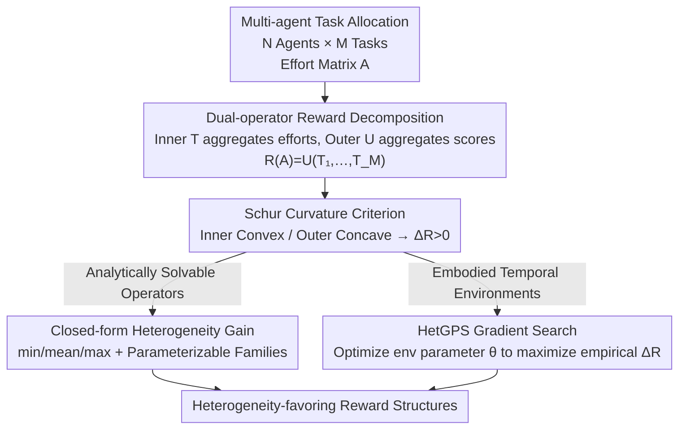

# When Is Diversity Rewarded in Cooperative Multi-Agent Learning?

**Conference**: ICLR 2026  
**OpenReview**: [https://openreview.net/forum?id=uJCGMBO6Qx](https://openreview.net/forum?id=uJCGMBO6Qx)  
**Code**: https://sites.google.com/view/hetgps  
**Area**: Reinforcement Learning / Multi-Agent  
**Keywords**: Multi-agent reinforcement learning, behavioral heterogeneity, task allocation, Schur-convexity, reward design

## TL;DR
This paper attributes the long-standing question of "when does a multi-agent team need division of labor" to a curvature criterion of the reward function. By decomposing the team reward into a two-step process—an "inner operator" aggregating agent efforts on individual tasks and an "outer operator" aggregating task scores—it proves that whenever the inner operator is Schur-convex (or the outer is Schur-concave), a heterogeneous team strictly outperforms the optimal homogeneous team. Furthermore, a gradient search algorithm based on differentiable simulators, HetGPS, is used to automatically discover "heterogeneity-demanding" reward structures in embodied MARL environments, yielding results perfectly consistent with theoretical predictions.

## Background & Motivation
**Background**: From robot swarms to insect societies, collaborative teams often exhibit two organizational forms: **homogeneous** teams where all members act identically, or **heterogeneous** teams where members specialize in different roles. In multi-agent learning, this corresponds to the modeling choice of "all agents sharing a single policy" versus "agent behavioral differentiation." Heterogeneity can be achieved through independent policy networks (neural heterogeneity) or shared policies with distinct inputs (e.g., role encodings).

**Limitations of Prior Work**: While heterogeneity can unlock role specialization and asymmetric information utilization, it introduces additional coordination costs, representation overhead, and learning complexity. Although the intuition suggests "division of labor is better," the field lacks a **principled criterion** to answer: under what conditions does a heterogeneous team actually beat the optimal homogeneous baseline? Past work has mostly relied on empirical observations (i.e., division of labor being useful in a specific environment) without provable or transferable standards.

**Key Challenge**: The benefit of heterogeneity is not universal—it depends on the **reward structure of the task** itself. For the same set of agents, changing the reward aggregation method can shift division of labor from "essential" to "meaningless." The root of the problem lies in how the reward function maps "the efforts of agents across tasks" to a "team scalar return." The curvature of this aggregation process determines everything, yet it has not been formalized.

**Goal**: (1) Provide necessary and sufficient criteria for "when $\Delta R > 0$ (positive heterogeneity gain)" in a clean, non-spatial, instantaneous task allocation model; (2) transfer these criteria to realistic, embodied, temporally extended MARL environments; (3) provide an algorithm that can automatically discover "reward-driven division of labor" configurations in complex environments where theory is difficult to apply directly.

**Key Insight**: The authors observe that team rewards in many task allocation problems can be written as $R(A) = U\big(T_1(a_1), \dots, T_M(a_M)\big)$, a "two-layer aggregation" structure. The inner operator $T_j$ aggregates the efforts of $N$ agents on task $j$ into a task score, and the outer operator $U$ aggregates $M$ task scores into a global reward. Once framed this way, whether division of labor is beneficial becomes a mathematical question regarding the curvature of $T$ and $U$.

**Core Idea**: Use **Schur-convexity/concavity** as a unified criterion. An inner operator that is Schur-convex (rewarding "unbalanced effort distributions") necessitates heterogeneity, while a Schur-concave one (rewarding "uniformity") does not. A gradient-based method is then used to search the environment parameter space to verify and extrapolate this theory.

## Method

### Overall Architecture
The paper does not propose a new model but rather establishes a **theoretical criterion** paired with an **algorithmic searcher** for validation. The logic follows: abstracting multi-agent task allocation rewards into a dual-operator decomposition ("inner $T$ + outer $U$"), providing theorems for "when heterogeneity gain $\Delta R > 0$" using Schur-convexity, deriving closed-form gains for typical operators like $\{\min, \text{mean}, \max\}$ and parameterizable families (Softmax / Power-Sum), and finally using HetGPS—a gradient searcher—to optimize environment parameters $\theta$ in complex temporal environments to maximize empirical $\Delta R$ and check if they align with the "inner-convex / outer-concave" region predicted by theory.

### Key Designs

**1. Dual-operator Reward Decomposition and Schur Curvature Criterion: Turning "Need for Specialization" into a Provable Curvature Problem**

A major pain point is that past assessments of whether specialization is beneficial were purely empirical. This work formalizes the team reward as a two-layer aggregation $R(A) = U\big(T_1(a_1), \dots, T_M(a_M)\big)$, where $A = [r_{ij}]$ is an $N \times M$ effort matrix with $r_{ij} \ge 0$ and budget constraints $\sum_j r_{ij} \le 1$ for each agent. The inner $T_j$ aggregates the column of efforts $a_j = [r_{1j}, \dots, r_{Nj}]^\top$ for task $j$ into a task score, and the outer $U$ aggregates $M$ scores into a scalar reward. A homogeneous strategy requires all agents to use the same row $r_{ij} = c_j$, resulting in reward $R_\text{hom}$; a heterogeneous strategy allows independent choices, resulting in $R_\text{het}$. The **heterogeneity gain** is defined as $\Delta R = R_\text{het} - R_\text{hom}$.

The key insight is that the sign of $\Delta R$ is determined by the Schur-convexity of $T$ and $U$: if $x$ can be made "more uniform" to get $y$ ($x$ majorize $y$, $x \succ y$), a Schur-convex function satisfies $f(x) \ge f(y)$, while a Schur-concave function increases with uniformity. The paper proves three core theorems: **Theorem 3.1**—if $inner T_j$ is strictly Schur-convex and $outer U$ is monotonically increasing, then $\Delta R > 0$ unless the optimal homogeneous solution is trivial; **Theorem 3.2**—if $inner T_j$ is Schur-concave, then $\Delta R = 0$ (division of labor is useless); **Theorem 3.3**—under a constant task score sum constraint ($\sum_j T_j = C$), if $outer U$ is strictly Schur-convex, then $\Delta R = 0$. Summarized: **Inner Convex + Outer Concave → Heterogeneity Favored**. Intuitively, inner convexity means "concentrated effort on one task is better than splitting" (encouraging specialization), while outer concavity means "all tasks must be addressed" (encouraging distribution across tasks), which together force division of labor.

**2. min / mean / max and Parameterizable Operator Families: Implementing Abstract Criteria as Calculable Reward Toolkits**

To make the curvature criterion practical, the authors instantiate it with common operators. $\{\min, \text{mean}, \max\}$ serve as natural poles: $\min$ is "maximally Schur-concave," $\max$ is "maximally Schur-convex," and $\text{mean}$ is both (the boundary case). For all 9 combinations of inner/outer operators, the paper derives **closed-form heterogeneity gains** (e.g., for continuous efforts $r_{ij} \in [0,1]$, $\Delta R = (M-1)/M$ when $U = \min, T = \max$).

Furthermore, **parameterizable operator families** such as $\{f_t(\cdot)\}_{t \in \mathbb{R}}$ allow continuous tuning of curvature via a scalar $t$, smoothly transitioning between Schur-concave and Schur-convex. A typical example is the Softmax aggregator $\sum_i \frac{\exp(t \cdot r_{ij})}{\sum_\ell \exp(t \cdot r_{\ell j})}$, controlled by temperature $t$: strictly Schur-concave for $t < 0$ and strictly Schur-convex for $t > 0$. This transforms "reward design" into "tuning curvature in a low-dimensional parameter space."

**3. HetGPS: Using Differentiable Simulators to Search for "Heterogeneity-Demanding" Environments**

While theoretical criteria are elegant in instantaneous models, real MARL environments are embodied and temporal, where effort $r_{ij}^t$ is realized through movement over time. Curvature analysis may not apply directly. Thus, the authors propose **Heterogeneity Gain Parameter Search (HetGPS)**: the environment is modeled as a **Parameterized Dec-POMDP (PDec-POMDP)** where observations, transitions, and rewards depend on parameter $\theta$, making the return $G_\theta(\pi)$ differentiable with respect to $\theta$. Empirical heterogeneity gain is defined as $\text{HetGain}_\theta = G_\theta(\pi_\text{het}) - G_\theta(\pi_\text{hom})$. Gradient ascent $\theta \leftarrow \theta + \alpha \nabla_\theta \text{HetGain}_\theta$ is used to maximize this gain via backpropagation through time in a differentiable simulator.

The process is a **bilevel iterative optimization**: each round runs heterogeneous and homogeneous teams to calculate gain, then updates environment $\theta$; agent policies are trained separately using any on-policy MARL algorithm (e.g., MAPPO). The environment uses first-order gradients while the policies use zero-order (policy gradients) to avoid local minima. This approach resembles automatic curriculum methods like PAIRED but differs by using a **differentiable simulator for direct regret gradient backpropagation** instead of RL for the environment designer, which is more efficient.

### Loss & Training
The environment-side objective for HetGPS is the empirical heterogeneity gain $\text{HetGain}_\theta(\pi_\text{het}, \pi_\text{hom}) = G_\theta(\pi_\text{het}) - G_\theta(\pi_\text{hom})$, optimized via gradient ascent or descent. The agent-side uses standard MARL (MAPPO). Matrix game experiments use $N = M = 4$ for 12M steps; embodied environments (Multi-goal-capture, Tag) for 30M frames; HetGPS on Multi-goal-capture for 90M frames across 13 random seeds.

## Key Experimental Results

### Main Results

| Study Stage | Environment | Setup | Key Findings |
|-------------|-------------|-------|--------------|
| Matrix Games | Single-step task allocation | $N=M=4$, 9 combinations of $\{\min, \text{mean}, \max\}$, 12M steps | Learned strategy gains **precisely match** theoretical closed-form predictions (Fig. 2). |
| Multi-goal-capture | Embodied continuous effort navigation | $U, T \in \{\min, \text{mean}, \max\}$, 30M frames | $\Delta R > 0$ only for $U=\min, T=\max$ and $U=\text{mean}, T=\max$ (Concave-Convex), consistent with theory. |
| 2v2 Tag | Embodied discrete effort pursuit | Sparse reward, 30M frames | Discrete effort theory accurately predicts which operators yield $\Delta R > 0$. |
| Football | VMAS continuous control | $R(A)$ is only part of the global reward | Theory remains highly predictive even when the target reward is only a component. |
| HetGPS | Multi-goal-capture param reward | Softmax / Power-Sum operators, 90M frames | Automatically learns $T$ to be Schur-convex and $U$ to be Schur-concave, **rediscovering** the theoretically optimal reward structure. |

### Ablation Study

| Configuration | Observation | Description |
|---------------|-------------|-------------|
| Softmax init $\tau_1=\tau_2=0$ (both mean) | After training, $\tau_1$ increases, $\tau_2$ decreases | HetGPS pushes inner $T$ toward Schur-convexity and outer $U$ toward Schur-concavity. |
| Power-Sum init $\tau_1=\tau_1=1$ (both sum) | Similarly converges to inner-convex/outer-concave | Changing the parameterizable family yields the same conclusion, verifying the structural discovery. |
| Increase agent observability | Empirical heterogeneity gain gradually disappears | Rich observations allow "homogeneous shared-network agents" to exhibit behavioral heterogeneity, replicating existing findings. |

### Key Findings
- **Three-stage Consistency**: From instantaneous matrix games to embodied temporal environments, the curvature theory consistently predicts which operator combinations result in $\Delta R > 0$.
- **HetGPS Validates Theory**: Without being programmed with the "inner-convex / outer-concave" rule, pure gradient search converges to the reward structure predicted by theory.
- **Observability-Heterogeneity Trade-off**: Heterogeneity exists at the neural level (distinct networks) and behavioral level (distinct acts). This work shows that when agents have rich observations, a homogeneous network can produce behavioral heterogeneity, causing $\Delta R$ to vanish.
- **Operational Reality**: For example, $U=\min, T=\max$ implies "each agent goes to a different goal and all goals must be covered"—a scenario naturally requiring division of labor, which the theory correctly identifies.

## Highlights & Insights
- **Curvature as a Unified Criterion**: The most elegant aspect is using Schur-convexity to turn intuitive reward design into a provable condition—"Inner Convex + Outer Concave = Heterogeneity Needed"—providing high transfer value.
- **Mutual Validation of Theory and Algorithm**: The fact that HetGPS discovers the theoretically optimal structure without prior knowledge is a strong example of the "theory predicts—algorithm finds" loop.
- **New Use for Differentiable Environment Design**: Shifting the PAIRED approach from "RL-trained designer" to "direct regret gradient backprop" via differentiable simulators is highly efficient and useful for searching for specific environment properties (e.g., fairness, difficulty).
- **Clarifying Neural vs. Behavioral Heterogeneity**: Identifying that the benefit of heterogeneity lies at the behavioral level, which can sometimes be induced by rich observations even in homogeneous networks, provides practical guidance on whether to use independent policies.

## Limitations & Future Work
- **Reliance on Effort-Allocation Abstraction**: High-level abstraction of agent contributions as scalar "efforts" $r_{ij}$ is idealized; real tasks may be harder to quantify this cleanly.
- **$\Delta R > 0$ as Evidence, Not Guarantee**: In embodied environments, $\Delta R > 0$ means the *optimal* heterogeneous strategy is superior, but learning agents are not guaranteed to converge to that optimum.
- **Constant-Sum Constraint in Theorem 3.3**: The proof for outer Schur-convexity yielding no gain depends on the sum of task scores being constant, which limits its scope.
- **Requirement of Differentiable Simulators**: The efficiency of HetGPS relies on environment gradients, which poses a barrier to entry for non-differentiable environments.
- **Future Directions**: Extending the criteria to non-additive reward structures and validating on large-scale, heterogeneous real-world multi-robot tasks.

## Related Work & Insights
- **vs. PAIRED (Automatic Curriculum Design)**: PAIRED uses RL to generate environments that are difficult for a protagonist but solved by an adversary. HetGPS adapts this for "beneficial to heterogeneous but not homogeneous teams," using direct regret gradient backprop for much higher efficiency.
- **vs. Empirical Studies of Heterogeneity (e.g., Bettini et al. 2023)**: Prior work observed "specialization works" empirically. This paper provides the mathematical "why"—rooting it in the curvature and Schur-convexivity of rewards.
- **vs. Observability-Induced Heterogeneity (Leibo et al. 2019)**: This work corroborates that rich observations allow homogeneous networks to exhibit heterogeneous behavior, unifying this under the "neural vs. behavioral" framework.

## Rating
- Novelty: ⭐⭐⭐⭐⭐ 
- Experimental Thoroughness: ⭐⭐⭐⭐ 
- Writing Quality: ⭐⭐⭐⭐⭐ 
- Value: ⭐⭐⭐⭐⭐ 

<!-- RELATED:START -->

## Related Papers

- [\[ICLR 2026\] Distributionally Robust Cooperative Multi-agent Reinforcement Learning with Value Factorization](distributionally_robust_cooperative_multi-agent_reinforcement_learning_with_valu.md)
- [\[ICLR 2026\] Bayesian Robust Cooperative Multi-Agent Reinforcement Learning Against Unknown Adversaries](bayesian_robust_cooperative_multi-agent_reinforcement_learning_against_unknown_a.md)
- [\[ICLR 2026\] Potentially Optimal Joint Actions Recognition for Cooperative Multi-Agent Reinforcement Learning](potentially_optimal_joint_actions_recognition_for_cooperative_multi-agent_reinfo.md)
- [\[CVPR 2026\] TaskForce: Cooperative Multi-agent Reinforcement Learning for Multi-task Optimization](../../CVPR2026/reinforcement_learning/taskforce_cooperative_multi-agent_reinforcement_learning_for_multi-task_optimiza.md)
- [\[ICLR 2026\] Multi-Agent Guided Policy Optimization](multi-agent_guided_policy_optimization.md)

<!-- RELATED:END -->
## Related Papers

- [\[ICLR 2026\] Potentially Optimal Joint Actions Recognition for Cooperative Multi-Agent Reinforcement Learning](potentially_optimal_joint_actions_recognition_for_cooperative_multi-agent_reinfo.md)
- [\[CVPR 2026\] TaskForce: Cooperative Multi-agent Reinforcement Learning for Multi-task Optimization](../../CVPR2026/reinforcement_learning/taskforce_cooperative_multi-agent_reinforcement_learning_for_multi-task_optimiza.md)
- [\[ICLR 2026\] Multi-Agent Guided Policy Optimization](multi-agent_guided_policy_optimization.md)
- [\[ICML 2026\] LLM-Guided Communication for Cooperative Multi-Agent Reinforcement Learning](../../ICML2026/reinforcement_learning/llm-guided_communication_for_cooperative_multi-agent_reinforcement_learning.md)
- [\[ICLR 2026\] SocialJax: An Evaluation Suite for Multi-Agent Reinforcement Learning in Sequential Social Dilemmas](socialjax_an_evaluation_suite_for_multi-agent_reinforcement_learning_in_sequenti.md)

<!-- RELATED:END -->
