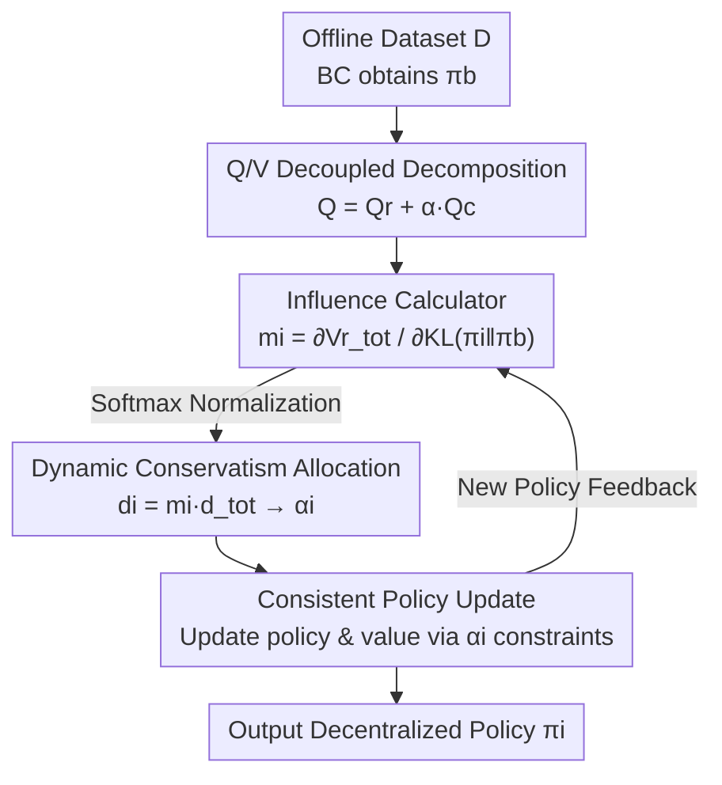

# Who Matters Matters: Agent-Specific Conservative Offline MARL

**Conference**: ICLR 2026  
**OpenReview**: [https://openreview.net/forum?id=oWzLIDYime](https://openreview.net/forum?id=oWzLIDYime)  
**Area**: Reinforcement Learning / Offline Multi-Agent  
**Keywords**: Offline MARL, Conservatism Allocation, Value Decomposition, Heterogeneous Agents, Credit Assignment

## TL;DR
Addressing the "one-size-fits-all" conservatism applied to all agents in offline MARL, this paper proposes OMCDA: it decouples the Q-function into "reward" and "policy divergence" components, then dynamically allocates conservatism to each agent based on its influence on system returns. This allows high-influence agents to deviate more from the behavior policy while keeping low-influence agents cautious, consistently outperforming existing offline MARL methods on MuJoCo and SMAC.

## Background & Motivation

**Background**: Offline Reinforcement Learning (Offline RL) allows agents to learn policies from static datasets without environment interaction during training, which is ideal for scenarios with high interaction costs or safety risks. Its core challenge is the overestimation of Q-values for out-of-distribution (OOD) actions. The mainstream solution is "conservatism"—penalizing actions not well-supported in the dataset to constrain the learned policy near the behavior policy. When extended to Multi-Agent settings (Offline MARL), this is typically combined with value decomposition (e.g., QMIX, VDN) under the CTDE framework to stabilize training.

**Limitations of Prior Work**: Existing methods almost exclusively apply **uniform** conservatism to all agents. However, in real-world multi-agent systems, agents have different roles and capabilities, and their impact on overall system performance varies significantly. Using a soccer team analogy: a striker should be encouraged to take high-risk, creative actions to score, while a defender must maintain discipline and avoid risks. Applying the same intensity of conservative constraints to both **over-constrains** key agents (limiting the striker) and **under-constrains** secondary agents (exposing the defense to high-cost errors), ultimately undermining collaboration.

**Key Challenge**: Conservatism should vary according to the agent's role, uncertainty, and potential impact, but uniform conservatism forces the "safety vs. exploration" trade-off into a single value for all agents. Furthermore, in regularized offline RL, the Q-function entangles "reward" and "behavior policy deviation" terms, making it impossible to cleanly measure how much an agent's deviation contributes to system rewards. Without this measure, "allocation by influence" cannot be achieved.

**Goal**: (1) Provide a mechanism to cleanly measure the impact of an individual agent's policy deviation on system returns; (2) Adaptively split a fixed total conservatism among agents based on this measure, while ensuring consistency between local and global optima, and before/after credit assignment.

**Key Insight**: Since entanglement is the obstacle, the Q-function (and V-function) should first be decoupled into a "reward term $Q^r$" and a "conservative/deviation term $Q^c$." The $Q^r$ term isolates conservative constraints and can directly reflect the sensitivity of system rewards to policy deviations, thereby defining each agent's "influence."

**Core Idea**: Use the partial derivative of $V^r_{tot}$ with respect to the agent's KL divergence as the influence $m_i$, and allocate total conservatism to agents via a softmax distribution of influence. Agents more important to system rewards are permitted larger deviations from the behavior policy.

## Method

### Overall Architecture

OMCDA (Offline MARL with Conservative Degree Allocation) is built upon QMIX-style CTDE value decomposition. Its core innovation is replacing "uniform conservatism" with "influence-driven dynamic conservatism allocation." The process is a closed loop: starting from an offline dataset, behavior cloning yields $\pi_b$, and the global Q/V functions are decoupled into reward and conservative paths; an **influence calculator** then reads current policies, the reward-based state value $V^r_{tot}$, and $\pi_b$ to calculate influence $m_i$ for each agent; individual conservatism $d_i$ is then partitioned from a fixed total $d_{tot}$ based on $m_i$ and converted into conservative intensity $\alpha_i$; finally, $\alpha_i$ is injected as a constraint into policy and value function updates, which feed back into the next round of influence calculation.

### Key Designs

**1. Q/V Function Decoupled Decomposition: Separating "Earning Reward" from "Following Rules"**

In regularized offline RL, the Q-function $Q(o,a)=\mathbb{E}[\sum_t \gamma^t(r_t-\alpha D_{KL}(\pi_t\|\pi_b))]$ blends rewards and KL penalties, making it impossible to judge whether an agent's deviation is beneficial. Inspired by BOPAH, this work splits it into: $Q(o,a)=Q^r(o,a)+\alpha\cdot Q^c(o,a)$, where $Q^r:=\mathbb{E}[\sum_t\gamma^t r_t]$ accounts only for rewards and $Q^c:=\mathbb{E}[-\sum_t\gamma^t D_{KL}(\pi_t\|\pi_b)]$ accounts only for deviation. The V-function is similarly split into $V^r+\alpha V^c$, with corresponding Bellman backup operators. In the multi-agent QMIX framework, the global Q is $Q_{tot}=Q^r_{tot}+\sum_i \alpha_i Q^{c,i}$, where the reward term $Q^r_{tot}=\sum_i w^r_i Q^r_i+b^r$ distributes global reward, and the conservative term $Q^{c,i}=\sum_j w^{c,i}_j Q^c_j+b^{c,i}$ is a weighted sum of agents' conservative values.

This step is fundamental: by isolating rewards from conservative constraints, $V^r_{tot}$ can "purely" reflect the impact of policy deviation on system returns, making influence measurement meaningful.

**2. Influence-driven Dynamic Conservatism Allocation: More Importance Allows More Deviation**

With a clean $V^r_{tot}$, the paper defines each agent's influence as the sensitivity of system rewards to its KL deviation: $m_i=\dfrac{\partial V^r_{tot}(o)}{\partial D_{KL}(\pi_i\|\pi_i^b)}$. The intuition: if a slight deviation from the behavior policy significantly increases system rewards, the agent has high influence and should be allowed greater deviation; conversely, low sensitivity necessitates tighter constraints to mitigate risk. Practically, this is calculated via the chain rule as $m_i=\dfrac{\partial V^r_{tot}}{\partial \pi_i}\big(\dfrac{\partial D_{KL}(\pi_i\|\pi_i^b)}{\partial \pi_i}\big)^{-1}$. Given a fixed total constraint $\sum_i d_i=d_{tot}$, $m_i$ values are softmax-normalized, setting $d_i=m_i\cdot d_{tot}$. Finally, $\alpha_i$ is derived via $\min_{\alpha_i}(\alpha_i d_i-\alpha_i D_{KL}(\pi_i\|\pi_i^b))$.

This distinguishes the paper from methods like CFCQL, which only determine conservatism based on "deviation from behavior policy." OMCDA further considers "impact on system performance," achieving a superior, role-dependent trade-off between conservatism and flexibility.

**3. Local-Global Consistency Guarantee: Individual $\alpha_i$ Adjustments without Breaking Global Optimality**

Dynamically assigning different $\alpha_i$ to each agent risks breaking the CTDE property where local optima aggregate to the global optimum. This is addressed through formal propositions. Proposition 3.1 defines the global optimal offline MARL policy $\pi^*_{tot}(a|o)=\pi_b(a|o)\exp(\frac{1}{\alpha}(Q^*-V^*))$. Proposition 3.2 decomposes the joint policy and derives that each agent's optimal policy $\pi^*_i$ follows an exponential form involving $\frac{w^r_i}{\alpha_i}(Q^{r*}_i-V^{r*}_i)+(Q^{c,i*}-V^{c,i*})$. Theorem 3.3 proves that even with **agent-specific** $\alpha_i$, local optima $\pi^*_i$ remain consistent with the global optimum $\pi^*_{tot}$. Finally, Proposition 3.4 provides the update target for the conservative value function $V^c_i$ based on the local policy normalization constraint $\sum_{a_i}\pi^*_i=1$. This ensures "personalized conservatism" enhances collaboration without fragmenting the team.

### Loss & Training

The training objective is to maximize the global reward-based state value $\max_\pi \mathbb{E}[V^r_{tot}(o)]$. In each round, decoupled $V^r_{tot}$ is used to estimate influence $m_i$, which is softmax-normalized to obtain $d_i$ and solve for $\alpha_i$. The conservative value function $V^c_i$ is updated according to Proposition 3.4 (Eq. 25), while $Q^r/Q^c$ and policies are updated using the modified Bellman operator with $\alpha_i$. The behavior policy $\pi_b$ is learned via behavior cloning on the offline dataset, and the total conservatism $d_{tot}$ is a key hyperparameter sampled across various ranges (e.g., 0.3/1.2/3 for MuJoCo and 0.6/1.8/3 for SMAC).

## Key Experimental Results

### Main Results

Evaluations were conducted on Multi-Agent MuJoCo (Hopper/Ant/HalfCheetah with expert/medium/medium-replay/medium-expert datasets) and SMAC (hard map 5m_vs_6m, super hard maps corridor, 6h_vs_8z with good/medium/poor datasets) against 7 offline MARL baselines using 5 random seeds.

| Environment | Task Setup | Baselines | Conclusion |
|------|----------|----------|------|
| Multi-Agent MuJoCo | Hopper/Ant/HalfCheetah × 4 quality levels | BCQ-MA, CQL-MA, ICQ, OMAR, CFCQL, OMIGA, ComaDICE | OMCDA consistently leads in average reward |
| SMAC | 5m_vs_6m / corridor / 6h_vs_8z × 3 quality levels | 7 baselines as above | OMCDA achieves highest average reward on hard / super hard maps |

> ⚠️ The original main results are presented as bar charts (Figure 2); mean/variance for each task are provided in the appendix. The table above is a qualitative summary.

### Ablation Study

Three sets of ablations on HalfCheetah and 6h_vs_8z verify the specific contributions of the innovations:

| Configuration | Modification | Result |
|------|------|------|
| OMCDA (Full) | Original model | Optimal, consistently outperforms all ablation versions |
| OMCDA-w/o-CDA | All agents share the same $d_i$, removing influence-based allocation | Conservatism imbalance; significant performance drop |
| OMCDA-w/o-dq | Dynamic allocation retained but Q-decoupling removed; reward and deviation re-entangled | Learning weakened; objective coupling degrades rewards |
| OMCDA-rd | Randomly assigned $d_i$ to each agent | Ignores actual influence differences; worst performance |

### Key Findings

- **Influence correlates with reward**: Figure 3 (Ant/Hopper) shows that agents with higher individual rewards $V^r_i$ are assigned greater influence $m_i$, granting them more room to deviate and further contribute to system reward—validating "allocation by influence."
- **Innovations are indispensable**: Removing dynamic allocation (w/o-CDA) causes imbalance, removing decoupling (w/o-dq) leads to regression due to objective entanglement, and random allocation (rd) proves that "strategic allocation" itself is the key factor.
- **Sensitivity to $d_{tot}$**: Scans on MuJoCo (0.3/1.2/3) and SMAC (0.6/1.8/3) show performance is sensitive to $d_{tot}$, requiring environment-specific tuning.

## Highlights & Insights
- **"Decoupling enables measurement" is the core insight**: Splitting reward and conservative terms might seem like a mathematical trick, but it unlocks the ability to measure influence via partial derivatives. Without a clean $V^r_{tot}$, influence cannot be defined. This "decouple then measure" approach is transferable to any scenario requiring credit attribution within entangled objectives.
- **Unifying "Credit Assignment" and "Conservatism Allocation"**: Influence $m_i$ measures reward contribution and simultaneously determines constraint relaxation. This uses the same metric for both credit attribution and conservative intensity, ensuring logical consistency.
- **Theoretical proof of consistency**: Theorem 3.3 addresses concerns about whether individual $\alpha_i$ adjustments break CTDE, providing the theoretical foundation for "personalized conservatism."

## Limitations & Future Work
- **Reliance on $V^r$ gradients**: Calculating $m_i$ requires partial derivatives of $V^r_{tot}$ and chain rule approximations, which may be sensitive to noise or instability in large-scale agent systems or inaccurate value estimations.
- **Manual tuning of $d_{tot}$**: While the method automates "how to allocate," the "total amount" $d_{tot}$ remains an environment-dependent hyperparameter.
- **Experiment scope**: Evaluation was limited to MuJoCo continuous control and SMAC cooperative games; effectiveness in competitive, massive-scale, or heterogeneous reward scenarios is yet to be verified.
- **Shared global reward assumption**: The framework is built for cooperative settings with a shared global reward; mapping this to mixed-motive scenarios with individual rewards requires further extension.

## Related Work & Insights
- **vs. CFCQL**: CFCQL determines conservatism based only on "behavior policy deviation." OMCDA introduces "agent influence on system performance," allowing more targeted trade-offs. The key difference is incorporating "importance" into constraint intensity.
- **vs. FOP / ADER**: While these online methods use dynamic entropy regularization, the adaptation applies only to policy updates. OMCDA injects dynamic conservatism into both policy and value function updates specifically for the offline OOD problem.
- **vs. Uniform Offline MARL (OMIGA, OMAR, ICQ)**: These methods apply uniform conservatism. OMCDA’s value add is "personalized conservatism + consistency guarantees," turning heterogeneity from a neglected factor into an exploited resource.

## Rating
- Novelty: ⭐⭐⭐⭐ High. Frame "allocation by influence" as a measurable and consistent framework.
- Experimental Thoroughness: ⭐⭐⭐⭐ Solid coverage across MuJoCo and SMAC with 7 baselines and multiple ablations.
- Writing Quality: ⭐⭐⭐⭐ Clear motivation (soccer analogy) and complete theoretical derivations.
- Value: ⭐⭐⭐⭐ Addresses a genuine pain point in offline MARL for heterogeneous agents.

<!-- RELATED:START -->

## Related Papers

- [\[ICLR 2026\] What Matters for Batch Online Reinforcement Learning in Robotics?](what_matters_for_batch_online_reinforcement_learning_in_robotics.md)
- [\[ICLR 2026\] Learning What Matters Now: Dynamic Preference Inference under Contextual Shifts](learning_what_matters_now_dynamic_preference_inference_under_contextual_shifts.md)
- [\[ICLR 2026\] Peng's Q($\lambda$) for Conservative Value Estimation in Offline Reinforcement Learning](pengs_qlambda_for_conservative_value_estimation_in_offline_reinforcement_learnin.md)
- [\[ICLR 2026\] Trajectory Generation with Conservative Value Guidance for Offline Reinforcement Learning](trajectory_generation_with_conservative_value_guidance_for_offline_reinforcement.md)
- [\[ICLR 2026\] Triple-BERT：在网约车派单上我们真的需要 MARL 吗？](triple-bert_do_we_really_need_marl_for_order_dispatch_on_ride-sharing_platforms.md)

<!-- RELATED:END -->
