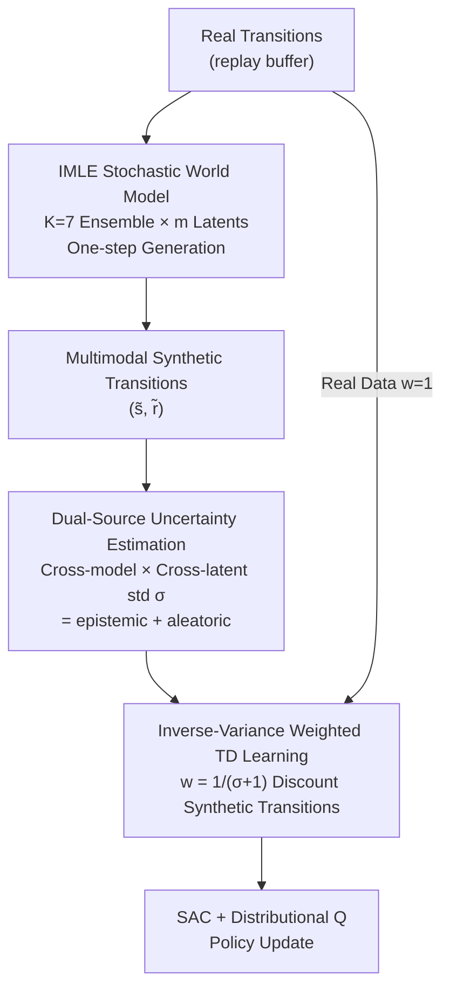

# WIMLE: Uncertainty-Aware World Models with IMLE for Sample-Efficient Continuous Control

**Conference**: ICLR 2026  
**arXiv**: [2602.14351](https://arxiv.org/abs/2602.14351)  
**Code**: None (Apex Lab, SFU)  
**Area**: Reinforcement Learning  
**Keywords**: Model-Based Reinforcement Learning, IMLE, Uncertainty Estimation, Multimodal World Models, Sample Efficiency, Continuous Control

## TL;DR
WIMLE extends Implicit Maximum Likelihood Estimation (IMLE) to model-based RL by learning stochastic world models that capture multimodal transition dynamics. It estimates prediction uncertainty through ensemble and latent sampling and utilizes an uncertainty-weighted RL objective for synthetic data. WIMLE achieves sample efficiency and asymptotic performance exceeding strong model-free and model-based baselines across 40 continuous control tasks.

## Background & Motivation

**Background**: Model-based RL (MBRL) theoretically should significantly improve sample efficiency by utilizing learned world models to generate synthetic data for policy training. However, in practice, MBRL has historically struggled to consistently outperform strong model-free baselines.

**Limitations of Prior Work**: (1) Standard predictive models average multiple modes when the same state-action pair yields different/conflicting supervision signals (due to partial observability, rich contacts, or inherent stochasticity), leading to "regression to the mean" and non-physical predictions. (2) Lack of uncertainty awareness causes world models to be overconfident in regions with insufficient data or complex dynamics, misleading policy learning.

**Key Challenge**: There is a need for multimodal world models that are not prohibitively slow (unlike diffusion models with iterative sampling, which are unsuitable for online RL) and uncertainty weighting mechanisms that do not shift the Bellman fixed point.

**Goal**: (1) How to efficiently learn multimodal world models? (2) How to estimate and utilize prediction uncertainty? (3) Does uncertainty weighting affect the convergence of the value function?

**Key Insight**: Ours uses IMLE—which provides one-step generation, mode-coverage, and high efficiency with low data—to replace Gaussian or diffusion-based world models. Total prediction variance is estimated via ensemble and multi-latent sampling, applying inverse-variance weighting to synthetic transitions.

**Core Idea**: IMLE world models provide multimodal mode-covering predictions + ensemble $\times$ latent uncertainty estimation + inverse-variance weighting to ensure optimal Bellman convergence.

## Method

### Overall Architecture
WIMLE addresses a long-standing issue: MBRL should theoretically be more sample-efficient than model-free RL, yet it often fails to match strong model-free baselines. The root cause is that world models tend to average multiple possible futures into a non-physical "intermediate state" when encountering multimodal or stochastic dynamics, while remaining overconfident. WIMLE integrates three interlocking components into a framework based on SAC and distributional Q-learning: an ensemble of stochastic world models trained via IMLE to "guess" diverse futures; an uncertainty estimator based on ensemble and latent dual-sampling to score each transition's variance; and inverse-variance weighting to discount synthetic transitions in the TD learning objective based on their credibility.

### Key Designs

**1. IMLE Stochastic World Models: Capturing Multimodal Dynamics via One-Step Generation to Avoid Mean Regression**

Standard regression-based world models average modes when $(s_t, a_t)$ corresponds to multiple conflicting successors (due to contacts, partial observability, or stochasticity), predicting non-existent "intermediate states." WIMLE adopts a conditional stochastic generator $(\tilde{s}_{t+1}, \tilde{r}_t) = g_\theta(s_t, a_t, z),\ z \sim \mathcal{N}(0, I)$, where noise $z$ accounts for different modes. Training alternates between two steps: first, a gradient-free assignment selects the closest prediction among $m$ candidate latents for each data point:

$$z_i^* = \arg\min_{1 \leq j \leq m} \|g_\theta(s_i, a_i, z_j) - y_i\|^2$$

Then, a gradient descent update is performed: $\theta \leftarrow \theta - \eta \nabla_\theta \frac{1}{|B|}\sum_{i \in B}\|g_\theta(s_i, a_i, z_i^*) - y_i\|^2$. This "match-then-pull" IMLE objective ensures mode coverage—where every real successor is covered by or near at least one generated sample—avoiding mean regression. Unlike diffusion models, IMLE provides one-step generation, offering the throughput required for high-frequency rollouts in online RL. The generator uses 3 residual blocks with rewards and successor states in separate output heads.

**2. Dual-Source Uncertainty Estimation: Quantifying Model Disagreement and Stochasticity Simultaneously**

To discount synthetic data by credibility, the uncertainty of each prediction must be quantified. WIMLE trains an ensemble of $K=7$ IMLE models, each sampling $m$ latents. Total prediction variance is defined as the standard deviation across models and latents $\sigma(s,a) = \text{std}_{k,j}[g_{\theta_k}(s,a,z_j)]$. This follows the law of total variance:

$$\sigma^2 = \underbrace{\text{Var}_k[\mathbb{E}_z[g_{\theta_k}]]}_{\text{epistemic}} + \underbrace{\mathbb{E}_k[\text{Var}_z[g_{\theta_k}]]}_{\text{aleatoric}}$$

The first term represents epistemic uncertainty (model disagreement in low-data regions), while the second represents aleatoric uncertainty (inherent stochasticity). Capturing both ensures that even if the world model is perfect (leaving only aleatoric uncertainty), weighting prevents stochasticity from introducing bias into value estimation.

**3. Inverse-Variance Weighted TD Learning: Soft Weighting without Breaking Convergence**

WIMLE employs an inverse-variance soft weight $w(s,a) = \frac{1}{\sigma(s,a) + 1} \in (0, 1]$. Real data is assigned $w=1$, while synthetic data weights are calculated as above. The weights are integrated into the critic loss: $\mathcal{L}_{\text{critic}} = \mathbb{E}[w_i \cdot \delta_i^2]$. Uncertain long-horizon predictions are naturally discounted rather than discarded. Two theoretical results support this: Lemma 1 proves that any positive weighting maintains the Bellman fixed point, and Lemma 2 shows that under a linear critic, inverse-variance weighting provides the minimum-covariance unbiased estimate (Gauss-Markov theorem). This transforms uncertainty discounting from a heuristic into a principle with optimality guarantees.

## Key Experimental Results

### Main Results (40 tasks, 10 seeds)

**DMC Dog & Humanoid (7 tasks)**: WIMLE IQM significantly leads all baselines.
- Humanoid-run: WIMLE achieves a **>50%** improvement in sample efficiency compared to the strongest competitor.

**DMC Suite (16 tasks)**: WIMLE achieves the highest IQM.

**MyoSuite (10 tasks)**: WIMLE asymptotic performance remains on par with strong baselines that already approach full marks.

**HumanoidBench (14 tasks)**:

| Method | Tasks Solved |
|------|----------|
| BRO | 4/14 |
| SimbaV2 | 5/14 |
| **WIMLE** | **8/14** |

### Ablation Study

| Configuration | Effect |
|------|------|
| WIMLE (full) | Optimal |
| Without Uncertainty Weighting (w=1) | Early performance may be worse than model-free, validating weighting necessity |
| Gaussian vs. IMLE World Model | Significantly worse, validating the value of multimodal modeling |
| Rollout H=1→4→6→8 | Performance improves with H; H=8 remains stable (traditional MBRL degrades) |

### Weight Evolution Analysis
- IMLE: Weights are low initially (high uncertainty) and increase as data accumulates (increasing confidence).
- Gaussian: Weights remain flat, reflecting poor calibration.

### Wall-clock Comparison
- WIMLE is comparable to MBPO and significantly faster than TD-MPC2 and DreamerV3.

## Highlights & Insights
- **First Application of IMLE in MBRL**: The mode-covering property is naturally suited for multimodal dynamics, while one-step generation ensures rollout speed.
- **Theoretical Rigor**: Dual theoretical guarantees (Bellman fixed point preservation + inverse-variance optimality) make uncertainty weighting principled rather than just heuristic.
- **Long-Horizon Stability**: Traditional MBRL degrades as rollouts lengthen; WIMLE naturally mitigates the impact of distant, uncertain predictions via weighting, enabling stable long-horizon rollouts.
- **Total Variance Decomposition**: Simultaneously capturing epistemic and aleatoric uncertainty allows weighting to avoid biases introduced by stochasticity even in perfect world models.

## Limitations & Future Work
- The ensemble of 7 models increases computation and memory overhead (though parallel training is efficient).
- The IMLE assignment step, while gradient-free, increases implementation complexity.
- Rollout horizon H remains a hyperparameter requiring per-task tuning.
- Gains are limited in tasks where existing baselines are near-perfect (e.g., MyoSuite).
- Currently limited to state-based inputs; extension to visual inputs is an area for exploration.

## Related Work & Insights
- **vs MBPO**: Ours can be viewed as an IMLE-upgraded MBPO—replacing Gaussian ensembles with IMLE ensembles + adding uncertainty weighting.
- **vs DreamerV3**: Dreamer uses a latent space world model; Ours operates in state space, providing more transparency.
- **vs Infoprop**: Infoprop uses information-theoretic measures to truncate rollouts; Ours uses inverse-variance soft-weighting, which is smoother and does not discard data.
- **vs BRO/SimbaV2**: These are model-free methods; WIMLE's MBRL paradigm solves more tasks on HumanoidBench.

## Rating
- Novelty: ⭐⭐⭐⭐ First introduction of IMLE to MBRL with solid theoretical backing.
- Experimental Thoroughness: ⭐⭐⭐⭐⭐ 40 tasks, 4 benchmark suites, 10 seeds, detailed ablations, and wall-clock analysis.
- Writing Quality: ⭐⭐⭐⭐ Clear motivation, methodology, theory, and experimental structure.
- Value: ⭐⭐⭐⭐⭐ Substantial breakthrough in MBRL, with impressive results on HumanoidBench (8/14 tasks).

<!-- RELATED:START -->

## Related Papers

- [\[ICLR 2026\] Learning Massively Multitask World Models for Continuous Control](learning_massively_multitask_world_models_for_continuous_control.md)
- [\[ICLR 2026\] Learning to Be Uncertainty: Pre-training World Models with Horizon-Calibrated Uncertainty](learning_to_be_uncertain_pre-training_world_models_with_horizon-calibrated_uncer.md)
- [\[ICLR 2026\] From Observations to Events: Event-Aware World Models for Reinforcement Learning](from_observations_to_events_event-aware_world_models_for_reinforcement_learning.md)
- [\[ICLR 2026\] Sample-efficient and Scalable Exploration in Continuous-Time RL](sample-efficient_and_scalable_exploration_in_continuous-time_rl.md)
- [\[ICLR 2026\] Object-Centric World Models from Few-Shot Annotations for Sample-Efficient Reinforcement Learning](object-centric_world_models_from_few-shot_annotations_for_sample-efficient_reinf.md)

<!-- RELATED:END -->
