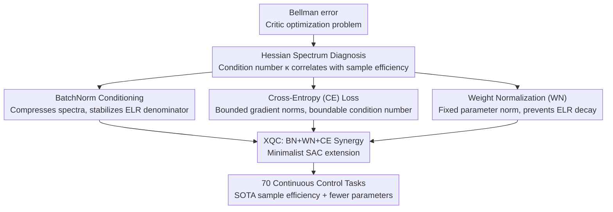

# XQC: Well-Conditioned Optimization Accelerates Deep Reinforcement Learning

**Conference**: ICLR 2026  
**Paper**: [OpenReview](https://openreview.net/forum?id=xqc) (Note: Link subject to original source)  
**Code**: https://danielpalenicek.github.io/projects/xqc  
**Area**: Reinforcement Learning  
**Keywords**: Sample Efficiency, Optimization Landscape, Condition Number, BatchNorm, Distributed Critic

## TL;DR
XQC does not rely on scaling up models or complex architectures. Instead, starting from the "condition number" of the critic loss landscape, it proves that the combination of BatchNorm + Weight Normalization + Categorical Cross-Entropy loss can reduce the Hessian condition number by several orders of magnitude and naturally bound gradient norms. This allows it to achieve SOTA sample efficiency on 70 continuous control tasks using ~4.5× fewer parameters.

## Background & Motivation
**Background**: Recent improvements in the sample efficiency of deep RL have followed a trajectory of "bigger and more complex"—larger networks, higher update-to-data (UTD) ratios, and various exotic architectures (SIMBA-V2, BRO, BRC, etc.). These improvements are mostly driven by empirical performance, treating architecture as a tool "to enable stable scaling."

**Limitations of Prior Work**: This "bigger is better" approach is costly—requiring high compute and numerous parameters—and evades a more fundamental question: Is increasing complexity necessary to improve performance? Many architectural choices (e.g., LayerNorm vs. BatchNorm, using Weight Normalization, MSE vs. Cross-Entropy loss) are based on heuristics in RL and lack principled explanations.

**Key Challenge**: Training the critic in RL is essentially gradient optimization under non-stationary targets (the bootstrapped TD target changes constantly). If the loss landscape is ill-conditioned (i.e., the Hessian condition number is very large), gradient descent with a fixed learning rate becomes extremely slow due to the vast differences in curvature across dimensions—a neglected root cause of poor sample efficiency.

**Goal**: Instead of increasing complexity, this paper aims to directly improve the "conditioning" of the critic optimization problem and provide quantifiable second-order analysis (eigenvalue spectra, condition numbers, effective learning rates) to explain "why certain architectures are better."

**Key Insight**: This work systematically brings tools from supervised learning—specifically Hessian eigenvalue analysis to understand BatchNorm benefits—to the Bellman error in deep RL for the first time. The authors hypothesize that a lower Hessian condition number for the critic leads to higher sample efficiency.

**Core Idea**: Replace "scaling up" with "well-conditioned optimization"—identifying a combination of BN + WN + Cross-Entropy loss that synergistically reduces the condition number and stabilizes the effective learning rate. Based on this, they build a minimal SAC extension called XQC.

## Method

### Overall Architecture
The work of XQC is divided into two phases: first, **Diagnosis** (Section 3), which systematically evaluates 12 critic architecture combinations (Normalization $\in$ {BN, LN, Dense} $\times$ whether to use WN $\times$ Loss $\in$ {MSE, CE}) on the high-dimensional DMC dog-trot task using the stochastic Lanczos algorithm to estimate the Hessian spectra and condition number $\kappa$. Analyzing the correlation between $\kappa$, maximum eigenvalues, and 1M-step returns reveals a strong trend of "low condition number → high return." Second, **Implementation** (Section 4) synthesizes the three identified beneficial components (BN, WN, and Cross-Entropy loss) into a minimalist actor-critic algorithm, XQC. XQC is simply SAC with a modified critic architecture and loss, without any exotic components.

The causal chain of the method is: Architectural Components → Loss Landscape Condition Number → Stability of Gradient Norms/Effective Learning Rate (ELR) → Plasticity → Sample Efficiency. The flowchart below illustrates the transition from diagnosis to algorithm:

### Key Designs

**1. Hessian Condition Number Diagnosis: Moving "Good Architecture" from Heuristics to Measurable Second-Order Quantities**

Selecting BN/LN or loss functions in RL has long relied on empirical intuition; few could explain "why" one is better. XQC grounds the answer in optimization theory: the loss can be locally approximated by a quadratic $L(\theta+\delta\theta)\approx L(\theta)+\nabla_\theta L\,\delta\theta+\tfrac{1}{2}\delta\theta^\top \nabla_\theta^2 L\,\delta\theta$, where the eigenvalues of the Hessian $\nabla_\theta^2 L$ characterize the curvature in different directions. Defining the condition number as $\kappa(H)=\max_i|\lambda_i|/\min_i|\lambda_i|$: a larger $\kappa$ means vastly different curvatures across dimensions, making gradient descent with a fixed learning rate inefficient. The authors estimate spectra for 12 architectures on dog-trot (5 seeds, 1M steps, 20 checkpoints) and find that BN architectures consistently maintain compact spectra without outliers, with $\kappa$ being an order of magnitude lower than non-BN versions. Furthermore, $\kappa$ is strongly negatively correlated with the IQM return at 1M steps—providing a principled basis for component selection.

**2. Cross-Entropy Distributed Loss: Naturally Bounding Gradient Norms and Condition Numbers**

The gradient of the MSE regression loss $\|\nabla_{\hat y}\,\tfrac12\|y-\hat y\|_2^2\|=\|y-\hat y\|$ is unbounded (Proposition 1). Under non-stationary bootstrapped targets, large TD errors can cause gradients to explode, and the landscape condition number cannot be bounded. XQC adopts a C51-style categorical critic (101 atoms, outputting categorical distribution logits), treating the Bellman error as a classification problem using Cross-Entropy loss. Proposition 2 proves that the gradient with respect to logits has a hard upper bound: $\|\nabla_{\hat y}\,l(t,\hat y)\|_2=\|t-\mathrm{Softmax}(\hat y)\|_2\le\sqrt 2$. Furthermore, Proposition 4 proves that under the assumption of bounded Hessian eigenvalues, the condition number of the CE loss (with weight decay $\mu^2$) has a finite upper bound $\kappa(\nabla_\theta^2 L)\le(4\lambda^f_m+L_f^2+\epsilon)/\epsilon$, whereas the MSE condition number (Proposition 3) cannot be bounded. This theoretically explains the empirical observation in Section 3 that the CE condition number is always significantly smaller than that of MSE. Reward normalization $\hat r_t=r_t/\sigma(R)$ is used to constrain Q-values within the support of the categorical critic.

**3. BatchNorm + Weight Normalization Synergy: Fixing Effective Learning Rate (ELR) and Preserving Plasticity**

For scale-invariant functions, the effective learning rate $\tilde\eta=\eta/\|\theta\|_2^2$ (Definition 1) is what truly matters: if the parameter norm $\|\theta\|_2$ grows during training, the ELR decays to 0, causing the network to lose plasticity. XQC stabilizes this using two techniques. First, BN is placed directly after the input and each linear layer (swapping the order to "normalization before activation" so that scale-invariance holds for any activation, not just homogeneous ones; it also uses a joined forward pass on the $(s,a)$ and $(s',a')$ joint distribution to calculate BN running statistics for stability in the RL loop). Second, leveraging the scale-invariance provided by BN, every layer's weights are projected back to the unit sphere (WN) after every gradient update, thus fixing the ELR denominator $\|\theta\|_2$. Combined with the bounded gradients from Design 2, the ELR remains nearly constant throughout training (Figure 8), maintaining plasticity. This, in turn, allows XQC to safely use learning rate scheduling with Adam. BN, WN, and CE each independently improve conditioning, and their combination yields the strongest synergy and performance.

### Loss & Training
The critic uses a C51-style categorical Cross-Entropy Bellman loss (101 atoms), with rewards normalized by the standard deviation of returns $\hat r_t=r_t/\sigma(R)$. The critic network consists of 4 hidden layers with 512 neurons each, using only Linear + BN + ReLU standard components. Weights are projected to the unit sphere (WN) after every update. The Adam optimizer is used with a learning rate scheduler. For vision tasks, the original DrQ-v2 image encoder is used, only modifying the subsequent MLP to ensure a fair comparison. A single set of hyperparameters is used for all 70 tasks.

## Key Experimental Results

### Main Results
The evaluation covers 5 benchmark suites and a total of 70 continuous control tasks (55 proprioceptive tasks from DMC, HumanoidBench, MyoSuite, and MuJoCo + 15 vision-based DMC tasks). The main experiment uses 10 seeds per environment for 1M steps, reporting IQM and 90% SBCI. Aggregation uses the Area Under the Normalized Return Curve (AUC).

| Evaluation Setting | Metric | XQC | Strongest Competitor | Conclusion |
|----------|------|------|----------|------|
| 55 Proprioceptive Tasks (4 benchmarks) | IQM AUC Normalized Return | SOTA | Parity/Slightly better than SIMBA-V2 | Most significant advantage in hardest tasks (HB, DMC-hard) |
| 15 Vision DMC Tasks | IQM AUC | Significantly Leading | DrQ-v2 | Largest Gain in humanoid tasks |
| Parameter Count | #params | Baseline | ~4.5× of SIMBA-V2 | XQC params are approx. 1/4.5 of SIMBA-V2 |
| Compute | FLOP/S | Baseline | ~5× (SIMBA-V2/BRO), >100× (BRC) | Training FPS is 60% higher |

### Ablation Study
Ablations were conducted with 5 seeds per configuration, removing the three main components of XQC one by one (Figure 10, right column):

| Configuration | Relative to Full XQC | Explanation |
|------|--------------|------|
| Full XQC (BN+WN+CE) | Baseline (Best) | Synergy of all three components |
| w/o WN | Significant Decrease | Parameter norm grows, ELR decays to 0, losing plasticity |
| Replace CE with MSE | Significant Decrease | Unbounded gradients; ELR and gradient norm increase by ~1 order of magnitude |
| Replace BN with LN | Significant Decrease | Large outliers in spectrum; sharp curves, unstable training |

### Key Findings
- **Three components are indispensable and synergistic**: BN, WN, and CE each independently improve conditioning, but only their combination achieves both the lowest condition number and the highest performance; removing any significantly degrades results.
- **Condition number directly predicts performance**: On dog-trot, the IQM condition number/max eigenvalue of an architecture is strongly negatively correlated with 1M-step returns—a smoother, better-conditioned landscape is a key driver of deep RL performance.
- **ELR is coupled with gradient norm**: In all architectures using WN, the ELR is almost proportional to the gradient norm; XQC's CE loss pins the gradient norm down, causing the ELR to remain stable and several orders of magnitude smaller throughout training.
- **Stronger on harder tasks**: XQC shows the largest gains on the most ill-conditioned tasks (HB, DMC-hard, vision humanoid), confirming that "well-conditioning" is critical for handling non-stationary targets and bootstrap errors.
- **Stable and scalable**: XQC performance scales stably with UTD, network width, and depth, and is robust to batch size, weight decay, and action repeat.

## Highlights & Insights
- **Transforms architectural choice from empirical tuning to a provable optimization problem**: Using the Hessian condition number as a unified metric to explain BN > LN and CE > MSE is a second-order analysis method that is itself transferable to other RL architecture designs.
- **Thorough explanation of "gradient capping" in CE loss**: While previous distributed critics emphasized the representational advantage of modeling the full return distribution, this paper provides a more fundamental explanation from an optimization perspective: a hard upper bound of $\le\sqrt 2$ and its link to ELR stability.
- **Minimalist yet SOTA**: The critic uses only Linear+BN+ReLU components in 4 layers but matches or beats complex large-model baselines across 70 tasks with 1/4.5 the parameters—a powerful counterexample suggesting "less is more."
- **Three seemingly independent tricks form a closed loop**: BN provides scale-invariance → making WN valid → WN fixes the ELR denominator; CE fixes the ELR numerator (gradient norm) → constant ELR → preserved plasticity. The logic is self-consistent.

## Limitations & Future Work
- **Gap between theoretical assumptions and practice**: The condition number upper bounds in Propositions 3/4 rely on weight decay to ensure a positive definite Hessian, but the authors admit that performance is better without weight decay in practice, where the Hessian is not always positive definite—the theory provides "intuition" rather than strict guarantees.
- **Analysis limited to single tasks**: Hessian spectrum diagnosis was mainly performed on the DMC dog-trot task; whether it holds across all tasks requires broader verification.
- **Limited to continuous control + off-policy actor-critic**: The method is based on SAC; its effectiveness in discrete action spaces, on-policy, or model-based settings has not been verified.
- **Vision encoders remained unchanged**: For fair comparison, the DrQ-v2 encoder was used; well-conditioned design was only applied to the MLP. Extending the same principles to the vision encoder might yield further gains (unexplored by the authors).

## Related Work & Insights
- **vs. SIMBA-V2 / BRO / BRC ("Scaling Up" Route)**: These rely on larger networks, higher UTD, and complex architectures for sample efficiency. XQC does the opposite, using well-conditioned optimization to achieve comparable or better performance with ~4.5× fewer parameters and ~5× fewer FLOPs, trading "complexity" for "conditioning."
- **vs. CrossQ + WN (Palenicek et al., 2025)**: While also focusing on BN and WN in RL, XQC goes further by incorporating Categorical Cross-Entropy loss and providing systematic analysis and theoretical upper bounds for the Hessian condition number, upgrading component selection from heuristics to principles.
- **vs. Distributed RL / C51 (Bellemare et al., 2017)**: While using their categorical critic, the motivation shifts from "representational advantages of modeling distributions" to "optimizing landscape conditioning and gradient boundedness," providing a new optimization-centric defense for distributed loss.

## Rating
- Novelty: ⭐⭐⭐⭐⭐ First systematic application of Hessian condition number analysis to deep RL critics, with theoretical bounding of the CE loss condition number.
- Experimental Thoroughness: ⭐⭐⭐⭐⭐ 70 tasks, 5 benchmarks, 10 seeds, proper IQM+SBCI evaluation, including full component ablations and scaling analysis.
- Writing Quality: ⭐⭐⭐⭐ Clear causal chain (components → condition number → ELR → plasticity → sample efficiency), with strong links between theory and empirical results.
- Value: ⭐⭐⭐⭐⭐ Provides a practical, minimalist SOTA RL algorithm and a transferable optimization diagnostic methodology.

<!-- RELATED:START -->

## Related Papers

- [\[ICLR 2026\] Multistep Quasimetric Learning for Scalable Goal-Conditioned Reinforcement Learning](scaling_goal-conditioned_reinforcement_learning_with_multistep_quasimetric_dista.md)
- [\[ICLR 2026\] Understanding and Improving Hyperbolic Deep Reinforcement Learning](understanding_and_improving_hyperbolic_deep_reinforcement_learning.md)
- [\[ICLR 2026\] Local Reinforcement Learning with Action-Conditioned Root Mean Squared Q-Functions](local_reinforcement_learning_with_action-conditioned_root_mean_squared_q-functio.md)
- [\[ICLR 2026\] Robust Deep Reinforcement Learning against Adversarial Behavior Manipulation](robust_deep_reinforcement_learning_against_adversarial_behavior_manipulation.md)
- [\[ICLR 2026\] Occupancy Reward Shaping: Improving Credit Assignment for Offline Goal-Conditioned Reinforcement Learning](occupancy_reward_shaping_improving_credit_assignment_for_offline_goal-conditione.md)

<!-- RELATED:END -->
