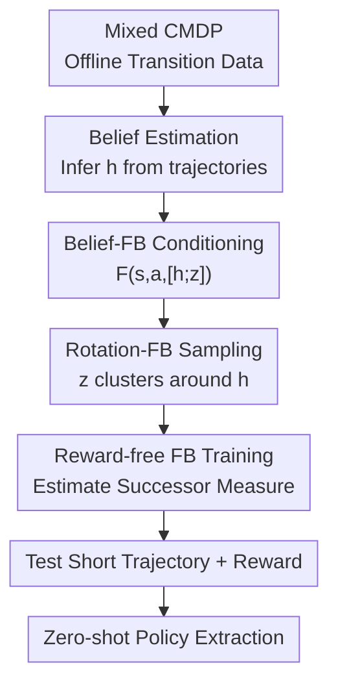

# Zero-Shot Adaptation of Behavioral Foundation Models to Unseen Dynamics

**Conference**: ICLR2026  
**OpenReview**: [https://openreview.net/forum?id=dBDBg4WF4F](https://openreview.net/forum?id=dBDBg4WF4F)  
**Code**: To be confirmed  
**Area**: Reinforcement Learning / Behavioral Foundation Models / Zero-Shot Adaptation  
**Keywords**: Behavioral Foundation Models, Zero-Shot Reinforcement Learning, Forward-Backward Representations, Latent Dynamics, Contextual Belief Estimation

## TL;DR

This paper identifies that Behavioral Foundation Models (BFMs) based on Forward-Backward (FB) representations tend to average future occupancy distributions across different environments when trained on offline data with mixed dynamics, making them unable to adapt to unseen dynamical changes. The authors propose estimating a hidden dynamics belief using a transformer and conditioning the FB forward representation and task vector sampling on this belief. The proposed method significantly outperforms vanilla FB, LAP, HILP, and other zero-shot RL baselines in environments such as FourRooms, PointMass, AntWind, and OGBench Scene.

## Background & Motivation

**Background**: Behavioral Foundation Models (BFMs) aim to learn a family of reusable behaviors from task-agnostic offline interaction data, similar to language or vision foundation models. A representative approach is the Forward-Backward (FB) representation: during training, it learns a low-rank decomposition of the successor measure without specific rewards; at test time, given a new reward, it infers a task vector $z$ through the backward representation and extracts the policy via $\arg\max_a F(s,a,z)^\top z$.

**Limitations of Prior Work**: This setup assumes that environmental dynamics are largely consistent. If offline data originates from multiple hidden dynamical configurations—such as varying door locations in a grid maze, different obstacle layouts in PointMass, or varied wind directions for an Ant agent—vanilla FB estimates the successor measure by mixing transitions from different Contextual MDPs (CMDPs). Consequently, instead of learning to "go through this door in this layout and that door in another," the model learns an "averaged future" that is incorrect for all layouts.

**Key Challenge**: Zero-shot RL aims to avoid parameter updates at test time, but adapting to dynamical changes requires identifying "which environment I am currently in." If this hidden context is not explicitly integrated into the FB representation, different directions in the policy encoding space $Z$ must simultaneously account for both task differences and dynamical differences. This entanglement leads to policy interference: optimal actions for different environments conflict at the same state.

**Goal**: The authors aim to enable FB models learned from mixed offline data to identify current dynamics from a short, reward-free trajectory and extract reasonable policies for both seen and unseen dynamical configurations, all while maintaining the zero-shot nature of BFMs.

**Key Insight**: The paper formalizes multi-dynamics data as a Contextual MDP. When the context $c$ is unobserved, the problem is equivalent to a POMDP, requiring the estimation of a belief $b(c\mid H)$ from history $H=\{(s_t,a_t,s_{t+1})\}$. This provides a natural interface: rather than changing how task rewards are input, the "current dynamics belief" is added as a complement to the FB successor feature estimation.

**Core Idea**: Use a self-supervised transformer to estimate a hidden dynamics vector $h$ from short trajectories. Then, organize the FB forward representation and task vector sampling around $h$ to decouple "what the task is" from "how the current environment transitions" within the latent space.

## Method

### Overall Architecture

The method can be viewed as two patches to vanilla FB: Belief-FB (BFB) encodes hidden dynamics into a context vector $h$, and Rotation-FB (RFB) ensures that task vectors $z$ are no longer uniformly spread across the hypersphere but form dynamics-related local cone regions around their corresponding $h$. Training remains reward-free and offline; at test time, zero-shot policy extraction is achieved using only a short reward-free exploratory trajectory and a task reward.

The workflow is as follows: offline data contains transitions from multiple hidden environment configurations. First, a dynamics encoder $f_{dyn}$ is trained to take an unordered set of transitions and output a vector $h$ representing current dynamics. Subsequently, when training FB, $h$ is concatenated with the task vector $z$ to condition only the forward network $F$, while the backward network $B$ remains shared across environments. RFB further samples $z$ from a von Mises-Fisher distribution centered at $h$, geometrically separating policy directions for different dynamics.

### Key Designs

**1. Proving FB failure is a dynamics averaging problem, not hyperparameter tuning**

The paper performs a diagnostic in discrete environments like Randomized-Doors: the correct door to a goal may differ entirely across layouts for the same state. When FB estimates $F(s,a,z)^\top B(s^+)$ with random task directions $z_{FB}\sim \mathrm{Unif}(S^{d-1})$, it essentially fits the discounted future occupancy of all training environments within the same function class. Without $c$ or a belief in the input, future distributions from different layouts are squeezed into a single representation.

The authors visualize this interference: if FB is trained on a single layout, most $z$ point toward consistent optimal actions; on mixed data, color directions at the same state blur together, leading to "averaged actions" that are incorrect even for seen layouts. Theoretically, the worst-case successor approximation error under multiple CMDPs is defined as $\epsilon_k^*=\inf_{F,B}\max_{i\le k}\|M^{\pi_i}-F(\cdot,\cdot,z_i)^\top B(\cdot)\|_{L_2(\rho)}$, yielding a regret bound:

$$
\mathbb{E}_{(s,a)\sim \rho_{test}}[Q_r^*(s,a)-Q_r^{\pi_{\hat z}}(s,a)] \le \frac{3R}{1-\gamma}(\epsilon_k^*+\Delta_{est}).
$$

The insight is that $\epsilon_k^*$ does not automatically decrease as the number of dynamical configurations increases. More data might reduce estimation error $\Delta_{est}$, but if the representation must compress conflicting futures together, the model class error becomes the bottleneck.

**2. Belief-FB: Estimating hidden dynamics from reward-free trajectories and conditioning the forward representation**

The core of BFB is the dynamics encoder $f_{dyn}$, which takes a set of transitions $\{(s_t,a_t,s_{t+1})\}_{t=1}^N$ and outputs a context vector $h\in\mathbb{R}^d$. Since the input contains no rewards or task labels, $h$ is forced to focus on dynamics cues—such as the positions of walls/doors, wind direction, or friction coefficients—rather than specific task goals.

$f_{dyn}$ is designed as a permutation-invariant transformer encoder because hidden configurations are static within an episode. During training, a self-supervised objective is used: $h$ follows a Gaussian prior and is shared within the same trajectory, while a projection head combines $(s_t,a_t,h)$ to predict $s_{t+1}$. After pre-training, it is used in FB as:

$$
\hat M^{\pi_z}(s_t,a_t,s_{t+1}) = F(s_t,a_t,[h;z_{FB}])^\top B(s_{t+1}).
$$

Crucially, $h$ is only injected into the forward network $F$, not the backward network $B$. The authors observed that conditioning $B$ oversmooths the Q-function and degrades performance. Intuitively, $B$ acts as a shared dictionary mapping task rewards to latent task vectors, while $F$ needs to interpret "which future states are reachable from here given this action" based on current dynamics.

**3. Rotation-FB: Clustering task directions around dynamics beliefs to reduce overlap in policy space**

Even with $h$, if task vectors $z$ are sampled uniformly, policy directions for different dynamics might still intersect in $Z$-space. RFB treats $h$ not just as a conditional input but as a "directional axis" for the current dynamics. For a trajectory, $h=f_{dyn}(H)$ is computed, and task vectors are sampled from a von Mises-Fisher (vMF) distribution centered at $h$:

$$
z_{h+FB}\sim \mathrm{vMF}(\mu=h,\kappa).
$$

$\kappa$ controls the concentration. If $\kappa$ is too small, cones for different dynamics overlap; if too large, task diversity within a single environment collapses. Implementation involves sampling vMF noise near a base vector, rotating it to the direction of $h$ via Householder reflection, and projecting it onto a hypersphere of radius $\sqrt d$.

Theoretically, RFB partitions the task space into disjoint cones around context directions. Under a block-separable assumption, the term in the regret bound depending on the total number of environments $k$ can be replaced by the maximum cluster size $k_{max}$, explaining why RFB remains stable as the number of mixed environments increases.

**4. Zero-shot at test time: Identifying dynamics via short exploratory trajectories without updates**

The "adaptation" here should not be confused with learning during test time (like meta-RL). The inference process remains zero-shot: given a short reward-free trajectory in an unseen context, $h$ is obtained via $f_{dyn}$; given a task reward $r$, the task vector $z_r\approx \mathbb{E}_{s\sim\rho}[r(s)B(s)]$ is inferred via $B$; finally, $\pi(s)=\arg\max_a F(s,a,[h;z_r])^\top z_r$ is executed.

This design relies on the short trajectory exposing enough dynamical information. Experiments show that performance is insufficient when the context length is much shorter than an episode, but gains diminish once the length reaches a full episode, indicating that $f_{dyn}$ captures the primary hidden configurations.

### Loss & Training

A two-stage training approach is adopted for stability. Phase one pre-trains $f_{dyn}$: sequences of length $T$ are sampled from offline data; the encoder outputs mean and variance parameters to produce $h$ via reparameterization, and a predictor $g_{pred}(s_t,a_t,h)$ predicts $s_{t+1}$. The context loss is:

$$
\mathcal{L}_{context}=\frac{1}{BT}\sum_{i=1}^{B}\sum_{t=1}^{T}\|\hat s_{i,t+1}-s_{i,t+1}\|_2^2.
$$

Phase two trains FB. In BFB, the forward input is changed to $(s,a,[h;z])$, while backward remains $B(s^+)$. In RFB, $z$ sampling is changed from uniform to a vMF distribution around $h$. FB training follows successor measure anchor regression/Bellman identities, using target networks and DDPG-style actors for continuous actions. Hyperparameters: latent dimension 100 (discrete) / 150 (continuous), learning rate $10^{-4}$, batch size 1024, discount $\gamma=0.99$ ($0.98$ for maze), and $\kappa=50$ (100 for PointMass).

## Key Experimental Results

### Main Results

Results are compared across Random, Vanilla-FB, LAP, HILP, Contextual-FB, Oracle-ID, BFB, and RFB. Environments include discrete partially observable mazes, continuous PointMass, MuJoCo Ant with wind, and OGBench Scene with friction changes. Higher values are better.

| Environment | Metric | RFB (Ours) | BFB (Ours) | Strongest Baseline | Vanilla-FB |
|-------------|--------|------------|------------|--------------------|------------|
| FourRooms Train | return/success | 0.85 ± 0.04 | 0.70 ± 0.07 | Oracle-ID 0.90 ± 0.03| 0.25 ± 0.05 |
| FourRooms Test | return/success | 0.61 ± 0.05 | 0.40 ± 0.06 | HILP 0.20 ± 0.05 | 0.15 ± 0.04 |
| PointMass Train | return/success | 0.88 ± 0.04 | 0.76 ± 0.07 | Oracle-ID 0.92 ± 0.02| 0.20 ± 0.05 |
| PointMass Test | return/success | 0.55 ± 0.05 | 0.45 ± 0.06 | HILP 0.25 ± 0.05 | 0.10 ± 0.03 |
| AntWind Train | return | 740 ± 40 | 680 ± 60 | Oracle-ID 780 ± 30 | 390 ± 40 |
| AntWind Test | return | 640 ± 40 | 550 ± 50 | HILP 410 ± 40 | 250 ± 30 |
| OGBench Scene Test| return | 0.55 ± 0.05 | 0.45 ± 0.06 | Contextual-FB 0.40 ± 0.07| 0.20 ± 0.05 |

The Oracle-ID contrast is revealing: it excels in training environments by memorizing IDs but collapses on OOD test environments (e.g., 0.10 on FourRooms test). This shows that memorization is not generalization. BFB/RFB, without explicit IDs, recover dynamical structures from trajectories, making them more robust to unseen layouts, wind, and friction.

### Ablation Study

| Configuration/Factor | Key Metric | Description |
|----------------------|------------|-------------|
| Vanilla-FB | FourRooms test 0.15, PointMass test 0.10 | Near random on mixed dynamics due to successor averaging. |
| BFB | FourRooms test 0.40, AntWind test 550 | Belief allows conditioning successor measures on environment configurations. |
| RFB | FourRooms test 0.61, AntWind test 640 | Organizing $z$ space further reduces policy direction interference. |
| Context length < episode | Poor performance | Short trajectories only expose local dynamics, failing to distinguish layouts. |
| Context length ~100 steps | Plateau after improvement | One episode provides sufficient dynamics cues; further length is redundant. |
| Training envs 10 -> 30 | Rapid improvement | More CMDPs provide better coverage of dynamical variations. |
| RFB $\kappa$ too small | Lower performance | Task vector cones for different contexts overlap, causing interference. |

### Key Findings

- Belief estimation is the critical gap for FB models to adapt to hidden dynamics. Without it, FB and LAP fail to consistently outperform random policies in FourRooms/PointMass.
- RFB generally outperforms BFB, suggesting that simply providing context as input is insufficient; the task vector sampling prior also influences how FB organizes the policy space.
- The vectors learned by $f_{dyn}$ correspond to actual hidden attributes. Visualization shows non-overlapping clusters for different layouts and wind directions that smoothly extrapolate to held-out cases.
- Q-function visualizations confirm that BFB/RFB respect wall positions and actual reachability, whereas vanilla FB ignores structural constraints and attempts to move through obstacles.

## Highlights & Insights

- The paper moves beyond a simple engineering fix by identifying the failure mode as successor measure averaging and latent direction interference. This is highly relevant for mixed offline RL datasets: more data only leads to more precisely learned "averaged errors" if different dynamics conflict in the representation.
- Conditioning only $F$ and not $B$ is a practical design choice that preserves the backward representation as a shared task-reward interface while allowing $F$ to be dynamics-sensitive.
- RFB provides a clean geometric perspective: each dynamics belief acts as a local coordinate system on the latent sphere. This allows task and dynamics diversity to coexist without competing for the same global directions.

## Limitations & Future Work

- Experimental settings remain relatively controlled (low-dimensional dynamics like wind/friction). Whether $f_{dyn}$ can reliably infer dynamics in complex robotics data with sensory delays and morphological differences remains to be seen.
- The method relies on test-time exploratory trajectories. If such trajectories do not visit regions differentiating the dynamics (e.g., not hitting a door or feeling friction), the belief will be unreliable.
- RFB introduces sensitive hyperparameters like $\kappa$. Future work could investigate automatic concentration adjustment or learning non-spherical structures for complex, multi-factor hidden dynamics.

## Related Work & Insights

- **vs. Vanilla FB**: Vanilla FB is suitable for fixed dynamics and varied rewards. This paper extends it to varying dynamics where the original model fails due to distribution averaging.
- **vs. Contextual-FB**: Contextual-FB often requires training classifiers for new layouts; BFB/RFB amortizes context vectors from reward-free trajectories, enabling true zero-shot reuse across multiple environments.
- **vs. Meta-RL (e.g., VariBAD)**: Meta-RL focuses on interactive adaptation; this method maintains a zero-shot RL setting where policy parameters are never updated at test time.

## Rating

- Novelty: ⭐⭐⭐⭐☆
- Experimental Thoroughness: ⭐⭐⭐⭐☆
- Writing Quality: ⭐⭐⭐⭐☆
- Value: ⭐⭐⭐⭐⭐

<!-- RELATED:START -->

## Related Papers

- [\[ICLR 2026\] TD-JEPA: Latent-predictive Representations for Zero-Shot Reinforcement Learning](td-jepa_latent-predictive_representations_for_zero-shot_reinforcement_learning.md)
- [\[NeurIPS 2025\] Dynamics-Aligned Latent Imagination in Contextual World Models for Zero-Shot Generalization](../../NeurIPS2025/reinforcement_learning/dynamics-aligned_latent_imagination_in_contextual_world_models_for_zero-shot_gen.md)
- [\[ICLR 2026\] Optimistic Task Inference for Behavior Foundation Models](optimistic_task_inference_behavior_models.md)
- [\[ICLR 2026\] Task Tokens: A Flexible Approach to Adapting Behavior Foundation Models](task_tokens_a_flexible_approach_to_adapting_behavior_foundation_models.md)
- [\[ICML 2026\] Unlocking Zero-Shot Geospatial Reasoning via Indirect Rewards](../../ICML2026/reinforcement_learning/unlocking_zero-shot_geospatial_reasoning_via_indirect_rewards.md)

<!-- RELATED:END -->
