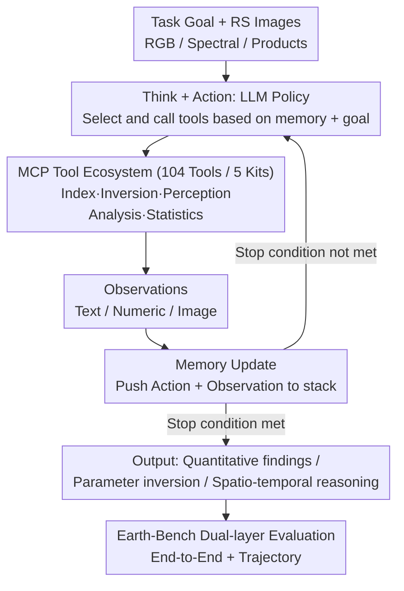

# Earth-Agent: Unlocking the Full Landscape of Earth Observation with Agents

**Conference**: ICLR 2026  
**arXiv**: [2509.23141](https://arxiv.org/abs/2509.23141)  
**Code**: [opendatalab/Earth-Agent](https://github.com/opendatalab/Earth-Agent)  
**Area**: Remote Sensing / LLM Agent  
**Keywords**: Earth Observation, Agent Framework, MCP Tool Ecosystem, Multimodal Remote Sensing, benchmark

## TL;DR
Earth-Agent is the first Earth Observation (EO) Agent framework based on the Model Context Protocol (MCP) tool ecosystem. it unifies RGB and spectral remote sensing data, achieving cross-modal, multi-step, and quantitative spatio-temporal reasoning by dynamically invoking 104 expert tools. The proposed Earth-Bench benchmark includes 248 expert tasks and 13,729 images. Experiments demonstrate that Earth-Agent significantly outperforms general-purpose Agents and remote sensing MLLMs.

## Background & Motivation
Earth Observation (EO) is a critical task for understanding the state of Earth system evolution. Recently, Multimodal Large Language Models (MLLMs) have advanced remote sensing research, yet fundamental capability gaps remain:

**Limitations of Prior Work** (MLLMs in EO):
- **RGB-only Perception**: Inability to process spectral data (multispectral, hyperspectral, SAR, etc.), which is central to scientific-grade remote sensing analysis.
- **Shallow Reasoning**: Incapability of performing complex tasks requiring multi-step reasoning and domain-specific tool calls.
- **Lack of Quantitative Capabilities**: Failure to execute scientific tasks requiring precise calculations, such as geophysical parameter inversion and quantitative spatio-temporal analysis.
- **Systemic Evaluation Deficiency**: Absence of evaluation protocols covering all modalities while considering both reasoning trajectories and final results.

**Limitations of Prior Work** (Existing Agent Methods):
- Restricted to RGB perception and do not handle spectral data.
- Insufficient reasoning depth with rudimentary tool-calling capabilities.
- Lack of systematic evaluation benchmarks oriented towards EO.

**Key Insight**: Modeling EO analysis as a ReAct-style POMDP process, where the LLM serves as a policy network to dynamically invoke domain expert tools via the MCP protocol, thereby bridging RGB and spectral modalities.

## Method

### Overall Architecture
Earth-Agent is a ReAct-type Agent framework that models Earth Observation (EO) analysis as a Partially Observable Markov Decision Process (POMDP), described by the tuple $\langle g, S, A, O, T\rangle$: where $g$ is the task goal, $A$ is the action space composed of tool calls, and $O$ represents the observations returned by tools (text/numeric/image). The LLM acts as the policy network $\pi$. Given the task goal and three types of remote sensing data (RGB, spectral, products), it iteratively follows the "Think → Act → Observe → Update Memory" cycle to approach an answer. It outputs quantitative analysis, parameter inversion values, or spatio-temporal reasoning conclusions. Crucially, the actual computation is not performed implicitly by the LLM but delegated to an MCP tool ecosystem consisting of 104 domain expert tools—the LLM only decides what to call, in what order, and with which parameters. The following three designs support this pipeline: the MCP tool ecosystem providing atomic capabilities across modalities, the ReAct-POMDP loop linking multi-step tasks, and Earth-Bench with a dual-layer protocol for systematic evaluation.

### Key Designs

**1. MCP Tool Ecosystem: Decoupling scientific computation from implicit knowledge and bridging RGB and spectral domains**

When pretrained MLLMs tackle remote sensing problems, tasks requiring precise physical models—like land surface temperature (LST) inversion or spectral index calculation—rely on "implicit knowledge," which is unreliable and non-quantitative. Furthermore, existing EO Agents often consume only RGB data, missing the spectral data core to scientific remote sensing. Earth-Agent externalizes computational power to 104 expert tools categorized into five kits: Index Kit for spectral indices (NDVI, NDWI, NBR, etc.), Inversion Kit for geophysical parameter inversion (LST, precipitable water, vegetation water content, sea ice concentration, etc.), Perception Kit for RGB perception (scene classification, object detection, segmentation), Analysis Kit for spatio-temporal analysis (trend detection, seasonal decomposition, change points, spatial autocorrelation), and Statistics Kit for large-scale preprocessing and statistics (variance, batch processing, cloud masking, etc.). These tools are registered via the Model Context Protocol (MCP), allowing the LLM to combine them dynamically. Consequently, LST inversion from Landsat uses real physical models rather than guessing, exceeding the base MLLM's capabilities. With both spectral and perception kits, a single Agent can automatically follow a spectral toolchain for LST or a perception toolchain for scene recognition, unifying quantitative spectral analysis and visual understanding.

**2. ReAct-POMDP Multi-step Reasoning: Decomposing complex tasks into observable decision chains**

Many EO tasks cannot be answered in one step—e.g., "Analyzing vegetation trends in a region from 2020–2025" requires extracting multi-temporal NDVI, performing time-series analysis, fitting trends, and synthesizing conclusions. Earth-Agent models this as a POMDP. Instead of providing a single answer, the LLM samples the next action $a_t \sim \pi(a_t\mid g,m_t)$ based on the current memory $m_t=(o_0,a_0,\dots,o_t)$ and goal $g$. It executes a four-step loop: ① Call tool to get observation, ② Push action + observation into memory, ③ LLM thinks about the next step based on updated memory, ④ Execute the selected tool call. This continues until a stop condition is met, outputting the final answer and a reproducible tool-call trajectory. All intermediate results enter memory for subsequent reasoning, enabling long-chain quantitative analysis and making the reasoning process observable.

**3. Earth-Bench and Dual-Layer Evaluation Protocol: Assessing both final accuracy and process validity**

Earth-Bench is constructed for systematic evaluation: 248 tasks curated by domain experts and approximately 13,729 images. It covers spectral, product, and RGB data across 14 representative tasks, annotated with 1,345 reference steps. Each task features two query modes: Auto-Planning (Agent must derive the trajectory) and Instruction-Following (trajectory guidance provided). Evaluation uses a dual-layer protocol: the End-to-End layer assesses the final output via Accuracy and Efficiency (ratio of actual to reference tool calls); the Trajectory layer evaluates the reasoning process via Tool-Any-Order (whether all necessary tools were used), Tool-In-Order (order correctness), Tool-Exact-Match (prefix-level match with expert trajectory), and Parameter Accuracy (correctness of tool identification and parameters).

### Loss & Training
Earth-Agent is a pure inference-time framework. No additional training is performed on EO tasks. The LLM understands tasks and completes calls solely based on prompts and tool descriptions. This allows for plug-and-play comparison of different LLM backends (DeepSeek-V3, GPT-4o, etc.).

## Key Experimental Results

### Main Results
Performance of different LLM backends on Earth-Bench:

| Model | Tool-Any-Order | Tool-In-Order | Tool-Exact-Match | Parameter | Accuracy | Efficiency |
|------|---------------|---------------|-------------------|-----------|----------|------------|
| DeepSeek-V3 (IF) | 0.892 | 0.876 | 0.741 | 0.572 | — | — |
| GPT-4o (AP) | 0.766 | 0.750 | 0.596 | 0.462 | 59.32% | 1.531 |
| Kimi-K2 (IF) | 0.806 | 0.799 | 0.633 | 0.522 | 62.71% | 1.410 |

### Ablation Study

| Comparison | Key Metric | Description |
|------|---------|------|
| Earth-Agent vs. General Agent | Accuracy | Earth-Agent significantly outperforms general frameworks like LangChain |
| Earth-Agent vs. RS-MLLM | RGB benchmark | Surpasses specialized remote sensing MLLMs on standard benchmarks |
| Spectral vs. RGB Tasks | Tool-Exact-Match | Spectral tasks have longer, more complex toolchains, making exact matching harder |
| Different LLM backbones | Comprehensive | Stronger LLMs lead to better tool invocation and reasoning |

### Key Findings
- DeepSeek-V3 performs best in tool usage accuracy (Tool-Any-Order: 0.892).
- Kimi-K2 slightly outperforms GPT-4o in final answer accuracy (62.71% vs. 59.32%).
- Tool Efficiency is generally > 1.0, suggesting models tend to use more tools than the ground truth.
- Parameter Accuracy is the primary bottleneck (max 0.572), indicating limited LLM understanding of remote sensing parameters.
- The gap between Tool-In-Order and Tool-Any-Order is small, showing models generally grasp the correct sequence.

## Highlights & Insights
- **Paradigm Shift**: Transitioning from MLLMs directly answering questions to Agents dynamically calling expert tools marks a major shift in EO-AI.
- **MCP Protocol Application**: Using MCP for tool management is a strong engineering practice, ensuring extensibility.
- **Dual-Layer Evaluation**: Evaluating trajectories alongside final results is crucial for understanding Agent behavior quality.
- **Scientific Value**: Tasks like geophysical parameter inversion and quantitative spatio-temporal analysis extend beyond traditional CV into real scientific application.
- **Toolbox Construction**: The creation of 104 tools is a significant contribution covering major EO analysis stages.

## Limitations & Future Work
- Strong dependence on the LLM's reasoning ceiling; errors in reasoning collapse the entire chain.
- Parameter Accuracy (max 0.572) highlights a lack of domain-specific parameter knowledge.
- Efficiency > 1 indicates redundant calls requiring inference optimization.
- Evaluation is limited to a few LLM backbones; applicability to smaller open-source models is unknown.
- Earth-Bench scale (248 tasks) remains small compared to general NLP/CV benchmarks.
- Real-time performance was not discussed; latency in multi-step calls may hinder practical application.

## Related Work & Insights
- **ReAct (Yao et al., 2023)**: Fundamental think-act paradigm; Earth-Agent is a domain-specific instantiation.
- **ToolFormer / Gorilla**: Pioneers in LLM tool use; Earth-Agent extends this to 104 domain tools.
- **GeoChat / RS-ChatGPT**: Existing RS-MLLMs that only handle RGB and lack tool calling support.
- **Model Context Protocol (MCP)**: Tool management protocol by Anthropic; Earth-Agent is a key scientific application.
- **Insight**: The Agent + domain tool paradigm is applicable to other scientific fields like astronomy or biology.

## Rating
- Novelty: ⭐⭐⭐⭐
- Experimental Thoroughness: ⭐⭐⭐⭐
- Writing Quality: ⭐⭐⭐⭐
- Value: ⭐⭐⭐⭐⭐

<!-- RELATED:START -->

## Related Papers

- [\[ICLR 2026\] Measuring the Intrinsic Dimension of Earth Representations](measuring_the_intrinsic_dimension_of_earth_representations.md)
- [\[CVPR 2026\] RAMEN: Resolution-Adjustable Multimodal Encoder for Earth Observation](../../CVPR2026/remote_sensing/ramen_resolution-adjustable_multimodal_encoder_for_earth_observation.md)
- [\[ICLR 2026\] TerraFM: A Scalable Foundation Model for Unified Multisensor Earth Observation](terrafm_a_scalable_foundation_model_for_unified_multisensor_earth_observation.md)
- [\[CVPR 2026\] OlmoEarth: Stable Latent Image Modeling for Multimodal Earth Observation](../../CVPR2026/remote_sensing/olmoearth_stable_latent_image_modeling_for_multimodal_earth_observation.md)
- [\[CVPR 2026\] NeighborMAE: Exploiting Spatial Dependencies between Neighboring Earth Observation Images in Masked Autoencoders Pretraining](../../CVPR2026/remote_sensing/neighbormae_exploiting_spatial_dependencies_between_neighboring_earth_observatio.md)

<!-- RELATED:END -->
