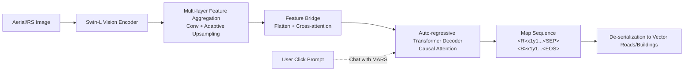

# MARS - A Foundational Map Auto-Regressor

**Conference**: ICLR 2026  
**OpenReview**: [https://openreview.net/forum?id=QV4sV5cbLl](https://openreview.net/forum?id=QV4sV5cbLl)  
**Code/Data**: [MAP-3M Dataset](https://huggingface.co/datasets/bag-lab/MAP-3M) / [Online Demo](https://huggingface.co/spaces/bag-lab/MARS)  
**Area**: Remote Sensing / Vector Map Generation  
**Keywords**: Map Generation, Auto-regressive, Vectorization, Road Extraction, Building Extraction, Foundation Model, Human-in-the-loop  

## TL;DR
This work treats vector maps (points, polylines, polygons) as a "language," using a unified vision encoder and auto-regressive decoder for end-to-end generation of road networks and building outlines without any segmentation post-processing. It releases MAP-3M, the largest multi-class map dataset to date (approximately 3M images).

## Background & Motivation
**Background**: Automatically generating maps from aerial or remote sensing imagery essentially involves converting raster pixels into vector geometric primitives—points, polylines, and polygons—corresponding to map elements such as roads, buildings, and water. However, most current vision generative models (e.g., SAM, Diffusion models) are rasterized, outputting pixel grids. In contrast, map elements are geometric and vectorized, consisting of variable numbers of points and segments without a fixed structure. This **structural mismatch** makes it difficult to apply general generative architectures directly to map generation.

**Limitations of Prior Work**: Mainstream approaches utilize a "two-stage pipeline"—performing pixel-level segmentation first, followed by vectorization post-processing (keypoint extraction, edge linking, NMS, etc.). This introduces two critical issues: (1) **Poor Generalization**: Post-processing is heuristic, and the logic required for road networks (multi-polylines with junctions/roundabouts) differs significantly from that for buildings (non-overlapping polygons), often restricting a model to a single type of map element. (2) **Limited Performance**: Generation is not learned end-to-end within a unified architecture, and it introduces numerous hand-tuned hyperparameters (NMS IoU thresholds, edge connection confidence, etc.), causing errors and complexity to accumulate across stages.

**Key Challenge**: To develop a "map foundation model," it is necessary to handle roads and buildings—two elements with vastly different geometric forms—using a unified architecture while eliminating all manual post-processing. However, the unstructured nature of vector data is exactly what general generative architectures find most difficult to process.

**Goal**: To propose the first **map foundation model** that uses a single end-to-end model to unify the generation of multi-polyline road networks and polygonal buildings, without relying on any intermediate steps or post-processing.

**Core Idea**: **Treating vector map primitives as a "formal language."** Drawing on the success of auto-regressive language modeling, a map-to-sequence framework is first used to convert all vector primitives (roads, buildings, etc.) into a unified sequence representation. Subsequently, a vision encoder combined with an auto-regressive Transformer decoder performs sequence-to-sequence learning, "generating maps" in the same way GPT generates text.

## Method

### Overall Architecture
MARS consists of two main components: (1) A **map-to-sequence conversion algorithm** that losslessly transforms any vector map data into a sequence of tokens with category labels; (2) An **end-to-end auto-regressive architecture** where a Swin Transformer vision backbone extracts image context features, which are then fed into an auto-regressive Transformer decoder via cross-attention to output the "map sequence" token by token. Training employs teacher forcing and cross-entropy, while inference decodes from `<SOS>` to `<EOS>`.

### Key Designs

**1. Map-to-Sequence: Unifying three geometric primitives into a "map language."** All map objects can be classified into three basic types—points, polylines, and polygons—expressed as vertex sequences: a point is $[x,y]$; a polyline is $[x_1,y_1,x_2,y_2,\dots]$; a polygon is a polyline that closes itself. Multiple objects are concatenated using **category tokens**: $[\langle P\rangle, x,y, \langle B\rangle, \dots, \langle R\rangle, \dots, \langle W\rangle, \dots]$, where $P/B/R/W$ mark points, buildings, roads, and water, respectively. In this way, a vector map tile is encoded into a sequence amenable to auto-regressive learning, bypassing the difficulties of variable object counts and non-fixed structures.

**2. Stroke-based Road Deconstruction: Breaking complex road networks into serializable single polylines.** Multi-polyline road networks are the most difficult part of serialization—crossings, merges, and roundabouts make them highly complex graphs. MARS adopts a stroke-based algorithm: first, all road segments are broken at **intersections with degree > 3**, and then adjacent segments with angles within a tolerance (e.g., $< 30°$) are merged into a "road." This decomposes complex road networks into multiple single polylines that align with real-world definitions, allowing the auto-regressive decoder to follow a unified sequence format (labeled with $R$).

**3. Shared Vocabulary + Spiral Sorting: Embedding semantics and coordinates into the same decoding space.** The decoder is built on a vanilla Transformer, using unidirectional causal attention to predict semantic categories and coordinates token by token. To unify category and position expression, MARS constructs a shared vocabulary $D \in \mathbb{R}^{B_o + B_c}$, where $B_o$ is the number of semantic categories and $B_c$ is the number of pixel positions in the image (e.g., 224). Both $x$ and $y$ share the same coordinate tokens, with additional special tokens like `<SOS>`, `<SEP>`, `<PAD>`, and `<EOS>`. Category and discrete coordinate tokens are supervised using the same cross-entropy loss. To ensure reproducible decoding orders, MARS sorts all objects by their distance to the image centroid, then by clockwise angle, forming a consistent **spiral order** to avoid training signal confusion from multiple valid annotation sequences.

**4. Chat with MARS: Natural human-in-the-loop editing via auto-regression.** Because teacher-forcing training makes every token conditional on all preceding tokens, MARS naturally exhibits "prompt-following" capabilities. Users can intervene in the decoding process via clicks through three modes: (i) **SOS Chat**—providing the starting point of the first object $[\langle SOS\rangle, B, x_1^1, y_1^1, \dots]$, particularly useful when imagery is blurred or out-of-domain. (ii) **MOS Chat**—correcting road prediction drift by replacing a drifted token with a single click $(x,y)$, "pulling" the generation back on track. (iii) **EOS Chat**—handling missed small objects by removing `<EOS>` and appending new object tokens to continue the sequence, thereby improving recall. These modes can be combined for multi-turn interactive map editing.

## Key Experimental Results

### Main Results
**Road Extraction (TOPO metrics, Cityscale / SpaceNet)**:

| Model | Cityscale P/R/F1 | SpaceNet P/R/F1 |
|------|------------------|------------------|
| RNGDet++ (2023) | 85.65 / 72.58 / 78.44 | **91.34** / 75.24 / **82.51** |
| SamRoad (2024) | **90.47** / 67.69 / 77.23 | 93.03 / 70.97 / 80.52 |
| **MARS** | 84.28 / **81.53** / **82.88** | 79.68 / **84.56** / 82.05 |

MARS improves F1 on Cityscale from 78.44 to **82.88** and achieves the highest recall on both datasets. While its SpaceNet F1 is 0.46 lower than the strongest specialized model, MARS is a **unified architecture**, whereas the others are road-specific models.

**Building Extraction (AICrowd-V1)**: MARS achieves AP 87.30 / AR 97.94, which is close to the specialized SOTA (GeoFormer AP 91.5) and surpasses it in AR, while **requiring no hyperparameters or post-processing**.

### Ablation Study
**Single-class vs. Multi-class (Table 2)**: The same architecture can be expanded from single to multiple categories simply by adding category tokens without significant performance loss—Road F1 87.7 (single) vs 83.1 (multi), AICrowd IoU 95.0 (single) vs 97.3 (multi), proving ontological scalability.

**Importance of MAP-3M Pre-training (Table 5)**:

| Setting | SpaceNet F1 | AICrowd IoU |
|------|-------------|-------------|
| No Pre-training | 70.45 | 95.09 |
| **MAP-3M Pre-training** | **82.05** | **95.24** |

SpaceNet F1 surged from 70.45 to 82.05, demonstrating that auto-regressive models are sensitive to data scarcity and benefit significantly from large-scale pre-training.

**Chat with MARS (Table 6)**: A single click consistently improves P/R/F1/IoU across all datasets (Cityscale F1 82.88 → 83.79), with further gains to 84.13 with two clicks.

### Key Findings
- **Paradigm Comparison**: Auto-regressive MARS generally offers higher recall, whereas segmentation-based models (like SamRoad) provide high precision but lower recall. MARS is more balanced in terms of average F1.
- **MAP-3M Scale**: Approximately 3M images, 512×512, covering 294,069 km². It represents a 10× increase in image count and 100× increase in spatial coverage compared to previous datasets, while including both buildings and roads.

## Highlights & Insights
- **Clean Perspective Shift to "Map as Language"**: Unifying points, polylines, and polygons into a sequence allows a GPT-style architecture to process geometrically distinct roads and buildings simultaneously, achieving a "no bells and whistles" end-to-end approach that removes manual post-processing.
- **Chat with MARS as a "Free Bonus" of Auto-regression**: Human-in-the-loop editing is not an extra module but an emergent property of prompt-following from teacher-forcing training. The SOS/MOS/EOS modes directly address real-world map maintenance needs.
- **Substantial Data Contribution**: MAP-3M provides a multi-order-of-magnitude increase in scale and geographic coverage, serving as a significant asset for the community.

## Limitations & Future Work
- **Computational Efficiency**: Auto-regressive decoding is inherently serial and more expensive than one-shot segmentation. While techniques like KV-cache could help, this paper does not provide an empirical inference speed comparison.
- **Failure in Difficult Scenarios**: Complex intersections (where the model might ignore minor roads) and occlusions from trees or shadows remain challenges for any vectorization method.
- **Limited Categories**: Currently only includes buildings and roads; expanding to water bodies or high-granularity classification (e.g., highway vs. sidewalk) is the next logical step.
- **Heuristic Sorting Dependency**: While spiral order ensures reproducibility, whether it is the optimal decoding sequence for extremely dense scenes requires further investigation.

## Related Work & Insights
- **Adopting the Auto-regressive Generation Paradigm**: Directly migrates the concepts of GPT / seq2seq to vector map generation, following the line of work that treats detection and segmentation as sequence generation (e.g., Pix2Seq).
- **Contrast with Two-stage Pipelines**: Compared to SAM-based or graph detection methods like RNGDet++, MARS emphasizes **unification and zero post-processing** rather than just topping specific metrics.
- **Inspiration**: The "structured output → serialization → auto-regression" path is valuable for any task requiring variable-length, unstructured geometric generation (e.g., circuit diagrams, CAD, scene graphs).

## Rating
- **Novelty**: ⭐⭐⭐⭐ First end-to-end auto-regressive map foundation model unifying roads and buildings. The "map as language" perspective and Chat with MARS are highly innovative.
- **Experimental Thoroughness**: ⭐⭐⭐⭐ Covers four datasets, dual tasks, pre-training ablations, and human-in-the-loop evaluation; however, it lacks efficiency benchmarks.
- **Writing Quality**: ⭐⭐⭐⭐ Clear logic from motivation to experimentation; serialization and Chat modes are well-explained.
- **Value**: ⭐⭐⭐⭐ Provides a unified architecture, a massive dataset, and an interactive paradigm, establishing a scalable prototype for map foundation models.

<!-- RELATED:START -->

## Related Papers

- [\[CVPR 2026\] WHU-MARS: A Multispectral Aerial-Ground Benchmark Towards Any-Scenario Person Re-Identification](../../CVPR2026/remote_sensing/whu-mars_a_multispectral_aerial-ground_benchmark_towards_any-scenario_person_re-.md)
- [\[ICML 2025\] MapEval: A Map-Based Evaluation of Geo-Spatial Reasoning in Foundation Models](../../ICML2025/remote_sensing/mapeval_a_map-based_evaluation_of_geo-spatial_reasoning_in_foundation_models.md)
- [\[ICCV 2025\] SMARTIES: Spectrum-Aware Multi-Sensor Auto-Encoder for Remote Sensing Images](../../ICCV2025/remote_sensing/smarties_spectrum-aware_multi-sensor_auto-encoder_for_remote_sensing_images.md)
- [\[CVPR 2026\] ACPV-Net: All-Class Polygonal Vectorization for Seamless Vector Map Generation from Aerial Imagery](../../CVPR2026/remote_sensing/acpv-net_all-class_polygonal_vectorization_for_seamless_vector_map_generation_fr.md)
- [\[ICLR 2026\] Object Fidelity Diffusion for Remote Sensing Image Generation](object_fidelity_diffusion_for_remote_sensing_image_generation.md)

<!-- RELATED:END -->
