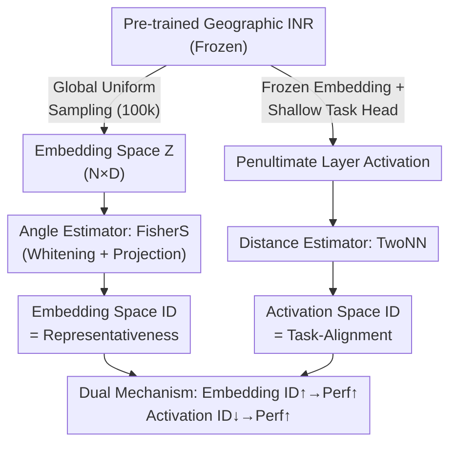

# Measuring the Intrinsic Dimension of Earth Representations

**Conference**: ICLR 2026  
**arXiv**: [2511.02101](https://arxiv.org/abs/2511.02101)  
**Code**: [GitHub](https://github.com/arjunarao619/GeoINRID)  
**Area**: Remote Sensing / Representation Learning  
**Keywords**: Intrinsic Dimension, Geographic Implicit Neural Representation, Earth Observation, Representation Learning, Unsupervised Evaluation

## TL;DR

This paper presents the first systematic measurement of the Intrinsic Dimension (ID) of Geographic Implicit Neural Representations (Geographic INR). It finds that the true ID of 256-512D embeddings is only 2-10. A high ID in the frozen embedding space correlates positively with downstream performance, while a low ID in the supervised task-head activation space correlates with high performance, revealing a dual mechanism of "Representativeness vs. Task-Alignment."

## Background & Motivation

Geographic Implicit Neural Representations (Geographic INR) map longitude and latitude coordinates $(λ, ϕ)$ to high-dimensional embedding vectors $z = f(λ, ϕ) \in \mathbb{R}^D$ (where $D$ is typically 256 or 512) through contrastive pre-training on satellite imagery, ground photos, or text. Models like SatCLIP, GeoCLIP, and CSP are widely used for downstream tasks such as land cover segmentation, object detection, and image geolocalization.

**Core Problem**: How much effective information is actually contained in these high-dimensional representations? Existing evaluations rely entirely on downstream task labels, lacking an architecture-agnostic, label-free measure of information content.

**Key Insight**: The Earth's surface itself is a two-dimensional sphere $S^2$, meaning the input manifold dimension of an INR is known to be 2. If the intrinsic dimension (ID) of the embedding is significantly higher than 2, it indicates the model encodes geographic signals beyond coordinates. If the ID is close to the ambient dimension $D$, redundancy may exist. This setup of "known input dimension + measurable output ID" makes geographic INRs ideal for studying ID.

## Method

### Overall Architecture

Rather than training new models, this study treats pre-trained geographic INRs as subjects and uses a suite of Intrinsic Dimension (ID) tools to measure the amount of independent information they encode. The design measures ID from **two complementary spaces**, addressing two distinct questions. The first path freezes the pre-trained encoder and uniformly samples 100,000 coordinates $(λ, ϕ)$ globally to generate an embedding matrix $Z_{geo} \in \mathbb{R}^{N \times D}$, measuring the number of independent directions in the manifold—representing "Representativeness." The second path also freezes the embeddings but trains a shallow task head, measuring the ID of the task manifold created by supervised learning—representing "Task-Alignment." Measuring these two spaces with the same ID metrics yields **opposite** correlation results, which constitutes the core finding.

### Key Designs

**1. Dual-space ID Measurement Protocol: Separating "Richness" from "Utility"**

Measuring ID in only one space cannot clarify whether a "higher or lower dimension" is better, as pre-training and fine-tuning have opposing dimensional requirements. This study separates these two aspects. For representativeness, embeddings $Z_{geo}$ are generated from a frozen position encoder $f$ using global coordinates, and the global ID of the embedding manifold is measured using an "angle-based ruler"—higher ID signifies more independent geographic signals. For task-alignment, the INR remains frozen, and only a shallow task head is trained. The ID of the **penultimate-layer activations** is measured (following Ansuini et al., 2019). "Task-alignment" is defined as a geometric concept: the more a representation can be compressed into a low-dimensional manifold by a shallow head, the better it aligns with the task.

**2. Complementary Use of Angle and Distance Estimators: Mitigating Spatial Heterogeneity**

The distribution of embeddings on the Earth's surface is naturally non-uniform—climate boundaries, coastlines, and training data biases cause local density spikes. Using neighborhood distance-sensitive estimators for global comparisons would lead to results contaminated by local structures. Thus, the study assigns tools by purpose: **FisherS (Angle Estimator)** is used for **global horizontal ranking** (Representativeness). It whitens embeddings and projects them onto a sphere, eliminating local density differences to focus on the effective degrees of freedom in orientation. **Distance Estimators** (MLE, TwoNN, MOM, TLE) are used for **point-wise spatial diagnostics**, as their sensitivity to local neighborhoods reveals the local structure of the manifold.

**3. Local ID Maps: Visualizing Scalar Values as Global Maps**

Global ID is a single number that masks spatial information regarding where dimensions are high or low. This study uses the MLE estimator to calculate ID point-wise ($k=100$) and generates global maps, making model flaws visible: GeoCLIP's ID is highest in the US and Western Europe, exposing geographic biases in its social media training images; CSP's map shows grid-like stripes due to periodic position encoding; SatCLIP shows subtle oscillations corresponding to truncation effects in spherical harmonics.

**4. Resolution—ID Causal Experiments: Verifying the Causal Link**

Since high representativeness correlate with performance, the study controls resolution hyperparameters—Legendre polynomial degree $L$ for SatCLIP, RFF maximum frequency $\sigma_{max}$ and layers $M$ for GeoCLIP, and frequency components $S$ for Space2Vec. The results show ID increases monotonically with resolution (e.g., SatCLIP FisherS ID increases from 5.0 to 8.1 as $L$ goes from 10 to 40), proving that high-frequency encoding expands the effective degrees of freedom.

## Key Experimental Results

### Global Intrinsic Dimension of Models

| Model | Type | $D$ | FisherS | MLE | MOM | TLE |
|------|------|-----|---------|-----|-----|-----|
| SatCLIP-L10 | Position Encoder | 256 | 5.00 | 1.96 | 2.02 | 2.16 |
| SatCLIP-L40 | Position Encoder | 256 | 8.08 | 2.03 | 2.39 | 2.32 |
| GeoCLIP | Position Encoder | 512 | 7.68 | 11.21 | 13.02 | 11.53 |
| CSP-fMoW | Position Encoder | 256 | 1.70 | 5.18 | 5.23 | 6.25 |
| CSP-iNat | Position Encoder | 256 | 0.92 | 3.37 | 4.64 | 4.14 |
| SINR | Position Encoder | 256 | 3.19 | 2.19 | 3.36 | 2.74 |
| TaxaBind-Loc | Position Encoder | 512 | 3.33 | 9.44 | 11.56 | 10.30 |
| CROMA | Image Encoder | 768 | 9.79 | 19.57 | 17.00 | 20.30 |
| DOFA | Image Encoder | 768 | 3.32 | 15.58 | 13.78 | 16.20 |
| ResNet152 | Image Encoder | 2048 | 7.60 | 20.72 | 17.50 | 21.50 |

The IDs of all position encoders are 1-2 orders of magnitude lower than their ambient dimensions. GeoCLIP's distance-estimated ID (11-13) approaches that of the large image encoder DOFA (14-16).

### Impact of Input Modalities on ID and Performance

| Pre-training Modalities | Global FisherS ID | Temp R² | Elevation R² | Pop R² |
|-----------|---------------|--------|--------|--------|
| Sentinel-2 | ~7.5 | ~0.76 | ~0.74 | ~0.78 |
| S1 + S2 | ~8.5 | ~0.80 | ~0.82 | ~0.82 |
| All Modalities | ~9.5 | ~0.84 | ~0.86 | ~0.86 |

More input modalities $\rightarrow$ Higher ID $\rightarrow$ Better downstream performance.

### Key Findings

- **Positive Correlation: Embedding Space ID vs. Performance**: Higher global FisherS ID in frozen INR embeddings leads to better performance in regression/classification tasks (Temperature, Elevation, Population, Biome, Country).
- **Negative Correlation: Activation Space ID vs. Performance**: Lower TwoNN ID in the penultimate layer of supervised MLPs leads to better performance.
- **Resolution Controls ID**: SatCLIP’s FisherS ID rises from 5.0 to 8.1 as the Legendre degree increases from 10 to 40.
- **Local ID Exposes Bias**: High ID in specific regions for GeoCLIP matches training data density; CSP exhibits grid artifacts.

## Highlights & Insights

- The **dual mechanism of representativeness vs. task-alignment** is the core contribution, unifying the intuitions of "wide pre-training" and "narrow fine-tuning."
- ID serves as a practical label-free metric for model selection and hyperparameter search.
- Local ID maps are effective diagnostic tools for identifying data coverage biases and structural spatial artifacts.
- Geographic INR IDs (2-10) are far lower than ambient dimensions (256-512), suggesting significant redundancy.

## Resolution Impact on ID

| Model | Resolution Parameter | Value | Global FisherS ID |
|------|-----------|--------|---------------|
| SatCLIP | Legendre Degree $L$ | 10 | 5.0 |
| SatCLIP | Legendre Degree $L$ | 20 | ~6.5 |
| SatCLIP | Legendre Degree $L$ | 40 | 8.1 |
| GeoCLIP | RFF Max Freq $\sigma_{max}$ | $2^8$ | 7.7 |
| GeoCLIP | RFF Max Freq $\sigma_{max}$ | $2^{16}$ | 75.7 |

## Limitations & Future Work

- Different ID estimators yield significantly different values (e.g., SatCLIP-L40: FisherS=8.08 vs MLE=2.03), requiring careful selection.
- Analysis is limited to static 2D coordinates; spatio-temporal representations are not yet covered.
- ID is a single scalar and does not capture directional structures or semantic organization in the embedding space.
- The correlation analysis depends on a limited set of 7 position encoders and 5 tasks.

## Rating
- Novelty: ⭐⭐⭐⭐
- Experimental Thoroughness: ⭐⭐⭐⭐
- Writing Quality: ⭐⭐⭐⭐
- Value: ⭐⭐⭐⭐

<!-- RELATED:START -->

## Related Papers

- [\[ICLR 2026\] Earth-Agent: Unlocking the Full Landscape of Earth Observation with Agents](earth-agent_unlocking_the_full_landscape_of_earth_observation_with_agents.md)
- [\[ICML 2026\] Localized, High-resolution Geographic Representations with Slepian Functions](../../ICML2026/remote_sensing/localized_high-resolution_geographic_representations_with_slepian_functions.md)
- [\[CVPR 2026\] GeoSANE: Learning Geospatial Representations from Models, Not Data](../../CVPR2026/remote_sensing/geosane_learning_geospatial_representations_from_models_not_data.md)
- [\[CVPR 2026\] RAMEN: Resolution-Adjustable Multimodal Encoder for Earth Observation](../../CVPR2026/remote_sensing/ramen_resolution-adjustable_multimodal_encoder_for_earth_observation.md)
- [\[CVPR 2026\] TESSERA: Temporal Embeddings of Surface Spectra for Earth Representation and Analysis](../../CVPR2026/remote_sensing/tessera_temporal_embeddings_of_surface_spectra_for_earth_representation_and_anal.md)

<!-- RELATED:END -->
