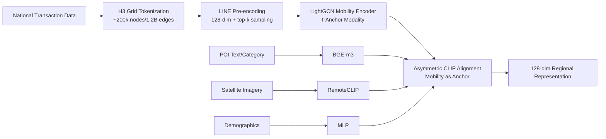

# MoRA: Mobility as the Backbone for Geospatial Representation Learning at Scale

**Conference**: ICLR 2026  
**OpenReview**: [https://openreview.net/forum?id=IlBr5JJsCj](https://openreview.net/forum?id=IlBr5JJsCj)  
**Code**: [https://github.com/ylzhouchris/MoRA](https://github.com/ylzhouchris/MoRA)  
**Area**: Geospatial Representation Learning / Multimodal Alignment / Self-Supervised  
**Keywords**: Human mobility graph, geospatial representation, multimodal contrastive learning, spatial tokenization, GNN, scaling laws  

## TL;DR
MoRA treats human mobility graphs as the "structural backbone" for multimodal fusion. Using CLIP-style asymmetric contrastive learning, it aligns POIs, satellite imagery, and demographics with a billion-edge mobility graph. It outperforms SOTA by an average of 12.9% across 9 socioeconomic downstream tasks using 128-dimensional representations and provides the first empirical evidence of scaling laws in geospatial representation learning.

## Background & Motivation
**Background**: The core of Geospatial Intelligence (GeoAI) involves compressing a "location" into low-dimensional dense vectors. Current research is split into two main streams: the **Earth observation (physical state) stream**, represented by Google AlphaEarth, SatCLIP, and GeoCLIP, which characterizes land surface appearance via satellite/remote sensing imagery; and the **human-centric stream**, which models socioeconomic dynamics via mobility data and demographics.

**Limitations of Prior Work**: The physical stream excels at describing land appearance but fails to capture non-visual socioeconomic semantics (e.g., house prices, crime, consumption). The human-centric stream often trains models on single cities, leading to significant performance degradation in cross-city transfer, and lacks unified multimodal fusion principles or comprehensive benchmarks for human-centric tasks. PDFM, the most similar prior work, relies on simple concatenation and static neighborhood graphs based on geographic proximity, missing high-order, dynamic, non-local correlations between regions.

**Key Challenge**: Geospatial data is inherently multimodal and heterogeneous, but there has been no principled answer to "which modality serves as the anchor for fusion"—using coordinates or imagery as anchors loses crucial **functional relationship signals**.

**Goal**: To learn "full-profile" location representations containing both physical attributes and human activity patterns that are scalable to the national level and transferable across tasks.

**Key Insight**: **[Mobility as the "Syntax" of Geospatial Space]** The authors draw an analogy to Large Language Models (LLMs)—the semantics of a word are derived from its context and co-occurrence, not just the word itself. Analogous to ViT, continuous geospatial space is discretized into H3 grid cells as "spatial tokens," and human mobility sequences (moving from one cell to another) are treated as "sentences" providing context. A cell's representation is thus enriched by the latent co-occurrence structure in mobility sequences. This leads to the **mobility-as-backbone** concept: using the mobility graph as the structural backbone through which all other auxiliary modalities are interpreted.

## Method

### Overall Architecture
MoRA consists of three components: **spatial tokenization + GNN mobility encoder + asymmetric CLIP alignment**. Geospatial space is partitioned using H3 grids (level 6, ~36 km²/cell). A national-level mobility graph with ~200k nodes and 1.2 billion edges is constructed from transaction data. Mobility serves as the sole **anchor modality** encoded by a GNN. Three auxiliary modalities—POI (text), satellite imagery (visual), and demographics (tabular histograms)—are encoded by specialized encoders and aligned to the mobility anchor via contrastive loss, resulting in final 128-dimensional regional representations.

### Key Designs

**1. Mobility as the backbone: Using functional relationships instead of geographic proximity as the anchor.** This is the theoretical pivot. Previous methods used coordinates or single imagery, encoding only "physical proximity." Human activities often cross geographic boundaries (via transport or digital networks); building the mobility graph as "edges" captures these non-local patterns. The authors argue the mobility graph is the backbone for alignment, interpreting all other modalities as "annotations of human dynamics." Replacing the mobility graph with a simple proximity graph results in a 12.2% performance drop.

**2. Spatial Tokenization + LINE Pre-encoding + top-k Sampling: Organizing sparse interactions into a learnable graph.** Raw spatial interactions are sparse and misaligned. Following the ViT patch concept, H3 grids are used for grid-level graph construction (H3 has less distortion than Geohash or Google S2). LINE (second-order proximity) is used to pre-encode the full graph into 128-dimensional embeddings for node initialization. **Scale-proportional top-k sampling** retains only the highest flow links (10% in main experiments) to handle the long-tail distribution of geographic flow while minimizing computation.

**3. LightGCN Mobility Encoder: Minimalist message passing.** The encoder for the mobility anchor uses LightGCN—removing feature transformations and non-linear activations to focus on neighbor aggregation. Final node representations are obtained by summing results across $L$ layers:
$$e_i = \sum_{k=0}^{K} e^{(k)}_i, \quad e^{(l+1)}_i = \sum_{j \in N_i} \frac{1}{\sqrt{|N_i|}} e^{(l)}_j$$
Ablations show that replacing the GNN with an MLP leads to the largest performance drop, indicating that the graph structure is essential for capturing non-local relationships.

**4. Asymmetric CLIP Alignment: Unifying modalities via a mobility anchor.** All four modalities are projected into a shared space, but only mobility acts as the anchor. For each grid cell, a modality tuple $(M, I, T, D)$ is formed. The mobility feature $f(m_i)$ is provided by the GNN, while auxiliary features $g(x_i)$ are provided by pre-trained Foundation Models (BGE-m3 for POI, RemoteCLIP for imagery) or an MLP (demographics). The loss is the sum of three auxiliary↔mobility symmetric terms:
$$\mathcal{L} = \frac{1}{|\{I,t,d\}|}\sum_{X\in\{I,t,d\}}(\mathcal{L}_{M,X}+\mathcal{L}_{X,M}), \quad \mathcal{L}_{M,X}=\frac{1}{2N}\sum_{i=1}^{N}-\log\frac{\exp(\langle f(m_i),g(x_i)\rangle/\tau)}{\sum_{j=1}^{N}\exp(\langle f(m_i),g(x_j)\rangle/\tau)}$$
This "star alignment" ensures auxiliary modalities are unified into the semantic coordinate system of human dynamics.

## Key Experimental Results

### Main Results
Pre-training data: National mobility flow from the Tencent ecosystem (54 weeks, 200k nodes/1.2B edges), 100M+ POIs, Google 10m satellite imagery, and WorldPop demographics. 9 downstream tasks cover Social (POP/EDU/ELD/HSR/CRI) and Economic (NTL/HOU/ENE/COS) domains at point/grid/county/city scales, evaluated using LightGBM with $R^2$ metrics.

Comparison with public pre-trained location encoders (entirety of China):

| Model | Dim | POP | EDU | ELD | HSR | CRI | NTL | HOU | ENE | COS |
|---|---|---|---|---|---|---|---|---|---|---|
| AlphaEarth | 64 | 0.80 | 0.77 | 0.71 | 0.68 | 0.71 | 0.63 | 0.63 | 0.47 | 0.81 |
| SatCLIP | 256 | 0.52 | 0.63 | 0.68 | 0.74 | 0.39 | 0.33 | 0.66 | -0.07 | 0.44 |
| GeoCLIP | 512 | 0.41 | 0.66 | 0.66 | 0.69 | 0.32 | 0.24 | 0.65 | 0.11 | 0.32 |
| CSP | 256 | 0.55 | 0.65 | 0.62 | 0.68 | 0.39 | 0.29 | 0.62 | 0.20 | 0.46 |
| Siren | 1024 | 0.51 | 0.66 | 0.69 | 0.74 | 0.39 | 0.33 | 0.66 | -0.14 | 0.44 |
| **MoRA** | **128** | **0.83** | **0.85** | **0.81** | **0.81** | **0.76** | 0.62 | **0.70** | **0.72** | **0.91** |
| Gain | | +4.1% | +10.5% | +13.9% | +9.5% | +6.9% | -1.7% | +6.1% | **+54.5%** | +12.1% |

MoRA achieves the best results in 8 out of 9 tasks with only 128 dimensions, with an average gain of **12.9%** (Social +10.8%, Economic +16.0%). The performance in city-level energy consumption (ENE) is particularly notable (+54.5%), where baselines struggled near zero $R^2$.

### Ablation Study
Modality ablation (Average $R^2$ after removing a modality):

| Variant | AVG $R^2$ |
|---|---|
| w/o POI | 0.765 |
| w/o Image | 0.762 |
| w/o Demo | 0.748 |
| **MoRA (full)** | **~0.78** |

Removing **demographics (Demo)** caused the largest drop, while POI and Imagery also provided necessary gains.

### Key Findings
- **First Evidence of Scaling Laws**: Pre-training across nested spatial scales (Jiangsu → East China → China) shows that downstream performance increases with data scale, following the scaling behavior seen in LLMs/CV.
- **Functional Proximity > Geometric Proximity**: Long-range correlations in the mobility graph are the core source of performance.
- **Distillable for Deployment**: An MLP can be trained to map continuous coordinates directly to MoRA grid outputs, creating a privacy-preserving, "coordinate-in, vector-out" tool that requires no external data at inference time.

## Highlights & Insights
- **Elegant Theoretical Narrative**: The "mobility as syntax" LLM/ViT analogy justifies the use of mobility as an anchor based on first principles rather than engineering heuristic.
- **Star Alignment**: Using mobility as the sole anchor explicitly models non-local, dynamic, high-order regional associations.
- **Scale**: Trained on a 1.2 billion-edge graph + 100M POIs + national imagery in just 1 hour on a single A100 (thanks to LINE pre-encoding and top-k sampling).
- **Efficiency**: 128-dimensional compact representations outperform 512/1024-dimensional baselines.

## Limitations & Future Work
- **Dependency on Tencent Ecosystem**: Mobility flow, POIs, and consumption data are proprietary, creating barriers for replication and cross-platform transfer.
- **Geographic Bias**: Validated only in China; cross-country transferability of H3-level-6 cell configurations and urban patterns remains unproven.
- **Physical-Task Weakness**: On tasks strongly correlated with remote sensing (e.g., NTL), a human-centric anchor is slightly less effective.
- **Static Aggregation**: Aggregating 54 weeks into a single graph loses temporal dynamics (e.g., seasonality, holidays).
- **Scaling Law Threshold**: Gains from East China to China show diminishing returns, suggesting a potential bottleneck in data diversity or architecture.

## Related Work & Insights
- **Earth observation stream**: AlphaEarth, SatCLIP/GeoCLIP excel at physical states but lack socioeconomic semantics.
- **Human-centric Foundational Models**: PDFM is the closest conceptual work but uses simple concatenation and static neighborhood graphs. ReFound, HREP, and ReCP are mostly limited to city-level scales.
- **Insights**: The "relationship-graph-as-backbone and star-alignment" is a transferable multimodal paradigm for domains with strong relational signals. Distilling complex multimodal signals into simple coordinate-to-vector utilities is an excellent template for deploying academic findings.

## Rating
- **Novelty**: ⭐⭐⭐⭐ — Strong theoretical framework with elegant LLM/ViT analogies.
- **Experimental Thoroughness**: ⭐⭐⭐⭐ — Large-scale validation across 9 tasks and multiple spatial scales.
- **Writing Quality**: ⭐⭐⭐⭐ — Clear narrative logic and well-explained concepts.
- **Value**: ⭐⭐⭐⭐ — High practical value for Socioeconomic GeoAI with compact, high-performance representations.

<!-- RELATED:START -->

## Related Papers

- [\[CVPR 2026\] GeoSANE: Learning Geospatial Representations from Models, Not Data](../../CVPR2026/remote_sensing/geosane_learning_geospatial_representations_from_models_not_data.md)
- [\[CVPR 2026\] Data Leakage Detection and De-duplication in Large Scale Geospatial Image Datasets](../../CVPR2026/remote_sensing/data_leakage_detection_and_de-duplication_in_large_scale_geospatial_image_datase.md)
- [\[CVPR 2026\] TESSERA: Temporal Embeddings of Surface Spectra for Earth Representation and Analysis](../../CVPR2026/remote_sensing/tessera_temporal_embeddings_of_surface_spectra_for_earth_representation_and_anal.md)
- [\[ICLR 2026\] Towards Faithful Reasoning in Remote Sensing: A Perceptually-Grounded Geospatial Chain-of-Thought for Vision-Language Models](towards_faithful_reasoning_in_remote_sensing_a_perceptually-grounded_geospatial_.md)
- [\[AAAI 2026\] Machine Learning for Sustainable Rice Production: Region-Scale Monitoring of Water-Saving Practices in Punjab, India](../../AAAI2026/remote_sensing/machine_learning_for_sustainable_rice_production_region-scale_monitoring_of_wate.md)

<!-- RELATED:END -->
