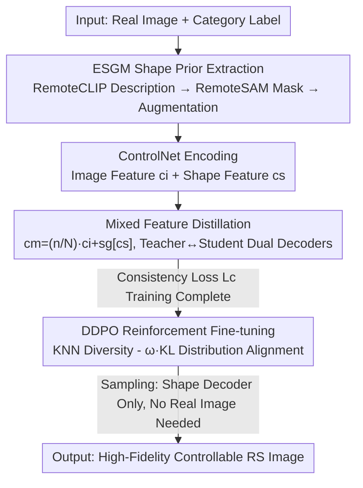

# Object Fidelity Diffusion for Remote Sensing Image Generation

**Conference**: ICLR 2026  
**OpenReview**: [https://openreview.net/forum?id=ngfIm9aPsH](https://openreview.net/forum?id=ngfIm9aPsH)  
**Code**: https://github.com/VisionXLab/OF-Diff  
**Area**: Remote Sensing Image Generation / Diffusion Models / Layout-to-Image  
**Keywords**: Layout-to-Image, Remote Sensing, Shape Prior, Online Distillation, DDPO

## TL;DR
OF-Diff utilizes category labels to directly extract "shape mask priors" of remote sensing objects to constrain diffusion generation. An "online distillation" framework is employed to distill mixed features containing real image information into a shape-dependent decoder. This enables the model to generate high-fidelity, layout-consistent remote sensing images **without requiring real image references** during inference. Finally, DDPO reinforcement fine-tuning is used to further align with the real distribution, resulting in a 4–8% mAP improvement for categories such as airplanes, ships, and vehicles in downstream detection tasks.

## Background & Motivation
**Background**: Remote sensing object detection has long been hindered by the scarcity of annotated data, making "controllable synthesis of training data" a research hotspot. Regarding generation paradigms, Layout-to-Image (L2I, conditioned on bounding boxes) provides more precise spatial control compared to Text-to-Image (T2I), making it more suitable for data augmentation in detectors. Representative methods in the remote sensing field include AeroGen (fine-grained layout conditions) and CC-Diff (instance-level, referencing real image patches).

**Limitations of Prior Work**: The authors categorize the failures of existing L2I methods in remote sensing into four types (Figure 1): ① **Control Leakage**—content overflows outside the specified layout boxes; ② **Structural Distortion**—object morphology is distorted and unrealistic; ③ **Dense Generation Collapse**—loss of control over quantity and position in dense scenes; ④ **Feature-level Mismatch**—the distribution of images generated by methods like CC-Diff is closer to their pre-training corpus style rather than the real remote sensing distribution (obvious deviation on t-SNE). The root cause is that pure bounding boxes only provide "where and how large," lacking **fine-grained shape information**, while instance-level methods, despite high fidelity, **depend heavily on the quality and quantity of real image patches**, limiting generalization and flexibility.

**Key Challenge**: A trade-off exists between high fidelity (requiring rich appearance priors from real images) and high controllability/generalizability (preferring labels only, without dependence on real references). Branches containing real image information are faithful but inflexible and require real images during sampling; branches relying solely on shapes are flexible and controllable but prone to converging to low-fidelity local optima.

**Goal**: To achieve high shape fidelity and layout consistency while **eliminating dependence on any real image reference during the sampling stage**, thereby truly enhancing downstream detection.

**Key Insight**: The authors observe that remote sensing objects possess "quasi-invariant shapes"—stadiums are rectangular, chimneys/oil tanks are circular, and airplanes are bilaterally symmetrical with a nose and tail. This shape consistency implies that **category labels can be used to directly generate shape masks** as strong controllable priors, without the need to model perspective or scale variations as in natural images.

**Core Idea**: Replace "real image patch references" with "label → shape mask prior" as the control signal, migrate the fidelity capabilities of a "mixed-feature teacher" to a "shape-only student" via online distillation, and use DDPO to reinforce alignment with the real distribution.

## Method

### Overall Architecture
OF-Diff is built upon Stable Diffusion 1.5 + ControlNet, centering on a **dual-decoder online distillation** structure. During training, both real images and labels are provided: ESGM first extracts object shape masks from "image + label"; images and masks pass through ControlNet to obtain image features $c_i$ and shape features $c_s$, which are fused into mixed features $c_m$. SD compresses the image into latent space $z_0$, adds noise to form $z_t$, and feeds it through an encoder into two decoders: the **mixed-feature decoder** (conditioned on $c_m$, containing real image information, acting as the teacher) and the **shape-feature decoder** (conditioned on $c_s$, relying only on shape, acting as the student). Online distillation uses a consistency loss to treat teacher predictions as stop-gradient anchors, pulling the student toward the high-fidelity optimum. During sampling, **only the frozen ControlNet + shape-feature decoder are retained**, allowing image generation using any label prior and completely removing the need for real image references. Finally, DDPO reinforcement fine-tuning is applied to the trained diffusion model to enhance diversity and distributional consistency.

### Key Designs

**1. ESGM Enhanced Shape Generation Module: Translating "Category Labels" into Controllable Shape Masks**

Addressing the issue where "pure bounding boxes lack shape and lead to structural distortion," ESGM leverages the quasi-invariant shape characteristics of remote sensing objects to upgrade labels into strong shape priors. For a bounding box $y_i^j$ of category $j$ in image $x_i$, RemoteCLIP first generates a textual description for the object within the box, then the description and original image are fed into RemoteSAM to obtain the corresponding shape mask $\{x_i^j\}$. Subsequently, shape augmentation is performed: each mask is cropped by the box, randomly rotated, and pasted back onto a blank canvas to form a "shape-augmented mask." During training, the shape from the real image is used directly; during sampling, augmented shapes are selected from a lightweight mask pool collected during training to synthesize diverse masks—enabling inference without real images. Ablations show that adding ESGM alone improves YOLOScore by over 10%, making it the most significant module.

**2. Mixed Features + stop-gradient: Creating a Stable "Anchor" for Fidelity**

Training with only shape features $c_s$ easily falls into low-fidelity local optima, whereas real image features $c_i$ are more information-rich. The authors fuse both into mixed features based on training progress:

$$c_m = \frac{n}{N}\cdot c_i + \mathrm{sg}[c_s]$$

Where $n$ is the current iteration and $N$ is the total iterations, so the weight of image information increases gradually. Crucially, a **stop-gradient** ($\mathrm{sg}[\cdot]$) is applied to the shape features $c_s$: allowing predictions under the mixed-feature condition to serve as a "stable anchor," thereby enhancing morphological fidelity without allowing gradients to back-propagate and perturb the shape branch. This $c_m$ is specifically used as the teacher input in online distillation.

**3. Online Distillation Consistency Loss: Transferring Teacher's Fidelity to the Shape-Only Student**

The mixed-feature decoder (teacher) is accurate but requires real images, limiting diversity; the shape-feature decoder (student) supports arbitrary label control but tends toward low fidelity. To obtain the benefits of both, the authors calculate reconstruction losses $L_s=\mathbb{E}[\|\epsilon_\theta^s-\epsilon\|^2]$ and $L_m=\mathbb{E}[\|\epsilon_\theta^m-\epsilon\|^2]$ for the two decoders respectively, and add a consistency loss treating the teacher as a stop-gradient anchor:

$$L_c = \mathbb{E}\big[\|\epsilon_\theta^s - \mathrm{sg}[\epsilon_{\theta'}^m]\|^2\big]$$

The total objective is $L = L_s + L_m + \lambda L_c$ (with $\lambda=1$ in implementation). The teacher $\epsilon_{\theta'}^m$ pulls the student $\epsilon_\theta^s$ toward the high-fidelity optimum in parameter space. Thus, discarding the teacher and retaining only the student (shape decoder) during sampling preserves high fidelity while removing dependence on real images—marking the core difference between OF-Diff and CC-Diff.

**4. DDPO Reinforcement Fine-tuning: Aligning with Real Distribution via KNN Diversity - KL Consistency Reward**

To further enhance diversity and approach the real remote sensing distribution, the authors introduce DDPO in the post-training stage, treating diffusion denoising as a multi-step MDP optimized via policy gradients. The reward function simultaneously encourages diversity and penalizes distributional deviation:

$$r(x_0, c) = \mathrm{KNN}(x_0, x_0) - \omega\,\mathrm{KL}(x_0, x_0')$$

The KNN term (calculated in the low-dimensional embedding space of a CLIP image encoder, $k=50$) measures the diversity of generated data, while the KL term measures the distributional consistency between generated and real data $x_0'$, with $\omega=2$ balancing the two. This step addresses the feature-level pain point where "generated images lean toward pre-training styles and mismatch the real remote sensing distribution."

### Loss & Training
Total loss $L = L_s + L_m + \lambda L_c$ ($\lambda=1$); DDPO reward $r = \mathrm{KNN} - \omega\,\mathrm{KL}$ ($k=50$, $\omega=2$). Based on SD 1.5, only ControlNet and the shape feature decoder are fine-tuned, while the rest are frozen; AdamW, learning rate 1e-5, global batch 64, trained for 100 epochs, with DIOR/DOTA trained separately.

## Key Experimental Results

### Main Results
Datasets: DIOR-R (20 categories, rotated boxes), DOTA-v1.0 (15 categories, dense small objects, cropped to 512×512), HRSC2016 (ships, appendix). Comparisons with LayoutDiffusion, GLIGEN (natural images) and AeroGen, CC-Diff (remote sensing), all retrained under uniform settings. 13 metrics cover generation fidelity, layout consistency, shape fidelity, and downstream utility.

| Dataset | Metric | OF-Diff | Next Best | Description |
|--------|------|---------|------|------|
| DIOR | FID↓ | 24.92 | 27.78 (AeroGen) | Best fidelity |
| DIOR | CMMD↓ | 0.312 | 0.447 (LayoutDiff) | Significant lead |
| DIOR | YOLOScore↑ | 58.99 | 55.38 (AeroGen) | Best layout consistency |
| DIOR | mAP50 | 54.44 | 53.48 (CC-Diff) | Best downstream |
| DOTA | FID↓ | 20.84 | 21.73 (LayoutDiff) | Best fidelity |
| DOTA | YOLOScore↑ | 55.68 | 49.62 (CC-Diff) | Substantial lead |
| DOTA | mAP50 | 67.89 | 67.09 (AeroGen) | Best downstream |

For shape fidelity (Canny edge maps, Table 2), OF-Diff achieves **SOTA across all five metrics** (IoU/Dice/CD/HD/SSIM): on DOTA, IoU is 0.1205 (next best 0.0863) and SSIM is 0.2938 (next best 0.2261), showing a clear advantage in morphological similarity.

Downstream Detection (data doubling augmentation): mAP for DIOR/DOTA improved by 2.2% / 1.94% compared to baseline; AP50 improvements by category are particularly prominent—Airplanes +8.3%, Ships +7.7%, Vehicles +4.0% on DIOR; Swimming pools +7.1%, Small vehicles +5.9%, Large vehicles +4.4% on DOTA, indicating that multi-morphology and small-object categories benefit most.

### Ablation Study

| ESGM | $L_c$ | DDPO | FID↓ | YOLOScore↑ | mAP50↑ |
|------|------|------|------|-----------|--------|
| ✗ | ✗ | ✗ | 42.59 | 41.20 | 52.13 |
| ✓ | ✗ | ✗ | 24.87 | 55.08 | 52.76 |
| ✓ | ✓ | ✗ | 24.98 | 57.83 | 54.31 |
| ✓ | ✗ | ✓ | 25.78 | 58.26 | 54.17 |
| ✓ | ✓ | ✓ | 24.92 | 58.99 | 54.44 |

### Key Findings
- **ESGM makes the greatest contribution**: Adding it alone reduces FID from 42.59 to 24.87 and boosts YOLOScore from 41.20 to 55.08 (over +10%), indicating that shape priors are the primary engine for fidelity and controllability.
- **Three-module complementarity**: $L_c$ online distillation mainly improves layout consistency (YOLOScore → 57.83) and downstream mAP50, while DDPO further pushes YOLOScore to 58.99; combined, they achieve the best overall results.
- **Side effects of Captions**: Adding captions makes images more semantically compliant and aesthetically pleasing to humans, but fidelity decreases and the distribution leans toward pre-training corpora rather than real remote sensing data—hence ablations were uniformly conducted without captions.
- **Robustness to unknown layouts**: On layouts unseen during training, OF-Diff still achieves the best fidelity and consistency, with downstream mAP 1.54% higher than the next best.

## Highlights & Insights
- **Remote Sensing-specific insight "Shape as a Strong Prior"**: By capturing the quasi-invariant shape characteristics of RS objects, vague bounding boxes are upgraded to controllable shape masks, bypassing the "absence of a unique geometric model for shapes" problem in natural images—which is why this approach is more effective in RS than in natural scenes.
- **Online distillation decouples "Real images for training, none for inference"**: The teacher consumes real image information while the student consumes only shapes. The stop-gradient consistency transfers fidelity, completely removing the dependency seen in CC-Diff where "real patches are still needed for sampling." This decoupling paradigm is transferable to other controllable generation tasks featuring "privileged information during training but not during inference."
- **Explicitly writing "Diversity - Distribution Distance" into reward**: DDPO uses KNN (CLIP space) + KL to directly target "avoiding mode collapse" and "not drifting from real distribution," which is more focused than simple FID-based fine-tuning.

## Limitations & Future Work
- Dependency on two external large models, RemoteCLIP and RemoteSAM, for generating shape masks; the upper bound of mask quality is constrained by these models' performance in the RS domain; performance may degrade for new categories lacking good textual descriptions or segmentation.
- The "quasi-invariant shape" assumption holds for regular objects (stadiums, oil tanks, planes) but may not apply to targets with highly variable morphology or flexible structures.
- Models are trained separately for each dataset; generalization across datasets or sensors has not been fully verified.
- Sampling relies on picking shapes from a training-phase mask pool; shape diversity is limited by the pool's coverage; sensitivity analysis of DDPO reward hyperparameters ($\omega$, $k$) was only partially explored through $\lambda$.

## Related Work & Insights
- **vs CC-Diff (Instance-level RS L2I)**: CC-Diff improves fidelity by referencing real instance patches but depends on real data for sampling and leans toward pre-training styles; OF-Diff uses shape priors + online distillation to discard real images during inference, outperforming it across five shape fidelity metrics.
- **vs AeroGen (Coarse layout-conditioned RS L2I)**: AeroGen uses only coarse layouts, providing limited spatial and shape control; OF-Diff introduces shape masks and DDPO, resulting in significantly higher YOLOScore and downstream mAP.
- **vs LayoutDiffusion / GLIGEN (Natural image L2I)**: These use layouts as modalities or gated attention for control, lacking fine-grained shape. Directly migrating them to RS results in control leakage or distortion; OF-Diff is specifically designed for the dense, arbitrarily oriented, large-background characteristics of RS.

## Rating
- Novelty: ⭐⭐⭐⭐ Shape prior + online distillation to remove real-image dependency + DDPO alignment is a clearly targeted combination for RS L2I.
- Experimental Thoroughness: ⭐⭐⭐⭐⭐ Three datasets, 13 metrics across four dimensions, unknown layouts, category-wise AP, and full module ablations; very solid.
- Writing Quality: ⭐⭐⭐⭐ Failure modes are clearly summarized, and Figures 2/3 explain paradigm differences well, though mathematical notation is somewhat dense.
- Value: ⭐⭐⭐⭐ Directly serves remote sensing detection data augmentation with significant gains for small/multi-morphic targets; high practical utility.

<!-- RELATED:START -->

## Related Papers

- [\[CVPR 2026\] ChangeBridge: Spatiotemporal Image Generation with Multimodal Controls for Remote Sensing](../../CVPR2026/remote_sensing/changebridge_spatiotemporal_image_generation_with_multimodal_controls_for_remote.md)
- [\[CVPR 2026\] Remote Sensing Image Super-Resolution for Imbalanced Textures: A Texture-Aware Diffusion Framework](../../CVPR2026/remote_sensing/remote_sensing_image_super-resolution_for_imbalanced_textures_a_texture-aware_di.md)
- [\[CVPR 2026\] Prompt-Free Unknown Label Generation for Open World Detection in Remote Sensing](../../CVPR2026/remote_sensing/prompt-free_unknown_label_generation_for_open_world_detection_in_remote_sensing.md)
- [\[CVPR 2026\] ORSATR-X: A Foundation Model based on Differential-and-Excitation Networks for Optical Remote Sensing Object Recognition](../../CVPR2026/remote_sensing/orsatr-x_a_foundation_model_based_on_differential-and-excitation_networks_for_op.md)
- [\[ICLR 2026\] Towards Faithful Reasoning in Remote Sensing: A Perceptually-Grounded Geospatial Chain-of-Thought for Vision-Language Models](towards_faithful_reasoning_in_remote_sensing_a_perceptually-grounded_geospatial_.md)

<!-- RELATED:END -->
