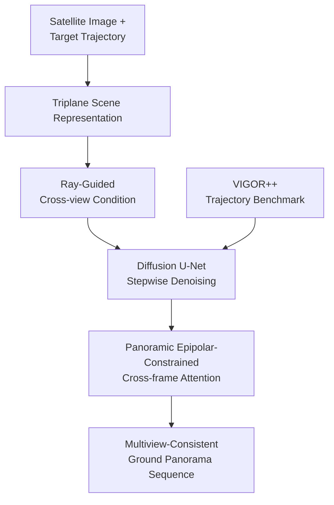

# SatDreamer360: Multiview-Consistent Generation of Ground-Level Scenes from Satellite Imagery

**Conference**: ICLR 2026  
**OpenReview**: [https://openreview.net/forum?id=wmQoigkqUt](https://openreview.net/forum?id=wmQoigkqUt)  
**Code**: To be released  
**Area**: Remote Sensing Cross-view Generation / Satellite-to-Ground Scene Generation  
**Keywords**: Satellite-to-ground generation, multiview consistency, panorama generation, triplane representation, epipolar-constrained attention  

## TL;DR
Starting from a single satellite image and predefined ground camera trajectories, SatDreamer360 utilizes triplane scene representations, ray-guided pixel attention, and panoramic epipolar-constrained temporal attention to generate geometrically aligned and cross-frame consistent 360° ground panorama sequences within a diffusion model, outperforming Sat2Density, ControlS2S, and EscherNet on the newly constructed VIGOR++ benchmark.

## Background & Motivation
**Background**: Satellite imagery provides vast coverage at a low acquisition cost. Consequently, many works aim to convert top-down views into street-level or ground panoramas for applications such as autonomous driving simulation, digital twin cities, 3D reconstruction, and data augmentation. Early methods often treated this as a one-to-one image translation task, using cGANs or geometric projections to synthesize single ground images from satellite views; recent diffusion models have further enhanced realism while allowing one satellite image to correspond to multiple possible ground appearances.

**Limitations of Prior Work**: Practical applications typically require continuous ground views along a road rather than just a single image. Most existing satellite-to-ground methods only optimize single-frame quality and lack cross-frame geometric constraints, which can lead to position jumps in roads, buildings, and trees between adjacent panoramas. Another category of methods relies on height maps, multi-angle satellite views, manual projections, or two-stage autoregressive pipelines. Such priors are either difficult to obtain at scale or propagate errors to subsequent frames.

**Key Challenge**: There is an extreme perspective gap between satellite images and ground panoramas. Satellite images capture road topology, rooftops, and scene layouts but cannot see facades, tree trunks, or roadside details. Ground panoramas require this occluded information, and the ground appearance corresponding to a single satellite image is inherently one-to-many. Relying solely on global conditions or standard cross-attention makes it difficult for a model to determine which spatial location in the satellite image a ground pixel should pull information from; using full-frame temporal attention to maintain consistency is computationally expensive and tends to introduce noise by mixing irrelevant pixels.

**Goal**: The authors aim to generate continuous 360° ground panorama sequences $G_i$ along a trajectory, given only a single satellite image and a set of 4-DoF ground camera poses $p_i=[t_i,\psi_i]$. This objective is decomposed into two sub-problems: first, how to maintain geometric alignment between each frame and the road/building layout in the satellite image; second, how to maintain consistency in structure, weather, lighting, and local details across different frames.

**Key Insight**: The observation in SatDreamer360 is that cross-view generation should not treat the satellite image merely as a conditional image but should transform it into a queryable 3D scene representation. Furthermore, multi-frame consistency should not use indiscriminate full-image attention; instead, it should leverage known relative camera poses to restrict attention to locations permitted by panoramic epipolar constraints. In this way, the diffusion model remains responsible for completing the one-to-many ground appearance, while the geometric relationships are constrained by an explicit structure.

**Core Idea**: Use a triplane representation to host the satellite scene, apply ray-guided pixel attention to associate each ground panoramic pixel with 3D spatial features, and use panoramic epipolar-constrained attention to pass consistent information between adjacent frames and the first frame, thereby expanding a single satellite image into a multiview-consistent ground panorama sequence.

## Method

### Overall Architecture
SatDreamer360 is built on a latent diffusion model. The input consists of a satellite image $S$ and a trajectory composed of multiple ground camera poses; the output is a set of ground 360° panoramas at those poses. During training, ground images are first encoded into latents via VQ-VAE, and the diffusion U-Net learns to predict noise $\epsilon$ given the condition $c=(S,p_i)$.

The overall method follows two geometric mainlines: one for the satellite-to-ground cross-view condition, which encodes the satellite image into triplane scene features and queries the triplane for each ground pixel along its panoramic ray; the other for inter-frame consistency, which performs cross-frame attention within U-Net layers according to panoramic epipolar constraints. The paper also constructs VIGOR++, an expansion of VIGOR into a large-scale evaluation set with trajectories and continuous street-view sequences.

The diffusion training objective remains the standard noise prediction: given ground latent $z_0$, condition $c$, diffusion step $t$, and noise $\epsilon$, the model optimizes $\|\epsilon-\epsilon_\theta(\sqrt{\bar{\alpha}_t}z_0+\sqrt{1-\bar{\alpha}_t}\epsilon,t,c)\|^2$. The novelty lies not in rewriting the diffusion objective, but in making the condition $c$ geometrically queryable and cross-frame constrainable.

### Key Designs
**1. Triplane Scene Representation: Converting a Single Satellite Image into a Queryable 3D Condition**

When satellite images are input directly into a diffusion model, the model can only rely on image-level or patch-level semantics, making it difficult to answer questions like "which road or building in the satellite image does this panoramic pixel correspond to?" SatDreamer360 adopts a triplane representation, using three orthogonal planes ($XY$, $XZ$, $YZ$) to represent the scene, where the $XY$ plane is parallel to the ground and naturally corresponds to the top-down satellite view. Features of any 3D point are obtained by projecting them onto the three planes and summing them: $F_{xyz}=F_{xy}\oplus F_{xz}\oplus F_{yz}$.

This design is more suitable for ground panoramas than pure BEV because ground perspectives observe vertical structures; an $XY$ plane alone cannot express facades and height-related information. It is also more lightweight than voxel representations, making it suitable for insertion into diffusion models. To ensure the three planes complement each other, the authors use Cross-view Hybrid Attention to exchange local 3D context between $XY$, $XZ$, and $YZ$. For example, points on the $XY$ plane refer to features from the $XZ$ and $YZ$ planes along the $Z$ direction. Thus, the top-down layout provided by the satellite image is expanded into an approximate but queryable spatial scene rather than a static conditional image.

**2. Ray-Guided Cross-view Conditioning: Allowing Each Panoramic Pixel to Fetch Information Along Its 3D Ray**

Standard cross-attention often performs soft matching between ground latent pixels and the entire satellite feature map, lacking real camera geometry. This easily leads to misalignments at road boundaries, building orientations, and complex corners. SatDreamer360 uses ray-based pixel attention: for a pixel at position $(u,v)$ in the panorama, it uses equirectangular projection to convert it into yaw and pitch: $\psi_{u,v}=(u-W/2)/W\times 2\pi$, $\theta_{u,v}=(H/2-v)/H\times \pi$, thereby obtaining a 3D ray in the camera coordinate system.

Along this ray, the model samples $K$ depth points uniformly, projects them into global 3D coordinates using the current camera pose, and queries the corresponding features in the triplane. The attention is not restricted to fixed samples: each head learns offsets $\Delta x_{k,j}$ and weights $A_{k,j}$ around the sampling points, resulting in the final conditional feature for that pixel: $F_g(u,v)=\sum_j W_j\sum_k A_{k,j}F(x_{u,v,k}+\Delta x_{k,j})$. This effectively transforms "inferring ground pixels from a satellite image" into "aggregating satellite scene clues along the possible spatial ray of this pixel," respecting camera poses while allowing the diffusion process to dynamically refine correspondences.

**3. Panorama Epipolar-Constrained Attention: Restricting Cross-frame Information Flow with Camera Poses**

Multiview consistency cannot rely solely on temporal modules from video diffusion because adjacent frames of a ground panorama are not standard video frames: the camera moves along a road with large viewpoint changes, and the projection is an equirectangular panorama. SatDreamer360 extends the epipolar constraints of pinhole images to panoramas. For pixel $g^m_{u,v}$ in frame $m$ and candidate pixel $g^n_{u',v'}$ in frame $n$, if they originate from the same spatial point, they must satisfy $(P^{-1}(g^n_{u',v'}))^\top \hat{t}_{mn}R_{mn}(P^{-1}(g^m_{u,v}))=0$, where $R_{mn}$ and $t_{mn}$ are the relative rotation and translation, and $P$ is the panoramic projection.

With this constraint, a query from frame $m$ does not need to perform full cross-attention with all pixels in frame $n$; it only needs to attend to candidate points falling near the panoramic epipolar curve. Complexity is reduced from $O(NHW\times NHW)$ to $O(NHW\times NM)$, where $M\ll HW$ is the number of sampled epipolar candidate points. Crucially, it reduces cross-frame mismatches: road edges do not randomly pull information from sky or building regions, making the structural continuity across adjacent frames more stable.

**4. Sparse Reference Frame Strategy and VIGOR++: Ensuring Evaluation and Scalability for Sequences**

To balance long-sequence consistency and computational cost, SatDreamer360 does not make every frame attend to all others. Instead, it uses a sparse reference strategy: each target frame only refers to the first frame and the previous frame of the sequence. The first frame serves as a global anchor to help maintain weather, lighting, and overall style; the previous frame provides local geometric continuity to prevent roads and buildings from drifting. While simple, this strategy fits the nature of street-view trajectories: correlations between distant frames are weak, and forcing dense interaction may introduce noise and memory pressure.

The paper also builds VIGOR++ to support this task. The original VIGOR primarily mapped satellite images to single ground views, making continuous generation un-evaluable. VIGOR++ expands satellite coverage from $70m\times70m$ to $160m\times160m$, adds cities like Atlanta, Bismarck, Kansas, Nashville, Orlando, and Phoenix, and extracts continuous panorama sequences within the same satellite region from Google Street View. Trajectories are formed via sky color histogram matching, image embedding similarity, connected graph search, and manual correction. This results in over 90,000 satellite-ground video pairs, with 84,055 for training and 7,443 for testing, most containing 7 to 16 frames.

### Loss & Training
Training proceeds in multiple stages. First, the model is fine-tuned for 300 epochs on a single-image generation task, focusing on making ray-guided cross-view conditioning learn to align satellite geometry with a single ground panorama. Subsequently, Epipolar-Constrained Temporal Attention is added, and the model is trained for another 300 epochs on continuous sequences, beginning with a 3-frame sequence warm-up before fine-tuning the entire model and eventually training on 5-frame sequences for long-sequence capability. Since the original autoencoder was designed for single images, the authors add a 3D convolution temporal module to the decoder and train it on VIGOR++ for 40 epochs to alleviate flickering in sequence decoding.

In the experimental setup, satellite input resolution is $256\times256$, and generated ground panoramas are $128\times512$. The model is fine-tuned based on Stable Diffusion 1.5, with $K=8$ ray sampling points, $M=4$ epipolar candidates, and 50-step DDIM inference. Training uses AdamW with a learning rate of $7.0\times10^{-5}$ on 4 NVIDIA L40 GPUs.

## Key Experimental Results

### Main Results
The paper compares continuous satellite-to-ground panorama sequence generation on VIGOR++, covering perceptual quality, semantic consistency, pixel similarity, and multiview stability. Numerically, SatDreamer360 achieves the best results across multiple metrics, including Depth, Palex, FID, DINO, FVD, and CLIPSIM, indicating that it does not sacrifice single-frame quality for temporal smoothness but rather improves both satellite alignment and cross-frame consistency.

| Method | Depth↓ | FID↓ | DINO↓ | SegAny↓ | SSIM↑ | FVD↓ | CLIPSIM↓ |
|------|--------|------|-------|---------|-------|------|----------|
| Sat2Den | 0.4584 | 133.6 | 4.437 | 0.3729 | 0.3892 | 8.405 | 7.671 |
| EscherNet | 0.5581 | 84.21 | 4.942 | 0.3845 | 0.2587 | 8.250 | 10.50 |
| ControlS2S | 0.4433 | 29.48 | 4.567 | 0.3753 | 0.3718 | 10.81 | 6.651 |
| Ours | 0.3955 | 27.41 | 4.156 | 0.3563 | 0.3964 | 6.820 | 5.623 |

For single satellite-to-ground panorama generation, the authors use CVUSA and VIGOR to isolate the effect of ray-guided conditioning. On VIGOR, SatDreamer360 shows improvements over ControlS2S in Depth, LRCE, FID, DINO, SegAny, SSIM, and PSNR, demonstrating that the triplane + ray attention benefits single-frame cross-view geometric alignment as well.

| Dataset | Method | Depth↓ | LRCE↓ | FID↓ | DINO↓ | SegAny↓ | SSIM↑ | PSNR↑ |
|--------|------|--------|-------|------|-------|---------|-------|-------|
| CVUSA | ControlS2S | 0.3192 | 0.4323 | 21.30 | 4.807 | 0.3612 | 0.3753 | 13.67 |
| CVUSA | Ours | 0.3146 | 0.4255 | 17.00 | 4.807 | 0.3602 | 0.3812 | 13.88 |
| VIGOR | ControlS2S | 0.2729 | 0.3770 | 28.01 | 4.335 | 0.3529 | 0.4228 | 13.80 |
| VIGOR | Ours | 0.2598 | 0.3469 | 21.36 | 4.287 | 0.3471 | 0.4385 | 14.08 |

### Ablation Study
Key ablations focus on the triplane, ray attention, epipolar attention, and sparse inter-frame strategies. Results show that pure BEV lacks vertical structure info, vanilla cross-attention lacks ray geometry, and full cross-attention is computationally expensive and noisy. Each of SatDreamer360's modules brings clear gains to these specific pain points.

| Configuration | Key Metrics | Description |
|------|----------|------|
| BEV Representation | VIGOR DINO 4.408, SSIM 0.4134, Depth 7.061 | Uses only $XY$ plane; lacks vertical structure. |
| Triplane Representation | VIGOR DINO 4.287, SSIM 0.4385, Depth 6.727 | Triplane retains more 3D structure with small memory increase. |
| Vanilla Condition | VIGOR DINO 5.425, SSIM 0.3174, Time 120.28s | Global cross-attention lacks geometric constraints; slow and misaligned. |
| Ray-guided condition | VIGOR DINO 4.287, SSIM 0.4385, Time 39.64s | Querying triplane along pixel rays ensures better geometric alignment. |
| w/o Epipolar-Att | VIGOR++ FVD 3.439, CLIPSIM 10.20, AUR(seq) 0.174 | Lacks explicit cross-frame geometry; weak sequence consistency. |
| Full Cross-Att | VIGOR++ FVD 2.150, CLIPSIM 7.516, AUR(seq) 1.136 | Cross-frame interaction exists but is costlier and contains irrelevant matches. |
| Epipolar-Att | VIGOR++ FVD 2.101, CLIPSIM 6.820, AUR(seq) 1.690 | Epipolar candidate filtering improves consistency and user preference. |

### Key Findings
- Ray attention is the primary source of single-frame cross-view quality. Compared to vanilla conditioning, Ray-Based Pixel Attention reduces DINO from 5.425 to 4.287 and improves SSIM from 0.3174 to 0.4385 on VIGOR, while reducing inference time from 120.28s to 39.64s. This indicates that geometric constraints both improve quality and reduce ineffective attention.
- Panoramic epipolar-constrained attention primarily addresses sequence continuity. Compared to versions without this module, Epipolar-Att reduces FVD from 3.439 to 2.101 and increases user sequence ranking AUR from 0.174 to 1.690, visually reducing structural drift across frames.
- Sparse reference frames are more suitable than dense reference frames for this task. For 30-frame generation, the dense strategy requires 120.75s and 40,520MB, whereas the sparse strategy requires only 32.71s and 35,142MB. Additionally, the sparse FVD (2.101) outperforms the dense FVD (2.253), showing that distant frames are not always beneficial.
- Trajectory length and sampling intervals still affect quality. Performance metrics like CLIPSIM and Depth degrade when trajectories exceed 60m or frame intervals exceed 10m, suggesting that training sequence length and data sampling density still limit long-distance continuous generation.

## Highlights & Insights
- The most ingenious aspect of SatDreamer360 is that it does not leave the "satellite condition" at the 2D image level but transforms it into a triplane before performing point-wise queries along ground pixel rays. This moves cross-view generation from semantic alignment toward geometric alignment, which is especially beneficial for space-sensitive scenes like road and building boundaries.
- Extending epipolar-constrained attention to panoramas is a natural yet critical adaptation. While epipolar geometry is common in indoor or pinhole multiview generation, this work adapts it for equirectangular panoramas to serve street-view sequences. It demonstrates that attention in generative models is not always "the more, the better"; using geometry to exclude impossible matches can stabilize the diffusion model.
- VIGOR++ itself is of significant value. Previously, satellite-to-ground generation was dominated by single-frame metrics that could not measure continuity along a trajectory. This dataset defines the task as satellite-to-ground video generation, providing a benchmark closer to simulation and digital twin requirements.
- Downstream cross-view localization experiments indicate that synthetic data is more than just "pretty." Using data augmented by SatDreamer360 to train G2SWeakly reduced the aligned error on VIGOR from 5.22 to 4.99 and unaligned error from 5.33 to 5.11, proving that geometrically consistent generated samples provide transferable training signals.

## Limitations & Future Work
- Generated content is still primarily focused on static scenes. The paper explicitly notes that the model does not handle dynamic objects like vehicles or pedestrians, so generated sequences may lack the dynamic behaviors of real traffic environments. Future work should combine controllable dynamic object modeling for autonomous driving simulation.
- VIGOR++ relies on Google Maps and road network coverage. Although testing includes different regions, it remains biased toward urban roads accessible by street-view vehicles. Narrow alleys, non-road areas, off-road scenes, or regions with weak coverage may experience poor generalization; the paper's failure cases mention erroneous results in narrow lanes.
- Long trajectory generation is still constrained by training and memory. Experiments show quality degradation for trajectories over 60m, as the authors can only train on a limited number of frames. Future improvements could include more efficient memory mechanisms, block-wise consistency constraints, or incremental scene representation updates.
- While the method does not require height maps, the triplane is still an implicit structure inferred from a single top-down view and cannot truly recover occluded facade details. For safety-critical applications, generated results should be viewed as synthetic priors or simulation materials rather than reliable street-view replacements.
- Generative satellite-to-ground models pose risks of misuse. The broader impact section warns that such systems could be used to create misleading visual content, necessitating watermarking, usage licensing, and synthetic content disclosure mechanisms in practical deployments.

## Related Work & Insights
- **vs Sat2Density**: Sat2Density uses density or NeRF-style representations for satellite-to-ground generation, leaning more toward single-frame cross-view reconstruction. SatDreamer360 targets continuous panorama sequences, using triplanes and epipolar attention to handle both single-frame geometric alignment and cross-frame consistency, significantly outperforming Sat2Density on VIGOR++.
- **vs ControlS2S**: ControlS2S is another diffusion-based satellite-to-street-view method focusing on controllable single-frame generation and pose alignment. This work inherits the realism of diffusion models but replaces coarse conditional injection with ray-based pixel attention and adds panoramic epipolar temporal attention, thus being more stable in both single-frame and sequence metrics.
- **vs EscherNet**: EscherNet is a general multiview diffusion model suitable for view synthesis given reference views and relative poses. However, satellite views are near-orthographic and ground panoramas have extreme perspective differences; the standard reference view assumption is insufficient. SatDreamer360 designs triplane spatial representations and ray queries specifically for the satellite-ground domain gap.
- **vs StreetScape / Sat2GroundScape**: These methods are closer to continuous street-view generation but may require height maps, multi-view satellite images, or two-stage pipelines. SatDreamer360 has lighter input requirements (single satellite image + trajectory), lowering the deployment threshold, though occluded structures are inferred by the model.
- **Insight**: For tasks like remote sensing-to-ground, BEV-to-onboard camera, or map-to-simulation video, this approach can be summarized as: "3D-ize the structural condition, execute cross-view queries along rays, and filter cross-frame propagation with geometric constraints." This is more targeted than simply adding a larger diffusion backbone and provides better interpretability for why a generation succeeds or fails.

## Rating
- Novelty: ⭐⭐⭐⭐⭐ Combining triplane ray conditions and panoramic epipolar attention for continuous ground panorama generation from a single satellite image is a complete and well-modeled task definition.
- Experimental Thoroughness: ⭐⭐⭐⭐⭐ Main experiments cover VIGOR++ sequence generation, CVUSA/VIGOR single-frame generation, module ablations, hyperparameters, long trajectories, random seeds, user studies, and downstream localization enhancement.
- Writing Quality: ⭐⭐⭐⭐ Motivations are clear, and figures/formulas support understanding. Some metric naming and table orientations require careful verification, and there are minor spelling/layout issues.
- Value: ⭐⭐⭐⭐⭐ Directly valuable for remote sensing generation, urban digital twins, autonomous driving simulation, and cross-view localization; VIGOR++ and the geometric-constrained attention provide reusable baselines for future work.

<!-- RELATED:START -->

## Related Papers

- [\[CVPR 2026\] WRIVINDER: Towards Spatial Intelligence for Geo-locating Ground Images onto Satellite Imagery](../../CVPR2026/remote_sensing/wrivinder_towards_spatial_intelligence_for_geo-locating_ground_images_onto_satel.md)
- [\[ICLR 2026\] Object Fidelity Diffusion for Remote Sensing Image Generation](object_fidelity_diffusion_for_remote_sensing_image_generation.md)
- [\[CVPR 2026\] Spectrally Distilled Representations Aligned with Instruction-Augmented LLMs for Satellite Imagery](../../CVPR2026/remote_sensing/spectrally_distilled_representations_aligned_with_instruction-augmented_llms_for.md)
- [\[CVPR 2026\] ACPV-Net: All-Class Polygonal Vectorization for Seamless Vector Map Generation from Aerial Imagery](../../CVPR2026/remote_sensing/acpv-net_all-class_polygonal_vectorization_for_seamless_vector_map_generation_fr.md)
- [\[ICLR 2026\] TAMMs: Change Understanding and Forecasting in Satellite Image Time Series with Temporal-Aware Multimodal Models](tamms_change_understanding_and_forecasting_in_satellite_image_time_series_with_t.md)

<!-- RELATED:END -->
