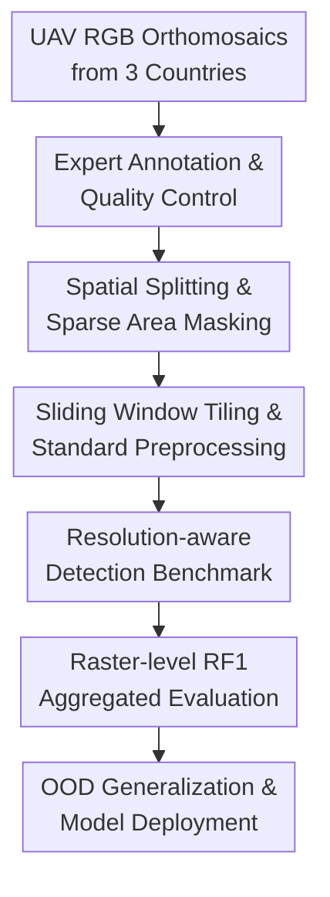

# SelvaBox: A high-resolution dataset for tropical tree crown detection

**Conference**: ICLR2026  
**OpenReview**: [https://openreview.net/forum?id=GH7z1RURL6](https://openreview.net/forum?id=GH7z1RURL6)  
**Code**: https://github.com/hugobaudchon/CanopyRS; https://github.com/hugobaudchon/geodataset  
**Area**: Remote Sensing / Tropical Forest Tree Crown Detection Dataset  
**Keywords**: Tropical Forest, Tree Crown Detection, UAV Remote Sensing, Multi-resolution Training, Raster-level F1  

## TL;DR
SelvaBox constructs the largest open-access high-resolution UAV RGB tree crown detection dataset for tropical forests. Using a unified multi-resolution detection benchmark, it demonstrates that high-resolution inputs, DINO-Swin detectors, and cross-dataset training significantly improve in-distribution and zero-shot generalization for tropical tree crown detection.

## Background & Motivation
**Background**: In tropical forest monitoring, the position and size of individual tree crowns are critical entry points for estimating biomass, carbon stocks, mortality, and forest structural changes. While traditional ground surveys are precise, they are time-consuming, expensive, and dangerous in tropical forests. Satellite remote sensing offers large coverage but typically provides only 0.3 to 0.5-meter resolution, making it difficult to distinguish individual tree crowns in dense, overlapping, and cloud-prone tropical canopies. UAV RGB imagery can achieve centimeter-level Ground Sampling Distance (GSD), making it a more realistic high-resolution source for tropical tree crown detection.

**Limitations of Prior Work**: The issue is not just the lack of powerful models, but the scarcity of open data and evaluations that align poorly with real-world applications. Most existing tree crown datasets originate from temperate forests, urban trees, or plantations, with very few annotations covering natural tropical forests. For example, tropical annotations in Detectree2 and BCI50ha are only in the thousands. Tropical forests feature high species diversity, large variations in crown size, and significant overlapping—characteristics that are difficult to extrapolate from temperate data. Furthermore, many papers report mAP or mAR only on image tiles, whereas ecological monitoring requires crown maps on full orthomosaics. Tile boundary truncation, duplicate detections from sliding windows, and NMS post-processing all impact the final tree count.

**Key Challenge**: Tropical tree crown detection requires both "sufficient spatial detail" and "realistic evaluation." If the resolution is too low, small crowns and adjacent layers blur together. If training or evaluation is restricted to small tiles, models become prone to distortions regarding edge crowns, giant crowns, and redundant predictions. More troublesome is the resolution domain shift caused by differences in UAVs, flight altitudes, cameras, and datasets, leading to significant performance drops when a model trained on one dataset is applied to a different region or acquisition setup.

**Goal**: The authors aim to bridge the gaps in both data and benchmarking. First, by releasing a large-scale, open dataset for tropical tree crown detection covering multiple countries, forest types, and UAV acquisition conditions. Second, by establishing a standardized benchmark from raster tiling and training to prediction aggregation and raster-level metrics. Third, by systematically answering how model architecture, input resolution, spatial extent, and multi-resolution training affect tree crown detection. Fourth, by testing whether models trained solely on SelvaBox or combined with other public datasets can generalize to unseen tropical and non-tropical datasets.

**Key Insight**: The observation is straightforward: the scarcity of tropical forest datasets has limited model research itself, and simply switching detectors cannot solve the lack of data distribution or evaluation misalignment. Therefore, the authors do not package their contribution as a complex new model, but focus on "high-quality large-scale annotations + resolution-aware training/evaluation workflows + reproducible utility toolchains." This perspective is valuable because ecological remote sensing ultimately requires deployment-ready, transferable detection systems that work on full forest imagery.

**Core Idea**: By using a high-resolution UAV RGB dataset covering 3 Neotropical countries with over 83,000 expert-annotated crown boxes, combined with raster-level RF1 evaluation and multi-resolution training, this work moves tropical tree crown detection from small-scale tile benchmarks toward a unified baseline closer to real-world forest monitoring.

## Method

### Overall Architecture
The methodology follows a remote sensing benchmark pipeline: "dataset construction + standardized training/evaluation + generalization verification." The inputs are high-resolution UAV RGB orthomosaics from Brazil, Ecuador, and Panama. The process involves expert annotation, spatial splitting, AOI masking, sliding window tiling, multi-resolution training, and raster-level aggregated evaluation. The outputs include the SelvaBox dataset, a set of tree crown detection models, the geodataset preprocessing library, the CanopyRS training/inference/benchmark code, and systematic conclusions on generalization.

Specifically, SelvaBox starts with 14 RGB orthomosaics covering 96.6 ha in Brazil, 96 ha in Panama, and 318.1 ha in Ecuador, with GSD ranging from 1.2 to 5.1 cm/px. Five trained biology experts used ArcGIS Pro to draw bounding boxes for reliably identifiable individual crowns, resulting in 83,137 manual boxes after multiple rounds of scanning quality control. The authors then defined train/valid/test AOIs in raster space to prevent spatial overlap and avoid artificially high performance due to geospatial autocorrelation.

On the model side, instead of proposing a new network, the paper compares Faster R-CNN, DeepForest, Detectree2, and DINO detectors under a unified pipeline. It examines the relationships between CNN vs. Transformer, ResNet-50 vs. Swin-L backbones, 40m/80m tile extents, and 4.5/6/10 cm GSD with input pixel sizes. Finally, tile predictions are mapped back to original raster coordinates for confidence filtering and NMS, using RF175 to measure F1 on the entire raster rather than COCO-style mAP on single tiles.

### Key Designs
**1. Large-scale tropical tree crown annotations: Filling the data distribution gap to a learnable scale**

The core value of SelvaBox stems from its data coverage. The paper collects 14 high-resolution UAV RGB orthomosaics across locations such as ZF-2 in the Central Amazon (Brazil), Tiputini Biodiversity Station in the Yasuní Biosphere Reserve (Ecuador), and native species plantations and secondary forests in Agua Salud (Panama). This is not just a simple expansion of sample size; it deliberately includes different soils, climates, species diversities, forest types, and UAV conditions in a single benchmark.

The annotation process is also critical. Experts invested 1,284 person-hours to annotate 83,137 boxes, with diameters spanning <2m to >50m. The paper emphasizes that ground validation in tropical forests is limited by GNSS occlusion, multipath errors, non-vertical trunks, dense vegetation, and weather risks. While LiDAR helps, its cost and professional threshold are high. Thus, the authors chose RGB photo-interpretation with 60m × 60m grid checks, multiple review rounds, and DSM assistance to distinguish adjacent crowns—a data production plan better suited for community expansion.

**2. Spatial splitting and sparse annotation masking: Avoiding geographical leakage and label noise**

A common artifact in remote sensing is that training and test sets come from the same continuous area after random tiling, meaning the model sees highly similar neighboring pixels. SelvaBox uses manual AOIs in raster space to define splits, ensuring no pixel overlap and selecting test AOIs in regions with better reconstruction quality and denser annotations. This spatial separation is closer to real-world extrapolation than random splits.

To handle sparse annotation areas, the authors acknowledge regions in Brazil and Ecuador that are difficult to distinguish or incompletely labeled. Treating these as negative samples would wrongly punish detectors for predicting real but unannotated crowns. SelvaBox creates "holes" in the AOIs to mask these pixels; during tiling, the model does not need to learn "there are no trees here." This is more refined than Detectree2’s approach of only keeping tiles above a certain crown coverage threshold.

**3. Resolution-aware detection benchmark: Decoupling GSD, ground extent, and input size**

The benchmark goes beyond "running a few detectors." The authors designed experiments to decouple resolution and extent: standard tiles are 80m × 80m (1777 × 1777 px at 4.5 cm/px), allowing large crowns (>50m) to appear fully in 75%-overlap sliding windows. They also tested 40m × 40m tiles. Fixed ground extent experiments compared 4.5, 6, and 10 cm/px, while fixed GSD experiments compared different input pixel sizes to distinguish the roles of "spatial detail" versus "network input size."

Experiments show that DINO series outperform Faster R-CNN, and Swin-L backbones significantly exceed ResNet-50. Lower GSD (higher spatial resolution) generally leads to better mAP, mAR, and RF175. This suggests that for tropical crowns, resolution is not a negligible engineering detail but determine whether small or overlapping crowns remain distinguishable.

**4. Raster-level RF175 and multi-resolution training: Aligning evaluation with forest mapping**

Traditional COCO-style mAP is calculated on tiles, which is suitable for general object detection but not for large remote sensing rasters. The final product of crown detection is a forest crown map. RF175 aggregates all tile predictions back to raster coordinates, filters edge predictions, tunes NMS IoU threshold $\tau_{nms}$ and minimum score $s_{min}$ on a validation set, and calculates F1 with a strict $IoU \ge 0.75$ greedy matching. It uses the form $F1 = 2PR/(P+R)$, where $P = TP/(TP+FP)$ and $R = TP/(TP+FN)$.

Multi-resolution training addresses GSD inconsistency across datasets. The paper uses random cropping and resizing for domain augmentation. For instance, in a [30, 120]m configuration, different ground extents are randomly cropped from large tiles and resized to [1024, 1777] pixels. Cropping changes the ground extent, while resizing changes the effective GSD. Such a model experiences different spatial scales and resolutions during training, eliminating the need for single-GSD training.

### Loss & Training
The training strategy relies on standard detector losses. Faster R-CNN uses ResNet-50, and DINO uses ResNet-50 or Swin-L-384. All models are initialized with COCO weights and use augmentations like cropping, resizing, flipping, rotation, and color jittering.

In single-resolution experiments, models are trained with fixed extents and GSD. In multi-resolution experiments, DINO 5-scale Swin-L uses random crop ranges (e.g., [36, 88]m, [30, 100]m, [30, 120]m) resized to [1024, 1777] pixels. Optimization uses AdamW with CosineLR and 5000-step warmup. Inference involves a grid search for $\tau_{nms}$ and $s_{min}$ on the validation set.

## Key Experimental Results

### Main Results
In-distribution experiments compared models, GSD, and extent. DINO 5-scale Swin-L at 4.5 cm/px achieved the highest RF175 on 80m × 80m rasters.

| Setup | Model | GSD / Input | mAP50:95 | mAR50:95 | RF175 |
|------|------|------------|----------|----------|-------|
| SelvaBox 80m | Faster R-CNN ResNet50 | 4.5 cm / 1777 px | 28.74 | 41.27 | 37.52 |
| SelvaBox 80m | DINO 4-scale ResNet50 | 6 cm / 1777 px | 33.62 | 50.85 | 44.18 |
| SelvaBox 80m | DINO 5-scale Swin-L | 10 cm / 1333 px | 34.22 | 50.76 | 45.64 |
| SelvaBox 80m | DINO 5-scale Swin-L | 6 cm / 1333 px | 37.12 | 53.56 | 47.81 |
| SelvaBox 80m | DINO 5-scale Swin-L | 4.5 cm / 1777 px | 37.79 | 54.66 | 49.38 |

OOD experiments highlight SelvaBox's value. Existing methods like DeepForest reached only 6.08 RF175 on SelvaBox zero-shot, whereas a SelvaBox-only DINO-Swin-L model achieved 41.91 RF175 on BCI50ha, outperforming Detectree2.

| Eval Dataset | Method / Training Set | OOD? | mAP50:95 | mAR50:95 | RF175 |
|------------|---------------|----------|----------|----------|-------|
| SelvaBox | Detectree2-resize / D | Yes | 8.62 | 15.47 | 13.14 |
| SelvaBox | DeepForest / N | Yes | 4.70 | 9.08 | 6.08 |
| SelvaBox | DINO-Swin-L / S | No | 37.77 | 54.69 | 48.60 |
| BCI50ha | Detectree2-resize / D | Yes | 32.11 | 48.18 | 34.97 |
| BCI50ha | DINO-Swin-L / S | Yes | 36.87 | 60.30 | 41.91 |

### Ablation Study
Multi-resolution training shows minimal loss in in-distribution performance while allowing a single model to cover multiple GSDs. A [30, 120]m crop range keeps performance stable across 10, 6, and 4.5 cm/px.

| Configuration | Test GSD | mAP50:95 | mAR50:95 | RF175 | Note |
|------|----------|----------|----------|-------|------|
| Single Res 80m | 6 cm | 37.12 | 53.56 | 47.81 | Strong baseline |
| Multi Res [36, 88]m | 4.5 cm | 38.19 | 54.90 | 49.16 | No loss in high-res |
| Multi Res [30, 120]m | 4.5 cm | 37.77 | 54.69 | 48.60 | Used for OOD |

### Key Findings
- **High resolution is essential**: Performance improves significantly from 10 cm to 4.5 cm, suggesting tropical crowns cannot be simply downsampled.
- **Transformers are superior**: DINO outperforms Faster R-CNN, particularly with Swin-L backbones in multi-scale and complex texture scenarios.
- **SelvaBox exposes OOD weaknesses**: Existing models fail on SelvaBox zero-shot, while SelvaBox-trained models generalize well to BCI50ha.
- **RF175 aligns with ecological needs**: By aggregating tile predictions, it accounts for boundary issues and counting errors neglected by tile mAP.

## Highlights & Insights
- **Dataset as an executable benchmark**: SelvaBox releases not just images, but a complete engineering loop including preprocessed external data and RF175 evaluation.
- **Emphasis on raster-level evaluation**: RF175 captures realistic errors like boundary duplicate boxes and counting discrepancies that occur in actual forest mapping.
- **Multi-resolution training as a practical trick**: Random crop + resize corresponds directly to variations in ground extent and GSD, a strategy transferable to other remote sensing tasks.
- **Distributional coverage as model capability**: The high heterogeneity of SelvaBox annotations provides better training value than simply tuning models on older, smaller datasets.

## Limitations & Future Work
- SelvaBox remains a bounding box dataset rather than instance segmentation. Boxes only provide approximate positions for biomass estimation.
- While covering three Neotropical countries, other types like African or Southeast Asian tropical forests remain.
- RGB interpretation has subjective limitations in intertwined canopies without LiDAR or ground-truth verification.
- Inference depends on NMS and score thresholds tuned on validation sets; adaptive strategies would improve deployment to unseen regions.
- The computational cost of DINO-Swin-L with large inputs is high for resource-constrained ecological teams.

## Related Work & Insights
- **vs. DeepForest**: SelvaBox shows that DeepForest's pre-trained weights perform poorly on tropical OOD data, though the architecture remains viable if re-trained on SelvaBox.
- **vs. Detectree2**: SelvaBox offers an order of magnitude more data and better spatial splitting, whereas Detectree2 may have interpretability limits due to potential train-test split issues.
- **vs. NeonTreeEvaluation / QuebecTrees**: These temperate datasets provide baselines but lack the long-tail crown sizes and complex occlusion found in the tropics.

## Rating
- Novelty: ⭐⭐⭐⭐ The combination of the dataset and RF175 benchmark is valuable.
- Experimental Thoroughness: ⭐⭐⭐⭐⭐ Comprehensive coverage of models, resolutions, and OOD scenarios.
- Writing Quality: ⭐⭐⭐⭐ Clear structure with intensive data density.
- Value: ⭐⭐⭐⭐⭐ High impact for tropical remote sensing and ecological monitoring.

<!-- RELATED:START -->

## Related Papers

- [\[CVPR 2026\] YieldSAT: A Multimodal Benchmark Dataset for High-Resolution Crop Yield Prediction](../../CVPR2026/remote_sensing/yieldsat_a_multimodal_benchmark_dataset_for_high-resolution_crop_yield_predictio.md)
- [\[ICML 2026\] Localized, High-resolution Geographic Representations with Slepian Functions](../../ICML2026/remote_sensing/localized_high-resolution_geographic_representations_with_slepian_functions.md)
- [\[CVPR 2026\] ZoomEarth: Active Perception for Ultra-High-Resolution Geospatial Vision-Language Tasks](../../CVPR2026/remote_sensing/zoomearth_active_perception_for_ultra-high-resolution_geospatial_vision-language.md)
- [\[NeurIPS 2025\] Cloud4D: Estimating Cloud Properties at a High Spatial and Temporal Resolution](../../NeurIPS2025/remote_sensing/cloud4d_estimating_cloud_properties_at_a_high_spatial_and_temporal_resolution.md)
- [\[ICML 2025\] High-Resolution Live Fuel Moisture Content (LFMC) Maps for Wildfire Risk from Multimodal Earth Observation Data](../../ICML2025/remote_sensing/high-resolution_live_fuel_moisture_content_lfmc_maps_for_wildfire_risk_from_mult.md)

<!-- RELATED:END -->
