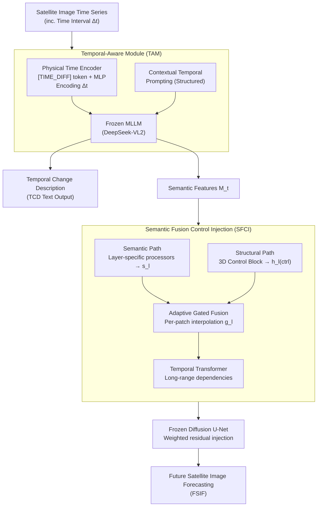

# TAMMs: Change Understanding and Forecasting in Satellite Image Time Series with Temporal-Aware Multimodal Models

**Conference**: ICLR 2026  
**arXiv**: [2506.18862](https://arxiv.org/abs/2506.18862)  
**Code**: None  
**Area**: Remote Sensing  
**Keywords**: Satellite Image Time Series, Change Description, Future Forecasting, Multimodal Large Language Models (MLLM), Diffusion Models

## TL;DR

The authors propose TAMMs—the first unified framework to jointly execute Temporal Change Description (TCD) and Future Satellite Image Forecasting (FSIF) in a single MLLM-Diffusion architecture. It awakens the temporal reasoning capabilities of a frozen MLLM through a Temporal-Aware Module (TAM) and translates change understanding into generative control signals via a Semantic Fusion Control Injection (SFCI) mechanism.

## Background & Motivation

1. Temporal Change Description (TCD) and Future Satellite Image Forecasting (FSIF) of Satellite Image Time Series (SITS) are two core tasks that have historically been fragmented; both are limited by insufficient long-range temporal dynamic modeling.
2. Existing TCD methods (e.g., SITSCC) fuse multi-temporal information through simple interactions, offering limited long-range reasoning. Existing FSIF methods (e.g., DiffusionSat) primarily rely on metadata conditioning and lack high-level semantic understanding of changes.
3. While MLLMs excel in vision-language tasks, their video understanding capabilities are optimized for densely sampled, short-interval sequences and do not directly adapt to sparse SITS intervals spanning years.
4. Control signals for diffusion models (e.g., edge maps or metadata) are typically low-level and lack guidance from high-level semantic narratives of temporal evolution.
5. Existing evaluation metrics (PSNR, SSIM) exhibit an "evaluation gap"—they fail to penalize temporally implausible predictions; a perceptually realistic prediction inconsistent with historical trends can still receive high scores.
6. Core Hypothesis: Empowering MLLMs with a deep understanding of historical dynamics can lead to more consistent future predictions—achieving a synergistic gain between understanding and generation.

## Method

### Overall Architecture

TAMMs aims to simultaneously address two historically separated tasks within a single framework: understanding "what has changed over the past years" in SITS (TCD) and drawing "what will happen next" based on that understanding (FSIF). It links these through two collaborative stages: first, the Temporal Change Understanding stage, where a Temporal-Aware Module (TAM) awakens the temporal reasoning of a frozen MLLM to output text descriptions and semantic feature vectors $\mathbf{M}_t$; second, the Future Forecasting stage, where a Semantic Fusion Control Injection (SFCI) mechanism translates $\mathbf{M}_t$ into multi-scale control signals to guide a frozen diffusion U-Net in denoising and generating future images. The interpreted "change narrative" is fed directly into generation, ensuring predictions are not only visually realistic but also consistent with historical trends. The backbone uses a frozen DeepSeek-VL2 for MLLM and a frozen DiffusionSat (Stable Diffusion 2.1) for generation, training only lightweight adapters.

### Key Designs

**1. Temporal-Aware Module (TAM): Enabling Frozen MLLMs to Understand "Sparse" Trans-annual Intervals**

MLLM video understanding is optimized for short, dense intervals. Feeding it satellite sequences spanning years causes the attention mechanism to fail in mapping visual changes to actual time spans. TAM addresses this with two lightweight components. First, the Physical Time Encoder (PTE) introduces a learnable `[TIME_DIFF]` token, where an MLP dynamically conditions it on specific time intervals $\Delta t_i$. This is inserted between visual features of adjacent frames—allowing the MLLM attention to bind "land change" directly with "a three-year gap" rather than treating frames as equidistant snapshots. Second, Contextual Temporal Prompting (CTP) provides detailed scene context via structured prompts, focusing the MLLM’s general reasoning onto the specific task of describing sequence dynamics. Together, these "awaken" latent temporal reasoning capabilities without fine-tuning the base MLLM.

**2. Semantic Fusion Control Injection (SFCI): Translating "Understanding" into Fine-grained Generative Controls**

Textual descriptions alone are insufficient—coarse-grained text control like standard ControlNet cannot transfer the MLLM’s multi-image temporal understanding to the generation side. SFCI operates in parallel with the frozen diffusion U-Net via an Enhanced Control Module (ECM), injecting semantics through four steps. The structural path uses frozen 3D Control Blocks to process U-Net encoder features, obtaining structural signals $\mathbf{h}_l^{(ctrl)}$ of visual dynamics. The semantic path projects MLLM outputs $\mathbf{M}_t$ through layer-specific processors into spatially-aware guidance $\mathbf{s}_l$. The critical step is Adaptive Gated Fusion, where a dynamic gate $\mathbf{g}_l$ interpolates between signals per position:

$$\mathbf{f}_l = (1-\mathbf{g}_l) \odot \mathbf{h}_l^{(ctrl)} + \mathbf{g}_l \odot \mathbf{s}_l$$

This allows the model to decide whether to follow "structure" or "semantics" for each patch. Finally, a temporal Transformer models long-range dependencies, integrating results into the U-Net via weighted residual connections. This path translates high-level change understanding into patch-level control, bypassing the text bottleneck.

**3. Temporal Consistency Score (TCS): Closing the "Evaluation Gap" Unreachable by PSNR/SSIM**

PSNR and SSIM focus on pixel and perceptual realism, often rewarding predictions that are visually sharp but contradict historical trends. TCS specifically quantifies "whether predicted changes align with historical dynamics," computed as the product of two sub-scores:

$$\text{TCS} = \text{SPS} \cdot \text{ACS}$$

Where SPS (Spatial Proximity Score) measures if the centroid of change aligns, and ACS (Area Consistency Score) measures if the magnitude of change matches. Both are based on binary change detection; the product ensures that a mismatch in either location or magnitude results in a penalty. Higher scores indicate predictions that strictly follow the historical evolution trajectory.

### Loss & Training

- Two-stage training: First train the structural path to learn basic spatiotemporal priors, then freeze it to train semantic components.
- Understanding stage: Composite loss $\mathcal{L} = \lambda_{\text{text}} \mathcal{L}_{\text{text}} + \lambda_{\text{temp}} \mathcal{L}_{\text{temp}}$, balancing text accuracy with temporal regularization.
- Generation stage: Standard diffusion loss.
- Only lightweight adapter components are trained; the MLLM and U-Net remain frozen.

## Key Experimental Results

### Main Results

**Temporal Change Description (TCD)**:

| Model | BLEU-4 | METEOR | ROUGE-L | CIDEr-D |
|-------|--------|--------|---------|---------|
| RSICC-Former | 0.1285 | 0.1930 | 0.3489 | 0.5344 |
| SITSCC | 0.2122 | 0.2961 | 0.4701 | 0.6244 |
| TEOChat | 0.2398 | 0.3102 | 0.4735 | 0.8267 |
| **Ours (TAMMs)** | **0.2669** | **0.3312** | **0.4690** | **0.9030** |

**Future Satellite Image Forecasting (FSIF)**:

| Model | PSNR↑ | SSIM↑ | LPIPS↓ | TCS↑ |
|-------|-------|-------|--------|------|
| DiffusionSat | 11.89 | 0.1520 | 0.5225 | 0.7624 |
| MCVD | 9.22 | 0.2098 | 0.4970 | 0.1930 |
| **Ours (TAMMs)** | **12.07** | 0.1831 | **0.4931** | **0.9690** |

### Ablation Study

| Config | BLEU-4 | CIDEr-D | TCS |
|--------|--------|---------|-----|
| SFT only | 0.2134 | 0.7523 | 0.6842 |
| w/o PTE | 0.2387 | 0.8234 | 0.7456 |
| w/o CTP | 0.2445 | 0.8567 | 0.8234 |
| w/o Semantic Fusion | - | - | 0.7911 |
| w/o Text Guidance | - | - | 0.9410 |
| Base Control Block | - | - | 0.7624 |
| **TAMMs (Full)** | **0.2669** | **0.9030** | **0.9690** |

### Key Findings

1. **Significant Advantage in TCS**: TAMMs achieves a TCS of 0.9690, far exceeding DiffusionSat (0.7624) and GeoSynth-Canny (0.2170), proving that its generated future images are more consistent with historical evolution tracks.
2. **Semantic Fusion is Critical**: Removing semantic feature fusion results in an 18% drop in TCS (0.9690 → 0.7911), validating the hypothesis that injecting deep semantic reasoning directly into the generative control path is essential.
3. **PTE Contributes Most to Temporal Understanding**: Removing PTE leads to a 23% drop in TCS, highlighting that explicit time interval encoding is the key to awakening temporal reasoning in MLLMs.

## Highlights & Insights

1. The framework represents the first attempt to unify temporal change understanding and future forecasting, featuring a novel bidirectional design where understanding guides generation and generation validates understanding.
2. The TCS metric fills a significant gap in spatio-temporal forecasting evaluation—standard quality metrics cannot differentiate temporal consistency, whereas TCS quantifies it through spatial proximity and area consistency.
3. The TAM design is elegant—it "awakens" the latent reasoning potential of a frozen MLLM in a parameter-efficient manner, avoiding the high costs of full-model fine-tuning.
4. SFCI bypasses the coarse-grained text control bottleneck by directly converting MLLM's multi-image temporal understanding into patch-level control signals.

## Limitations & Future Work

1. Training labels were automatically generated by Qwen2.5-VL (37K sequences), which may introduce systematic biases; the test set is relatively small (150 sequences).
2. Regarding SSIM, MCVD (0.2098) outperformed TAMMs (0.1831), indicating a possible trade-off between standard perceptual quality and temporal consistency.
3. The TCS metric relies on binary change detection and may have a limited capacity to capture gradual changes, such as slow vegetation degradation.
4. Forecasting scenarios for very long-term transitions (>10 years) or sudden catastrophic events have not yet been explored.

## Related Work & Insights

- **DiffusionSat**: Foundation model for satellite image generation based on metadata conditioning but lacks semantic guidance.
- **SITSCC**: A multi-temporal change description method lacking the deep semantic reasoning of MLLMs.
- **TEOChat**: A temporal MLLM for Earth Observation, but limited to description tasks without generative capabilities.
- **ControlNet**: Uses only text/scaffold control for diffusion generation, providing insufficient patch-level guidance for temporal forecasting.
- Insight: The unification of understanding and generation is a vital direction for remote sensing spatio-temporal analysis. The "awakening" strategy used in TAM can be generalized to other foundation models lacking temporal awareness.

## Rating

- ⭐ Novelty: 4.5/5 — First unified TCD+FSIF framework; innovations in TCS, TAM, and SFCI.
- ⭐ Experimental Thoroughness: 4/5 — Comprehensive ablation and qualitative analysis, though the test set is small (150 sequences).
- ⭐ Writing Quality: 4/5 — Problem-driven approach with clear "How" questions guiding the design.
- ⭐ Value: 4/5 — Establishes a new paradigm of understanding-driven generation for remote sensing analysis.

<!-- RELATED:START -->

## Related Papers

- [\[ICML 2025\] Resampling Augmentation for Time Series Contrastive Learning: Application to Remote Sensing](../../ICML2025/remote_sensing/resampling_augmentation_for_time_series_contrastive_learning_application_to_remo.md)
- [\[CVPR 2026\] Sparsely Timing the Change: A Spiking Temporal Framework for Remote Sensing Interpretation](../../CVPR2026/remote_sensing/sparsely_timing_the_change_a_spiking_temporal_framework_for_remote_sensing_inter.md)
- [\[CVPR 2026\] UniChange: Unifying Change Detection with Multimodal Large Language Model](../../CVPR2026/remote_sensing/unichange_unifying_change_detection_with_multimodal_large_language_model.md)
- [\[NeurIPS 2025\] EcoCast: A Spatio-Temporal Model for Continual Biodiversity and Climate Risk Forecasting](../../NeurIPS2025/remote_sensing/ecocast_a_spatio-temporal_model_for_continual_biodiversity_and_climate_risk_fore.md)
- [\[CVPR 2026\] ChangeBridge: Spatiotemporal Image Generation with Multimodal Controls for Remote Sensing](../../CVPR2026/remote_sensing/changebridge_spatiotemporal_image_generation_with_multimodal_controls_for_remote.md)

<!-- RELATED:END -->
