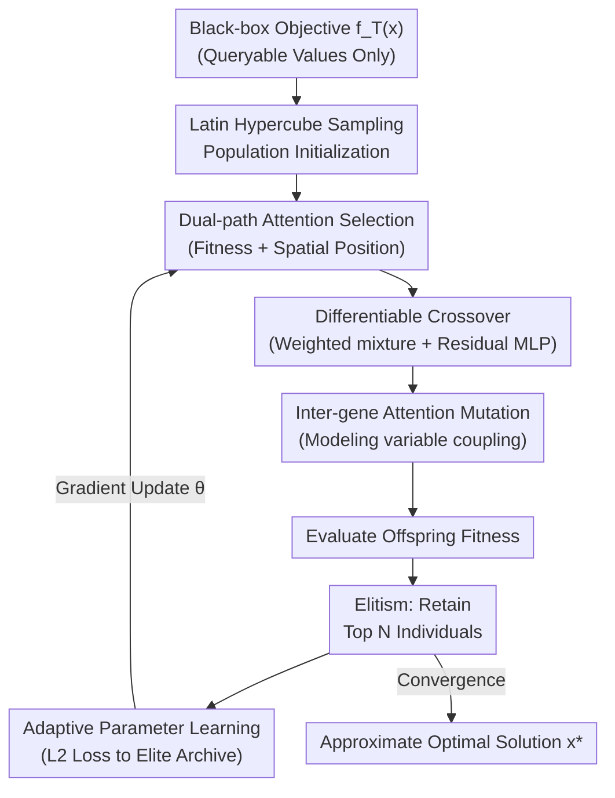

# Task-free Adaptive Meta Black-box Optimization

**Conference**: ICLR 2026 Oral  
**arXiv**: [2601.21475](https://arxiv.org/abs/2601.21475)  
**Code**: None  
**Area**: Remote Sensing  
**Keywords**: Black-box Optimization, Meta-learning, Evolutionary Algorithms, Adaptive Parameter Learning, Zero-shot Optimization  

## TL;DR
This paper proposes ABOM, a task-free adaptive meta black-box optimizer that parameterizes evolutionary operators (selection, crossover, and mutation) as differentiable attention modules. By utilizing self-generated data to update parameters online during the optimization process, it achieves competitive zero-shot performance on synthetic benchmarks and UAV path planning.

## Background & Motivation

**Background**: Black-box optimization (BBO) is widely applied in hyperparameter tuning and neural architecture search. Traditional evolutionary algorithms (EA) rely on hand-designed operators and parameters, while Meta-BBO methods automate optimizer configuration through meta-learning but require pre-training on human-designed training task distributions $\mathcal{F}$.

**Limitations of Prior Work**: The core limitation of Meta-BBO methods is their dependency on manual training task distributions. In practical applications, the distribution of target tasks is often unknown or unique (e.g., specific engineering optimization problems), making it impossible to obtain an appropriate set of training tasks.

**Key Challenge**: The NFL theorem implies that no universal optimal algorithm exists, necessitating adaptation. However, existing adaptive methods either require domain knowledge to design rules (traditional adaptive EA) or require training task distributions (Meta-BBO). The challenge is achieving adaptation without both domain knowledge and training tasks.

**Goal**: (a) Eliminate dependence on predefined training task distributions; (b) Replace discrete algorithm selection spaces with continuous differentiable parameter spaces; (c) Implement online parameter learning using self-generated data during the optimization process.

**Key Insight**: Evolutionary operators are parameterized as attention mechanisms to make them differentiable. The parameters are then updated online using "offspring approaching the elite archive" as a supervision signal.

**Core Idea**: Transform the "train-then-test" paradigm of meta-learning into a "learn-while-optimizing" closed-loop adaptation by parameterizing evolutionary operators with attention mechanisms.

## Method

### Overall Architecture
The input is a black-box objective function $f_T(\mathbf{x})$ (queryable values only), and the output is an approximate optimal solution $\mathbf{x}^*$. ABOM decomposes a traditional EA iteration into a closed-loop pipeline: population initialization via Latin Hypercube Sampling, followed by three **parameterized evolutionary operators**—dual-path attention selection to decide recombination, differentiable crossover to fuse parents, and inter-gene attention mutation to inject perturbations—to generate offspring. After evaluating offspring fitness, the top $N$ individuals are retained via elitism. Finally, an L2 loss measuring "offspring approaching the elite archive" serves as a supervision signal for backpropagation to update operator parameters $\theta$ on-the-fly. This process performs online adaptation directly on the target task without pre-training.

### Key Designs

The core of ABOM is rewriting selection, crossover, and mutation into differentiable attention modules with learnable parameters, combined with a closed-loop online update mechanism.

**1. Dual-path Attention Selection: Combining Fitness and Spatial Position**

Traditional selection (e.g., tournament selection) focuses only on fitness ranking, ignoring spatial proximity. ABOM utilizes an $N \times N$ attention matrix $\mathbf{A}^{(t)}$ to determine recombination weights. It employs two paths: one uses position coordinates $\mathbf{P}$ for Query-Key projections to encode spatial relations, and the other uses fitness $\mathbf{F}$ to encode ranking quality. These are fused via softmax:

$$\mathbf{A}^{(t)} = \text{softmax}\left(\frac{(\mathbf{P}\mathbf{W}^{QP})(\mathbf{P}\mathbf{W}^{KP})^\top + (\mathbf{F}\mathbf{W}^{QF})(\mathbf{F}\mathbf{W}^{KF})^\top}{\sqrt{d_A}}\right)$$

**2. Differentiable Crossover: Attention-weighted Fusion + Residual MLP**

Offspring information is fused into an intermediate population $\mathbf{P}'^{(t)}$ by calculating $\mathbf{A}^{(t)}\mathbf{P}^{(t)}$. A non-linear offset learned by an MLP is then added via a residual connection:

$$\mathbf{P}'^{(t)} = \mathbf{P}^{(t)} + \text{MLP}_{\theta_c}(\mathbf{A}^{(t)}\mathbf{P}^{(t)})$$

Dropout (probability $p_C$) remains active during inference to replace manual crossover probability tuning, providing continuous exploration.

**3. Inter-gene Attention Mutation: Modeling Variable Coupling**

Unlike traditional mutation that applies noise independently to each dimension, ABOM calculates a $d \times d$ mutation matrix $\mathbf{M}_i^{(t)}$ for each individual. Self-attention models dependencies between gene dimensions:

$$\hat{\mathbf{p}}_i = \mathbf{p}'_i + \text{MLP}_{\theta_m}(\mathbf{M}_i^{(t)}\mathbf{p}'_i)$$

This allows mutation to capture problem-specific dimensional interaction structures.

**4. Adaptive Parameter Learning: Self-generated Supervision**

Without pre-defined training tasks or labels, ABOM uses the elite archive $\mathbf{E}^{(t)}$ (the current best $N$ individuals) as targets. Generated offspring $\hat{\mathbf{P}}^{(t)}$ are optimized to minimize the L2 distance to the archive:

$$\mathcal{L}^{(t)} = \|\hat{\mathbf{P}}^{(t)} - \mathbf{E}^{(t)}\|^2$$

Parameters are updated via AdamW: $\theta \leftarrow \theta - \eta \nabla_\theta \mathcal{L}^{(t)}$. This gradient-based "survival of the fittest" allows the model to adapt in-place on the target problem.

### Loss & Training
- Loss function: $\mathcal{L}^{(t)} = \|\hat{\mathbf{P}}^{(t)} - \mathbf{E}^{(t)}\|^2$, representing the L2 distance between offspring and the elite archive.
- Training Strategy: No pre-training; parameters are initialized randomly and learned online during optimization.
- Theory: Global convergence is guaranteed under compact search spaces and continuous objective functions.

## Key Experimental Results

### Main Results (BBOB Synthetic Benchmark $d=500$)
Comparison across 16 test functions against 10 baselines (30 independent runs, Wilcoxon test):

| Method Category | Representative Method | vs ABOM Win/Tie/Loss | Description |
|---------|---------|----------------|------|
| Traditional EA | RS/PSO/DE | 0/0/16 | ABOM is significantly better on all functions |
| Adaptive EA | CMAES/JDE21 | 2~3/1~2/11~13 | ABOM is generally significantly superior |
| MetaBBO | GLEET/RLDEAFL/LES/GLHF | 1~4/1~3/9~14 | ABOM matches/surpasses MetaBBO without training tasks |

### UAV Path Planning (28 Problems)

| Metric | ABOM | Best MetaBBO | Best Adaptive EA |
|------|------|------------|------------|
| Cost Convergence Speed | Fastest | Medium | Slow |
| Final Normalized Cost | Lowest | Medium | Higher |
| Running Time | GPU Accelerated, one of the fastest | Requires Pre-training | CPU-bound |

### Ablation Study

| Configuration | Rank on BBOB $d=500$ | Description |
|------|------------------|------|
| ABOM (Full) | Best | Selection + Crossover + Mutation + Adaptive Learning |
| w/o Adaptive Learning | Significant drop | Fixed random parameters; degrades to random search |
| w/o Selection Attention | Drop | Uniform selection; similar to random recombination |
| w/o Mutation Attention | Drop | Independent dimension mutation |

### Key Findings
- ABOM matches or surpasses MetaBBO methods that require training tasks, despite being **task-free**.
- Visualizations show the selection matrix automatically learns high weights for high-fitness individuals while maintaining diversity.
- Mutation matrices evolve from random to structured patterns, reflecting problem-specific interaction.

## Highlights & Insights
- **Shifting meta-learning from "train-then-test" to "learn-while-optimizing"** is the core innovation. Using the elite archive as supervision converts unsupervised BBO into online supervised learning.
- **Attention as an Evolutionary Operator**: The analogy is natural—selection corresponds to inter-individual attention, crossover to weighted recombination + MLP, and mutation to inter-dimensional self-attention.
- **Differentiable exploration**: Maintaining dropout during inference is crucial for exploration.

## Limitations & Future Work
- Computational complexity is $O(d^3)$, making it impractical for ultra-high dimensional problems ($d > 1000$).
- The elite archive loss may lead to loss of population diversity without explicit diversity maintenance mechanisms.
- Verification is limited to BBOB and UAV path planning; more real-world scenarios are needed.

## Related Work & Insights
- **vs CMA-ES**: While CMA-ES adjusts search via covariance matrix adaptation through manual rules, ABOM learns search strategies automatically via attention.
- **vs MetaBBO (GLHF/RLDEAFL)**: ABOM avoids the distribution shift problems associated with pre-training on artificial tasks.
- **vs Differentiable Frameworks**: Unlike frameworks focusing purely on GPU acceleration (e.g., EvoTorch), ABOM focuses on parameterization and online adaptation.

## Rating
- Novelty: ⭐⭐⭐⭐ Complete parameterization of operators as differentiable attention is novel.
- Experimental Thoroughness: ⭐⭐⭐⭐ Covered BBOB, UAV applications, ablation, and visualization.
- Writing Quality: ⭐⭐⭐⭐ Clear derivation from Meta-BBO to ABOM.
- Value: ⭐⭐⭐⭐ Significant contribution to the Meta-BBO field.

<!-- RELATED:START -->

## Related Papers

- [\[CVPR 2025\] Meta-Learning Hyperparameters for Parameter Efficient Fine-Tuning](../../CVPR2025/remote_sensing/meta-learning_hyperparameters_for_parameter_efficient_fine-tuning.md)
- [\[CVPR 2026\] Semantic-Adaptive Diffusion for Dynamic Spatiotemporal Fusion](../../CVPR2026/remote_sensing/semantic-adaptive_diffusion_for_dynamic_spatiotemporal_fusion.md)
- [\[CVPR 2026\] Prompt-Free Unknown Label Generation for Open World Detection in Remote Sensing](../../CVPR2026/remote_sensing/prompt-free_unknown_label_generation_for_open_world_detection_in_remote_sensing.md)
- [\[CVPR 2026\] Regulating Rather than Constraining: Adaptive Guidance for Complex Spectral Reconstruction in Pansharpening](../../CVPR2026/remote_sensing/regulating_rather_than_constraining_adaptive_guidance_for_complex_spectral_recon.md)
- [\[CVPR 2026\] CrossEarth-Gate: Fisher-Guided Adaptive Tuning Engine for Efficient Adaptation of Cross-Domain Remote Sensing Semantic Segmentation](../../CVPR2026/remote_sensing/crossearth-gate_fisher-guided_adaptive_tuning_engine_for_efficient_adaptation_of.md)

<!-- RELATED:END -->
