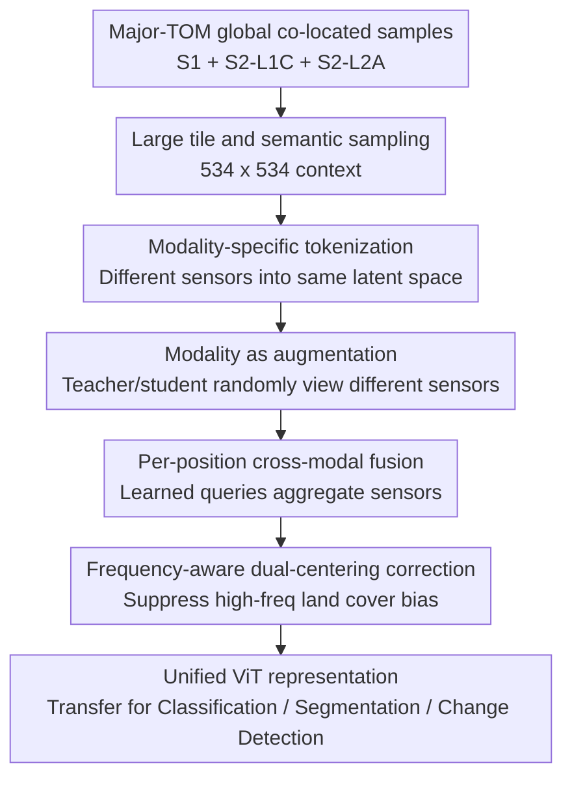

# TerraFM: A Scalable Foundation Model for Unified Multisensor Earth Observation

**Conference**: ICLR2026  
**OpenReview**: [https://openreview.net/forum?id=cBxuzdUDNx](https://openreview.net/forum?id=cBxuzdUDNx)  
**Code**: https://github.com/mbzuai-oryx/TerraFM  
**Area**: Remote Sensing / Earth Observation Foundation Models  
**Keywords**: Remote Sensing Foundation Models, Multisensor Fusion, Sentinel-1/2, Self-supervised Learning, Semantic Segmentation  

## TL;DR
TerraFM is designed for multisensor Earth observation data, treating Sentinel-1 SAR and Sentinel-2 optical imagery as natural augmented views of the same location. Through modality-specific patch embedding, per-position cross-attention fusion, and dual-centering DINO training for long-tail land cover, it achieves strong generalization on classification and segmentation tasks in GEO-Bench and Copernicus-Bench.

## Background & Motivation
**Background**: Remote sensing foundation models are evolving from single-optical imagery pre-training toward unified representation learning across sensors, regions, and resolutions. Sentinel-1 provides radar observations that complement information under cloud cover and varying optical conditions; Sentinel-2 L1C/L2A provides multispectral optical observations covering land surface spectral features. Recent methods such as AnySat, Galileo, Prithvi-EO, DOFA, and Copernicus-FM have demonstrated that large-scale self-supervised pre-training can be transferred to tasks like land cover classification, crop segmentation, and cloud detection.

**Limitations of Prior Work**: The issue is not just "insufficient data." Difficulties in remote sensing data arise from three levels: first, sensor discrepancies are significant—SAR channels, noise, and imaging mechanisms are entirely different from optical multispectral, making it hard for RGB-centric ViT shared patch projections to handle these inputs naturally; second, many models either split multimodal inputs into multiple encoders or only perform fusion in the decoder or reconstruction target, resulting in indirect cross-modal coupling; third, the global land cover distribution is naturally long-tailed, with forests, grasslands, and oceans occupying large portions while cities, mangroves, and ice are rare, causing standard DINO global centering to stabilize training without actively correcting this semantic sampling bias.

**Key Challenge**: A remote sensing foundation model must fully utilize global-scale massive data without being biased toward "mainstream sensors, mainstream land cover, and local textures." Larger tiles provide broader spatial semantic context but increase modeling and training costs; more sensors provide complementary information, but without modality awareness at the input side, the model treats sensor differences as noise; self-supervised learning avoids labeling costs but easily learns prototypes biased toward high-frequency categories on long-tailed land cover.

**Goal**: TerraFM attempts to resolve these contradictions within a unified framework. It aims to learn unified remote sensing representations across three types of co-located data: Sentinel-1, Sentinel-2 L1C, and Sentinel-2 L2A; ensure the model works under both single-modality and multi-modality inputs; learn broader spatial context using global-coverage large-tile data; and mitigate the impact of long-tailed categories on self-supervised representations using land cover frequency information from ESA WorldCover.

**Key Insight**: The authors' key observation is that co-located multisensor imagery does not have to be viewed merely as "multi-path inputs" but can be seen as natural augmented views of the same geographical location. This perspective is well-suited for DINO-style teacher-student self-supervision: the teacher can view a global crop of one modality, while the student views a local crop of another modality; as long as they come from the same location, the training objective pushes the model to learn sensor-invariant semantic consistency.

**Core Idea**: TerraFM replaces single-modality remote sensing pre-training with "modality-as-augmentation" DINO pre-training. It incorporates modality-specific embeddings at the encoder entrance, cross-modal attention fusion, and frequency-aware dual-centering, enabling a unified ViT to possess multisensor adaptation, spatial context modeling, and robustness to long-tailed land cover.

## Method

### Overall Architecture
The input to TerraFM consists of Sentinel-1 SAR, Sentinel-2 L1C, and Sentinel-2 L2A imagery on the same spatial grid unit, with each unit associated with a coarse-grained land cover category derived from ESA WorldCover. The main model remains a ViT teacher-student framework, but the input side no longer uses a single shared RGB patch embedding. Instead, inputs are encoded by modality, fused via per-spatial-position cross-attention when necessary, and finally trained for unified representations using a DINO-style multi-crop distillation target.

The workflow can be summarized in four stages: first, globally distributed tiles with all three modalities are filtered from Major-TOM; second, each sensor input is transformed into tokens that can be processed in a shared space; if multiple modalities are sampled for a training view, sensors are fused at each spatial position using cross-attention; finally, teacher-student multi-crop loss aligns different modalities and scales, while dual centering cancels out the representation dominance of high-frequency land cover categories.

### Key Designs
**1. Large tiles and semantic sampling: Ensuring pre-training data covers informative global land cover**

TerraFM is built on Major-TOM data. Each spatial unit covers approximately $10.68\,\text{km} \times 10.68\,\text{km}$, containing co-located Sentinel-1 RTC, Sentinel-2 L1C, and Sentinel-2 L2A imagery. Instead of training on all grids, the authors filter out 98% of ocean-classified tiles, retaining 2% to maintain marine representation, and perform distributed sampling based on land cover, climate zones, and ESRI world regions. This prevents the model from learning monotonic background prototypes from vast oceans or low-information areas, which would exacerbate bias at scale.

Each retained grid is divided into four non-overlapping $534 \times 534$ tiles. This size is larger than the 96, 128, or 224 tiles used by many other RS foundation models, allowing the model to see broader spatial semantics like farmland boundaries, urban-suburban transitions, and vegetation-water relationships. The final dataset includes approximately 1.53 million multimodal samples and 18.7 million modality-specific training tiles, totaling about 23.32T pixels. WorldCover categories are not used as supervisory labels but are employed to calculate high-frequency statistics for dual centering.

**2. Modality-specific tokenization: Shared ViT for SAR and multispectral without forced shared projections**

Standard ViT patch embeddings are usually a shared convolutional projection, assuming all inputs have the same channel structure. While reasonable for RGB, this is unsuitable for Sentinel-1 and Sentinel-2: S1 has only two radar channels (VV/VH), while S2 has up to 13 spectral bands, and the physical meanings of L1C and L2A differ. TerraFM uses independent patch embeddings $f_{\theta_m}$ for each modality $m$, mapping input $x^{(m)} \in \mathbb{R}^{H \times W \times C_m}$ to a token sequence $\bar{Z}^{(m)} \in \mathbb{R}^{N \times D}$.

To inform the shared encoder of the sensor source, learnable modality vectors $\epsilon^{(m)}$ are added: $\tilde{Z}^{(m)} = \bar{Z}^{(m)} + \mathbf{1}_N (\epsilon^{(m)})^\top$. Subsequently, all modality tokens are aligned to the same latent space via a shared projection $\psi: \mathbb{R}^{D} \rightarrow \mathbb{R}^{d}$. This design preserves modality differences at the low-level input adaptation while allowing the higher-level transformer to reuse parameters for learning cross-sensor semantics.

**3. Modality as augmentation and per-position cross-modal fusion: Turning co-located sensors into self-supervised positive pairs**

The core training concept of TerraFM is that S1, S2-L1C, and S2-L2A at the same location are different observations of the same scene, and can thus serve as self-supervised augmentations like color jitter or cropping. During pre-training, the student and teacher randomly select modalities with a threshold of 0.5; for example, the teacher might receive a global crop of S1, while the student receives a local crop of S2-L2A. The DINO loss forces the student to predict the teacher's semantic distribution from a local and different sensor perspective, aligning "same place, different sensor" into consistent representations.

When a view selects only one modality, it follows the standard modality-specific patch embedding path. When multiple modalities are selected, TerraFM performs cross-attention fusion before the encoder. Specifically, for each spatial position $n$, tokens from different modalities are stacked as $M$ keys/values. The model uses $N_q$ shared learnable queries to attend to these sensor tokens, producing $N_q$ intermediate outputs $z'_n$. A learnable projection $p_r$ calculates weights $w=\operatorname{Softmax}(z'_n p_r)$, resulting in a fused token $z^{\text{fused}}_n = \sum_j w_j z'_n[j]$. The paper uses $N_q=5$.

This fusion occurs per spatial position rather than globally across all tokens. It maintains the original sequence length of the ViT and preserves the comparability of modalities at the same geographical location: if an optical view is affected by clouds at one position, SAR might be more reliable; if radar texture is weak at another, spectral bands might be more discriminative. The fusion block learns "which sensor to trust at this position," while the subsequent transformer handles spatial interactions.

**4. Frequency-aware dual centering: Explicitly handling land cover long-tail beyond DINO stability**

DINO typically uses a center $c$ to shift teacher logits, preventing collapse into a few prototypes. TerraFM keeps this global center but notes that RS data has an additional problem: highly imbalanced land cover categories. Frequent categories like tree cover, grassland, and open seas appear repeatedly, causing the prototype space to bias toward high-frequency land cover. To address this, an additional high-frequency category center $c_h$ is introduced, updated via EMA using only samples in the batch belonging to high-frequency LULC categories.

The teacher logits are corrected by subtracting a weighted combination of both centers: $\hat{g}(x)=g_{\theta_t}(x)-\alpha c-(1-\alpha)c_h$, where $\alpha \in [0,1]$ (set to $\alpha=0.8$ in experiments). This is not a supervised classification loss and does not use WorldCover categories as input labels; it acts as a frequency-aware representation regularizer, using high-frequency statistics to "cool down" the teacher distribution and reduce the model's tendency to attract too many samples to common land cover prototypes. Appendix analysis shows that dual centering increases the softmax entropy and top-k prototype diversity for rare categories like mangroves, herbaceous wetlands, and built-up areas.

### A Complete Example
Suppose a training sample comes from a tropical coastal area, where the same $534 \times 534$ tile has S1, S2-L1C, and S2-L2A available. The data sampling phase first confirms it is not a low-information sample dominated by ocean background and records the WorldCover majority category for frequency statistics. During training, the teacher might take two global crops from S2-L2A, while the student takes multiple local crops from S1 and S2-L1C.

For a student local crop where only S1 is sampled, the model uses the S1-specific patch embedding and adds the S1 modality vector. If both S1 and S2-L1C are sampled, the two tokens at each spatial position are fused into one via learned queries. The student output is then aligned with the teacher's global optical view. Consequently, a local SAR texture, a local top-of-atmosphere optical view, and a global surface reflectance view are pulled toward consistent semantics under the same DINO objective.

If this sample's majority category belongs to very high-frequency tree cover, dual centering includes the high-frequency category center to correct the teacher logits, preventing it from further reinforcing the dominance of the "common vegetation prototype." As a result, the model learns cross-sensor consistency without being solely optimized for the most frequent land covers in the dataset.

### Loss & Training
TerraFM employs DINO-style teacher-student training. The student is updated via gradients, while the teacher uses an EMA of student parameters: $\theta_t \leftarrow \lambda_e \theta_t + (1-\lambda_e)\theta_s$, with $\lambda_e$ increasing via a cosine schedule. The teacher processes two global crops, while the student processes both global and local crops. The objective is to minimize cross-entropy between teacher and student distributions across all view pairs.

Multi-crop settings: global crops are sampled at a scale of $[0.25,1.0]$ and resized to $224 \times 224$; local crops are sampled at $[0.05,0.25]$ and resized to $96 \times 96$, with a patch size of $16 \times 16$. TerraFM-B is trained for 150 epochs with a batch size of 1024 (approx. 92h on 64 GPUs); TerraFM-L is trained for 200 epochs with a batch size of 2048 (approx. 183h). The projection head output dimension is $K=65{,}536$, teacher temperature is linearly increased from 0.04 to 0.06, teacher momentum starts at 0.996, drop path is 0.1, fusion query count $N_q=5$, and dual centering weight $\alpha=0.8$.

## Key Experimental Results

### Main Results
The paper primarily evaluates on GEO-Bench and Copernicus-Bench, covering classification, segmentation, and multi-label classification. For GEO-Bench, it reports kNN results (evaluating representation quality without training heads) and downstream transfer via fine-tuning/probing. Copernicus-Bench covers Sentinel-1/2 tasks including EuroSAT, BigEarthNet, Cloud-S2, and DFC2020.

| Benchmark / Task | Metric | TerraFM Best | Representative Baselines | Gain / Conclusion |
|--------|------|------|----------|------|
| GEO-Bench kNN m-EuroSAT | Top-1 Acc | 95.1 | Galileo 93.0 | +2.1, frozen representation is very strong |
| GEO-Bench kNN m-BigEarthNet | F1 | 69.4 | SoftCon 64.7 / Galileo 59.0 | Significant improvement in multi-label recognition |
| GEO-Bench fine-tune m-So2Sat | Top-1 Acc | 66.6 | Galileo 63.3 | Robust even when input channels are fewer than pre-training |
| GEO-Bench probing m-Cashew-Plant | mIoU | 37.0 | Galileo 33.0 | +4.0, segmentation transfer superior to existing FMs |
| GEO-Bench probing m-SA-Crop-Type | mIoU | 34.6 | CROMA 32.0 / Galileo 30.1 | Best results achieved on crop segmentation |
| Copernicus-Bench Cloud-S2 | mIoU | 67.9 | SoftCon 66.9 / Copernicus-FM 66.7 | Best in cloud detection segmentation |
| Copernicus-Bench EuroSAT-S2 | OA | 99.1 | Copernicus-FM 97.9 | Improvement despite near-saturated optical classification |
| Copernicus-Bench DFC2020-S1 | mIoU | 55.4 | SoftCon 52.8 / Copernicus-FM 52.4 | Stronger transfer in SAR segmentation |

The main results indicate that TerraFM's advantages are consistent across tasks. It performs steadily in kNN classification, fine-tuning, linear/UPerNet segmentation probing, and various Copernicus-Bench metrics. Notably, while Copernicus-FM also uses a ViT-B/16 backbone and large-scale Copernicus pre-training, TerraFM outperforms it in most Sentinel-1/2 tasks, suggesting that the input fusion and training objective design provide additional benefits.

### Ablation Study
The authors trained TerraFM-B for 150 epochs on a 200k sample subset, progressively adding modality augmentation, fusion, and dual centering. BEN refers to m-BigEarthNet, ES to m-EuroSat, and CP refers to m-Cashew-Plantation segmentation evaluated via UPerNet and linear probing.

| Configuration | BEN | ES | CP UPerNet | CP Linear | Explanation |
|------|---------|------|------|------|------|
| SS | 54.62 | 83.20 | 50.58 | 19.4 | Standard self-supervised DINO style training |
| SS + MAug | 57.63 | 87.70 | 59.17 | 24.8 | Significant gains in both classification and segmentation |
| SS + MAug + Fus | 57.74 | 88.50 | 62.40 | 26.2 | Fusion is particularly helpful for segmentation |
| SS + MAug + Fus + DC | 58.06 | 90.40 | 64.58 | 27.6 | Dual centering continues to improve results, especially ES and CP |

The ablation logic is clear: while standard self-supervision learns basic representations, using sensors as augmentations allows the model to exploit co-located multimodal relationships, increasing m-EuroSat by 4.50 and m-Cashew UPerNet by 8.59. Cross-attention fusion is critical for segmentation as pixel-level tasks rely more on local sensor complementarity. Dual centering yields stable positive gains across metrics, consistent with analyses of land cover bias.

| Fusion Strategy | m-BigEarthNet | m-EuroSat | Observation |
|------|------|------|------|
| DINO (S2-L2A) | 54.6 | 83.2 | Single-modality optical baseline |
| Multi-Student-Teacher | 55.8 | 87.8 | Multi-network alignment is effective but heavy |
| CrossAttn (Q=196) Global | 52.0 | 77.1 | Global query is too heavy and lacks spatial alignment bias |
| TerraFM-B (Q=1) | 57.2 | 89.2 | Per-position lightweight fusion is significantly better |
| TerraFM-B (ViT PatchEmb) | 56.9 | 87.2 | Complex token extractors are not necessarily better |
| TerraFM-B (Q=5) | 58.1 | 90.4 | Multiple spatial queries yield optimal fusion |

### Key Findings
- Modality augmentation is a primary source of gain. It frequently presents the teacher and student with the same scene under different sensors, forcing the model to learn sensor-invariant representations.
- Cross-attention fusion is particularly important for segmentation. The UPerNet probing for m-Cashew-Plantation improved from 59.17 to 62.40, showing better utilization of local sensor complementarity.
- Dual centering benefits are not just single-point numerical increases. Visualizations show improved softmax entropy and prototype diversity for tail categories, indicating the model avoids over-reusing frequent land cover prototypes.
- Scaling results show that larger models utilize data better. TerraFM-L shows a gain of 6.8 points on BigEarthNet and So2Sat when moving from 20% to 100% pre-training data, while TerraFM-S shows significantly smaller gains.
- Cross-resolution generalization is strong. Despite being pre-trained on Sentinel-1/2, TerraFM outperforms Galileo on tasks ranging from low to high resolution (e.g., AID, m-pv4ger, m-chesapeake-landcover), suggesting representations capture more than just modality-specific textures.

## Highlights & Insights
- Reinterpreting co-located multisensor data as self-supervised augmentations is the most critical insight. It avoids treating multimodal fusion as an extra supervised task and fits more naturally into the DINO framework than "encode-then-align" approaches.
- Per-spatial-position fusion is more aligned with RS data structures than global cross-attention. S1/S2 tokens at the same location have natural alignment; allowing queries to select sensors within a position provides better inductive bias than 196 global queries looking at all tokens.
- Dual centering is a practical self-supervised trick for RS. It requires no land cover labels during training—shifting teacher logits based on frequency statistics alone mitigates dominance by common land cover.
- The choice of large tiles ($534 \times 534$) is pragmatic. Many RS tasks, such as urban expansion or crop typing, require spatial context beyond local textures. The large tile size provides a wider geographical semantic window.
- The ablation study goes beyond "module adding" by comparing various fusion structures. The drop in performance with CrossAttn (Q=196) Global demonstrates that cross-modal fusion is not better simply by being larger; spatial alignment and lightweight design are key.

## Limitations & Future Work
- TerraFM primarily focuses on Sentinel-1 and Sentinel-2. While it shows transfer results on high-res RGB or Landsat, unified modeling of Sentinel-3/4/5P, DEM, meteorological data, and time series remains to be achieved.
- Treating modalities as co-located augmentations does not deeply address the temporal dimension. While Major-TOM's random 4-month window reduces seasonal bias, it does not explicitly model crop growth, disaster evolution, or long-term land surface changes.
- Dual centering relies on frequency statistics derived from WorldCover. This design is lightweight but could introduce bias if WorldCover labels have systematic errors in certain regions or if category granularity differs significantly from downstream tasks.
- Training costs remain high. TerraFM-L requires approximately 183 hours on 64 GPUs. While more efficient than Prithvi-EO-v2.0, it remains a high barrier for most research teams.
- While focusing on classification and segmentation generalization, details on deployment-level robustness (e.g., extreme cloud cover, cross-season shift, missing sensor combinations, geographical OOD) could be further explored.
- Future work could extend "modality-as-augmentation" to temporal augmentation: different seasons or years at the same location could form natural views, though this requires careful positive/negative pair definitions to avoid aligning away real changes.

## Related Work & Insights
- **vs Galileo**: Galileo also emphasizes global/local features and multimodal inputs. TerraFM differs by using S1, S2-L1C, and S2-L2A as natural augmentations in DINO teacher-student training and using per-position cross-attention fusion, outperforming Galileo on multiple GEO-Bench tasks.
- **vs Copernicus-FM**: Copernicus-FM uses metadata-aware design and a broader Sentinel family. TerraFM focuses on S1/S2 but outperforms it on most Copernicus-Bench tasks using the same ViT-B/16 backbone, thanks to large tiles, modality augmentation, and dual centering.
- **vs CROMA / SoftCon**: These methods utilize SAR-optical contrastive learning or soft-contrast signals. TerraFM integrates this alignment into the DINO multi-crop distillation framework and allows multimodal fusion at the encoder side.
- **vs Prithvi-EO-v2.0**: Prithvi-EO-v2.0 focuses on multi-temporal optical pre-training at a larger scale. TerraFM emphasizes multisensor unification and frequency-aware self-supervision, showing advantages in SAR/optical mixed tasks and segmentation probing.
- **vs DOFA / AnySat / msGFM**: These methods handle cross-resolution or arbitrary sensor inputs. TerraFM's insight is that instead of complex arbitrary interfaces, treating co-located sensors as augmentations and using in-position fusion yields strong results within the common Sentinel-1/2 ecosystem.

## Rating
- Novelty: ⭐⭐⭐⭐☆ Combines DINO, multimodal RS, and long-tail centering into a cohesive framework; the "modality-as-augmentation + per-position fusion" is highly insightful for EO foundation models.
- Experimental Thoroughness: ⭐⭐⭐⭐⭐ Comprehensive coverage across GEO-Bench, Copernicus-Bench, fusion/component ablations, scaling, high-res transfer, and change detection.
- Writing Quality: ⭐⭐⭐⭐☆ Clear logic and complete formulas; some segments are dense, and specific implementation details occasionally require referring to the appendix.
- Value: ⭐⭐⭐⭐⭐ Highly valuable for future work on remote sensing foundation models, multisensor pre-training, and long-tailed land cover representation learning.

<!-- RELATED:START -->

## Related Papers

- [\[ICCV 2025\] Towards a Unified Copernicus Foundation Model for Earth Vision](../../ICCV2025/remote_sensing/towards_a_unified_copernicus_foundation_model_for_earth_vision.md)
- [\[ICLR 2026\] Earth-Agent: Unlocking the Full Landscape of Earth Observation with Agents](earth-agent_unlocking_the_full_landscape_of_earth_observation_with_agents.md)
- [\[ICCV 2025\] SkySense V2: A Unified Foundation Model for Multi-Modal Remote Sensing](../../ICCV2025/remote_sensing/skysense_v2_a_unified_foundation_model_for_multi-modal_remote_sensing.md)
- [\[CVPR 2026\] RAMEN: Resolution-Adjustable Multimodal Encoder for Earth Observation](../../CVPR2026/remote_sensing/ramen_resolution-adjustable_multimodal_encoder_for_earth_observation.md)
- [\[CVPR 2026\] OlmoEarth: Stable Latent Image Modeling for Multimodal Earth Observation](../../CVPR2026/remote_sensing/olmoearth_stable_latent_image_modeling_for_multimodal_earth_observation.md)

<!-- RELATED:END -->
