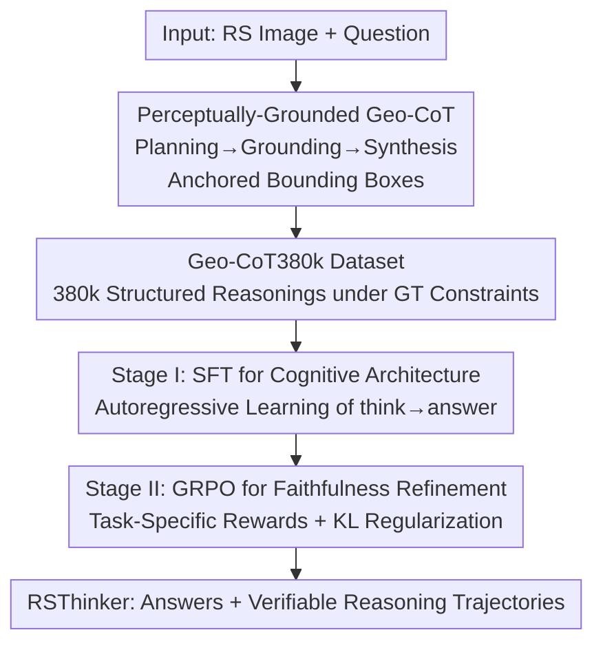

# Towards Faithful Reasoning in Remote Sensing: A Perceptually-Grounded Geospatial Chain-of-Thought for Vision-Language Models

**Conference**: ICLR 2026  
**OpenReview**: [https://openreview.net/forum?id=lJ7zecny2e](https://openreview.net/forum?id=lJ7zecny2e)  
**Code**: Not yet released (Authors state the Geo-CoT380k dataset and RSThinker model will be released after publication)  
**Area**: Remote Sensing / Multimodal VLM / LLM Reasoning  
**Keywords**: Remote Sensing, Geospatial Chain-of-Thought, Perceptual Grounding, Vision-Language Models, GRPO

## TL;DR
This paper proposes "Perceptually-Grounded Geospatial Chain-of-Thought" (Geo-CoT), which decomposes the analysis process of remote sensing VLMs into three steps: "Planning → Grounding Evidence → Synthesis." Each step anchors assertions to specific pixel regions using bounding boxes. By constructing the Geo-CoT380k dataset with 380,000 structured reasoning entries and employing two-stage alignment (SFT for cognitive structure and GRPO for faithfulness refinement), the resulting RSThinker significantly outperforms existing SOTA models across over ten remote sensing tasks, including visual grounding, counting, detection, captioning, and VQA.

## Background & Motivation
**Background**: Remote sensing vision-language models (e.g., GeoChat, EarthGPT, VHM, SkySenseGPT, EarthDial) have developed rapidly in recent years. They generally adopt an end-to-end paradigm that compresses the "pixels → final text answer" mapping into a single step, achieving high scores in downstream tasks like VQA, scene classification, and object counting.

**Limitations of Prior Work**: This end-to-end mapping treats the intermediate reasoning process as a latent, inaccessible hidden variable. It lacks process transparency and is prone to generating hallucinations that are "seemingly plausible but factually groundless." High-stakes remote sensing applications (disaster response, environmental monitoring) require **verifiable** results—not only must the answer be correct, but the process leading to it must be auditable. Although some works have attempted multi-modal chain-of-thought (MM-CoT), their reasoning steps often remain at abstract semantic explanations (relying on model world knowledge for "high-level deduction," e.g., identifying a stadium as a post-disaster shelter) or use ungrounded text for visual evidence without verifiable links to specific pixel regions.

**Key Challenge**: There is a fundamental "perceptual mismatch" between remote sensing and natural images. Remote sensing scenes are large-scale, non-uniform, top-down views with high densities of small objects, lacking the salient, well-defined entities found in natural images. Existing grounded CoT frameworks, built on the assumption of "salient large objects," fail when transferred to remote sensing. The root cause is the lack of **intent-driven active perception**: models perform one-time, passive global inference rather than "planning an analysis, systematically gathering evidence, and synthesizing."

**Goal**: To make the reasoning process of remote sensing VLMs explicit, structured, and anchored to verifiable visual evidence, transforming "opaque perception" into "structured, verifiable reasoning."

**Key Insight**: The authors argue that remote sensing experts follow an externalizable protocol—task planning, iterative evidence gathering, and final synthesis. By transforming this protocol into a structured sequence with bounding boxes and training the model accordingly, the model can be forced to perform "methodical visual interrogation" instead of "reflexive global inference."

**Core Idea**: Define a "Perceptually-Grounded Geospatial Chain-of-Thought" (Geo-CoT) that forces every analytical assertion to be explicitly linked to a specific spatial reference. Use a large-scale structured reasoning dataset and two-stage alignment (SFT for structure, GRPO for faithfulness) to instill this cognitive architecture into the model.

## Method

### Overall Architecture
The method addresses "how to enable remote sensing VLMs to produce reasoning that is both correct and process-verifiable." The overall approach is: 1) define a reasoning paradigm with spatial grounding (Geo-CoT), 2) instantiate it into a large-scale supervised dataset, 3) use two-stage alignment to train this capability into a base VLM, resulting in the RSThinker model.

The input is a remote sensing image $I$ and a user question $Q$. The output follows a `<think>...</think><answer>...</answer>` structure. The `<think>` block contains verifiable reasoning trajectories following the "Planning → Grounding → Synthesis" flow, each step anchored with bounding box coordinates. The base model is GLM-4.1V-9B-Base. Its visual encoder, Aimv2-Huge, naturally supports variable resolutions and aspect ratios via dynamic positional encoding (normalizing patch coordinates to $[-1,1]$ followed by bicubic interpolation). Training consists of two stages: Stage I uses Geo-CoT380k for Supervised Fine-Tuning (SFT) to instill the "decomposition + iterative grounding + synthesis" skeleton; Stage II uses Group Relative Policy Optimization (GRPO) with task-specific rewards to refine reasoning strategies toward factual correctness.

### Key Designs

**1. Perceptually-Grounded Geo-CoT: Anchoring Assertions to Pixel Regions**

This design addresses the limitation where existing remote sensing reasoning is either abstract semantic guessing or ungrounded text evidence. Geo-CoT is a mandatory cognitive protocol: analysis must follow "Planning → Iterative Grounding Evidence → Final Synthesis," with **strict perceptual grounding** as a core principle. Any abstract assertion must be replaced by assertions explicitly linked to spatial references (bounding box coordinates). For example, to answer "how many bridges are in the image," the planning stage determines a search strategy (e.g., along water systems/roads). The grounding stage lists candidate entries like `a bridge [183,558,276,762] across the water`, and the synthesis stage provides a verifiable count based on these entries.

Why this is effective: By making evidence "falsifiable spatial references," every reasoning step becomes auditable. The model cannot bypass perception with "plausible" text. Furthermore, "planning before scanning" naturally fits the "wide-range + dense-small-objects" characteristics of remote sensing, turning a single global identification into a methodical sequential search, which helps enumerate targets more completely and reduces missed detections or double counting in dense scenes.

**2. Geo-CoT380k: Backfilling Verifiable Reasoning under GT Constraints**

The success of SFT depends on large-scale, structured, and faithful reasoning corpora. However, generating reasoning from scratch often leads to hallucinations. The authors designed a scalable pipeline using GPT-4V to generate reasoning under **strong conditional constraints**. Instead of open-ended reasoning, the model is provided with verified bounding boxes, image descriptions, and CoT examples, and is tasked with "backfilling verifiable reasoning reasons based on the GT," thereby minimizing hallucination risks. The final Geo-CoT380k dataset contains 384,591 structured reasoning entries covering six tasks: VQA, captioning, classification, visual grounding, counting, and detection. Data sources include VRSBench, DOTAv2 (800x800 patches), HRRSD, and NWPU-RESISC45. This is the first large-scale CoT SFT dataset in the remote sensing field.

**3. Stage I — SFT for Cognitive Architecture**

To make the model internalize the "decomposition-grounding-synthesis" workflow, Stage I uses a standard autoregressive objective to maximize the log-likelihood of each structured output $o_i$ (i.e., `<think>...</think><answer>...</answer>`):

$$\mathcal{L}_{\text{SFT}}(\theta) = -\sum_{t=1}^{|o_i|} \log p(o_i,t \mid o_{i,<t}, I, Q; \theta)$$

The authors emphasize that this is not simple task fine-tuning but a restructuring of the model's internal reasoning process. Ablations show that SFT with CoT (SFT w/ CoT) compared to SFT without CoT (SFT w/o CoT) improves object detection mAP@0.5 from 49.36 to 74.03 and VQA from 63.57 to 74.20. Supervising the "calculation process" unlocks a higher level of performance.

**4. Stage II — GRPO for Faithfulness Refinement**

While SFT instills the structural template, its token-level likelihood objective may still assign high scores to trajectories where evidence and assertions are unfaithful. Stage II uses GRPO—an outcome-oriented RL method—to fix this sequence-level defect. For each input $(I, Q)$, $k$ outputs are sampled. The reward $R$ is based on task-standard metrics (VQA/classification uses 1.0/0.6/0.0 accuracy; grounding uses IoU; counting uses $1-\alpha\times\text{MAE}/\max(|\text{Ans}|,|\text{GT}|)$; detection uses mAP@0.5; captioning uses a weighted sum of BLEU-4/METEOR/CIDEr/ROUGE-L). These are normalized into a group relative advantage $\hat{A}_i = (R_i - \text{mean}(R))/\text{std}(R)$. The policy is updated using a clipped surrogate objective:

$$\mathcal{L}_{\text{GRPO}}(\theta) = -\mathbb{E}\Big[\sum_{i=1}^{k}\sum_{t=1}^{|o_i|} \min\big(r_{t,i}(\theta)\hat{A}_i,\ \text{clip}(r_{t,i}(\theta),1-\epsilon,1+\epsilon)\hat{A}_i\big)\Big] + \beta D_{\text{KL}}(\pi_\theta \| \pi_{\text{ref}})$$

The reference policy $\pi_{\text{ref}}$ is initialized from the SFT checkpoint. KL regularization is critical; removing it leads to "catastrophic collapse" of reasoning formats (repetitive gibberish). SFT establishes the cognitive skeleton, and GRPO drives the strategy toward factual correctness.

### Example: Counting Airplanes
When asked "How many airplanes are in the image?", RSThinker first enters **Planning**: it recognizes that airports usually have planes near runways/terminals and decides to search systematically by zone. Then it enters **Grounding**: it identifies multiple planes parked near the terminal, noting "three on one side, two on the other, one further down the runway" with coordinates. Finally, it **Synthesizes**: it confirms these targets possess wings/fuselages, totals 6, and outputs `<answer>There are a total of 6 airplanes.</answer>`. The trajectory breaks the total into auditable subgroups.

## Key Experimental Results

### Main Results
The base model is GLM-4.1V-9B-Base. Baselines include closed-source (Claude-3.5-Sonnet, Gemini-2.0-Flash, GPT-4o), general open-source VLMs (Qwen2.5-VL), reasoning VLMs (GLM-4.1V-Thinking, Kimi-VL-Thinking), and RS-specific VLMs (GeoChat, VHM, SkySenseGPT, EarthDial).

| Task | Dataset / Metric | RSThinker | Second Best | Note |
|------|--------------|-----------|----------|------|
| Visual Grounding | VRSBench-VG mAP@0.5 | 90.4 | 63.8 (GLM-4.1V-T) | Significant Lead |
| Visual Grounding | DIOR-RSVG mAP@0.5 | 93.1 | 60.8 (SkySenseGPT) | Strong Zero-shot |
| Counting | HRRSD Acc / MAE↓ | 85.26 / 0.242 | 61.45 / 0.871 (EarthDial) | MAE Greatly Reduced |
| Counting | DOTAv2-val Acc | 43.93 | 36.20 (GPT-4o) | — |
| Classification | RESISC45 Acc | 96.89 | 91.33 (VHM) | — |
| Captioning | NWPU-Cap BLEU-4 | 85.12 | 67.14 (EarthDial) | — |
| VQA | VRSBench Existence Acc | 92.36 | 88.89 (GPT-4o) | Existential Checks benefit most |

### Ablation Study

| Configuration | VG (mIoU) | OC (MAE↓) | Det (mAP@0.5) | IC (BLEU-4) | SC (Acc) | VQA (Acc) |
|------|-----------|-----------|----------------|-------------|----------|-----------|
| Base (GLM-4.1V-9B-Base) | 56.26 | 10.81 | 3.56 | 10.99 | 69.78 | 8.16 |
| + SFT (w/o CoT) | 81.80 | 3.272 | 49.36 | 31.14 | 93.33 | 63.57 |
| + SFT (w/ CoT) | 87.70 | 2.932 | 74.03 | 33.31 | 96.67 | 74.20 |
| + SFT (w/o CoT) + GRPO | 86.47 | 4.510 | 56.77 | 30.87 | 97.56 | 74.09 |
| + SFT (w/ CoT) + GRPO (Full) | **89.02** | **2.728** | **77.06** | **33.96** | 96.89 | **77.24** |

### Key Findings
- **CoT supervision is the key to performance jumps**: SFT w/ CoT vs. w/o CoT shows detection mAP jumping from 49.36 to 74.03. Supervising the process is more effective than supervising the final output.
- **SFT and GRPO are symbiotic**: Skipping CoT and applying GRPO (w/o CoT + GRPO) leads to poor detection results and worse counting MAE (4.510), proving GRPO requires the CoT cognitive skeleton to be effective.
- **KL Regularization is indispensable**: Removing it causes catastrophic reasoning format collapse.
- **Fine-grained perception tasks benefit most**: Tasks like grounding, counting, and detection show the highest gains as Geo-CoT forces evidence into verifiable bounding boxes.

## Highlights & Insights
- **Verifiability as a hard constraint**: Instead of post-hoc explanation, the model is required to write every piece of evidence as a falsifiable bounding box—a "forced grounding" concept transferable to high-risk tasks like medical imaging or industrial inspection.
- **High-fidelity CoT data via GT constraints**: By providing GT boxes/descriptions/examples to a labeling model (GPT-4V), it "backfills reasons based on answers," creating a scalable, hallucination-controlled synthetic reasoning route.
- **Adaptation to RS dense small objects**: Changing global recognition into a systematic sequential search mitigates missed detections and double counting typical in top-down views.
- **Clear Two-stage Division**: SFT handles the "cognitive structure" while GRPO handles "factual faithfulness," decoupling structural and strategy challenges—a paradigm inspired by LLM training (e.g., DeepSeek-R1).

## Limitations & Future Work
- **Dependency on GPT-4V and GT for data**: Reasoning quality is limited by GPT-4V's generation capability and the coverage of underlying GT annotations.
- **Code and Data Availability**: The authors state these will be open-sourced after publication; reproducibility is currently pending.
- **Computation Overhead**: Outputting full Planning-Grounding-Synthesis trajectories increases inference cost and latency compared to end-to-end models.
- **Reward Engineering**: GRPO reward functions are hand-designed per task, potentially limiting scalability to unseen task types.

## Related Work & Insights
- **vs. End-to-end RS VLMs (GeoChat / SkySenseGPT / EarthDial)**: These treat reasoning as a latent variable; Ours explicitly materializes it with grounding, offering verifiability and leading performance in fine-grained tasks at the cost of heavier inference.
- **vs. General Grounded CoT (Visual CoT / V\*)**: Natural image frameworks fail in RS due to lacks of "salient large objects"; Ours provides an RS-specific data foundation and cognitive architecture.
- **vs. Existing RS Reasoning (SegEarth-R1 / RemoteReasoner)**: Previous works lack verifiable links to spatial regions; Ours is the first to structure both "perceptual grounding" and "systematic cognitive planning" into RS reasoning.

## Rating
- Novelty: ⭐⭐⭐⭐⭐ First to systematize "perceptually-grounded verifiable CoT" for RS with a corresponding large-scale dataset.
- Experimental Thoroughness: ⭐⭐⭐⭐⭐ Covers 6 categories and 10+ benchmarks with clear ablation of CoT, GRPO, and KL contributions.
- Writing Quality: ⭐⭐⭐⭐⭐ Clear motivation and methodology; high-quality visual aids.
- Value: ⭐⭐⭐⭐⭐ Addresses the critical need for "process verifiability" in high-risk RS applications.

<!-- RELATED:START -->

## Related Papers

- [\[CVPR 2026\] ZoomEarth: Active Perception for Ultra-High-Resolution Geospatial Vision-Language Tasks](../../CVPR2026/remote_sensing/zoomearth_active_perception_for_ultra-high-resolution_geospatial_vision-language.md)
- [\[CVPR 2026\] GeoDiT: A Diffusion-based Vision-Language Model for Geospatial Understanding](../../CVPR2026/remote_sensing/geodit_a_diffusion-based_vision-language_model_for_geospatial_understanding.md)
- [\[CVPR 2025\] Think and Answer ME: Benchmarking and Exploring Multi-Entity Reasoning Grounding in Remote Sensing](../../CVPR2025/remote_sensing/think_and_answer_me_benchmarking_and_exploring_multi-entity_reasoning_grounding_.md)
- [\[CVPR 2026\] AVION: Aerial Vision-Language Instruction from Offline Teacher to Prompt-Tuned Network](../../CVPR2026/remote_sensing/avion_aerial_visionlanguage_instruction_from_offli.md)
- [\[CVPR 2026\] GeoCoT: Towards Reliable Remote Sensing Reasoning with Manifold Perspective](../../CVPR2026/remote_sensing/geocot_towards_reliable_remote_sensing_reasoning_with_manifold_perspective.md)

<!-- RELATED:END -->
