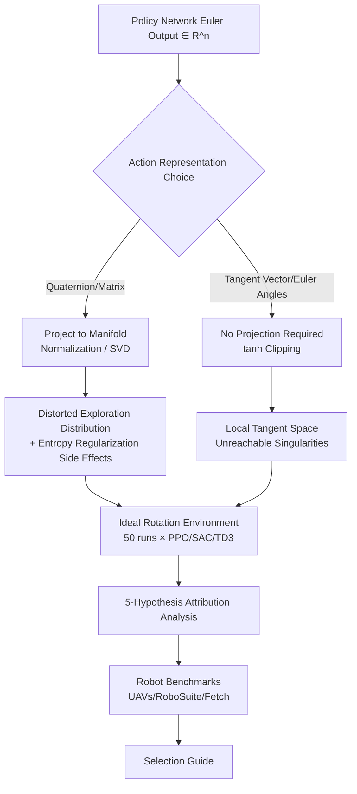

# A Primer on SO(3) Action Representations in Deep Reinforcement Learning

**Conference**: ICLR 2026  
**OpenReview**: [https://openreview.net/forum?id=g4ZrpMQL1Z](https://openreview.net/forum?id=g4ZrpMQL1Z)  
**Code**: [amacati.github.io/so3_primer](https://amacati.github.io/so3_primer)  
**Area**: robotics, reinforcement learning  
**Keywords**: SO(3), rotation action representations, continuous control, PPO/SAC/TD3, exploration dynamics, tangent space actions  

## TL;DR
This paper systematically evaluates various parameterizations of SO(3) rotation actions in Deep Reinforcement Learning (Euler angles / Quaternions / Rotation Matrices / Lie algebra tangent vectors). Through large-scale experiments on PPO, SAC, and TD3 under dense and sparse rewards, it demonstrates that "delta tangent vector actions in the local coordinate frame" are the most robust across nearly all algorithms and tasks, providing a practical guide for selecting rotation actions.

## Background & Motivation
- **Background**: Policy action spaces for tasks such as robotic manipulation and drone attitude control naturally include SO(3) rotations. However, SO(3) is a compact, curved, and non-commutative manifold, lacking a parameterization that is simultaneously globally smooth, minimal, and singularity-free. Common representations involve trade-offs: Euler angles are minimal and intuitive but suffer from sequence dependence, angle wrapping, and gimbal lock; quaternions are smooth and numerically stable but double-cover SO(3) ($q$ and $-q$ represent the same rotation); rotation matrices are unique and smooth but over-parameterized at 9 dimensions and require orthogonalization; Lie algebra tangent vectors are locally smooth but exhibit singularities at large angles.
- **Limitations of Prior Work**: These trade-offs have been thoroughly studied in **supervised learning** (e.g., rotation estimation, as detailed by Zhou 2019 and Geist 2024), yet **no systematic study has explored the impact of rotations when treated as "actions" in reinforcement learning**. Action representation and observation representation are distinct; actions involve stochastic policy sampling, exploration noise, and clipping due to actuator constraints, all of which are deeply coupled with RL-specific exploration dynamics.
- **Key Challenge**: Prior works either provided specific solutions for narrow scenarios (Alhousani 2023) or tested only a single algorithm/reward setting (Schuck 2025 addressed only DDPG + sparse rewards). The question of "which SO(3) action representation is best in RL" remained unresolved.
- **Goal**: To systematically characterize how action representations shape exploration, interact with entropy regularization, and affect convergence stability across three major continuous control algorithms (PPO/SAC/TD3) and both dense and sparse rewards, ultimately distilling a concise guide for engineering selection and implementation.
- **Core Idea**: **[Representation-Induced Geometry]** The root of performance differences lies not in abstract "smoothness/uniqueness," but in the **mapping projected from the Euler network output to SO(3)**—it distorts the exploration distribution and amplifies the side effects of entropy regularization. **[Victory of Delta Tangent Space]** Treating actions as small tangent vector increments in a local coordinate frame ensures that singularities and discontinuities remain in regions unreachable by the policy, thereby bypassing these issues.

## Method

### Overall Architecture
This paper does not propose a new algorithm but rather a **controlled comparative study + hypothesis-driven attribution analysis**: fixing the network architecture, training budget, observation space, and reward definitions, while only switching the policy's action representation to verify five hypotheses regarding why performance varies. The research is conducted at two levels: first, isolating the impact of action representation in an **idealized environment** with pure rotation dynamics (Section 3), then verifying transferability on **three real-robot benchmarks** (UAVs and robotic arms) (Section 4).

### Key Designs

**1. Perspective Shift: Global vs. Incremental Actions (Utilizing SO(3) Group Structure)**. A rotation action can be interpreted in two ways: first, as a **target pose** $R_a$ in a global coordinate frame $E$, which the low-level controller tracks; second, as an **incremental rotation relative to the current state** using the SO(3) group structure, such as $R_{t+1}=R_t \Delta R_{\Delta a}$. The incremental perspective decouples actions from the global frame, potentially favoring generalization, though the agent must additionally learn the relative relationship between current and target poses. Environment transitions are modeled using geodesic shortest paths—rotating toward the target $R_a$ with a maximum step size $\alpha_{max}$, where the geodesic distance is $d(R_1,R_2)=\arccos\frac{\mathrm{tr}(R_1^\top R_2)-1}{2}$. This $\alpha_{max}$ is central to the conclusions: it confines tangent space actions to a small neighborhood that is unique, continuous, and where the Exp map is approximately linear.

**2. Trade-offs in Projection Layers: "Sampling in Euclidean Space, Projecting in the Environment"**. Feedforward policy outputs do not satisfy manifold constraints: quaternions require $\|q\|=1$, and matrices require $R^\top R=I, \det R=1$. Quaternions are projected via normalization $q=x/\|x\|$; matrices are projected via SVD to the nearest rotation $R=U\,\mathrm{diag}(1,1,\det(UV^\top))\,V^\top$. Tangent vectors and Euler angles **do not require feasibility projections**, only tanh to limit amplitudes to $|\tau|<\pi-\epsilon$. The challenge for stochastic policies is that applying projections to every sampled action distorts the distribution and makes log-probabilities non-analytical, while PPO/SAC rely heavily on accurate log-probabilities. The technical compromise here is to **project only the mean within the network, sample in Euclidean space, and project the sampled off-manifold action once more within the environment**, maintaining compatibility with standard log-probability calculations while ensuring execution feasibility.

**3. Unit-rotation Centering: Making "Zero" the Identity**. Policy networks are typically initialized with zero-centered outputs, but projections for quaternions/matrices map outputs near zero to **a wide range of rotations**—this is particularly detrimental for incremental actions as the agent must first learn which output corresponds to "no rotation" (the identity). The remedy is a customized policy network that adds a constant identity rotation directly to the action mean. Experiments show this significantly improves quaternion/matrix incremental actions under PPO (Fig. 3), with mixed results for SAC/TD3; tangent vectors and incremental Euler angles are inherently centered at identity and remain unaffected.

**4. Action Scaling: Tangent Vectors and Geometric Pitfalls**. Physical systems (arms, UAVs) have bounded angular velocities, necessitating limits on the per-step rotation magnitude. Local tangent vector increments $s\tau\in\mathbb{R}^3$ are easiest to scale—restricting the output norm suffices and keeps wrapping/cut-locus singularities outside the action space. Quaternions/matrices can use geometric scaling $\tilde R=\mathrm{Exp}(\alpha\,\mathrm{Log}\,R)$ to limit rotation to a maximum angle $\alpha$, but this introduces branch choices and non-smooth points at $\theta=\pi$. Incremental Euler angles are the hardest to scale, as rotation magnitude depends on the current pose, requiring either overly conservative limits or complex pose-dependent normalization. Conclusion: Tangent space with norm control is the cleanest scaling mechanism. Scaling tangent vectors to the allowed angular range consistently yields a performance gain of approximately $-1.5$ (corresponding to the removal of cut-locus discontinuities) across PPO/SAC/TD3.

> The attribution conclusions for the 5 hypotheses can be summarized as: **Uniqueness and smoothness are beneficial but need not be global**—as long as $\alpha_{max}$ prevents action space from reaching singularities/discontinuities (as in local tangent space), the representation is sufficient; projections distort exploration distributions (Euler angles and quaternions suffer most, followed by matrices, with tangent space least affected); increasing entropy regularization pushes actions toward larger norms without **increasing actual diversity for matrices/quaternions**, and instead pulls Euler angles toward singularities.

## Key Experimental Results

### Main Results Table (Idealized Pure Rotation Environment; closer to 0 is better; Blue/Bold indicates top two; Mean of 50 runs)

| Representation | PPO Dense | SAC Dense | SAC Sparse | TD3 Dense | TD3 Sparse |
|---|---|---|---|---|---|
| Matrix $R$ (Global) | -5.4 | -4.7 | -29.4 | -4.7 | -6.4 |
| Delta Matrix $\Delta R$ | -12.3 | -5.1 | -31.0 | -4.9 | -20.7 |
| Quaternion $q$ (Global) | -11.5 | -5.0 | -30.2 | -5.3 | -9.2 |
| Delta Quaternion $\Delta q$ | -22.1 | -5.0 | -29.3 | -5.2 | -21.6 |
| Tangent Vector $E\tau$ | -8.4 | -7.1 | -33.5 | -6.4 | -30.3 |
| **Local Tangent Vector $s\tau$** | **-5.4** | **-2.9** | **-7.9** | **-3.5** | **-6.9** |
| Euler angles $(\phi,\theta,\psi)$ | -10.8 | -5.5 | -35.2 | -7.3 | -16.2 |
| Delta Euler angles | -7.9 | -5.8 | -15.7 | -7.4 | -31.2 |

**Local tangent vector $s\tau$ is optimal across nearly the entire table** with the lowest variance; Global matrix consistently ranks second (though it collapses to -29.4 under SAC sparse rewards); other representations generally perform poorly, especially under sparse rewards (even with HER). Under SAC sparse rewards, the gap between tangent vectors (-7.9) and quaternions (-30.2) is substantial.

### Ablation Study (Key Attributions of 5 Hypotheses)

| Hypothesis | Conclusion |
|---|---|
| H1 Smoothness + Uniqueness → Superiority | Only partially true. Incremental matrices are smooth but underperform global matrices due to the difficulty of learning relative relations; tangent vectors have singularities, but are optimal because $\alpha_{max}$ keeps singularities unreachable. |
| H2 Representation Affects Exploration | True. Projections compress Gaussian exploration into small regions; Euler samples cluster near singularities (Fig. 2), while tangent space distribution is most uniform. |
| H3 Entropy Regularization Causes Suboptimality | Only for PPO/SAC. Entropy maximization pushes actions toward high norms without increasing matrix/quaternion diversity; scaling tangent vectors mitigates this. |
| H4 Unit-Centering Improves Delta Actions | Significantly improves PPO; SAC/TD3 results are unclear. Tangent vectors/Euler angles are inherently centered and unaffected. |
| H5 Scaling to Allowed Angular Range | Stability improves by roughly $-1.5$ for all three algorithms by removing cut-locus discontinuities. |

### Key Findings
- **UAV Control (PPO)**: On trajectory tracking and drone racing tasks, local tangent vectors exhibit the fastest convergence and highest rewards; **Euler angles unexpectedly rank second** (since drones cannot deviate too far from an upright position, remaining within the range where Euler angles perform well); global quaternions/matrices often cause immediate crashes due to high initial randomness.
- **RoboSuite Arm (SAC Dense, 9 Tasks)**: Dense rewards compensate for exploration issues, and global actions perform well; **quaternions outperform matrices on several tasks**; tangent vectors are competitive but do not exceed quaternions—suggesting that reward design and task difficulty are the dominant factors here.
- **Fetch Pose Target (TD3 + HER)**: On reach tasks, matrices and tangent vectors converge rapidly, followed by quaternions, with Euler angles last. On the harder pick-and-place, **local tangent vectors lead significantly with a 69.8% success rate** (Matrix 54.1% / Quaternion 46.7% / Euler 32.3%), showing that representation gaps double when covering a large SO(3) range.

## Highlights & Insights
- **In-depth "Why"**: The paper does not stop at "tangent vectors are best" but attributes this to the fundamental mechanism of exploration distribution distortion caused by projection mappings, rigorously validating/falsifying five hypotheses.
- **The Insight of $\alpha_{max}$**: It reveals that "global singularity-free" properties are not mandatory—as long as singularities fall outside the range reachable by the policy in a single step, local representations enjoy low dimensionality while bypassing singularities. This is a structural advantage unique to RL actions compared to supervised learning.
- **Amplification in Sparse Rewards**: Dense rewards can mask representation flaws, whereas sparse rewards expose and amplify them—explaining why previous single-reward studies reached limited conclusions.
- **Directly Actionable**: Provides 5 engineering guidelines (prioritize local tangent space increments, be cautious with sparse rewards, watch for zero-centering traps in quaternions/matrices, global representations can excel in fixed-pose tasks, and delta Euler angles remain a poor choice), serving as a true "primer" for practitioners.

## Limitations & Future Work
- **Limited to State Observations and Small Networks**: While observations theoretically do not affect the action space, empirical evidence for image observations or large-scale networks is lacking.
- **Excludes Discrete Action Algorithms**: Issues like discretization schemes and SO(3) coverage density open up entirely new dimensions.
- **Lack of Standard Full SO(3) Benchmarks**: The authors' extended HER environment is a starting point, but the community lacks a standard task set requiring control over the full SO(3) manifold.
- **Diffusion Policies Not Covered**: Diffusion policies widely used in imitation learning require similar representation selection studies and may yield different conclusions.

## Related Work & Insights
- **SO(3) Representations in SL**: Zhou 2019 (6D continuous representation), Peretroukhin 2020, Brégier 2021, and Geist 2024 (the most authoritative review and recommendation) established the understanding of "which representation is easy to learn." This paper systematically transfers that discussion to RL actions for the first time.
- **Lie Group / SO(3) Theory**: Solà 2018's Lie theory review, Macdonald 2011, and Barfoot 2017 provide the mathematical foundations for Exp/Log mappings and manifold geometry.
- **Prior RL Representation Attempts**: Alhousani 2023 (scenario-specific) and Schuck 2025 (DDPG + sparse rewards) are the closest works. This paper provides full coverage across algorithm breadth (PPO/SAC/TD3) and reward settings (dense + sparse).
- **Insight**: Any policy learning involving manifold actions (not just SO(3), but also SE(3), unit spheres, etc.) should prioritize the "local tangent space delta + norm control" paradigm and remain wary of latent exploration distribution distortion from projection layers.

## Rating
- **Novelty**: ⭐⭐⭐⭐ — Not a new algorithm, but fills the "SO(3) action representation in RL" gap with genuine insight from the $\alpha_{max}$ perspective.
- **Experimental Thoroughness**: ⭐⭐⭐⭐⭐ — 3 algorithms × 8 representations × dense/sparse × 50 runs in an idealized study plus three real-robot benchmarks; rigorous hypothesis-driven ablation.
- **Writing Quality**: ⭐⭐⭐⭐⭐ — A true "primer," progressing from mathematical properties to engineering traps with clear, actionable conclusions.
- **Value**: ⭐⭐⭐⭐⭐ — A direct "how-to" manual for researchers and engineers working on pose-control RL, saving significant trial-and-error costs.

<!-- RELATED:START -->

## Related Papers

- [\[NeurIPS 2025\] Time Reversal Symmetry for Efficient Robotic Manipulations in Deep Reinforcement Learning](../../NeurIPS2025/robotics/time_reversal_symmetry_for_efficient_robotic_manipulations_in_deep_reinforcement.md)
- [\[ICLR 2026\] Partially Equivariant Reinforcement Learning in Symmetry-Breaking Environments](partially_equivariant_reinforcement_learning_in_symmetry-breaking_environments.md)
- [\[ICLR 2026\] APPLE: Toward General Active Perception via Reinforcement Learning](apple_toward_general_active_perception_via_reinforcement_learning.md)
- [\[ICLR 2026\] From Embedding to Control: Representations for Stochastic Multi-Object Systems](from_embedding_to_control_representations_for_stochastic_multi-object_systems.md)
- [\[ICML 2025\] Learning to Stop: Deep Learning for Mean Field Optimal Stopping](../../ICML2025/robotics/learning_to_stop_deep_learning_for_mean_field_optimal_stopping.md)

<!-- RELATED:END -->
