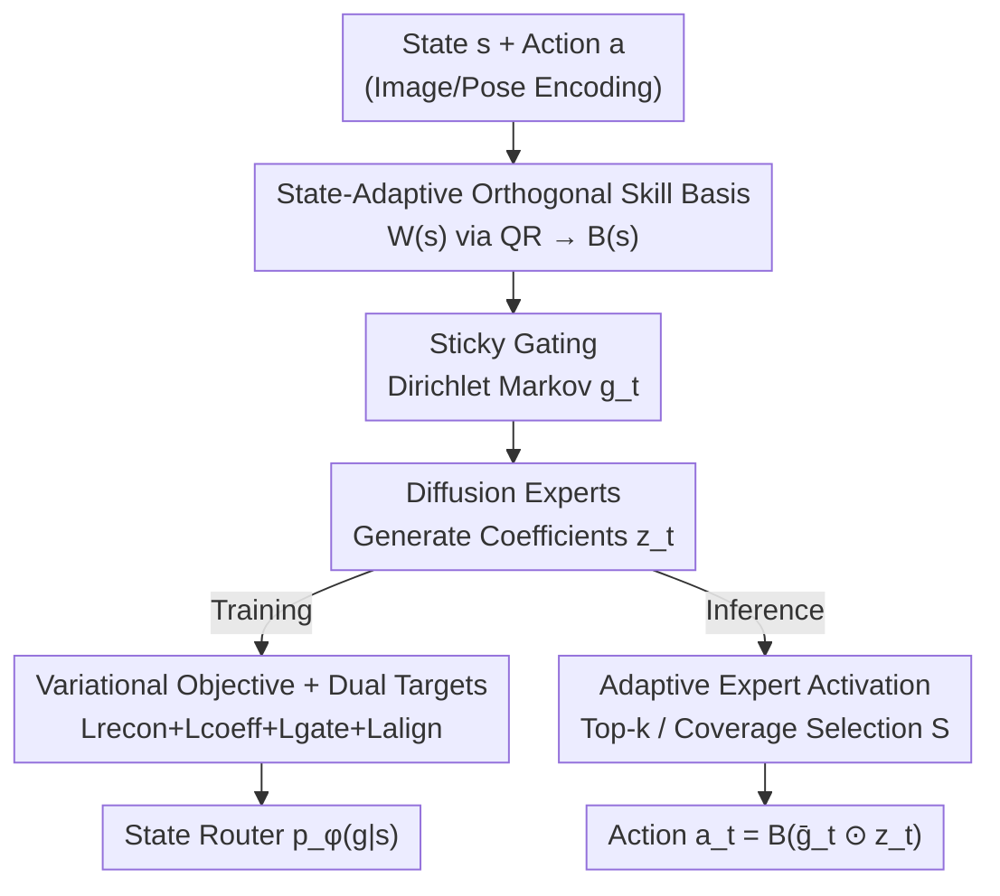

# Abstracting Robot Manipulation Skills via Mixture-of-Experts Diffusion Policies

**Conference**: ICLR2026  
**OpenReview**: [https://openreview.net/forum?id=VSWjHIveqZ](https://openreview.net/forum?id=VSWjHIveqZ)  
**Code**: TBD  
**Area**: Robotics / Embodied AI  
**Keywords**: Diffusion Policy, Mixture-of-Experts, Skill Abstraction, Bimanual Manipulation, Orthogonal Basis

## TL;DR
SMP (Skill Mixture-of-Experts Policy) decomposes action generation of diffusion policies into a set of **state-adaptive orthogonal skill bases**. By using slowly-varying "sticky" gating to activate only a few experts relevant to the current stage, it achieves reusable and transferable multi-task bimanual manipulation at a medium model scale. It reduces inference active parameters to approximately 30% of its own total (about 7% of RDT) while achieving higher success rates than large diffusion baselines.

## Background & Motivation
**Background**: Diffusion Policy models action generation as a denoising process. Its high success rate and stable training in single-task robot manipulation have made it a mainstream paradigm. To extend it to multi-task scenarios, a common approach in the community is to "scale up the network," relying on scaling laws to enable large models to interpolate across unseen tasks.

**Limitations of Prior Work**: Simply scaling models is extremely costly. On one hand, ultra-large models have slow inference speeds, making real-time control difficult; on the other hand, the required demonstration data grows almost exponentially as task diversity increases. In the paper, RDT increases parameters to 10× that of DP, yet the multi-task success rate only increases by 19%, indicating low returns for naive scaling.

**Key Challenge**: Achieving multi-task generalization under the constraints of "medium model scale + low sampling latency." Another path is skill abstraction—extracting task-agnostic reusable skills from demonstrations and recombining them across tasks. However, existing methods have drawbacks: information-theoretic skill discovery (DIAYN) and hierarchical RL are mainly designed for exploration under sparse rewards and are not suited for manipulation skill abstraction; recent work applying MoE to diffusion policies (Sparse Diffusion Policy) merely replaces large feed-forward backbones with small experts **without explicitly decoupling and representing reusable skills**, leading to expert entanglement, frequent gating jitters, and uninterpretable bimanual roles.

**Goal**: To enable policies to learn "cleanly separated, phase-consistent, and cross-task reusable" skills, while only computing the required experts during inference.

**Key Insight**: The authors observe that the mixture of unconstrained expert outputs is **unidentifiable**—many different combinations of coefficients can restore the same action, causing routing and training instability. If each skill is mapped to a non-overlapping direction in the action space for every state, the mixture becomes identifiable and well-conditioned, making expert contributions naturally additive.

**Core Idea**: Perform skill abstraction in a **locally whitened (orthogonal) action space**—using a state-adaptive orthogonal basis $B(s)$ to decompose actions into several one-dimensional subspaces, paired with slowly-varying sticky gating to sparsely activate only a few skills at each state.

## Method

### Overall Architecture
SMP aims to solve "how to learn reusable and transferable skills for multi-task bimanual manipulation using a moderately sized model and execute them in real-time." Its core shift is: instead of allowing unconstrained experts to overlap freely, actions $a_t\in\mathbb{R}^d$ are decoded through an orthogonal skill basis $B=[b_1,\dots,b_K]$,

$$a_t = B\,(g_t \odot z_t)$$

where $K\ll d$ is the number of skills, $g_t\in\Delta^{K-1}$ represents the gating (weights on a simplex), $z_t\in\mathbb{R}^K$ are the coefficients for each skill, $\odot$ denotes the element-wise product, and $B^\top B = I_K$. Because the basis is orthogonal, the $i$-th skill only contributes a rank-one vector $b_i(g_{t,i}z_{t,i})$ in the subspace $\mathrm{span}\{b_i\}$, making skill effects additive and gradients decoupled.

During training (Fig 2a): Raw observations are encoded into state features, and a lightweight network generates an unconstrained matrix $W(s)$, which is projected onto the Stiefel manifold via differentiable QR contraction to obtain the state-adaptive orthogonal basis $B(s)$. Gating is provided by an amortized posterior $q(g_t\mid s_t,a_t)$, and coefficients $z$ are generated by diffusion experts. Actions are reconstructed as $\hat a_t=B(g_t\odot z_t)$, and the model is optimized using four losses: reconstruction, diffusion, gating regularization, and router alignment. Simultaneously, a **state-only** router $p_\phi(g_t\mid s_t)$ is distilled for deployment. During inference (Alg 2): The state router estimates the importance of each expert. A compact active set $S$ is selected using top-k or coverage-based greedy selection. Only coefficients within $S$ are denoised before decoding the action, enabling sparse, low-latency control.

### Key Designs

**1. State-Adaptive Orthogonal Skill Basis: Eliminating Expert Unidentifiability with a State-Rotating Coordinate System**

Mixing unconstrained experts directly leads to overlap: multiple coefficient combinations can reconstruct the same action, destabilizing routing and training. SMP addresses this by constructing an orthogonal coordinate system at each state, pinning each skill to a non-overlapping direction. This makes expert contributions additive and unmixing well-conditioned. However, since robot action geometry varies with state (arm position, contact), a fixed global basis is insufficient; thus, the basis itself is state-dependent $B(s)$. Specifically, a lightweight network generates $W(s)\in\mathbb{R}^{d\times K}$, which is then projected via signed-stable differentiable thin QR contraction:

$$W(s)=\tilde B U,\quad D=\mathrm{diag}\big(\mathrm{sign}(\mathrm{diag}(U))\big),\quad B(s)=\tilde B D$$

where $\tilde B$ is the orthogonal factor from QR, $U$ is upper triangular, and $D$ is a diagonal sign matrix to eliminate column sign ambiguity—preventing basis vectors from suddenly flipping between adjacent states, ensuring $B(s)$ evolves continuously with $s$. During training, $B(s)$ acts as the forward mapping, and $W(s)$ is updated via automatic differentiation through the QR contraction. This yields a "moving orthogonal frame following the task geometry," providing phase consistency when combined with gating. From an MoE perspective, this decoder is precisely an additive MoE in the local skill basis: $a_t=\sum_i g_{t,i}b_i z_{t,i}$, where the $i$-th expert is a rank-one mapping $f_i=b_i z_{t,i}$. Orthogonality ensures that experts act in one-dimensional subspaces with decoupled gradients.

**2. Sticky Gating: Switching Skills like "Phases" Rather than Step-wise Jitter**

Manipulation processes usually undergo quasi-steady phases (grasping, moving, placing). Therefore, gating $g_t$ should change slowly rather than jumping at every step, without collapsing into too few skills. The authors formalize this intuition using "sticky" Dirichlet Markov dynamics:

$$\vartheta\sim\mathrm{Dir}(\alpha\mathbf 1),\quad g_1\sim\mathrm{Dir}(\alpha_0\vartheta),\quad g_t\sim\mathrm{Dir}(\kappa g_{t-1}+\alpha_0\vartheta),\ t\ge 2$$

where $\vartheta$ is a global vector characterizing overall skill usage; $g_1$ is sampled near $\vartheta$; subsequently, each $g_t$ blends "persistence from the previous timestep" with a "slight pull toward global usage." Three hyperparameters serve distinct roles: $\kappa$ controls temporal stickiness (larger means longer, phase-like segments), $\alpha_0$ anchors the process to $\vartheta$ to prevent degradation, and $\alpha$ sets the dispersion of the global prior. The result is piecewise-constant skill activation—achieving phase consistency while maintaining broad but non-uniform utilization across tasks.

**3. Variational Objective and Dual-Coefficient Targets + State Router: Stable Supervision in Whitened Space**

SMP utilizes variational inference for unified training. Latent variables are split into gating/global usage $(\vartheta,g_{1:T})$ and coefficients $z_{1:T}$. Applying Jensen's inequality to the ELBO yields three components: reconstruction loss $\mathcal L_{recon}$, gating/global usage regularization $\mathcal L_{gate}$, and coefficient regularization $\mathcal L_{coeff}$. A key trick is **using two coefficient targets to separate gradient flow to the basis $B$**:

$$\hat z^{sg}_{0,t}=\frac{\bar B^\top a_t}{\mathbb E_q[g_t]+\epsilon}\ (\text{Stop-gradient, feeds diffusion}),\qquad \hat z^{rec}_{0,t}=\frac{B^\top a_t}{\mathbb E_q[g_t]+\epsilon}\ (\text{With-gradient, flows to }B)$$

where $\bar B=\mathrm{sg}[B]$ is a stop-gradient copy. The diffusion surrogate loss $\mathcal L_{coeff}=\mathcal L_{diff}(z;\hat z^{sg}_{0,1:T})$ does not update $B$. Conversely, the reconstruction loss $\mathcal L_{recon}=\frac{1}{2\sigma_a^2}\sum_t\|a_t-\hat a^{rec}_t\|_2^2$ uses $\hat z^{rec}_{0,t}$ with gradients, allowing gradients to flow back to the basis via the projection $B^\top a_t$ and decoding $B(\cdot)$. This ensures both "action consistency" and "stable per-expert coefficient supervision," with only the reconstruction term updating the skill basis. An additional alignment loss $\mathcal L_{align}=\sum_t \mathrm{KL}\big(q(g_t\mid s_t,a_t)\,\|\,\mathrm{Dir}(\tilde\beta_\phi(s_t))\big)$ aligns a **state-only** router $p_\phi(g_t\mid s_t)$ to the training-phase gating posterior.

**4. Adaptive Expert Activation: Computing Only Relevant Experts During Inference**

Evaluating all experts at every state is expensive and unnecessary, as only a few skill directions are typically significant. During deployment, the state router's mean $\bar g_t=\mathbb E[g_t\mid s_t]$ is used to estimate expert importance. In the orthogonal basis, expert $i$'s magnitude is defined as $m_i=\bar g_{t,i}^2$. For any active set $S$, the score is $F(S)=\sum_{i\in S}m_i$. Since $F$ is additive, the optimal set is found by sorting experts by $m_i$ and taking either (i) top-k, or (ii) the shortest prefix satisfying a coverage ratio $\frac{\sum_{i\in S}m_i}{\sum_j m_j}\ge\tau_m$ (with $\tau_m\in[0.9,0.95]$). Once $S_t$ is selected, only $z_{t,S_t}$ is denoised (others are zeroed), and the action is decoded as $a_t=B(\bar g_t\odot z_t)$. This simple sorting rule yields sparse, state-dependent activation, significantly reducing inference costs while maintaining precision.

### Loss & Training
The total objective is $\mathcal L_{\text{SkillMoE}}=\mathcal L_{coeff}+\mathcal L_{recon}+\mathcal L_{gate}+\mathcal L_{align}$. In each training iteration (Alg 1): Sample a trajectory → orthogonalize $B=\mathrm{qrf}(W)$ via signed-stable QR → compute amortized gating posterior → construct stop-grad/with-grad coefficient targets → compute $\mathcal L_{coeff}$ via DDPM loss and $\mathcal L_{recon}$ via the with-grad target → compute gating regularization and router alignment → jointly update $W$, diffusion experts, the amortizer, and the router. $\mathcal L_{coeff}$ follows standard DDPM noise prediction loss.

## Key Experimental Results

### Main Results
Multi-task learning was evaluated on two bimanual benchmarks: RoboTwin-2 (6-task joint learning, cross-arm skill reuse) and RLBench-2 (4 tasks with tight-coupled collaboration). Each result is averaged over 100 episodes.

| Benchmark | Metric | SMP (Ours) | Prev. SOTA | Description |
|-----------|--------|-------------|------------|-------------|
| RoboTwin-2 | Avg. Success | **0.54** | RDT 0.48 | SMP is 6 pts higher with far fewer active parameters than RDT |
| RLBench-2 | Avg. Success | **0.18** | RDT 0.17 | Remains leading in tightly coupled tasks |
| RoboTwin-2 | DP / DP3 / ACT | 0.29 / 0.33 / 0.34 | — | Standard Diffusion/Transformers underfit multi-modal distributions in bimanual tasks |

Computational Cost (Average across tasks):

| Method | Total Params $N_p$ (M) | Active Params $N_p^{act}$ (M) | Inference Time $T_{inf}$ (ms) |
|--------|------------------------|-------------------------------|-------------------------------|
| DP | 132.5 | 132.5 | 120.3 |
| RDT | 1200 | 1200 | 183.1 |
| Sparse DP | 154.4 | 110.1 | 148.3 |
| **SMP (Ours)** | 258.9 | **80.2** | **107.3** |

While SMP has a significant total parameter count, it only activates ~30% during inference (~7% of RDT's total). Active parameters and inference latency are the lowest in the table, and multiple small experts can denoise in parallel.

### Ablation Study
The paper validates the core claim that "cleanly separated skills are recombinable" through transfer experiments rather than standard w/o ablation tables.

Few-shot Transfer (10-shot full fine-tuning on 4 new tasks in RoboTwin-2, 100-episode avg):

| Config | Div. | Mic | Roller | Box | Avg. | Description |
|--------|------|-----|--------|-----|------|-------------|
| DP | 0.06 | 0.13 | 0.18 | 0.16 | 0.13 | 10-shot tuning fails to shift old behaviors in large backbones |
| RDT | 0.14 | 0.26 | 0.21 | 0.18 | 0.20 | Scaling alone struggles with few-shot transfer |
| Disc. Policy | 0.17 | 0.38 | 0.44 | 0.25 | 0.31 | Can reuse some discrete codes |
| **SMP** | **0.22** | **0.49** | **0.49** | **0.31** | **0.38** | Concentrates 10-shot data on sparse expert subsets |

Skill Recombination (Frozen experts and basis, fine-tune only the router with 10 demos/task):

| Config | Skillet-Fries | Bottle-Cab. | Avg. | Description |
|--------|---------------|-------------|------|-------------|
| SDP | 0.11 | 0.38 | 0.25 | Hierarchical gating couples experts; routing tuning can't isolate skills |
| **SMP** | **0.15** | **0.44** | **0.30** | Skills are separated; tuning only the router successfully recombines limbs |

### Key Findings
- **Structured skills are effectively learned**: Different experts handle left/right arm behaviors. Trajectories automatically organize into pick/move/place phases. Move/pre-release phases primarily call translation experts, while grasp/release phases are handled by gripper experts.
- **Naive scaling shows diminishing returns**: RDT is 10× larger than DP in parameters but gains only 19% in success rate, highlighting the efficiency of the skill abstraction approach.
- **"Router-only tuning" provides the strongest evidence**: In combination experiments, freezing all experts and only tuning the router allowed for new task behaviors, proving SMP learns truly reusable modules. Conversely, SDP's routing tuning failed to isolate skills due to expert coupling.
- **Activation budget is a clear precision-latency knob**: Increasing the activation budget slightly improves reconstruction but increases latency; the paper selects an equilibrium point based on validation.

## Highlights & Insights
- **Turning "MoE Interpretability" into a Geometric Property**: By using a state-adaptive orthogonal basis to pin each expert to a one-dimensional subspace, SMP eliminates unidentifiability at the root—this is far cleaner than adding post-hoc regularizations to encourage differentiation.
- **Dual-Coefficient Targets are Ingenious**: Projecting the same action into two targets—one for diffusion (no basis contamination) and one for reconstruction (updating the basis)—precisely controls gradient flow, preventing diffusion losses from distorting the learned orthogonal structure.
- **Sticky Dirichlet Gating** directly encodes the physical intuition of "phase-based manipulation" into the prior, resulting in piecewise-constant activation that is both stable and efficient.
- **Posterior routing for training vs. distilled state router for deployment** solves the real-world problem of needing to route without access to future actions during inference.

## Limitations & Future Work
- The authors acknowledge that the diffusion backbones used are relatively small and focused on bimanual manipulation; performance on larger datasets/models or mobile manipulation remains unverified.
- There is a lack of systematic ablation for various hyperparameters (e.g., $\kappa, \alpha_0, \tau_m, k$). The quantification of the "Success-Latency" trade-off is relatively sparse.
- Custom metrics like gating flip-rate and skill reuse are mostly described qualitatively; a unified numerical table would improve cross-verification.
- Overall success rates on RLBench-2 remain low (0.18 for SMP), indicating that tightly coupled collaboration is still a major challenge.

## Related Work & Insights
- **vs. Sparse Diffusion Policy (FFN-MoE Diffusion)**: While both use MoE, SDP merely replaces backbones with experts and lacks geometric skill decoupling. Its gating couples experts across diffusion steps and jitters during sampling. SMP decouples skills in an orthogonal basis, uses sticky routing for stability, and thus performs better in precision tasks and skill recombination.
- **vs. RDT (Diffusion Foundation Model)**: RDT pursues generalization via scaling, yet remains 10× larger than DP with poor few-shot transfer. SMP follows a path of "learn reusable skills once, activate as needed," achieving higher multi-task and transfer success at lower active costs.
- **vs. Discrete Policy / DIAYN / Hierarchical RL**: DIAYN uses mutual information for reward-free skill discovery, and hierarchical RL learns temporally extended actions primarily for exploration. SMP focuses on efficiently abstracting manipulation skills from demonstrations and situates skills in continuous orthogonal subspaces rather than discrete codebooks, allowing for more flexible recombination.

## Rating
- Novelty: ⭐⭐⭐⭐⭐ Translating skill abstraction into a geometric/probabilistic framework of "state-adaptive orthogonal basis + sticky Dirichlet gating" is a highly original and consistent approach.
- Experimental Thoroughness: ⭐⭐⭐⭐ Coverage of simulation, real-world, multi-task, and two types of transfer is solid, though systematic ablation of core hyperparameters is missing.
- Writing Quality: ⭐⭐⭐⭐ Derivations are clear and motivations follow a logical progression; some notations are dense and require careful reading.
- Value: ⭐⭐⭐⭐⭐ Provides a practical and interpretable path for "transferable multi-task manipulation at medium model scale," with direct implications for real-time bimanual control.

<!-- RELATED:START -->

## Related Papers

- [\[ICLR 2026\] Contractive Diffusion Policies](contractive_diffusion_policies.md)
- [\[ICLR 2026\] Demystifying Robot Diffusion Policies: Action Memorization and a Simple Lookup Table Alternative](demystifying_robot_diffusion_policies_action_memorization_and_a_simple_lookup_ta.md)
- [\[ICLR 2026\] M³E: Continual Vision-and-Language Navigation via Mixture of Macro and Micro Experts](m3e_continual_vision-and-language_navigation_via_mixture_of_macro_and_micro_expe.md)
- [\[CVPR 2026\] REACH: Explicit Recovery Behavior for Diffusion Policies](../../CVPR2026/robotics/reach_explicit_recovery_behavior_for_diffusion_policies.md)
- [\[ICML 2026\] From Imagined Futures to Executable Actions: Mixture of Latent Actions for Robot Manipulation](../../ICML2026/robotics/from_imagined_futures_to_executable_actions_mixture_of_latent_actions_for_robot_.md)

<!-- RELATED:END -->
