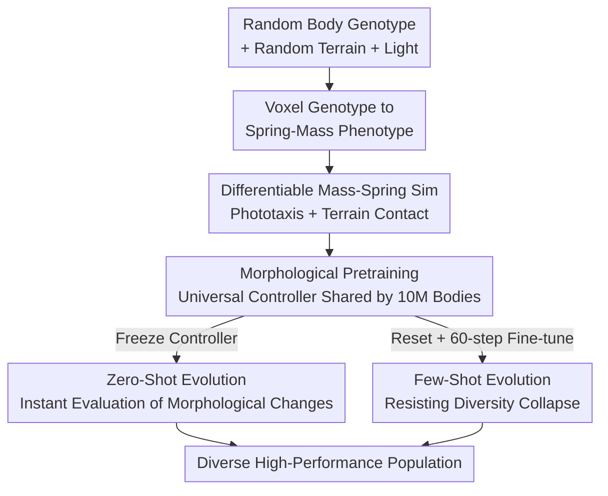

# Accelerated co-design of robots through morphological pretraining

**Conference**: ICLR2026  
**OpenReview**: [https://openreview.net/forum?id=WVliGyFwZv](https://openreview.net/forum?id=WVliGyFwZv)  
**Code**: Project website provides videos and code (link on the final page of the paper)  
**Area**: Robotics / Morphological-Control Co-design  
**Keywords**: Co-design, Differentiable Simulation, Morphological Pretraining, Universal Controller, Evolutionary Algorithms

## TL;DR
This paper introduces "morphological pretraining": a morphology-agnostic universal controller is pretrained once across tens of millions of robot bodies using differentiable simulation. This frozen (or slightly fine-tuned) controller then enables zero-shot evaluation of arbitrary morphological changes, accelerating robot "body+brain" co-design by an order of magnitude and demonstrating, for the first time, that evolutionary "crossover" can produce offspring superior to their parents.

## Background & Motivation
**Background**: Robot co-design requires simultaneous optimization of physical morphology and neural control. The prevailing approach uses Reinforcement Learning (RL) to learn a separate control policy for each candidate body, as changing a single morphological part alters the control gradients entirely.

**Limitations of Prior Work**: RL requires massive interaction data to approximate control policies in non-differentiable simulations. During evolution, morphological changes necessitate relearning controllers repeatedly, leading to a computational explosion. Consequently, the field has struggled for thirty years—most work is limited to exploring thousands of morphologies on "rigid stick-figures with fewer than a dozen parts." While soft robots have many components, they often lack actuators and intelligent sensing, and are frequently restricted to 2D environments.

**Key Challenge**: The "learning a separate controller for every body" paradigm is the bottleneck: it nests morphology search (outer, discrete, non-differentiable) with control learning (inner, data-intensive), requiring a full training cycle for every step in the outer loop. More subtly, attempting to "simultaneously co-learn a universal controller from scratch" leads to **diversity collapse**, where the population converges to similar morphologies that are easier for a single shared controller to manage, reducing co-design to "training a controller for a single design."

**Goal**: (1) Make the controller "immune" to morphology, eliminating the need for retraining on new bodies; (2) Enable instant evaluation of non-differentiable changes like adding, removing, or recombining body parts; (3) Solve/leverage diversity collapse to achieve high performance while maintaining morphological diversity.

**Key Insight**: Drawing from the success of large-scale pretraining in CV/NLP—if language models can pretrain universal capabilities on massive corpora, why can’t controllers pretrain "universal driving skills" on massive bodies? The key is **differentiable simulation**: it provides direct gradients for controller parameters, making it feasible to "average gradients across millions of bodies," a scale unattainable for RL due to the lack of gradient information.

**Core Idea**: Use differentiable simulation to pretrain a morphology-agnostic universal controller on 10M+ bodies to obtain a "prior brain." Subsequently, freeze this controller for **zero-shot evolution** (instant evaluation of morphological changes) or perform **few-shot evolution** with minor per-generation fine-tuning, thereby completely decoupling control learning from the inner loop of morphological search.

## Method

### Overall Architecture
The method consists of three integrated stages: defining robot encoding and simulation within a unified "body space → physical entity → differentiable environment" pipeline; **pretraining** a shared universal MLP controller on millions of random bodies, terrains, and light sources to learn how to drive nearly any morphology toward a goal (phototaxis); and finally using this controller as a prior for a standard Genetic Algorithm (GA) to evolve the body population. Freezing the controller enables **zero-shot evolution**, while resetting and fine-tuning for 60 steps per generation enables **few-shot evolution**. The pipeline takes "random body genotypes + random environments" as input and outputs "a population of high-performance diverse evolved bodies + a controller that drives them."

### Key Designs

**1. Voxel Genotype to Spring-Mass Phenotype: Making bodies both evolvable and differentiable**

Bodies are encoded as $6\times6\times4$ binary voxel genotypes $G$. Each occupied voxel maps to a $10\,\text{cm}^3$ cubic unit in the physical phenotype $P$, with masses at the eight corners and springs along the edges and face diagonals. Adjacent voxels share interface masses and springs to ensure structural cohesion. The workspace accommodates up to $|M|=245$ masses and $|S|=1648$ springs. This design bridges discrete, bit-flip/XOR-recombining genotypes (suitable for evolution) with continuous mass-spring physical bodies (suitable for differentiable simulation). The authors also handle symmetries (90° rotations, x/y mirroring) using lexicographical normalization to avoid redundant body representations.

**2. Morphology-Agnostic Universal Controller: Using input/output masking for any body**

The controller is a simple MLP (input: 250 dimensions = 245 mass light sensors + 5 CPG sine waves; three 256-unit hidden layers; output: 1648 dimensions for all possible springs; 620,912 parameters). To handle varying sensor/actuator counts across bodies, the input and output dimensions are fixed to $|M|$ and $|S|$ respectively. **Sensors or actuators not present in a specific body are masked to zero.** This provides "implicit morphological conditioning" through the observation and action space masking; the network learns the body structure by detecting "active" channels. Light readings are zero-centered by subtracting the mean of all active sensors to provide an "embodied irradiance gradient." Springs operate according to Hooke's Law $F=k(L-L_0)$, where the rest length $L_0$ is driven within $\pm20\%$ of its nominal value.

**3. Large-Scale Morphological Pretraining: Averaging gradients over 10M+ bodies**

The controller is pretrained for 1400 steps across 10 million distinct bodies, where each sample (random body, terrain, and light source) is **seen only once**. The objective is to minimize the batch mean of $d_1/d_0$, where $d_0$ and $d_1$ are the initial and final distances to the light source. This relative distance formulation incentivizes both far-away and nearby individuals equally. Simulation is implemented in Taichi, performing end-to-end backpropagation over 1000 physical steps ($dt=0.004\text{s}$). Gradients are averaged across variations in bodies, worlds, and targets (Batch size 8192 on 8x H100). This scale is unique to differentiable simulation; convergence is reached in 57 minutes, with loss dropping from 1.0 to approximately 0.3 (completing 70% of the initial distance).

**4. Zero-Shot / Few-Shot Evolution: Decoupling control from morphological search**

With a pretrained prior, evolution focuses purely on morphology. **Zero-shot evolution**: The controller is frozen while a GA evolves 8192 individuals (25% bit-flip mutation, 75% XOR **crossover**). Since the controller is static, morphological changes can be evaluated **instantly**. However, this leads to diversity collapse, producing "clones" optimized for the fixed pretrained model. **Few-shot evolution** addresses this: at the start of each generation, the controller weights are **reset to the pretrained values**, and the optimizer is reset before fine-tuning for 60 steps on the current population (30 for parents, 30 for offspring). This "reset-and-slight-finetune" strategy surprisingly maintains and **significantly increases** diversity while achieving superior performance, as the controller adapts to the "current population" rather than forcing the population to accommodate a fixed controller.

### Loss & Training
The pretraining loss is the batch mean of the relative distance ratio $d_1/d_0$. Optimization uses Adam ($\beta_1=0.9, \beta_2=0.999$, gradient clipping 1.0) with cosine annealing learning rate restarts (initial $1\mathrm{e}{-3}$, minimum $1\mathrm{e}{-5}$, period doubling after each restart). Few-shot fine-tuning uses $3.5\mathrm{e}{-4}/3.5\mathrm{e}{-5}$ with a period of 100 truncated at 60 steps.

## Key Experimental Results

### Main Results
Performance and diversity comparison across three co-design paradigms (Diversity = normalized mean pairwise Hamming distance in genotype space):

| Paradigm | Pretrained | Convergence (Steps/Time) | Performance | Diversity |
|----------|------------|---------------------------|-------------|-----------|
| Morphological Pretraining | — | 1400 steps / 57 min | Loss 1.0→0.3 (70% Gain) | Covers heterogeneous bodies |
| Zero-Shot Evolution | Yes (Frozen) | 100 gen / 17 min | Rapidly nears optimum | Collapse (Clones) |
| Few-Shot Evolution | Yes (Reset+60 steps) | ~18 gen / 53 min | Best and continuously improving | Significant increase & sustained |
| Simultaneous Co-design (Li et al. 2025) | No | <180 gen / 109 min | Similar training loss | Rapid collapse |

Key takeaway: Few-shot evolution at Gen 6 (G6) and zero-shot at Gen 31 (G31) already match or exceed the performance of Simultaneous Co-design at Gen 180 (G180).

### Ablation Study
Simultaneous co-design serves as an ablation by removing pretraining and resetting:

| Configuration | Performance | Diversity | Note |
|---------------|-------------|-----------|------|
| Few-Shot (Full) | Best | Significantly increases | Pretraining + Reset-finetune |
| Zero-Shot (No Finetune) | Rapid near-optimum | Collapse | Pretrained only |
| Simultaneous (No Pretrain/Finetune) | Slower, needs G180 | Rapid collapse | Prev. SOTA (Li et al. 2025) |

### Key Findings
- **Diversity collapse is an inherent pathology of co-design**: When a population adapts to a shared controller (frozen or learned from scratch), evolution collapses to a single "species."
- **"Reset-and-finetune" is the cure**: By forcing the controller to adapt to the current population, diversity increases spontaneously without explicit selection pressure.
- **Pretrained controllers unlock effective crossover**: In zero-shot evolution, improvements in offspring can be attributed solely to morphological recombination, providing rare evidence that "recombination produces superior offspring" in robot evolution (Fig 5: Parent loss 0.257/0.593 → Offspring 0.073).
- **Robustness & Generalization**: The controller remains functional when failing 1/4 of motors or over half of sensors. Zero-shot evolution can adapt bodies to discrete platforms or magnetic-field targets without fine-tuning the controller.
- **Emergence of Saltation**: The universal controller discovered a kangaroo-like **saltation** (jumping) gait with distinct flight phases, which differs from gaits typically designed for single bodies.

## Highlights & Insights
- **Applying the "Pretraining Paradigm" to Co-design**: The core insight is that relearning controllers is the bottleneck; differentiable simulation enables "universal pretraining" that is unattainable with RL.
- **Masking as Morphological Conditioning**: Masking inputs/outputs allows a fixed-dimension MLP to control thousands of bodies, suggesting that many "custom-net" scenarios can be replaced by shared backbones + masking.
- **Identifying a New Pathology**: Characterizing "diversity collapse" and providing a simple "reset-to-pretrained" cure is a major contribution.
- **Directionality of Adaptation**: Whether the population adapts to the controller or vice versa determines the survival of diversity.

## Limitations & Future Work
- **Ours** considers single material (soft), single sensing (light), single actuator (linear springs), and single task (phototaxis). Future work should address multi-task/multi-material scenarios.
- **Sim-to-real**: Experiments were conducted only in simulation. Real-world transfer may require higher resolution or noise modeling.
- **Dependency on Differentiable Simulation**: The method requires an analytical gradient, which may not be available for all contact-heavy or fluid environments.

## Related Work & Insights
- **Vs. Simultaneous Co-design (Li et al. 2025)**: They inherit controllers across generations; *Ours* uses large-scale pretraining. The key difference is adaptation direction—theirs forces the population to adapt to the controller (causing collapse), while *Ours* forces the controller to adapt to the population (preserving diversity). *Ours* achieves G180-level performance by G6 or G31.
- **Vs. RL General Controllers (MetaMorph, etc.)**: RL methods approximate universal policies on small, pre-designed sets of morphologies. *Ours* leverages differentiable simulation to pretrain on a scale (10M+) impossible for RL.

## Rating
- Novelty: ⭐⭐⭐⭐⭐ Introduces pretraining to co-design and solves diversity collapse with a novel paradigm.
- Experimental Thoroughness: ⭐⭐⭐⭐ Extensive comparisons and robustness tests, though limited to simulation.
- Writing Quality: ⭐⭐⭐⭐⭐ Very clear logic and effective visualization of mechanisms.
- Value: ⭐⭐⭐⭐⭐ Significantly improves efficiency and scale; the methodology is highly transferable.

<!-- RELATED:START -->

## Related Papers

- [\[ICLR 2026\] House Of Dextra : Cross-Embodied Co-Design for Dexterous Hands](house_of_dextra_cross-embodied_co-design_for_dexterous_hands.md)
- [\[CVPR 2026\] Spatial-Aware VLA Pretraining through Visual-Physical Alignment from Human Videos](../../CVPR2026/robotics/spatial-aware_vla_pretraining_through_visual-physical_alignment_from_human_video.md)
- [\[ICLR 2026\] Disentangled Robot Learning via Separate Forward and Inverse Dynamics Pretraining](disentangled_robot_learning_via_separate_forward_and_inverse_dynamics_pretrainin.md)
- [\[ICLR 2026\] BOLT: Decision‑Aligned Distillation and Budget-Aware Routing for Constrained Multimodal QA on Robots](bolt_decisionaligned_distillation_and_budget-aware_routing_for_constrained_multi.md)
- [\[ICLR 2026\] MetaVLA: Unified Meta Co-Training for Efficient Embodied Adaptation](metavla_unified_meta_co-training_for_efficient_embodied_adaptation.md)

<!-- RELATED:END -->
