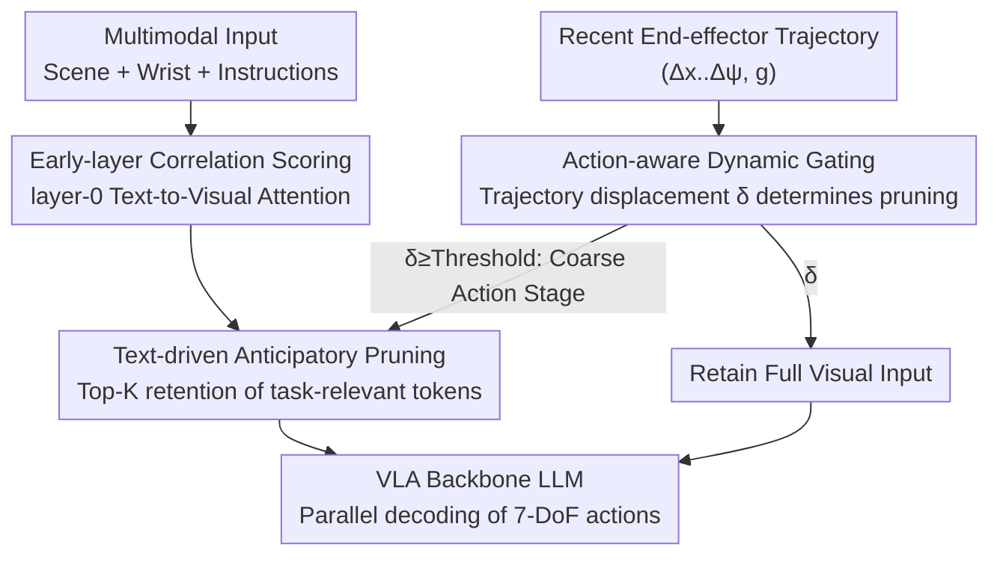

# Action-aware Dynamic Pruning for Efficient Vision-Language-Action Manipulation

**Conference**: ICLR 2026  
**OpenReview**: [https://openreview.net/forum?id=ea6j8k8Rnw](https://openreview.net/forum?id=ea6j8k8Rnw)  
**Code**: To be confirmed (Project page noted as available in the paper)  
**Area**: Robotics / Embodied AI / VLA Efficiency  
**Keywords**: VLA Models, Visual Token Pruning, Action-aware, Inference Acceleration, Robot Manipulation

## TL;DR
Addressing the issue of excessive visual tokens in Vision-Language-Action (VLA) models that consume attention computation during inference, this paper proposes ADP (Action-aware Dynamic Pruning). It utilizes text correlation for anticipatory pruning of task-related visual tokens and uses recent motion magnitude of the robot's end-effector as a gating signal. This enables aggressive pruning during coarse action stages (high displacement) to save computation and restores full visual input during fine manipulation stages (low displacement) to maintain precision. It accelerates OpenVLA-OFT by 1.35× on LIBERO with negligible success rate loss and reduces real-world robot latency to 1.49×.

## Background & Motivation
**Background**: The mainstream VLA pipeline involves a "visual encoder producing dense visual tokens $\rightarrow$ a projector aligning them to the language space $\rightarrow$ an LLM fusing multimodal data to generate robot actions autoregressively or in parallel." A single frame often includes dual images from scene and wrist cameras, resulting in a large number of visual tokens—far exceeding text and action tokens.

**Limitations of Prior Work**: Many of these visual tokens are only weakly related to the current operation but significantly lengthen the input sequence, increasing FLOPs, memory usage, and latency. This also dilutes the attention mechanism's focus on truly critical cues. Existing acceleration work falls into two categories: training-related lightweight/structured pruning (RoboMamba, DeeR-VLA, Mole-VLA) and training-free cache reuse or attention pruning (VLA-Cache, EfficientVLA, FastV).

**Key Challenge**: Almost all these methods use "single-layer heuristics" or "static rules" to apply pruning uniformly across all time steps, ignoring the fact that redundancy varies throughout different stages of robot manipulation. The key observation of this paper is that **visual redundancy is "action-aware"**. In coarse-grained stages (e.g., reaching or moving), global displacement dominates and local details are less critical, allowing for bold pruning. In fine stages (e.g., grasping or alignment), local geometry and details determine success; excessive pruning leads to failure and cumulative error propagation that crashes the task. Static rules either prune too little (saving little) or too much (dropping accuracy), which is particularly problematic in multi-view scenarios.

**Goal**: To make pruning sensitive to both "instruction semantics" and "instantaneous action states"—selecting the right tokens and deciding the right timing for pruning.

**Key Insight**: The relevance of visual patches is determined not only by text conditions (instruction semantics) but also by action conditions (instantaneous motion of the end-effector and gripper state). Motion magnitude itself is a cost-free signal capable of distinguishing between coarse and fine stages.

**Core Idea**: A combination of "text-driven token selection" and a "trajectory motion magnitude gating switch" for plug-and-play dynamic pruning—pruning during large movements and retaining full input during small movements.

## Method

### Overall Architecture
ADP is a plug-and-play module placed before the VLA backbone LLM. It operates through two parallel decision chains: **Content Selection**, which calculates correlation with text to retain task-relevant tokens before the multimodal sequence enters the LLM, and **Timing Control**, which reads the motion magnitude of recent end-effector trajectories to decide whether to prune at the current step. After merging these chains, the system either feeds a pruned short sequence to the LLM (saving computation) or retains the full visual sequence (ensuring precision). The LLM then decodes 7-DoF actions in parallel. Pruning occurs at the embedding stage before the LLM, benefiting all Transformer layers.

### Key Designs

**1. Text-driven Anticipatory Pruning: Letting Instructions Select Visual Tokens**

The pain point is that many dense visual tokens are irrelevant to the current instruction. ADP calculates "relevance scores" for visual tokens before they undergo deep fusion in the LLM. Specifically, it takes the hidden states $H^{(l)}$ of a certain layer, splits them into visual subsets $H^{(l)}_{vis}$ and text subsets $H^{(l)}_{txt}$, and obtains text queries and visual keys using projection matrices: $Q^{(l)}=H^{(l)}_{txt}W^{(l)}_Q$, $K^{(l)}=H^{(l)}_{vis}W^{(l)}_K$. It then calculates scaled dot-product similarity $A^{(l)}=Q^{(l)}(K^{(l)})^\top/\sqrt{d}$, where each term measures "the attention a text token pays to a specific visual patch." By averaging across all attention heads and text queries, a global importance score is derived for each visual token:

$$\Phi^{(l)}(v)=\frac{1}{N_h\cdot L_{txt}}\sum_{h=1}^{N_h}\sum_{t=1}^{L_{txt}}A^{(l)}_{h,t,v}$$

Next, a Top-K retention is performed based on the ratio $\rho$: $k=\lfloor\rho\cdot L_{vis}\rfloor$. Discarded patches are removed from the sequence, and the remaining tokens are recombined with `[BOS]`, text, proprioception, and action placeholders for the LLM. In multi-view scenarios, a weight vector $\alpha$ ($\sum_c\alpha_c=1$) allocates the retention quota across views, $k_c=\lfloor\alpha_c\cdot k\rfloor$. Empirically, a 4:6 ratio for scene vs. wrist camera is used, allowing non-uniform pruning based on importance. "Anticipatory" refers to pruning redundant tokens **before** deep fusion occurs, saving computation throughout all Transformer layers.

**2. Action-aware Dynamic Gating: Deciding When to Prune Using Motion Magnitude**

Selecting tokens is not enough—not every stage is suitable for a sparse set. Fine manipulation failure occurs if local details are lost. This design quantifies whether the robot is performing "coarse work" or "fine work" into a scalar gating signal. Each decoded action chunk is treated as a time window $[b_i, e_i]$, where each step $a^c_{i,u}=[\Delta x,\Delta y,\Delta z,\Delta\phi,\Delta\theta,\Delta\psi,g]^\top$ includes translation, rotation increments, and gripper commands. Through forward kinematics inside the window, these increments are integrated into end-effector positions $p_t$. The sum of Euclidean displacements within the window is calculated as the motion magnitude:

$$\delta_i=\sum_{t=b_i}^{e_i-1}\lVert p_{t+1}-p_t\rVert_2$$

Using $\delta_i$, a binary state $s_i\in\{0,1\}$ (0=full visual, 1=pruned) is defined via threshold rules. The simplest is a "Running Mean" rule: $s_{i+1}=1$ if $\delta_i\ge\bar\delta_i$, else 0, where $\bar\delta_i=\frac{1}{i}\sum_{j=1}^i\delta_j$. The paper actually adopts a more sensitive **Adjacent Extreme Rule**: taking the maximum $U^{(i)}$ and minimum $V^{(i)}$ of the most recent $\mathrm{\tau}$ windows. If $\delta_i\ge U^{(i)}$, it prunes; if $\delta_i\le V^{(i)}$, it uses full visual input; if in between, it maintains the previous state $s_i$. This allows rapid response to local transitions. The intuition is clean: large motion = coarse stage = high redundancy = prune to save FLOPs; decreased motion = fine manipulation = keep full visual. To prevent error accumulation, stability constraints are added: **Cold Start** (first two windows forced to full visual), **Continuous Pruning Meltdown** (forcing full visual after three consecutive pruned windows), and deterministically setting the state to 1 in the middle range of the Adjacent Extreme Rule to further save FLOPs.

**3. Layer-0 Scoring: Relevance Signals are Cleaner in Shallow Layers**

A counter-intuitive but key choice is calculating the importance score $\Phi$ at **Layer 0** instead of deep layers. While it is commonly believed that text-visual alignment happens in deep multimodal layers, this study finds otherwise for parallel-decoding VLAs. Visualizations show that the visual self-similarity matrix at Layer 0 presents clear high-contrast block structures, and the text-to-visual submatrix exhibits distinct peaks and valleys (high signal-to-noise ratio). Deeper layers tend to move toward diagonal-band patterns, suppressing non-local correlations and making Top-K ranking sensitive to local noise. Ablations (Table 3b) confirm Layer 0 provides the best accuracy-computation balance (96.3% / 6.43 FLOPs, better than Layer 1's 95.5% and Layer 4's 95.8%), with deeper scoring increasing FLOPs.

### Loss & Training
ADP is a **training-free** plug-and-play inference-time method. it introduces no additional learnable parameters and requires no retraining of the VLA backbone. Scoring and gating logic are simply inserted at the embedding stage. The paper provides a complexity analysis: FLOPs for a single Transformer layer are approx $F(S;D,M)\approx 2S^2D+8SD^2+6SDM$. Pruning shortens the sequence from $S$ to $S'=1+k+L_{prop}+L_{txt}+L_{act}+1$. The scoring overhead $F_{score}=2L_{txt}D^2+2L_{vis}D^2+2N_hL_{txt}L_{vis}d$ is relatively lightweight. For an episode with $T$ forwards where a fraction $\gamma$ is pruned: $E[F_{episode}]=T(\gamma F_{ADP}+(1-\gamma)F_{base})$, with expected savings $E[\Delta F_{episode}]=T\gamma\Delta F_{ADP}$.

## Key Experimental Results

### Main Results
Using OpenVLA-OFT (7B, parallel decoding) as the base on four LIBERO suites:

| Method | Retention Ratio | Avg. SR | FLOPs↓ | Speedup↑ |
|:---|:---|:---|:---|:---|
| OpenVLA-OFT (base) | 100% | 97.1% | 7.91 | 1.00× |
| FastV (+OFT) | — | 86.8% | 6.37 | 1.24× |
| VLA-ADP | 30% | 94.4% | 5.85 | 1.35× |
| VLA-ADP | 40% | 94.8% | 6.14 | 1.29× |
| VLA-ADP | 50% | 96.3% | 6.43 | 1.23× |
| VLA-ADP | 70% | 96.3% | 7.03 | 1.13× |

At 50–70% retention, the average success rate drops by $\le 0.9\%$ while achieving up to 1.23× acceleration. Even at 30–40%, it maintains 94.4-94.8% with 1.29–1.35× speedup. In contrast, FastV with similar retention averages only 86.8%, and random dropping yields poor results on Object/Long tasks, proving ADP's "accurate selection and right timing" is effective.

Real-world robot experiments (Jaco2 platform, pick/place/wipe tasks):

| Method | Avg. SR | Latency↓ | Speedup↑ |
|:---|:---|:---|:---|
| OpenVLA-OFT (base) | 85.8% | 76.9 | 1.00 |
| VLA-ADP (Ours) | 88.3% | 51.8 | 1.49× |

On real robots, the success rate actually improved from 85.8% to 88.3%, with latency reduced to 1.49×.

### Ablation Study

| Configuration | Avg. SR | $\rho_{avg}$ | FLOPs↓ | Description |
|:---|:---|:---|:---|:---|
| ADP (Full) | 96.3% | 0.22 | 6.43 | Text pruning + Action gating |
| w/o D | 93.45% | 0.25 | 6.23 | No dynamic gating (static pruning) |
| w/o D + PS | 89.9% | 0.50 | 4.55 | Periodic switching |

### Key Findings
- **Dynamic gating is core**: Removing it (w/o D) drops the average SR by 2.85 points with almost no computation change. Changing to periodic switching (w/o D + PS) is worse, with Object tasks plummeting to 81.4% (vs. 98.0% for ADP). Adaptive switching based on motion prevents over-pruning during fine stages.
- **Layer-0 scoring is optimal**: Layer 0 provides the best balance. Deeper layers increase FLOPs and slightly decrease SR, confirming that deep attention becomes overly localized and noise-sensitive.
- **Redundancy differs between stages**: In simpler spatial operational scenarios (Spatial suite), ADP achieved 99.4%, showing it can boldly prune redundancy while retaining critical information in simple tasks.

## Highlights & Insights
- **Linking action to pruning signals**: Using end-effector displacement as a gating switch is a robot-centric insight. Visual redundancy is strongly correlated with action dynamics, making motion magnitude a cost-free and physically interpretable "coarse/fine stage detector."
- **Counter-intuitive early-layer scoring**: Challenging the common belief that text-visual alignment is deep, the paper demonstrates that Layer-0 correlation signals have the highest signal-to-noise ratio, which is both accurate and computationally efficient.
- **Training-free and Plug-and-play**: It requires no weight changes or retraining of the backbone, allowing for low-cost deployment on existing VLA models.
- **Robust stability engineering**: Details like Cold Start, Continuous Pruning Meltdown, and 4:6 view allocation specifically address the lethal problem of error accumulation in fine robot manipulation.

## Limitations & Future Work
- **Heuristic gating rules**: Thresholds based on running means or adjacent extremes involve hyperparameters ($\tau$, cold start windows, meltdown thresholds) that might require retuning for different platforms or tasks.
- **Dependency on kinematics**: Gating relies on integrating trajectories from action chunks, which requires modifying forward kinematics definitions for non-7-DoF or non-Cartesian VLAs.
- **Acceleration limits**: Pruning only applies to visual tokens before the LLM. Speedup comes from sequence length reduction; visual encoder and projector overheads remain untouched, setting a floor for FLOPs.
- **Evaluation scale**: Real-world tests were limited to 4 tasks, and simulation centered on LIBERO. Validity in long-range, high-DoF, or dual-arm scenarios remains to be verified.

## Related Work & Insights
- **vs EfficientVLA / FastV**: While these also prune visual tokens based on attention, they use single-layer heuristics and static rules. ADP differs by adding "action-aware dynamic gating," which allows it to avoid the performance collapse FastV suffers on long-range tasks (73.0% $\rightarrow$ 84.2%+).
- **vs VLA-Cache**: VLA-Cache saves computation by reusing KV caches across time steps (temporal reuse). ADP focuses on spatial selection and timing gating. The two are orthogonal and could theoretically be combined.
- **vs DeeR-VLA / Mole-VLA / RoboMamba**: These involve training-related structured pruning or architectural changes. ADP is training-free with lower deployment costs, though its speedup upper bound is constrained by the frozen backbone.

## Rating
- Novelty: ⭐⭐⭐⭐ The observation that "visual redundancy is action-aware" and the use of end-effector trajectories as a gating signal are novel and physically intuitive.
- Experimental Thoroughness: ⭐⭐⭐⭐ Comprehensive testing across LIBERO suites with real-robot validation and detailed ablations.
- Writing Quality: ⭐⭐⭐⭐ Clear chain of logic (motivation-observation-method) with solid complexity analysis and visualization.
- Value: ⭐⭐⭐⭐ Directly useful for real-time VLA deployment with its training-free nature and significant speedup without accuracy loss.

<!-- RELATED:START -->

## Related Papers

- [\[ICML 2026\] SpecPrune-VLA: Accelerating Vision-Language-Action Models via Action-Aware Self-Speculative Pruning](../../ICML2026/robotics/specprune-vla_accelerating_vision-language-action_models_via_action-aware_self-s.md)
- [\[ICLR 2026\] Hybrid Training for Vision-Language-Action Models](hybrid_training_for_vision-language-action_models.md)
- [\[ICLR 2026\] UniVLA: Unified Vision-Language-Action Model](unified_vision-language-action_model.md)
- [\[ICLR 2026\] TwinVLA: Data-Efficient Bimanual Manipulation with Twin Single-Arm Vision-Language-Action Models](twinvla_data-efficient_bimanual_manipulation_with_twin_single-arm_vision-languag.md)
- [\[ICLR 2026\] Vision-Language-Action Instruction Tuning: From Understanding to Manipulation](vision-language-action_instruction_tuning_from_understanding_to_manipulation.md)

<!-- RELATED:END -->
