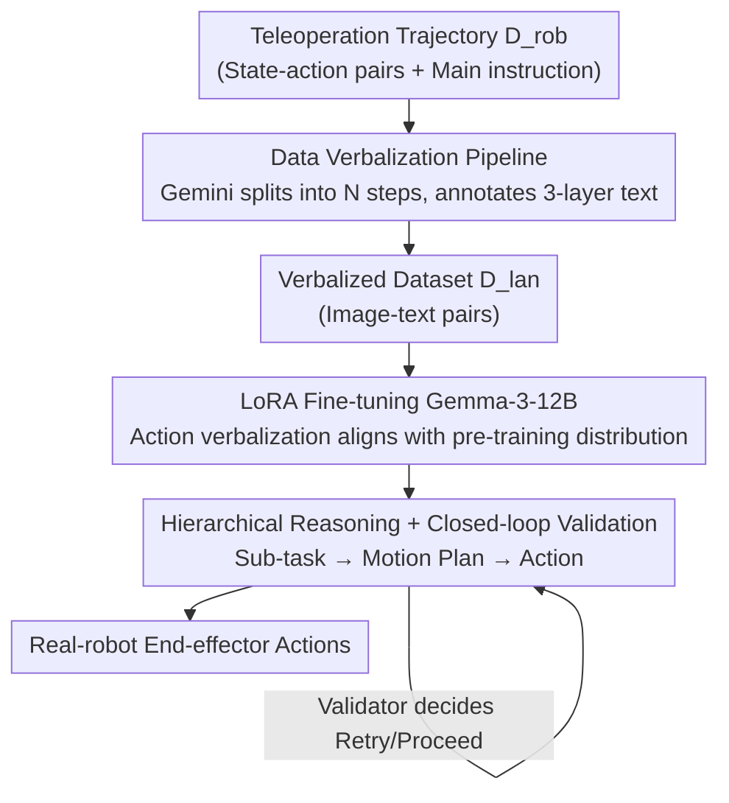

# Actions as Language: Fine-Tuning VLMs into VLAs Without Catastrophic Forgetting

**Conference**: ICLR 2026  
**OpenReview**: [https://openreview.net/forum?id=sFO9d6XSlf](https://openreview.net/forum?id=sFO9d6XSlf)  
**Code**: None  
**Area**: Robotics / Embodied AI / Multimodal VLM  
**Keywords**: VLA, Catastrophic Forgetting, LoRA, Action Verbalization, Hierarchical Reasoning

## TL;DR
By verbalizing low-level robot end-effector actions into natural language text and feeding them into a VLM, the fine-tuning data is aligned with the pre-training distribution. This allows converting Gemma-3-12B into a robotic policy (VLA) using only LoRA. In 800+ real-robot experiments, the model retains 85%+ of its VQA capability and achieves zero-shot generalization for multilingual instructions and open-world semantics.

## Background & Motivation

**Background**: Fine-tuning pre-trained Vision-Language Models (VLMs) on robotic teleoperation data to create "Vision-Language-Action" (VLA) models is the mainstream paradigm for training general-purpose robotic policies. Representative works such as OpenVLA, π0, and RT-2 either discretize continuous actions into tokens or attach external diffusion/flow-matching action heads to regress continuous actions directly.

**Limitations of Prior Work**: Both mainstream approaches require **modifying the VLM architecture or vocabulary**, followed by **full-parameter fine-tuning**. Consequently, models suffer from severe overfitting to narrow robotic data, erasing the general world knowledge acquired during pre-training—a phenomenon known as "catastrophic forgetting." A comparison in the paper illustrates this: when asked "Is it safe for the robot to clean the counter near a person?", a standard VLM answers "No, it risks hitting the person," while a standard VLA only outputs action vectors like `[0.1, 0.4, ...]`, completely losing its semantic reasoning ability. This leads to poor generalization in downstream tasks involving unseen objects, different languages, or distractors.

**Key Challenge**: The authors attribute the root cause to **distribution mismatch**—a gap exists between low-level action spaces in teleoperation data (continuous vectors mapped to arbitrary tokens) and the internet-scale pre-training corpora (images and text) of VLMs. This gap forces researchers to use full-parameter fine-tuning for hard fitting, which triggers forgetting. Existing mitigation techniques (co-training with massive non-robotic data, MoE with stop-gradients, or frozen phased training) are either expensive or require careful tuning of data ratios, treating the symptoms rather than the cause.

**Goal**: To learn robotic control while preserving the VLM's world knowledge **without co-training or architectural changes**.

**Key Insight**: The authors observe that parameter-efficient methods like LoRA can naturally prevent catastrophic forgetting, provided the **fine-tuning data is sufficiently close to the model's existing representation space**. Instead of modifying the model to accommodate action data, it is more effective to **eliminate the mismatch at the data level**. Fig. 3 supports this: the un-tuned Gemma-3-12B assigns significantly higher log-probabilities to "actions described in language" than to "actions mapped to the least likely tokens."

**Core Idea**: Represent low-level actions **directly as natural language text** (e.g., treating "move forward by 4.2 cm" as a standard string). This aligns VLA fine-tuning data with the VLM pre-training distribution, allowing adaptation through LoRA alone and fundamentally avoiding catastrophic forgetting.

## Method

### Overall Architecture

VLM2VLA is a "data pipeline + training paradigm" where the core principle is: **translate robotic trajectories into natural language at the data level first, then fine-tune using LoRA without modifying the VLM backbone**.

The pipeline consists of two stages. **Offline Data Side**: A set of human teleoperation trajectories (using a Bridgev2 subset) is used, where each trajectory is a state-action sequence $\tau=\{(o_t,a_t)\}_{t=0}^{T}$ with a high-level task instruction $L$. Gemini 2.5 is used to automatically decompose each trajectory into $N$ steps, with each step annotated with three layers: "sub-task description $l_i$ / motion plan $m_i$ / action block $\bar a_i$," resulting in a new dataset $D_{lan}$. This step transforms "state-action pairs" into "image-text pairs," reframing robot control as a **standard supervised fine-tuning task**. **Model Side**: Gemma-3-12B-IT is fine-tuned using LoRA (applied to all linear layers) with cross-entropy loss to learn the three-layer reasoning chain. **Inference Side**: At test time, the model generates text autoregressively following the "sub-task → motion plan → action" hierarchy. A Gemini 2.5 Pro validator determines in a closed loop whether to "retry the current sub-task" or "proceed to the next."

### Key Designs

**1. Action Verbalization: Representing low-level actions as text to eliminate distribution mismatch**

This is the foundation of the work, targeting the "mismatch between continuous actions/arbitrary tokens and VLM image-text distributions." Previous VLAs chose either discretization (mapping actions to unlikely tokens) or external action heads (adding randomly initialized parameters). The former creates "gibberish tokens" unseen by the VLM, while the latter introduces parameters that pollute pre-trained representations. VLM2VLA takes a third path: expressing both high-level and low-level actions **using the VLM's existing natural language vocabulary**. For instance, "move forward by 4.2 centimeters" is a standard text string. This approach leverages the VLM's inherent understanding of **numerical magnitudes**, grounding them in physical space. Quantitative evidence shows that before fine-tuning, Gemma assigns significantly higher average log-probabilities to verbalized actions than to tokenized ones (Fig. 3). Thus, LoRA provides sufficient perturbation; the backbone weights remain largely untouched, preventing forgetting.

**2. Three-stage Hierarchical Reasoning + Closed-loop Validator: Framing action prediction as a VQA-style reasoning chain**

The authors model action prediction as a **three-stage hierarchical reasoning** process corresponding to a factored distribution:

$$p_\theta(\bar a_i, m_i, l_i \mid \bar o_i, L) = \underbrace{p_\theta(l_i \mid \bar o_i, L)}_{\text{Sub-task Prediction}} \; \underbrace{p_\theta(m_i \mid l_i, \bar o_i)}_{\text{Motion Planning}} \; \underbrace{p_\theta(\bar a_i \mid m_i, l_i, \bar o_i)}_{\text{Action Generation}}$$

- **High-level Sub-task $l_i$**: Given observations and the instruction, the model describes the immediate sub-task to be completed.
- **Mid-level Motion Plan $m_i$**: Generates a coarse-grained, direction-only plan (e.g., "left," "down and slightly forward") to utilize the VLM’s latent spatial reasoning.
- **Low-level Action Generation $\bar a_i$**: Outputs variable-length action blocks (a list of lists containing text commands for translation degrees of freedom).
In practice, the model generates all $N$ sub-tasks based on the initial observation $\bar o_0$. To improve robustness, a **Gemini 2.5 Pro validator** acts in a closed loop after each action generation cycle to decide whether to retry or proceed until all sub-tasks are finished. This reasoning chain ensures the model "thinks before acting" on long-horizon tasks.

**3. Data Re-labeling Pipeline: Scaling via automated Gemini translation**

To teach the VLM this "spatially grounded reasoning chain," training data is required. Manually annotating thousands of trajectories is infeasible. VLM2VLA uses Gemini to automate re-labeling: each original trajectory $\tau$ is decomposed into $N$ steps, generating initial observations $\bar o_i$, sub-tasks $l_i$, motion plans $m_i$, and action blocks $\bar a_i$, forming $\bar\tau=\{(\bar o_i,l_i,m_i,\bar a_i)\}_{i=0}^{N-1}\in D_{lan}$. This step transfers the engineering burden of specialized decoders or complex co-training into a one-time, automatable data conversion. Once the data becomes standard image-text pairs, the process is standard SFT without architectural modifications.

### Loss & Training
LoRA is applied to all linear modules of Gemma-3-12B-IT, using standard **cross-entropy loss** on $D_{lan}$ for supervised fine-tuning. No action decoders are introduced, the vocabulary is unchanged, and no co-training or multi-stage training is required—embodying the "minimal backbone modification" philosophy.

## Key Experimental Results

The experiments address three questions: Q1: Does the model retain multimodal understanding? Q2: Is real-robot performance competitive? Q3: Does preserved knowledge enable OOD zero-shot generalization? Evaluations were conducted on a 6-DoF WidowX 250S arm in a toy kitchen environment, totaling 800+ trials.

### Main Results

**Multimodal Understanding (VQA Benchmarks, selected)**: Comparison between the base Gemma-3-12B-IT, fine-tuned VLM2VLA, and tokenized VLAs.

| Benchmark | Gemma-3-12B (Base) | VLM2VLA (Ours) | OpenVLA | ECoT |
|-----------|--------------------|----------------|---------|------|
| MMMU      | 46.0               | 42.7           | 26.3    | 26.6 |
| MMStar    | 46.3               | **48.0**       | 0       | 0    |
| MME       | 1182.3             | **1391.7**     | 0       | 0    |
| OCRBench  | 75.0               | 63.9           | 0       | 0.01 |
| MMB-en    | 76.9               | 68.5           | 0       | 3.7  |
| TextVQA   | 68.9               | 64.9           | 0       | 0    |
| DocVQA    | 80.6               | 78.4           | 0       | 0    |

OpenVLA and ECoT scores drop to near zero in most benchmarks, indicating catastrophic forgetting. VLM2VLA shows only slight decreases, retaining 85%+ base performance and even slightly exceeding the base on MMStar and MME.

**Real-Robot Success Rates (%, Fig. 5, 30 trials per cell, 90 for multilingual)**:

| Task | OpenVLA | ECoT | VLM2VLA-AT | VLM2VLA |
|------|---------|------|-----------|---------|
| Pick Up (ID) | **78** | 52 | 57 | 62 |
| Pick, Place & Lift (Sequential) | 77 | 58 | 43 | 62 |
| Pick and Place (ID Long-horizon) | 49 | 33 | 34 | **51** |
| Pick Up-T (Multilingual OOD) | 1 | 5 | 28 | **53** |
| Pick Up-A (Ash Ketchum OOD) | 0 | 0 | 30 | **60** |

On simple ID tasks, OpenVLA is strongest (benefiting from training on the larger Open-X-Embodiment), while VLM2VLA is competitive (62) → Addressing Q2. As task complexity and OOD requirements increase, VLM2VLA’s advantage grows—achieving 53% on multilingual instructions vs OpenVLA's 1%, and 60% on identifying the anime character "Ash Ketchum," where it is the only model with meaningful success → Addressing Q3.

### Ablation Study

The core ablation, VLM2VLA-AT, keeps everything identical but replaces "natural language" action representation with "Gemma's 10 least likely tokens."

| Configuration | Multilingual Pick Up-T | Ash Ketchum Pick Up-A | Description |
|---------------|-------------------------|-----------------------|-------------|
| VLM2VLA (Verbalized) | 53 | 60 | Full method |
| VLM2VLA-AT (Tokenized) | 28 | 30 | Similar VQA, but OOD success halved |

### Key Findings
- **LoRA is necessary but not sufficient to prevent forgetting**: VLM2VLA-AT's VQA scores are close to VLM2VLA, suggesting LoRA is the primary factor in avoiding forgetting. However, **action representation** is the differentiator for downstream robotic generalization.
- **Verbalization determines generalization**: Tokenization performs adequately on simple ID tasks but fails (30% vs 60%) in OOD scenarios (multilingual, open-world semantics). This indicates a disconnect between the VLM's latent world knowledge and fine-tuned action tokens, which verbalization bridges.
- **The harder the task, the greater the gap**: From ID to compositional to OOD tasks, VLM2VLA’s advantage over reactive policies (like OpenVLA) rises monotonically.

## Highlights & Insights
- **Reversing the Perspective**: Rather than modifying the architecture to fit action data, this work modifies the data to fit the model. A data-level change bypasses catastrophic forgetting in a "model-agnostic and easy-to-implement" way.
- **Reuse of Numerical Understanding**: Treating "move 4.2 cm" as text leverages the VLM’s pre-trained magnitude awareness for physical grounding, which is more elegant than using gibberish tokens.
- **Transferable Logic**: The strategy of "rewriting the target space into the pre-training distribution format to enable light-weight LoRA fine-tuning" can be generalized to any domain where the label space mismatches the base distribution.

## Limitations & Future Work
- **Inference Speed**: Autoregressive generation of actions is slow, with a median generation time per cycle of 6.1 seconds and high variance, precluding real-time control.
- **Translation Only**: The model currently only controls end-effector translation. Motion planning is coarse and lacks the precision for dexterous manipulation involving rotation.
- **Single Morphology**: Training was limited to a specific robot. Mapping other low-level controls like joint angles to spatial affordance remains unproven, though "language as a universal medium" may support cross-morphology in the future.
- **Dependency on External Validator**: The closed loop relies on Gemini 2.5 Pro, further slowing inference. Training the base VLM itself as a validator is a future goal.
- **Personal Observation**: VQA retention is measured relative to the base model; however, the base (Gemma-3-12B) is not the state-of-the-art in VQA (e.g., Molmo scores higher). "Preserving base capability" is distinct from "maximizing performance ceiling."

## Related Work & Insights
- **vs OpenVLA / RT-2 (Tokenization)**: These map continuous actions to unlikely tokens, creating a distribution shift that necessitates full-parameter fine-tuning. This work uses natural language, enabling LoRA and preventing forgetting.
- **vs π0 / MolmoAct (Action Heads + Co-training)**: These use external heads and large co-training datasets to combat forgetting, which is expensive. This work uses no decoders and no co-training.
- **vs ECoT (Embodied Chain-of-Thought)**: While ECoT also uses reasoning trajectories, it remains prone to catastrophic forgetting and may rely on heuristics (picking the most prominent object) for OOD tasks. VLM2VLA demonstrates true OOD understanding.
- **vs Driess et al. / Zhou et al. (MoE / Freezing)**: These use complex training mechanisms to shield weights from destructive gradients. This work suggests those mechanisms are unnecessary if actions are verbalized.

## Rating
- Novelty: ⭐⭐⭐⭐⭐ "Actions as Language" is a persuasive third path alongside discretization and external heads.
- Experimental Thoroughness: ⭐⭐⭐⭐ 800+ real trials and VQA benchmarks, though limited to single morphology/translation.
- Writing Quality: ⭐⭐⭐⭐⭐ Strong logical loop from motivation to observation to method.
- Value: ⭐⭐⭐⭐⭐ Provides a simple, low-cost, and reproducible path for forgetting-free VLA development.

<!-- RELATED:START -->

## Related Papers

- [\[ICLR 2026\] EVLP: Learning Unified Embodied Vision-Language Planner with Reinforced Supervised Fine-Tuning](evlp_learning_unified_embodied_vision-language_planner_with_reinforced_supervise.md)
- [\[NeurIPS 2025\] PROFIT: A Specialized Optimizer for Deep Fine Tuning](../../NeurIPS2025/robotics/profit_a_specialized_optimizer_for_deep_fine_tuning.md)
- [\[ICLR 2026\] Cosmos Policy: Fine-Tuning Video Models for Visuomotor Control and Planning](cosmos_policy_fine-tuning_video_models_for_visuomotor_control_and_planning.md)
- [\[ICLR 2026\] Vision-Language-Action Instruction Tuning: From Understanding to Manipulation](vision-language-action_instruction_tuning_from_understanding_to_manipulation.md)
- [\[ICLR 2026\] From Spatial to Actions: Grounding Vision-Language-Action Model in Spatial Foundation Priors](from_spatial_to_actions_grounding_vision-language-action_model_in_spatial_founda.md)

<!-- RELATED:END -->
