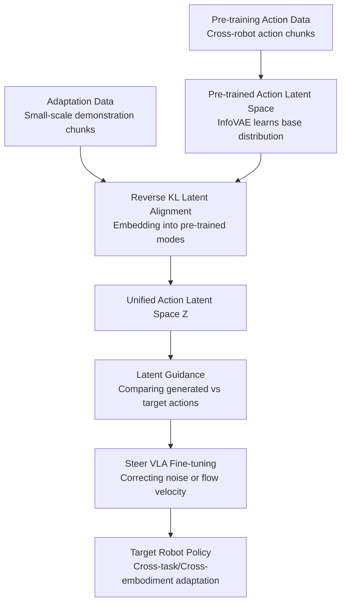

# Align-Then-stEer: Adapting the Vision-Language Action Models through Unified Latent Guidance

**Conference**: ICLR 2026  
**OpenReview**: [https://openreview.net/forum?id=T3i7Ifeatk](https://openreview.net/forum?id=T3i7Ifeatk)  
**Code**: https://github.com/TeleHuman/Align-Then-Steer  
**Area**: Robotics / VLA / Cross-Embodiment Policy Adaptation  
**Keywords**: [VLA Adaptation, Cross-Embodiment, Action Latent Space, Diffusion Policy, Flow Matching]

## TL;DR
ATE first aligns pre-trained robot actions and target robot actions into a single structured latent space. It then utilizes gradients generated from latent space distances to guide the fine-tuning of diffusion-based or flow-matching VLAs, enabling faster adaptation to new embodiments and tasks with limited demonstration data.

## Background & Motivation
**Background**: Vision-Language-Action (VLA) models are becoming a critical path for general-purpose robot manipulation. Typically, a VLA is pre-trained on large-scale cross-robot demonstration data (e.g., Open X-Embodiment, DROID, ALOHA) and then fine-tuned on small-scale data from target platforms and tasks. The model inputs visual observations, language instructions, and proprioceptive states to output continuous action chunks. Recent methods like RDT, Diffusion Policy, and $\pi_0$ model action prediction as diffusion generation or flow matching, as generative action heads are better suited to represent multi-modal continuous distributions where one instruction may correspond to various feasible trajectories.

**Limitations of Prior Work**: When deploying a pre-trained VLA on a new robot, the bottleneck is not merely parameter count or training speed, but the shift in action labels themselves. Pre-training data might come from a single-arm 6-DoF robot, while the target platform is a dual-arm 7-DoF robot. Even with the same robot, variations in task setup, object placement, action scale, and execution rhythm cause the target action distribution to deviate from the pre-trained one. Direct supervised fine-tuning (SFT) forces the model to bridge a large distributional gap using minimal data, which often results in slow convergence, high demonstration requirements, and even the destruction of the vision-motor priors learned during pre-training.

**Key Challenge**: A VLA must retain the general visuomotor priors obtained from large-scale pre-training while closely adhering to the specific action distribution of the target robot. Lightweight parameter updates address the "how many parameters to change" problem but do not directly solve "where the target action should reside within the pre-trained action space." Simply constructing a unified action token or shared space does not necessarily resolve the density misalignment between pre-training and adaptation distributions. This work decomposes the conflict into two levels: first, creating a comparable common coordinate system for different action spaces, and then explicitly steering the generation process toward the target domain within this system.

**Goal**: The authors aim to develop a data-efficient, architecture-agnostic VLA adaptation method with zero additional inference overhead. It needs to cover both cross-task and cross-embodiment scenarios, support diffusion-based and flow-based VLAs, require no architectural modifications, and avoid dependence on additional online interactions or reward signals.

**Key Insight**: The paper observes that action distribution misalignment can be handled first in a low-dimensional latent space. By training an action VAE on pre-trained actions to obtain a base latent distribution and another VAE on target domain actions—while using reverse KL divergence to compress the target latent distribution into a high-density mode of the pre-trained distribution—a structured representation is formed where "target actions belong to a specific mode within the pre-trained action manifold." Subsequent fine-tuning can then leverage latent space distances to inform the generative action head of the required update direction, rather than relying solely on raw action errors.

**Core Idea**: The core of ATE is "Align-Then-Steer": first, use dual InfoVAEs and reverse KL to embed target actions into the pre-trained action latent space; then, use the latent distance between target actions and currently generated actions to construct classifier guidance, steering the diffusion/flow VLA fine-tuning toward the target robot's action distribution.

## Method

### Overall Architecture
ATE consists of two stages. The first stage is **alignment**: pre-training an action VAE and an adaptation action VAE respectively to compress different robots, action lengths, and action representations into a unified action latent space $Z$. The second stage is **steering**: the learned adaptation action encoder is frozen and used to project both noisy action chunks during fine-tuning and ground-truth target action chunks into $Z$, using the gradient of the latent distance to correct the training objective of the diffusion noise prediction or flow velocity.

The critical point is that ATE does not replace the original VLA nor run an additional controller during inference. The two lightweight VAEs only establish the latent space and provide gradient signals during training; the original diffusion or flow-matching VLA directly outputs actions during deployment.

### Key Designs
**1. Dual InfoVAE Latent Space Alignment: Placing target actions into pre-trained manifold modes**

Across different stages, VLA action chunks may differ in dimensionality and temporal length. Instead of forcibly retargeting target robot actions to the physical joint space of pre-trained robots, the paper trains two action VAEs: a pre-trained VAE $V_{pretrain}=\{E_\phi,D_\phi\}$ for pre-training action chunks $\bar a_{t:t+H-1}$, and an adaptation VAE $V_{adaptation}=\{E_\psi,D_\psi\}$ for target domain chunks $\tilde a_{t:t+L-1}$. Both utilize Transformer encoder-decoder structures.

The pre-trained VAE learns a base latent distribution $q_\phi(z)$ with an objective including reconstruction, KL regularization to a unit Gaussian prior $p(z)=\mathcal{N}(0,I)$, and mutual information constraints. The objective is formulated as:

$$
\mathcal{L}(\phi)=\mathbb{E}[\log p_\phi(\bar a|z)]-(1-\alpha)D_{KL}(q_\phi(z|\bar a)\Vert p(z))-(\alpha-\lambda-1)D_{KL}(q_\phi(z)\Vert p(z)).
$$

The adaptation VAE is trained on target domain data but is regularized toward the pre-trained latent distribution $q_\phi(z)$:

$$
\mathcal{L}(\psi)=\mathbb{E}[\log p_\psi(\tilde a|z)]-(1-\alpha)D_{KL}(q_\psi(z|\tilde a)\Vert q_\phi(z))-(\alpha-\lambda-1)D_{KL}(q_\psi(z)\Vert q_\phi(z)).
$$

The KL direction is crucial. Using $D_{KL}(q_\psi\Vert q_\phi)$ induces mode-seeking behavior: the target action latent distribution tends to fall into a high-density mode of the pre-trained distribution rather than covering it entirely. This is ideal for cross-embodiment adaptation, as the target robot only needs to find a "compatible region" within the pre-trained prior. In practice, $q_\phi(z)\approx\mathcal{N}(\mu_\phi,\Sigma_\phi)$ is approximated using the mean and covariance of all pre-trained action latents.

**2. Latent space classifier guidance: Guiding generative heads using target latent distance**

Latent alignment alone is insufficient because VLA fine-tuning still predicts noise or velocity in the original action space. ATE turns the adaptation VAE encoder $E_\psi$ into a training-time guider. Given a noisy action chunk $\hat a^k_{t:t+h}$ at a certain diffusion/flow step and the ground-truth action $a^0_{t:t+h}$, they are encoded as $\hat z=E_\psi(\hat a^k_{t:t+h})$ and $z=E_\psi(a^0_{t:t+h})$. An energy-based classifier is defined by the latent distance:

$$
p_\psi(y|\hat a^k)\propto \exp(-\|E_\psi(\hat a^k)-E_\psi(a^0)\|^2).
$$

The resulting guidance is:

$$
g=\nabla_{\hat a^k}\log p_\psi(y|\hat a^k)\propto -\nabla_{\hat a^k}\|E_\psi(\hat a^k)-E_\psi(a^0)\|^2.
$$

Intuitively, $g$ informs the model not "how much each coordinate should change," but "how far this segment is from the demonstration in the target manifold and in which direction to approach." This is more effective than raw action MSE in cross-embodiment scenarios where action dimensions and physical meanings vary significantly.

**3. Unified guidance for Diffusion and Flow VLAs: Modifying objectives without architecture changes**

The plug-and-play nature of ATE comes from integrating the guidance signal into the original generative loss. For diffusion-based VLAs predicting noise $\epsilon_\theta(a^k,k,o,l)$, ATE modifies the objective:

$$
\mathcal{L}(\theta)=\mathbb{E}\left[\left\|\epsilon-\epsilon_\theta(a^k;k,o,l)+\sqrt{1-\bar\alpha_k}\,\lambda g\right\|^2\right].
$$

For flow-matching VLAs learning velocity $v_\theta(a^\tau;\tau,o,l)$, the guidance $g$ is added as:

$$
\mathcal{L}(\theta)=\mathbb{E}\left[\left\|v_\theta(a^\tau;\tau,o,l)+\frac{1-\tau}{\tau}\lambda g-(a^0-\epsilon)\right\|^2\right].
$$

This allows ATE to adapt paradigms like RDT, Diffusion Policy, and $\pi_0$. The guidance scale $\lambda$ controls the steering intensity; sensitivity experiments suggest $\lambda=2$ is generally optimal.

**4. Constraints within the pre-trained latent space: Improving sample efficiency and preventing forgetting**

Direct fine-tuning can lead models to quickly deviate from the valid action manifold learned during pre-training to fit small target datasets. ATE's reverse KL alignment and latent guidance form a soft constraint: target actions are treated as specific modes within the pre-trained distribution rather than isolated data. This allows the model to learn target embodiment habits while preserving general priors like grasping, placing, and bimanual coordination.

### Loss & Training
Training involves three lightweight steps.
1.  **Pre-trained InfoVAE**: Latent dimension of 512, Adam optimizer, learning rate $1\times10^{-4}$. Action chunk lengths vary by backbone (e.g., 64 for RDT, 50 for $\pi_0$). Takes ~12 hours.
2.  **Target domain InfoVAE**: Same structure, trained on minimal target demonstrations (e.g., 50-100 per task in RoboTwin). Training takes <0.5 hours. Encoder $E_\psi$ is subsequently frozen.
3.  **VLA Fine-tuning**: RDT and $\pi_0$ are fine-tuned with the latent guidance. For instance, $\pi_0$ is trained for 120k steps on real robots with a batch size of 48. Guidance scale $\lambda=2$ is typically used.

## Key Experimental Results

### Main Results
ATE was validated on RoboTwin 1.0 (17 tasks), ManiSkill3 (contact-rich tasks), and a real dual-arm RealMan robot (long-horizon tasks).

| Scenario | Backbone | Direct FT | + ATE | Gain |
|----------|----------|-----------|-------|------|
| RoboTwin 1.0 (Avg 17 tasks) | RDT-1B | 31.8% | 41.6% | +9.8 |
| RoboTwin 1.0 (Avg 17 tasks) | $\pi_0$ | 36.1% | 44.8% | +8.7 |
| ManiSkill3 (Avg 2 tasks) | RDT-1B | 36.4% | 46.6% | +10.2|
| Real Dual-Arm (Avg 120k steps) | $\pi_0$ | 16.7% | 58.1% | +41.4|

In real-robot experiments, ATE achieved 100% success in "Cook Bun" by 90k steps, while the baseline reached only 15%. Significant improvements were also noted in "Pick Bun," "Make Sandwich," and "Use Toaster."

### Ablation Study
| Configuration | Key Metric | Description |
|---------------|------------|-------------|
| $\pi_0$ Direct FT | 36.1% Avg | No latent alignment or guidance |
| $\pi_0$ + ATE | 44.8% Avg | Full dual InfoVAE + guidance |
| ATE Single-step InfoVAE | Low performance | Lacks alignment with pre-trained distribution |
| ATE Dual-step InfoVAE | **Highest** | Aligns target into pre-trained modes |
| $\lambda=2$ | 85% (Dual Pick) | Optimal guidance scale |

### Key Findings
- **Latent alignment is the core**: Simply training a target VAE is insufficient. The two-step InfoVAE alignment ensures target actions reside in high-density pre-trained modes.
- **Value in low-data regimes**: With only 25 demonstrations per task, ATE reached 29.0% vs. 9.2% for direct FT on RoboTwin.
- **Improved generalization**: Real-world tests under lighting changes, spatial offsets, and disturbances showed ATE significantly outperforms baselines, likely due to the retention of pre-trained visuomotor priors.

## Highlights & Insights
- ATE shifts the VLA adaptation problem from "how to update parameters" to "how to embed the target action distribution into the pre-trained manifold."
- The use of reverse KL is ingenious for mode-seeking, ensuring the target robot finds a compatible region in the pre-trained prior.
- The training-time guidance provides a clean engineering interface that does not add latency during inference.

## Limitations & Future Work
- **Data dependence**: While efficient, it still requires target demonstrations (e.g., 160 trajectories for real-world long-horizon tasks).
- **Latent space quality**: If the pre-training data lacks modes close to the target embodiment, alignment might fail.
- **Hyperparameter tuning**: Parameters like $\lambda$ and KL weights require validation across different robots.
- **Backbone restrictions**: Currently focused on diffusion and flow-based generative heads; adaptation for discrete/autoregressive VLAs requires further research.

## Related Work & Insights
- **vs. Direct SFT**: ATE provides better sample efficiency and cross-embodiment stability by establishing a unified latent space.
- **vs. LoRA / PEFT**: These methods focus on parameter efficiency ("how"), whereas ATE focus on distributional alignment ("where"). They are complementary.
- **vs. Unified Action Spaces (UniVLA/UniACT)**: These methods learn shared tokens; ATE focuses on the adaptation phase alignment within a pre-trained manifold.
- **vs. DynaGuide**: ATE incorporates guidance into the training objective, avoiding the inference-time overhead associated with iterative testing-time guidance.

## Rating
- **Novelty**: ⭐⭐⭐⭐⭐ (Effective use of reverse KL and latent guidance for VLA adaptation).
- **Experimental Thoroughness**: ⭐⭐⭐⭐⭐ (Broad coverage across backbones and complex real-robot tasks).
- **Writing Quality**: ⭐⭐⭐⭐☆ (Clear logic, though some results are fragmented across appendices).
- **Value**: ⭐⭐⭐⭐⭐ (High practical significance for deploying VLAs on new platforms).

<!-- RELATED:START -->

## Related Papers

- [\[ICLR 2026\] From Language to Locomotion: Retargeting-free Humanoid Control via Motion Latent Guidance](from_language_to_locomotion_retargeting-free_humanoid_control_via_motion_latent_.md)
- [\[ICLR 2026\] villa-X: Enhancing Latent Action Modeling in Vision-Language-Action Models](villa-x_enhancing_latent_action_modeling_in_vision-language-action_models.md)
- [\[ICLR 2026\] HybridVLA: Collaborative Diffusion and Autoregression in a Unified Vision-Language-Action Model](hybridvla_collaborative_diffusion_and_autoregression_in_a_unified_vision-languag.md)
- [\[ICLR 2026\] UniVLA: Unified Vision-Language-Action Model](unified_vision-language-action_model.md)
- [\[ICLR 2026\] VLM4VLA: Revisiting Vision-Language-Models in Vision-Language-Action Models](vlm4vla_revisiting_vision-language-models_in_vision-language-action_models.md)

<!-- RELATED:END -->
