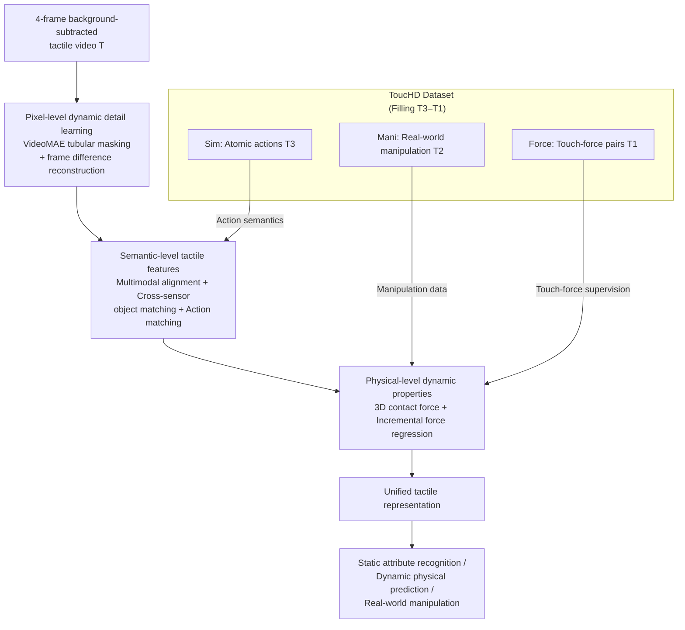

# AnyTouch 2: General Optical Tactile Representation Learning For Dynamic Tactile Perception

**Conference**: ICLR 2026  
**arXiv**: [2602.09617](https://arxiv.org/abs/2602.09617)  
**Code**: [https://github.com/GeWu-Lab/AnyTouch2](https://github.com/GeWu-Lab/AnyTouch2)  
**Area**: Tactile Perception / Robotics  
**Keywords**: Tactile Representation Learning, Dynamic Perception, Optical Tactile Sensors, Force Sensing, Tactile Datasets

## TL;DR
AnyTouch 2 proposes a tactile dynamic pyramid framework and constructs the ToucHD hierarchical dataset containing 2.426 million contact samples (covering atomic actions, real-world manipulation, and touch-force pairs). It designs a unified representation learning framework for triple-layer dynamic perception—pixel-level, semantic-level, and physical-level—outperforming existing methods across static property recognition, dynamic physical prediction, and real-world manipulation tasks.

## Background & Motivation
Real-world contact-intensive manipulation requires robots to perceive temporal tactile feedback, capture subtle surface deformations, and reason about object properties and mechanical dynamics. Although optical tactile sensors provide rich information, existing tactile datasets and models face severe limitations: (1) Data primarily focuses on object-level attributes (e.g., material), ignoring fine-grained temporal tactile dynamics during physical interaction; (2) Existing pre-trained models based on image self-supervision or multimodal alignment struggle to capture fine-grained deformation and force perception dynamics. The **Key Challenge** lies in the lack of a systematic paradigm for dynamic tactile perception—specifically, the absence of both a hierarchical framework to guide data collection and matching model designs. The **Core Idea** of this paper is to establish a tactile dynamic pyramid to systematically advance dynamic tactile perception from both data and modeling dimensions.

## Method

### Overall Architecture
AnyTouch 2 decomposes dynamic tactile perception into three layers of capabilities from shallow to deep, corresponding to different levels of the tactile dynamic pyramid. The pyramid ranges from T5 (press only), T4 (random actions), T3 (specific actions), T2 (manipulation), to T1 (force data). The ToucHD dataset specifically completes the three most deficient high-level tiers: T3–T1. The model takes 4 frames of background-subtracted consecutive tactile images as input. It first learns subtle deformations at the pixel level, then establishes object and action understanding at the semantic level, and finally anchors the representation to quantifiable contact forces at the physical level to output a unified tactile representation. Overall, the ToucHD dataset serves as the "fuel" for this deep pipeline, with the three-level learning objectives drawing data from its different hierarchical levels as needed.

### Key Designs

**1. Pixel-level dynamic detail learning: Focusing the model on subtle inter-frame deformations**

The most valuable information in tactile signals is often hidden in highly localized subtle deformations between adjacent frames, which ordinary image-level self-supervision might overlook. Here, a Video Masked Autoencoder (VideoMAE) processes the normalized input $\mathbf{T} \in \mathbb{R}^{N \times H \times W \times 3}$ after background frame subtraction. The video is segmented into 3D spatio-temporal tokens, and a tubular mask with a ratio of $\rho=0.75$ is applied before reconstruction. Since original frame reconstruction alone is insufficient to force the model to focus on changes, **frame difference reconstruction** is added: the difference $D_n = T_n - T_1$ is explicitly calculated, and a difference decoder is trained to reconstruct it. The total loss is $\mathcal{L}_{Pixel} = \mathcal{L}_{rec}^{ori} + \mathcal{L}_{rec}^{dif}$. This term places supervision directly on "what changed between frames," thereby embedding localized, weak, yet critical deformation patterns into the representation.

**2. Semantic-level tactile features: Injecting object and action semantics**

Pixel-level learning only captures "how it deforms"; the model also needs to know "what the object is" and "what action is being performed." Three semantic objectives are employed in parallel. Multimodal alignment follows the CLIP paradigm to align tactile features with visual and linguistic features: $\mathcal{L}_{Align} = \frac{\alpha_{TV}}{2}(\mathcal{L}_{T\to V} + \mathcal{L}_{V\to T}) + \frac{\alpha_{TL}}{2}(\mathcal{L}_{T\to L} + \mathcal{L}_{L\to T})$. Cross-sensor matching pairs tactile signals of the same object across different sensors as positive samples, forcing the model to learn sensor-agnostic object-level features: $\mathcal{L}_{obj} = -\log\sigma(sim(\mathbf{T}, \mathbf{T}_{obj}^+)) - \log(1 - \sigma(sim(\mathbf{T}, \mathbf{T}_{obj}^-)))$. The newly introduced action matching groups tactile videos in ToucHD into 8 atomic action categories (press, lift, 4 directions of sliding, 2 directions of rotation). Training with $\mathcal{L}_{act}$ brings similar actions closer and pushes different actions apart, explicitly encoding action-level semantics and filling the gap where previous models understood "objects" but not "actions."

**3. Physical-level dynamic properties: Anchoring representations to quantifiable physical quantities**

No matter how rich semantic understanding is, it remains qualitative. Contact-intensive manipulation requires quantitative force. Leveraging the large-scale touch-force pairs in ToucHD, the model directly regresses the 3D contact force $\mathbf{F} \in \mathbb{R}^{(N-1) \times 3}$ for each frame of the tactile video $\mathbf{T}$. Similar to frame difference reconstruction, **incremental force prediction** $\Delta\mathbf{F}_n = F_n - F_{n-1}$ is added to focus on temporal force changes rather than static magnitude. The total loss is $\mathcal{L}_{Force} = \frac{1}{3(N-1)} \|\hat{\mathbf{F}} - \mathbf{F}\|_1 + \frac{1}{3(N-1)} \|\Delta\hat{\mathbf{F}} - \Delta\mathbf{F}\|_1$. This layer bridges high-level semantics and low-level physics, allowing the final representation to span all levels of the pyramid.

**4. ToucHD Dataset: Filling the three high-level tiers of the pyramid**

The model's three-level capabilities are fed by matched data. ToucHD contains 2,426,174 contact samples filling T3–T1. Simulated atomic action data (Sim, T3) uses the IMPM simulator with 5 types of optical sensors performing 4 atomic actions (sliding, rotation, etc.) on 1,043 objects, expanded to 8 categories via rotation for a total of 1,118,896 frames. Real-world manipulation data (Mani, T2) uses modified FastUMI grippers equipped with multiple sensors for 46 manipulation tasks (unscrewing caps, inserting USBs, kneading clay, stacking blocks, etc.), collecting 584,842 frames with synchronized video. Touch-force paired data (Force, T1) uses robots to control 5 types of sensors with 71 indenters in multi-directional sliding, with a 6-axis force sensor recording 3D forces, resulting in 722,436 pairs—the source for physical-level training.

### Loss & Training
The four objectives are not activated simultaneously but introduced via curriculum scheduling: pixel-level reconstruction starts from the beginning with the highest weight, while high-level tasks are added by linearly increasing weights after specific epochs. The total objective is:
$$\mathcal{L}_{total} = \mathcal{L}_{Pixel} + \lambda_{Align}^i \mathcal{L}_{Align} + \lambda_{Match}^i \mathcal{L}_{Match} + \lambda_{Force}^i \mathcal{L}_{Force}$$
Specifically, matching and force prediction are introduced at epoch 20, and alignment at epoch 30. Maximum weights are $\lambda_{Align}^{max}=1.0$, $\lambda_{Match}^{max}=0.02$, and $\lambda_{Force}^{max}=0.1$. The model is based on an OpenCLIP-Base encoder and trained on 4×H100 for 40 epochs.

## Key Experimental Results

### Main Results
**Offline Benchmarks (Object Bench + Sparsh Bench + ToucHD Bench):**

| Task | Sensor | AnyTouch 2 | AnyTouch 1 | MAE(Sparsh) | VJEPA(Sparsh) | Note |
|------|--------|------|----------|------|------|------|
| TAG Material Class. | GS | 76.97% | 71.10% | 67.06% | 66.57% | Acc↑ |
| Cloth Textile Class. | GS | 42.31% | 39.73% | 35.38% | 35.96% | Acc↑ |
| Slip Detection | DG | 86.66 F1 | 81.20 | 82.44 | 83.90 | F1↑ |
| Force Pred (ToucHD) | DG | 624.26 | 1540.76 | 783.64* | 1232.65 | RMSE(mN)↓ |
| Force Pred (ToucHD) | Mini | 202.14 | 652.61 | 257.95* | 331.12 | RMSE(mN)↓ |

(* indicates use of ToucHD augmented data)

**Real-world Manipulation Tasks (4 tasks x 20 trials):**

| Task | Pyramid Level | AnyTouch 2 (DG) | AnyTouch 2 (Mini) | MAE(S)† (DG) | AnyTouch 1 (DG) |
|------|-----------|------|------|------|------|
| Tactile Grasping | T5 | 0.75 | 0.80 | 0.65 | 0.70 |
| Whiteboard Erasing | T4&3 | 0.85 | 0.80 | 0.70 | 0.55 |
| USB Insertion | T2 | 0.30 | 0.25 | 0.20 | 0.10 |
| Chip Moving | T1 | - | 0.85 | - | 0.60 |

### Ablation Study

| Configuration | TAG Acc | ToucHD Force(DG) | ToucHD Force(Mini) | Note |
|------|---------|------|------|------|
| Full AnyTouch 2 | 76.97 | 624.26 | 202.14 | All modules |
| - Frame Diff. Rec. | 76.19 | 687.13↓ | 225.18↓ | Pixel-level dynamics drop |
| - Action Matching | 76.56 | 640.15 | 215.83 | Slip detection drop |
| - Force Prediction | 75.17 | 777.41↓ | 283.59↓ | Significant force task drop |
| - Multimodal Align. | 71.70↓ | 594.15↑ | 196.10↑ | Static drop but dynamic gain (Interesting) |
| - Full ToucHD set | 68.58↓ | 1365.60↓ | 519.55↓ | Comprehensive performance drop |

### Key Findings
- Removing multimodal alignment actually improves performance on dynamic tasks because coarse-grained text labels pull same-object samples with different forces closer, harming fine-grained force perception—this reflects a trade-off between static and dynamic perception.
- Removal of the ToucHD dataset leads to a comprehensive decline across all tasks, validating the necessity of high-level hierarchical data.
- 4-frame input consistently outperforms 2-frame input, as denser dynamic information benefits tactile perception.
- GelSight Mini’s clear deformation imaging aids fine-grained attribute tasks, while DIGIT’s 30Hz high frequency is more advantageous for high-level manipulation tasks—demonstrating sensor complementarity.
- Only minor performance drops occurred when changing the gel pad, demonstrating the generalization capability of sensor-agnostic representations.

## Highlights & Insights
- **Tactile Dynamic Pyramid**: Proposes a clear hierarchical framework that systematically defines the levels of tactile perception capability, providing a unified paradigm for the field.
- **Data + Model Dual Drive**: Not only constructs a large-scale hierarchical dataset but also designs a matching multi-level learning architecture; the two synergetically enhance each other.
- **Interesting Alignment Paradox**: The discovery that multimodal alignment improves static understanding but harms dynamic perception deeply reveals the limitations of CLIP-style training for fine-grained physical tasks.
- **46 Manipulation Task Designs**: ToucHD (Mani) covers extremely rich practical scenarios (from kneading clay to Rubik's Cube rotation), providing valuable resources for the tactile community.
- **Physical Significance of Force Prediction**: By explicitly predicting contact force and its increments, it grounds tactile representations in quantifiable physical quantities, surpassing pure semantic understanding.

## Limitations & Future Work
- Data from DM-Tac W and GelStereo BioTip sensors in ToucHD remains unutilized.
- Force data collection is limited to simplified indenter-sensor setups, lacking force collection during daily object manipulation.
- Multi-sensor paired manipulation data is only used for alignment; dedicated architectures for cross-sensor coordination have not been introduced.
- Limited to optical tactile sensors; not yet extended to array-based tactile sensors.
- Real manipulation tasks used UMI + human hand instead of dual UMI, potentially introducing visual modality bias.

## Related Work & Insights
- **AnyTouch 1**: Prior work focused on cross-sensor static feature learning; this paper comprehensively introduces the dynamic dimension.
- **Sparsh (Meta)**: Tactile self-supervised models based on MAE/VJEPA, but lacking high-level hierarchical data and force perception.
- **FeelAnyForce**: A pioneer in touch-force paired datasets, but only covers pressing interactions and lacks complex dynamics like sliding.
- **Insight**: The hierarchical design approach (Data Hierarchy → Capability Hierarchy → Task Hierarchy) can be adapted for pre-training in other sensory modalities.

## Rating
- Novelty: ⭐⭐⭐⭐
- Experimental Thoroughness: ⭐⭐⭐⭐⭐
- Writing Quality: ⭐⭐⭐⭐⭐
- Value: ⭐⭐⭐⭐⭐

<!-- RELATED:START -->

## Related Papers

- [\[ICLR 2026\] APPLE: Toward General Active Perception via Reinforcement Learning](apple_toward_general_active_perception_via_reinforcement_learning.md)
- [\[ICLR 2026\] DexMove: Learning Tactile-Guided Non-Prehensile Manipulation with Dexterous Hands](dexmove_learning_tactile-guided_non-prehensile_manipulation_with_dexterous_hands.md)
- [\[ICLR 2026\] TaCo: A Benchmark for Lossless and Lossy Codecs of Heterogeneous Tactile Data](taco_a_benchmark_for_lossless_and_lossy_codecs_of_heterogeneous_tactile_data.md)
- [\[ICLR 2026\] ExoPredicator: Learning Abstract Models of Dynamic Worlds for Robot Planning](exopredicator_learning_abstract_models_of_dynamic_worlds_for_robot_planning.md)
- [\[CVPR 2026\] AT-VLA: Adaptive Tactile Injection for Enhanced Feedback Reaction in Vision-Language-Action Models](../../CVPR2026/robotics/at-vla_adaptive_tactile_injection_for_enhanced_feedback_reaction_in_vision-langu.md)

<!-- RELATED:END -->
