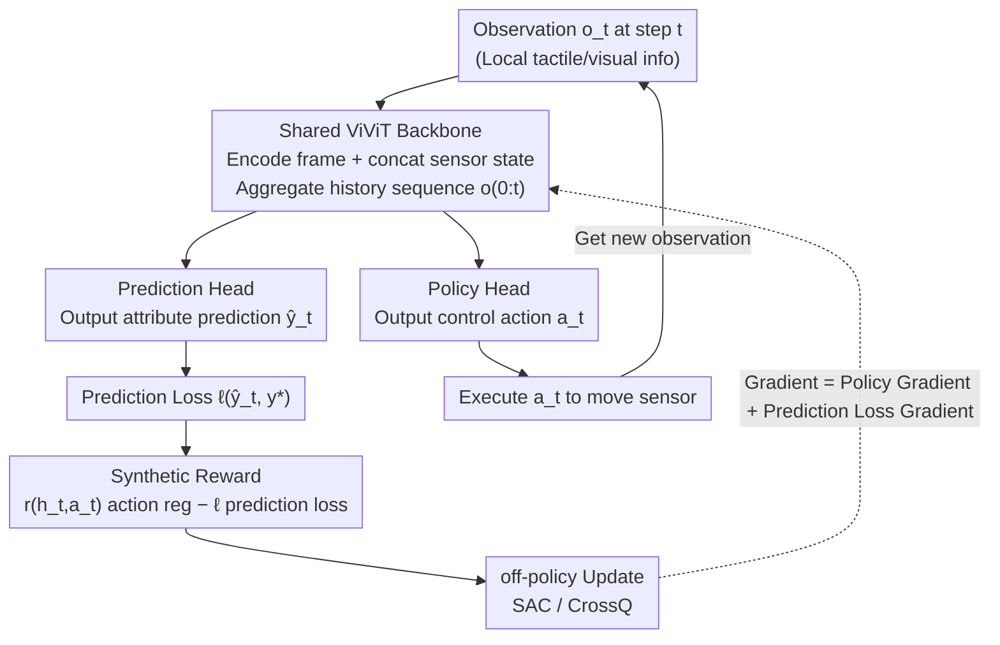

# APPLE: Toward General Active Perception via Reinforcement Learning

**Conference**: ICLR 2026  
**arXiv**: [2505.06182](https://arxiv.org/abs/2505.06182)  
**Area**: Active Perception / Reinforcement Learning  
**Keywords**: active perception, reinforcement-learning, POMDP, supervised learning, off-policy, ViViT, CrossQ

## TL;DR

Ours proposes APPLE—a general active perception framework that combines reinforcement learning with supervised learning by modeling active perception as a POMDP. The reward function is designed as the RL reward minus prediction loss, allowing the gradient to naturally decompose into policy gradient and prediction loss components. Based on off-policy algorithms (SAC/CrossQ) and a shared ViViT backbone, its generality is validated across 5 different task benchmarks, where the CrossQ variant eliminates the need for per-task hyperparameter tuning and increases training efficiency by 53%.

## Background & Motivation

**Key Challenge of Active Perception**: Active perception requires an agent to acquire information through active control of sensors (e.g., moving camera viewpoints, performing tactile exploration) while completing a perceptual prediction task. This necessitates simultaneous optimization of "how to perceive" and "how to predict."

**Limitations of Prior Work**: Current active perception methods are typically designed for specific tasks and sensing modalities (e.g., active object recognition, active tactile perception), lacking a unified framework applicable to diverse tasks.

**Coupling Difficulty of RL and Prediction**: Pure RL methods require designing reward functions to indirectly evaluate perception quality, making it difficult to directly optimize prediction performance; pure supervised learning methods cannot learn perception policies.

**Failure of On-policy Methods**: Experiments reveal that on-policy methods such as REINFORCE and PPO fail completely on active perception tasks due to low exploration efficiency and sparse reward signals.

**Hyperparameter Sensitivity**: Existing methods often require meticulous hyperparameter tuning for each task, limiting the generality of practical applications.

**Computational Efficiency Requirements**: Practical deployment scenarios demand efficient training and inference to reduce computational overhead without sacrificing performance.

## Method

### Overall Architecture

APPLE unifies active perception by modeling it as a "POMDP embedded within supervised learning": the agent aims to learn an attribute $y^*$ of the environment (object class, pose, volume, etc.). This ground truth $y^*$ is hidden and unobservable, requiring active sensor control to approach it step-by-step. Consequently, the agent's action at each step is split into two parts: it outputs a control action $a_t$ (moving viewpoint, tactile exploration) to change the next observation, and a current prediction $y_t$ of the attribute. After a new observation $o_t$ is received, it is first encoded by a ViViT (Video Vision Transformer) and concatenated with the sensor state. Then, a shared spatio-temporal Transformer backbone aggregates the history sequence $o_{0:t}$. The backbone branches into two heads: a prediction head for $\hat{y}_t$ and a policy head for $a_t$. The system reward is defined as "action regularization minus prediction loss." Gradients are naturally decomposed into policy gradient and prediction loss gradient branches, optimized using off-policy algorithms (SAC/CrossQ).

### Key Designs

**1. Reward as "Action Regularization minus Prediction Loss": Merging Perception and Prediction via a Scalar**

The most difficult aspect of active perception is the entanglement of two objectives: pure RL frameworks require manual design of proxy rewards to indirectly evaluate perception quality, which is difficult to tune; pure supervised learning cannot learn which way to look. APPLE bypasses "proxy reward design" by defining the reward at each step as $\tilde{r}(h_t, y^*_t, a_t, y_t) = r(h_t, a_t) - \ell(y^*_t, y_t)$, where $\ell$ is a differentiable prediction loss (cross-entropy for classification, Euclidean distance for pose estimation), and $r(h_t, a_t)$ is the "RL reward" which does not carry the task objective but serves only to regularize actions (e.g., constraining movement magnitude). This term can even be non-differentiable or unknown to the agent. Learning is primarily driven by the prediction loss term. Since the prediction $y_t$ does not affect future states, the gradient for maximizing the expected discounted return $J(\pi_\theta)$ can be cleanly decomposed into two terms:

$$\frac{\partial}{\partial\theta}J(\pi_\theta)=\underbrace{\mathbb{E}\Big[\tfrac{\partial}{\partial\theta}\ln\pi_\theta(\mathbf{a}\mid\mathbf{o})\textstyle\sum_t\gamma^t\tilde{r}\Big]}_{\text{Policy Gradient}}-\underbrace{\mathbb{E}\Big[\textstyle\sum_t\gamma^t\tfrac{\partial}{\partial\theta}\ell_{\pi_\theta}(y^*_t,o_{0:t})\Big]}_{\text{Prediction Loss Gradient}}$$

Note that both terms are derived with respect to **the same set of shared parameters $\theta$** (not separate networks): the policy gradient teaches the backbone "how to move to see more accurately," while the supervised loss gradient directly teaches the backbone "how to predict based on existing observations." This eliminates hard-coded proxy rewards while allowing the prediction model to benefit from the direct gradients of the supervision signal.

**2. Off-policy (SAC/CrossQ) instead of On-policy: Enabling Effective Exploration**

Empirical results show that on-policy methods like REINFORCE and PPO exhibit extremely low sample efficiency in active perception tasks, failing to learn exploration policies effectively. APPLE utilizes off-policy actor-critic methods to estimate the policy gradient term, leveraging experience replay to reuse historical samples, resulting in two variants: APPLE-SAC and APPLE-CrossQ. Adopting SAC/CrossQ for active perception requires three modifications: replacing the state with the historical observation sequence $o_{0:t}$ (due to partial observability); **dynamically recalculating** the total reward $r_t-\ell_{\pi_\theta}(y^*_t,o_{0:t})$ whenever sampling from the replay buffer for the Bellman residual in the critic; and overlaying the prediction loss gradient during policy updates. Specifically, CrossQ replaces the target network of SAC with BatchRenorm, eliminating the "target network update frequency" hyperparameter, making it more robust and efficient—allowing it to generalize across tasks without per-task tuning.

**3. Shared ViViT Backbone: Reading Sequence Information**

Active perception is inherently a process of accumulating observations frame by frame, where information in a single frame (especially tactile) is sparse and local. APPLE treats the history sequence of observations as a "video," using a Video Vision Transformer (ViViT) to encode each frame and concatenate sensor states, then using a Transformer to aggregate the entire $o_{0:t}$ along the temporal dimension. Crucially, this backbone is **shared** by both the policy and prediction heads: this saves parameters and ensures that spatio-temporal modeling aligns with the structure of "gradually enriching observations," letting "where to look" and "what to guess" rely on the same evolving spatio-temporal representation. This also allows APPLE to be applied to different sensing modalities (vision/tactile) with minimal structural changes.

## Key Experimental Results

### Main Results

| Task | APPLE-SAC | APPLE-CrossQ | Best Baseline | Baseline Method |
|------|-----------|-------------|---------|---------|
| MHSB (Classification) | 94.2% | **95.1%** | 89.7% | InfoGain |
| CircleSquare (Detection) | 0.82 IoU | **0.84 IoU** | 0.76 IoU | Random |
| TactileMNIST (Recognition) | 92.8% | **93.5%** | 88.3% | Coverage |
| Volume (Estimation) | 0.031 MSE | **0.028 MSE** | 0.045 MSE | Heuristic |
| Toolbox (6DoF) | 78.5% | **80.2%** | 71.4% | AcTPa |

### Ablation Study

| Method/Variant | Average Rank | Training Time (Relative) | Hyperparameter Tuning Needs |
|-----------|---------|----------------|-------------|
| APPLE-CrossQ | **1.2** | **1.0x** | Low |
| APPLE-SAC | 1.8 | 1.53x | Medium |
| REINFORCE | 4.5 | 0.8x | High (Poor performance) |
| PPO | 4.8 | 1.1x | High (Poor performance) |
| Supervised (No RL) | 3.2 | 0.6x | Low |

### Key Findings

1. **Failure of On-policy Methods**: REINFORCE and PPO failed to learn effective policies across all 5 benchmarks, verifying the necessity of off-policy methods for active perception.
2. **Superiority of CrossQ**: CrossQ achieved a higher average rank across tasks and was 53% faster to train than SAC, while eliminating the need for target network tuning.
3. **Generality Verification**: The same framework and hyperparameter settings achieved SOTA or near-SOTA performance across 5 vastly different tasks.
4. **RL+Supervised > Supervised Only**: Performance significantly degraded when the RL component was removed, demonstrating the importance of learning active perception policies.

## Highlights & Insights

1. **Unified Framework**: The first general active perception framework applicable to diverse sensing modalities and task types.
2. **Elegant Gradient Decomposition**: The reward-loss design keeps policy and prediction gradients naturally separated with clear theoretical grounding.
3. **Important Negative Result**: The finding that on-policy methods fail completely provides significant value to the active perception community.
4. **High Practicality**: The CrossQ variant requires almost no tuning, significantly lowering the barrier for practical application.

## Limitations & Future Work

1. **Discrete Action Space**: Current experiments use discrete actions; the effectiveness in continuous action spaces (e.g., continuous viewpoint control) is unverified.
2. **Simulation-Based**: All 5 benchmarks are in simulation; generalization to real-world physical scenarios remains to be validated.
3. **Computational Overhead**: The computational cost of the ViViT backbone may be a bottleneck for resource-constrained embedded platforms.
4. **Long Time Sequences**: Perception steps in current experiments are relatively short (5-20 steps); performance trends for much longer sequences have not been explored.

## Related Work & Insights

- **Active Perception**: Active perception reviews by Bajcsy et al. (2018); AcTPa (Liang et al., 2025) for tactile active perception.
- **Off-policy RL**: Efficient off-policy methods such as SAC (Haarnoja et al., 2018) and CrossQ (Bhatt et al., 2024).
- **Vision Transformers**: ViViT (Arnab et al., 2021) architecture for video understanding.
- **POMDP Solvability**: Kaelbling et al. (1998) theoretical framework for POMDPs.

## Rating

- Novelty: ⭐⭐⭐⭐ Unified framework and gradient decomposition design are novel.
- Experimental Thoroughness: ⭐⭐⭐⭐ 5 benchmarks cover multiple modalities and task types.
- Writing Quality: ⭐⭐⭐⭐ Clear framework and detailed experiments.
- Value: ⭐⭐⭐⭐ High potential for practical application of general active perception.

<!-- RELATED:START -->

## Related Papers

- [\[NeurIPS 2025\] Real-World Reinforcement Learning of Active Perception Behaviors](../../NeurIPS2025/robotics/real-world_reinforcement_learning_of_active_perception_behaviors.md)
- [\[ICLR 2026\] AnyTouch 2: General Optical Tactile Representation Learning For Dynamic Tactile Perception](anytouch_2_general_optical_tactile_representation_learning_for_dynamic_tactile_p.md)
- [\[ICLR 2026\] Memory, Benchmark & Robots: A Benchmark for Solving Complex Tasks with Reinforcement Learning](memory_benchmark_robots_a_benchmark_for_solving_complex_tasks_with_reinforcement.md)
- [\[CVPR 2026\] General Process Reward Modeling for Robotic Reinforcement Learning](../../CVPR2026/robotics/general_process_reward_modeling_for_robotic_reinforcement_learning.md)
- [\[CVPR 2026\] ActiveVLA: Injecting Active Perception into Vision-Language-Action Models for Precise 3D Robotic Manipulation](../../CVPR2026/robotics/activevla_injecting_active_perception_into_vision-language-action_models_for_pre.md)

<!-- RELATED:END -->
