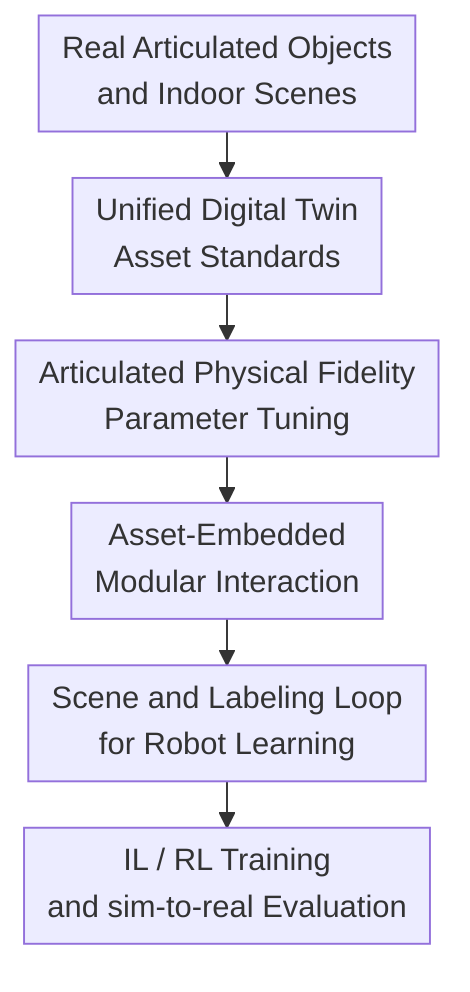

# ArtVIP: Articulated Digital Assets of Visual Realism, Modular Interaction, and Physical Fidelity for Robot Learning

**Conference**: ICLR 2026  
**OpenReview**: [https://openreview.net/forum?id=SqPLEZ66BO](https://openreview.net/forum?id=SqPLEZ66BO)  
**Code**: https://huggingface.co/datasets/x-humanoid-robomind/ArtVIP  
**Area**: Robotics / Embodied AI  
**Keywords**: Articulated Object Assets, Digital Twin, Robot Learning, Physical Simulation, sim-to-real

## TL;DR
ArtVIP constructs a set of 992 high-quality digital twin articulated objects and accompanying indoor scenes. By utilizing unified modeling standards, articulated physics parameter tuning, asset-embedded interaction behaviors, and pixel-level affordance labeling, it enables robot learning algorithms to be trained, evaluated, and transferred in simulation environments that more closely resemble the real world.

## Background & Motivation
**Background**: Robot learning increasingly relies on simulation environments to obtain low-cost, reproducible, and scalable data. Whether it is trajectory collection in imitation learning or large-scale exploration in reinforcement learning, simulation avoids hardware wear and safety risks while standardizing experimental conditions. As embodied intelligence moves from simple grasping to fine-grained interactions like opening cupboard doors, pulling drawers, pressing buttons, and pushing oven doors, the simulation assets themselves have begun to determine the upper bound of model capabilities.

**Limitations of Prior Work**: The issue with existing open articulated object datasets is not simply a lack of quantity, but rather that their quality makes it difficult to directly support robot learning. PartNet-Mobility has a large quantity, but many models have coarse appearances, missing materials, and imprecise joint dynamics; BEHAVIOR-1K offers better visual quality but is tied to OmniGibson with encrypted assets and lacks fine-tuned physical parameters. For a robot, whether a cupboard door looks real is only the first level of the problem; more critical is whether its collision bodies, joint damping, magnetic closure, and button triggering behaviors are consistent with real objects.

**Key Challenge**: Articulated object assets must simultaneously satisfy visual realism, physical fidelity, interaction reusability, and simulation friendliness—four requirements that often conflict. High polygon counts and high-resolution textures improve visual realism but slow down simulation; complex collision meshes allow for more accurate contact but increase computational overhead; embedding interaction logic in task code is flexible but makes it difficult to reuse the same asset across different scenes. This paper posits that the current bottleneck is biased toward asset quality rather than continuing to accumulate more low-fidelity models.

**Goal**: ArtVIP aims to provide the robot learning community with a batch of high-quality articulated object assets that can be directly used in Isaac Sim. Specific goals include: creating digital twin models visually close to real objects, tuning collision bodies and joint dynamics parameters, modularly embedding common interaction behaviors within the assets, supplementing pixel-level affordance labeling and ready-to-run indoor scenes, and verifying through real robot tasks whether these assets truly reduce the sim-to-real gap.

**Key Insight**: Instead of using generative methods for batch asset synthesis, the authors commissioned professional 3D modelers to manually create digital twin models according to unified standards. This choice sacrifices the speed of scale expansion in exchange for controllable geometry, materials, hierarchical structures, and physical parameters. For robot learning, manually controllable physical and interaction attributes are often more important than simply having "many models."

**Core Idea**: Use unified production standards to create digital assets for articulated objects that are visually realistic, physically tunable, and have embedded interaction behaviors. This approach binds visibility, collidability, operability, and transferability required for robot learning at the asset level.

## Method

### Overall Architecture
ArtVIP is essentially a high-quality simulation asset production line for robot learning. The input consists of real-world furniture, appliances, tools, and other interactive objects, while the output includes articulated object assets in USD format, editable indoor scenes, pixel-level affordance labeling, and simulation environments directly callable for imitation learning and reinforcement learning. The entire workflow first addresses "visual similarity," then "motion similarity," and finally "robot usability."

The dataset eventually contains 9 major categories, 37 subcategories, and 992 articulated objects, covering daily interaction objects such as furniture, kitchenware, appliances, sanitary ware, cleaning tools, stationery, storage boxes, and mechanical equipment. In addition to single-object assets, the authors provide 6 sim-ready indoor scenes, such as kitchens, children's rooms, dining rooms, and living rooms; fixed furniture and small objects in these scenes also support physical interaction, and users can freely place ArtVIP's 992 objects into these scenes.

### Key Designs
**1. Unified Digital Twin Asset Standards: Integrating "Visual Realism" and "Simulation Readiness" into a Single Hierarchy**

The modeling in ArtVIP does not involve scraping and patching OBJ files from the web; instead, it creates digital twins starting from real objects. The authors adopt a three-layer structure: assembly, module, and mesh. An assembly represents a fully functional object, a module represents a component that can move as a rigid body, and a mesh carries static attributes such as geometric details, materials, textures, collision shapes, and mass. During modeling, the geometric center of the object's base is set as the base coordinate system, Xform type modules are segmented based on affordance, function, and joint positions, and finally, meshes are assembled bottom-up into modules and assemblies.

The value of this hierarchy lies in aligning visual modeling with the rigid body hierarchy required for robot interaction. For example, if a microwave is just a beautiful monolithic mesh, it is difficult for a robot to press buttons, pull the door, or observe hinge motion in simulation; however, if interactive components like doors, buttons, lights, and racks are separated into semantically clear modules, subsequent joints, collisions, labels, and interaction behaviors can be attached to the correct positions. The authors also require high-resolution textures, PBR materials, UV alignment, and normal optimization to reduce visual domain gaps caused by low-poly surfaces, material distortion, and texture stretching.

**2. Articulated Physical Fidelity Parameter Tuning: Beyond Adding Joints to Enabling Realistic Mechanical Responses**

The sim-to-real gap for articulated objects often stems from unrealistic motion. Common joint drive equations in standard simulations can be written as $\tau = K(q) \cdot (q - q_{target}(q)) + D \cdot (\dot{q} - \dot{q}_{target}(q))$, where $q$ and $\dot{q}$ are joint position and velocity, $K$ is stiffness, and $D$ is damping. The key modification in ArtVIP is acknowledging that the stiffness, target position, friction, and damping of real joints are not always constant but vary with joint position or even velocity.

For instance, damping increases as a drawer nears closure; a refrigerator door automatically snaps shut when within magnetic range; a door closer may suddenly accelerate closure after a certain angle; and a trash can lid pops open when a button is released. The authors designed position-dependent $K(q)$ and $q_{target}(q)$ for these scenarios and distinguished between static friction, maximum static friction, and dynamic friction. The purpose is not to complicate the formula but to ensure that the contact feedback, opening/closing trajectories, and critical trigger points encountered by the robot in simulation are closer to real hardware, thereby reducing action bias during policy transfer.

**3. Asset-Embedded Modular Interaction: Binding Reusable Behaviors within USD Assets Rather than Task Scripts**

The most engineering-oriented innovation of ArtVIP is the direct embedding of interaction behaviors into assets. The paper abstracts five common behavior primitives: latching / magnetic closure, damping, cross-asset effects, within-asset effects, and hover / hold position. These cover 394 assets and over 900 joints, capable of expressing effects such as magnetic closure of refrigerator doors, cushioned sliding of drawers, switches controlling another object, microwave buttons popping the door and lighting internal bulbs, and oven doors staying at arbitrary angles.

This design places "what the object is" and "how the object is used" in the same asset package. After researchers import the USD file, they do not need to rewrite logic for button triggers, door lock releases, damping changes, or cross-object linkages in every task to obtain affordances consistent with real objects. For robot learning, this significantly reduces the engineering cost of building task environments and avoids conflicting interaction logic written by different experimenters for the same class of objects.

**4. Scene and Labeling Loop for Robot Learning: Validating Asset Quality through Downstream Training and Real Transfer**

ArtVIP does not just release individual object models; it also supplements pixel-level affordance labels, indoor scenes, and robot learning experiments. Pixel-level labels cover functional parts such as handles, buttons, doors, drawers, knobs, pedals, wheels, and racks, allowing vision models to learn "where to interact." Indoor scenes place these interactive objects back into real-life contexts, enabling robots to perform tasks in complex environments like kitchens and living rooms.

More importantly, the authors did not stop at visual comparisons but validated asset utility using imitation learning (IL) and reinforcement learning (RL). IL experiments compared real-only, sim-only, and real-sim-mixed data; RL experiments involved training visuomotor policies in simulation and deploying them in the real world. This closed loop pushes asset quality from "looking good to a modeler" to robot-centric questions like "does policy training benefit" and "does simulation performance predict real performance."

### Mechanism (Full Example)
Taking a microwave asset as an example, traditional datasets might only provide a model with a door hinge where the door can rotate but buttons are merely decorative, and door release, internal lights, and realistic trajectories require additional implementation by task developers. In ArtVIP, the microwave is first decomposed into modules such as the body, door, buttons, internal lights, and racks. Joints are configured for the door and buttons, while colliders and mass are assigned to contactable parts, with PBR materials restoring metal, glass, and plastic surfaces.

When a robot presses the button in simulation, the button state triggers a within-asset effect: the door latch releases, the door pops open according to tuned joint dynamics, and the internal light turns on. The authors also compared trajectories from optical motion capture on real microwaves with virtual marker trajectories in simulation to ensure door motion after button triggering closely follows the real object. Consequently, the same microwave asset can be used both for visual perception data generation and for interaction tasks such as pressing buttons, opening doors, or placing objects.

### Loss & Training
ArtVIP itself is not a data-driven method for training a new network and thus does not have a single main loss function. Training objectives in the paper primarily appear in downstream RL applications: the authors extended EAGLE to adopt a two-stage training process for the CloseTrashcan task. In the first stage, PPO is used to train a teacher policy with access to privileged low-dimensional states, including robot proprioception, trashcan lid joint values, and 3D relative positions of the trashcan and gripper. The second stage distills the teacher into a visuomotor student that only observes wrist camera images and robot states.

The attention mask learning objective for EAGLE is written as $L_{att} = L_{rec} + L_{ae} + \beta L_{ctl} + \lambda L_{sps}$, where reconstruction, autoencoding, control prediction, and sparsity terms jointly constrain visual attention regions. The distillation loss for the student policy is $\hat{L}(\pi_\theta) = \mathbb{E}_{(o,s)\sim D}[\|\pi_\theta(o_{aug}) - \pi_e(s)\|_2^2]$. The reward for CloseTrashcan is also decomposed into four terms: approaching the lid, orientation alignment, closing progress, and action smoothness: $r_t = \lambda_1 r_{dst} + \lambda_2 r_{dir} + \lambda_3 r_{cls} + \lambda_4 r_{smth}$, with weights $0.5, 0.125, 10, -0.01$ respectively.

## Key Experimental Results

### Main Results
The main experiments revolve around two questions: whether the assets are more realistic than existing datasets and whether these assets help robot policies transfer from simulation to the real world. Regarding vision, the authors compared the rendering quality, polygon counts, VGGT reconstruction effects, and CLIP feature distributions of ArtVIP, BEHAVIOR-1K, and PartNet-Mobility. Regarding physics, optical motion capture recorded trajectories of real drawers, microwave doors, and oven doors for comparison with simulation trajectories. The table below selects the most direct IL results in robot learning.

| Task | Method | Real-Only | Sim-Only | Real+Sim Best Result | Main Conclusion |
|------|------|-----------|----------|-------------------|----------|
| PullDrawer | ACT | 64% | 39% | 81% | Pure sim enables zero-shot transfer; mixed data significantly improves performance |
| OpenCabinet | ACT | 34% | 12% | 46% | Cabinet tasks are difficult; sim data alone is insufficient but complements real data |
| SlideShelf | DP | 44% | 18% | 59% | Lateral sliding is sensitive to contact and perspective; mixed training gains are clear |
| CloseOven | DP | 66% | 28% | 78% | Success in upward closing movements is stable under real-sim mixed settings |

In a comparison with PartNet-Mobility for a microwave door opening task, the authors collected simulation trajectories using 5 ArtVIP microwaves and 5 PartNet-Mobility microwaves, testing them on an unseen real microwave. ArtVIP outperformed PartNet-Mobility in both SO and RSM settings, indicating that high-quality geometry, materials, and joint configurations are not just visually superior but also allow policies to learn more transferable actions.

| Method | Data Setting | ArtVIP Success Rate | PartNet-Mobility Success Rate | Gain |
|------|----------|---------------|--------------------------|------|
| ACT | Sim-Only | 41% | 32% | +9% |
| ACT | Real+Sim | 79% | 68% | +11% |
| DP | Sim-Only | 45% | 35% | +10% |
| DP | Real+Sim | 83% | 70% | +13% |

### Ablation Study
Strictly speaking, ArtVIP is an asset system rather than a data-driven method proposing an item-by-item ablatable network; the "ablation" in the paper is closer to component analysis and controlled experiments. The most informative comparisons involve asset capability dimensions, quality across different datasets, and differences in RL baselines.

| Configuration / Comparison | Key Metric | Description |
|-------------|----------|------|
| ArtVIP vs BEHAVIOR-1K vs PartNet-Mobility | 992 articulated assets, 2156 prismatic joints, 1809 revolute joints; Visual/Physical fidelity marked as High | ArtVIP is smaller in quantity than PartNet-Mobility but emphasizes high-quality digital twins and direct interaction |
| ArtVIP Modular Interaction | 394 assets, 900+ joints with behavior primitives | Covers magnetic closure, damping, cross-asset trigger, within-asset trigger, hold at any angle, etc. |
| EAGLE vs Vision-based PPO | 0.98 vs 0.24 success rate at 500k iterations | On CloseTrashcan, high-fidelity assets must be paired with suitable visual RL frameworks to form reliable policies |
| Correlation between Sim and Real RL | Pearson $r = 0.9886$ | Sim success rates of training checkpoints are highly linearly correlated with real success rates, indicating sim evaluation is predictive |

Supplementary performance analysis also shows that ArtVIP’s higher polygon count does not render it unusable. Testing on an i7-13700, Nvidia 4090, 64 GB RAM machine, single-object scenes yielded ~90 FPS, while a kitchen scene with 65 actuated joints maintained over ~60 FPS. This suggests a chosen compromise for "higher quality yet still real-time simulation" rather than unconstrained mesh detail.

### Key Findings
- ArtVIP's sim-only data already achieves non-zero success rates in the real world, e.g., ACT reaching 39% on PullDrawer and DP reaching 28% on CloseOven; this indicates that asset visual and physical quality is sufficient to support some level of zero-shot transfer.
- Real-only generally remains stronger than sim-only, especially in tasks with fine contact like OpenCabinet, indicating ArtVIP reduces but does not eliminate the sim-to-real gap regarding sensing, friction, grasping errors, and policy robustness.
- Real-sim mixed data is the most stable source of improvement: across four IL tasks, adding 10 to 100 sim trajectories generally incrementally improved success rates, suggesting ArtVIP is best used as a supplement to, rather than a total replacement for, real data.
- The comparison with PartNet-Mobility's microwaves is critical because tasks, algorithms, and real test objects are identical; the difference mainly comes from asset quality. ArtVIP's gain supports the core judgment that "quality is more important than quantity."
- The Pearson $r = 0.9886$ in RL experiments is a strong signal: if simulation checkpoint rankings can predict real-world rankings, the simulation environment can be used not only for training but also for model selection and iterative evaluation.

## Highlights & Insights
- ArtVIP frames a "dataset paper" as an "simulation asset engineering system": it does not just release model files but also provides modeling hierarchies, physical tuning, interaction primitives, labeling, scenes, and downstream validation, making the dataset closer to robot learning infrastructure.
- The most ingenious aspect is embedding interaction semantics into the assets themselves. The hidden cost of many simulation tasks is shifting from modeling to repeatedly writing scripts for buttons, locks, damping, and linkages; by assetizing these behaviors, ArtVIP offers significantly higher reuse value.
- The paper is relatively restrained in its evaluation of "visual realism" and "physical realism." Instead of just showing pretty renders, it uses CLIP feature t-SNE, VGGT reconstruction, optical motion capture trajectories, and real robot success rates to prove from multiple angles that the assets are indeed closer to the real world.
- This work also offers insights for generative 3D / articulated reconstruction: current generative models should not only aim for visual plausibility but also output reliable colliders, joint axes, joint limits, materials, and reusable behaviors to become sim-ready assets for robot learning.
- For practitioners in robot learning, ArtVIP's value may lie less in the 992 objects and more in providing a reproducible asset production standard. Even if automated generation methods are used to scale up in the future, this standard can serve as a quality checklist.

## Limitations & Future Work
- The largest limitation is human labor cost. The appendix lists modeling and physical tuning times for various categories—complex cabinets, refrigerators, and washing machines require hours of work, making expansion to broader object distributions slow.
- The dataset is primarily optimized for the Isaac Sim and USD ecosystem. Although the authors mention conversion to URDF or MJCF, how much PBR material, modular interaction, and complex joint behavior is retained after conversion requires further validation.
- Object coverage is concentrated in indoor daily scenes; support for specialized environments like industrial, outdoor, medical, or laboratory settings remains limited.
- While the paper presents various evaluations, the independent contributions of each behavior primitive (e.g., magnetic closure vs. damping) have not been strictly decoupled.
- Future work should combine ArtVIP with automated asset generation: using high-quality manual assets to train or evaluate generative models, then requiring generative models to output sim-ready assets that meet USD hierarchy, collider, joint, material, and behavior primitive requirements.

## Related Work & Insights
- **vs PartNet-Mobility**: PartNet-Mobility’s advantage is its scale, featuring 2347 articulated objects and more joints, but many models have low visual quality and insufficient material/physical parameters. ArtVIP is smaller in quantity but emphasizes digital twins, PBR materials, fine-tuned joints, and modular interaction, making it more suitable for high-fidelity robot learning.
- **vs BEHAVIOR-1K**: BEHAVIOR-1K targets daily activities and human-centric embodied AI with better visual quality than PartNet-Mobility, but its assets are encrypted and tied to OmniGibson, with physical parameters not systematically tuned. ArtVIP is more open, uses the USD format, and prioritizes asset editability, reusability, and cross-scene deployment.
- **vs RoboCasa**: RoboCasa is more of a simulation benchmark for kitchen tasks based on MuJoCo with strong coverage of daily tasks but few articulated object assets. ArtVIP focuses on the articulated object assets themselves, specifically visual/physical/interaction fidelity.
- **vs Articulate-Anything / Real2Code / SplArt etc.**: These methods attempt to reduce manual modeling costs but often encounter broken meshes, incorrect joint axes, missing materials, lack of internal cavity details, and excessively high polygon counts on real images. ArtVIP's insight is that whether automatic generation can enter robot learning depends not on reconstruction Chamfer Distance but on stable collisions, real-time simulation, and correct interaction triggers.
- **Insights for Robot Data Work**: High-quality simulation assets can serve as a "structured supplement" to real data. Rather than blindly increasing real trajectories, accurately modeling the joints, collisions, and affordances of interactive objects may better improve data efficiency in complex manipulation tasks.

## Rating
- Novelty: ⭐⭐⭐⭐☆ Systematically integrating digital twinning, physical tuning, and modular interaction into open articulated assets is a valuable engineering organization of ideas.
- Experimental Thoroughness: ⭐⭐⭐⭐⭐ Coverage of vision, physics, IL, cross-dataset comparisons, and RL, particularly real robot experiments, makes the dataset value credible.
- Writing Quality: ⭐⭐⭐⭐☆ The structure is clear and the appendix is detail-rich; the only weakness is that some evaluations feel more like system demonstrations than fine-grained component-level contribution analysis.
- Value: ⭐⭐⭐⭐⭐ Highly practical for robot learning research requiring high-fidelity articulated object simulation, and provides a quality benchmark for subsequent automated asset generation.

<!-- RELATED:START -->

## Related Papers

- [\[CVPR 2025\] DRAWER: Digital Reconstruction and Articulation with Environment Realism](../../CVPR2025/robotics/drawer_digital_reconstruction_and_articulation_with_environment_realism.md)
- [\[CVPR 2026\] RealAppliance: Let High-fidelity Appliance Assets Controllable and Workable as Aligned Real Manuals](../../CVPR2026/robotics/realappiance_let_high-fidelity_appliance_assets_controllable_and_workable_as_ali.md)
- [\[ICLR 2026\] Robotic Manipulation by Imitating Generated Videos Without Physical Demonstrations](robotic_manipulation_by_imitating_generated_videos_without_physical_demonstratio.md)
- [\[ICLR 2026\] Rodrigues Network for Learning Robot Actions](rodrigues_network_for_learning_robot_actions.md)
- [\[CVPR 2025\] RoboTwin: Dual-Arm Robot Benchmark with Generative Digital Twins](../../CVPR2025/robotics/robotwin_dual-arm_robot_benchmark_with_generative_digital_twins.md)

<!-- RELATED:END -->
