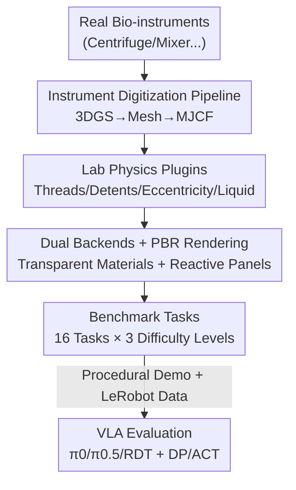

# AutoBio: A Simulation and Benchmark for Robotic Automation in Digital Biology Laboratory

**Conference**: ICLR2026  
**OpenReview**: [https://openreview.net/forum?id=UUE6HEtjhu](https://openreview.net/forum?id=UUE6HEtjhu)  
**Code**: To be confirmed (Authors promised open-source code + LeRobot dataset on GitHub / HuggingFace)  
**Area**: Robotics / Embodied AI (Simulation and Benchmark)  
**Keywords**: VLA Model, Bio-lab Automation, Robot Simulation, MuJoCo Physics Plugin, Transparent Material Rendering

## TL;DR
AutoBio transforms "robotic experimentation in biological laboratories" into a suite of simulatable, demonstration-generatable, and evaluatable benchmarks: it digitalizes real instruments using 3D Gaussian Splatting, augments MuJoCo with laboratory-specific physics (threads, detents, eccentricity, liquid surfaces), and resolves transparent container and liquid rendering via Blender PBR. Ultimately, it evaluates mainstream VLA models like π0, π0.5, and RDT across 16 biological experiment tasks of three difficulty levels, exposing significant shortcomings in precision manipulation, instruction following, and visual reasoning.

## Background & Motivation
**Background**: Vision-Language-Action (VLA) models, which integrate vision, language, and proprioception to output action trajectories end-to-end, are widely regarded as a path toward "General Robot Policies." Models such as RT-2, OpenVLA, RDT, and π0/π0.5 have demonstrated promising results in real-world scenarios like table clearing, laundry folding, and domestic grasping.

**Limitations of Prior Work**: However, existing robot benchmarks are almost entirely confined to "daily coarse manipulation" scenes—such as grasping, placing, and stacking in homes, warehouses, or factories—where requirements for precision and language understanding are relatively low. Professional, science-oriented scenarios, particularly biological laboratories, are seldom evaluated. Yet, the bio-lab is exactly where robotic automation is most promising and most challenging: experiments follow strict protocols (suitable for language-guided interpretation), and tasks are repetitive and time-consuming (ideal for liberating researchers). This domain poses unique challenges: long-horizon workflows involving digital displays, control panels, and various articulated mechanisms; ubiquitous precision operations like slot alignment; and difficult visual reasoning due to transparent liquids and containers.

**Key Challenge**: To evaluate VLA capabilities in a biological laboratory, a prerequisite is a simulation environment, which itself faces major hurdles. Existing simulators (robosuite, MuJoCo Playground, RoboTwin, etc.) based on MuJoCo/Bullet/PhysX focus on out-of-the-box rigid-body contact, lacking three essential laboratory capabilities: ① Instrument asset modeling (specialized instruments like centrifuges and thermal cyclers have no ready-made models); ② Laboratory-specific physics (threads for capping, detents for knobs, eccentric motion for mixers, and liquid sloshing, for which engines provide only generic implementations); ③ Transparent material rendering (vision is the primary VLA input, yet transparent containers/liquids render poorly in traditional blend-mode rasterization engines).

**Goal**: The objective is to first bridge the underlying gap in "simulating biological laboratories" (extending assets, physics, and rendering), then build a biological-based task benchmark upon it, and finally systematically evaluate SOTA VLA models to identify their true weaknesses.

**Key Insight**: The authors start from the observation that "biological experiments = a set of basic biological primitives," decomposing complex experiments into six "why-to-do" primitives (transfer, mix, measure, adjust, preserve, separate) and mapping them to "how-to-do" robotic motion primitives (reach & align, relocate, actuate). This allows a general suite of robotic capabilities (precision control, instruction following, visual reasoning) to be structured for evaluation.

**Core Idea**: Use a triad of "Instrument Digitization + Lab Physics Plugins + PBR Transparent Rendering" to bring the bio-lab into simulation, then distill difficulty-graded benchmark tasks, turning the laboratory into a touchstone for testing the general capabilities of VLA models.

## Method

### Overall Architecture
AutoBio consists of two layers: the underlying **AutoBio Simulator** (solving the simulation feasibility) and the upper **AutoBio Benchmark** (solving the VLA evaluation).

The simulator layer addresses three components corresponding to simulation essentials: **Assets**—using a digitization pipeline to transform real instruments into operable simulation assets; **Physics**—implementing four custom plugins for MuJoCo to fill gaps in common lab mechanical/fluid behaviors; **Rendering**—integrating the Blender PBR pipeline for transparent materials and adding dynamic texture rendering for interactive instrument panels.

The benchmark layer distills these capabilities into 16 "biologically grounded" manipulation tasks across three difficulty levels, accompanied by randomized scene initialization, procedural expert demonstration generation, and task evaluation, maintaining standard data interfaces (LeRobot format) with VLA models. Finally, baseline evaluations are conducted using three open-source VLAs (π0, π0.5, RDT) and two imitation learning baselines (Diffusion Policy, ACT).

The following diagram illustrates the entire pipeline from real instruments to VLA evaluation:

### Key Designs

**1. Instrument Digitization Pipeline: Transforming Real Instruments into Physically Faithful Operable Assets**

Laboratory instruments (centrifuges, thermal cyclers, mixers, pipettes, etc.) lack high-quality existing simulation models, and manual modeling is slow and fails to guarantee geometric/visual fidelity. AutoBio designs a semi-automatic pipeline (Fig. 2): Multi-view video of real instruments is captured, high-quality 3DGS assets are reconstructed using the PGSR algorithm, and coarse meshes are extracted for surface reconstruction. Since 3DGS meshes often have vertex redundancy and irregular topology, they are refined in CAD software into watertight low-poly versions while preserving key features and articulating joints. The refined model is exported as glTF and passed through two in-house tools: a texture generation tool that bakes vertex colors from the high-poly source onto UV-unwrapped textures (featuring seam-aware padding and lighting normalization); and a `gltf2mjcf` converter that transforms annotated glTFs into MuJoCo-ready MJCF files. Assets are categorized into: instruments, containers, racks, and robots (UR5e / Aloha / Robotiq / DexHand). Crucially, this pipeline preserves both visual fidelity and collision properties for faithful physical interaction.

**2. Four Laboratory Physics Plugins: Bridging Gaps in MuJoCo for Threads, Detent, Eccentricity, and Liquid**

General physics engines provide only generic rigid-body contacts, failing to handle fine-grained lab behaviors. AutoBio implements four plugins for MuJoCo (Fig. 3):

- **Thread mechanism**: Simulates the assembly of threaded components like centrifuge tube caps. Inspired by MuJoCo's separation of collision and visual geometry, the authors propose using the **Signed Distance Function (SDF) of a circular helix** for collision detection. A pair of coaxial helices with identical pitch induces collision between tube and cap. Utilizing MuJoCo’s SDF collision solver, this simulates both screwing motion and friction self-locking. Compared to mesh-based methods, the SDF approach is shape-independent and avoids convex decomposition, significantly reducing computational overhead while maintaining fidelity.
- **Detent mechanism**: Simulates incremental motion with discrete "clicks," such as on knobs or levers. It generates passive spring forces based on relative displacement from the nearest gear tooth, providing tactile feedback.
- **Eccentric mechanism**: Simulates oscillating motion by off-axis rotation, realistically modeling mixers (e.g., vortex mixers). It achieves eccentric orbital motion via negative-coupling rotation of two parallel joints.
- **Quasi-static liquid**: Simplifies fluid modeling by treating the liquid surface as a planar interface, ignoring wave propagation and pouring. Liquid deformation is described by two states: surface height and surface normal vector. The surface normal's motion is controlled by a **damped spherical pendulum system** under container acceleration; the authors derive the ODE system for the normal via Euler-Lagrange equations. Geometric liquid is then generated by intersecting a "directional half-space" with the container's interior, with height determined by volume conservation.

**3. Dual Backends + PBR Rendering + Reactive Panels: Ensuring Robust Visual Input**

Vision is the primary input for VLA, yet laboratories are filled with transparent materials which blend-mode rasterization handles poorly. AutoBio offers flexible rendering (Fig. 4): **Basic rendering** uses MuJoCo's native OpenGL renderer for speed, though it suffers from depth-sorting artifacts in nested transparent objects; **Advanced rendering** bridges MuJoCo states to the Blender pipeline, using PBR shaders for photo-realistic materials. Particularly for container tasks, it accurately renders polyethylene, glass, and liquids by configuring transmission, refractive index, and roughness. Furthermore, **Reactive User Interfaces** render instrument control panels and displays via dynamically loaded textures, providing visual feedback for robotic operation (crucial for tasks involving digital interfaces) across both backends.

**4. Benchmark Trio: Randomized Initialization + Procedural Demonstration + Task Evaluation**

A simulator alone is insufficient for VLA evaluation; capabilities must be distilled into standardized tasks with large-scale data. The AutoBio benchmark defines tasks through a unified workflow: ① **Randomized scene initialization**—each task initializes with random parameters (robot joint angles, spatial placement of objects); it supports physical domain randomization (control noise) and visual domain randomization (color, lighting); ② **Procedural demonstration generation**—expert demonstrations are generated via procedural policies, decomposing tasks into sequential sub-tasks (e.g., "pick up tube" into reach–grasp–lift). Each sub-task defines an end-effector path conditioned on initial states and keypoints, calculated via Inverse Kinematics (IK) and Time-Optimal Path Parameterization (TOPP); ③ **Task Evaluation**—success is judged via pre-defined state checks (contact events, object poses, task-specific metrics). This ensures standardized, reproducible evaluation and large-scale data synthesis.

### Loss & Training
As a benchmark paper, no proprietary training objective is introduced. The evaluation protocol: 3 tasks are selected per difficulty level, with 100 demonstrations generated per task at 50 Hz, stored as LeRobot datasets (total 792k frames, ~4.4 hours). Except for "operating thermal mixer panel" which uses a relative progress score, all tasks use binary scoring (1 for success, 0 for failure). Three VLAs (π0.5, π0, RDT) are fine-tuned from pre-trained checkpoints (π0.5-base / π0-base / RDT-1B) using default configurations. To study data scaling, models are trained on both full (100 demos) and reduced (20 demos) sets. Each config uses three random seeds, 30,000 steps, batch size 32, requiring 10–14 hours per run (NVIDIA H800), totaling ~2000 GPU hours.

## Key Experimental Results

### Main Results
The benchmark contains 16 tasks across three difficulty levels. The following table compares AutoBio's coverage with existing simulators (Table 1 abridged):

| Benchmark | Target Domain | Tasks | Interactable Instruments | Threaded Objects | Fluids | Reactive Display | Rendering Backend | VLA Train & Eval |
|-----------|---------|--------|-----------|---------|------|-----------|---------|--------------|
| Meta-world | - | 50 | × | × | × | × | MuJoCo | × |
| Robosuite | - | 9 | × | × | × | × | Isaac Sim | × |
| Factory | Factory | 8 | × | ✓ | × | × | Isaac Gym | × |
| ManiSkill 2 | - | 20 | × | × | × | × | SAPIEN | × |
| RoboTwin | - | 14 | × | × | × | × | SAPIEN | ✓ |
| Libero | Home | 130 | × | × | × | × | Isaac Sim | × |
| Chemistry3D | Chemistry | 5 | × | × | ✓ | × | Isaac Sim | × |
| **AutoBio (Ours)** | Biology | 16 | ✓ | ✓ | ✓ | ✓ | Blender | ✓ |

AutoBio is shown to be the only benchmark possessing the full suite of "interactable instruments + threads + fluids + reactive displays + VLA evaluation."

Qualitative conclusions from the VLA main evaluation (Fig. 6):

| Model | Easy Tasks | Mid/Hard Tasks | Data Scaling |
|------|--------|-----------|-------------|
| RDT (Frozen Encoder) | Relatively stable | Weak; limited by visual-density/instructions | Almost no gain with more data |
| π0 (~3B trainable) | Good | Stronger in visual-language grounding/precision | Benefits significantly from more demos |
| π0.5 (Latest) | Near 100% on "pick up tube"; easy tasks near perfect | Similar to π0; **fails** to close Mid/Hard gap | Similar to π0 |

### Comparison with Imitation Learning

| Method | Params | Performance | Main Bottleneck |
|------|--------|------|---------|
| Diffusion Policy (DP) | ~262M | Competitive in some Low/Mid tasks | State space heterogeneity (cannot train unified model) |
| ACT | ~52M | Similar to DP | State space heterogeneity |

DP/ACT lacks language input and requires structured numerical observations for task parameters. They prove that not all tasks require high-level language grounding, but they fail to scale across the diversity of AutoBio tasks. In contrast, VLAs treat language as a shared representation of goals and states, allowing a single policy to generalize across structurally diverse tasks.

### Key Findings
- **Failures are consistent across generations**: π0.5 perfected easy tasks but did not close the gap in mid/hard tasks, indicating that identified failure modes are structural rather than merely a factor of model scale.
- **Three Interpretable Failure Modes**: ① Cross-modal grounding errors—selecting wrong slots in "transfer" or failing to map text to small UI elements in "panel operation." Low input resolution blurs digital readouts, causing unstable goal selection. ② Vision reasoning deficits—"pipetting" requires liquid surface reasoning and "loading centrifuge" requires symmetry maintenance; non-memory architectures fail when visual cues leave the camera field. ③ Lack of closed-loop correction—in contact-rich tasks like capping, policies often commit to open-loop trajectories and fail to adjust for small deviations. These point toward "temporal/CoT visual reasoning," "feedback-conditioned policies," and "adaptive closed-loop control."
- **Data scaling depends on trainable capacity**: The π series (~3B trainable parameters) improves steadily with more demonstrations, whereas RDT, with its frozen encoder, shows minimal improvement—proving that architecture (e.g., PaliGemma-style joint attention + full tuning vs. frozen encoder) determines cross-modal adaptability.

## Highlights & Insights
- **Using helix SDF for thread collision** is an ingenious engineering point: Capping is traditionally difficult (requiring convex decomposition and high compute); the authors bypass this with analytical SDFs for coaxial helices, even simulating self-locking. It’s a prime example of "exchanging clever geometric representation for computational efficiency."
- **"Two-state" abstraction for quasi-static liquids** is pragmatic: Abandoning wave propagation for liquid height + surface normal (modeled as a damped spherical pendulum ODE) provides just enough fidelity—accuracy is exactly where it's needed for robotic manipulation.
- **The "Primitives Pyramid" framework** (biological primitives *the why* → motion primitives *the how* → VLA capabilities *the enabler* → tasks *the what*) provides a transferable methodology for building benchmarks in other specialized fields (e.g., chemistry, medicine).
- The most compelling takeaway: π0.5's failure to close the mid/hard task gap directly proves that existing VLA limitations are structural, providing diagnostic value beyond mere leaderboard rankings.

## Limitations & Future Work
- **Authors acknowledge**: Basic rendering suffers from depth-sorting artifacts with nested transparent objects; quasi-static liquids ignore wave propagation and pouring, making them unsuitable for tasks involving liquid transfer via pouring.
- **Limited evaluation coverage**: Only 9 of 16 tasks were used for VLA evaluation, and long-horizon protocols were relegated to supplemental experiments. Main evaluations remain relatively short, single/few-step tasks.
- **Asset scale and openness**: The digitization pipeline is semi-automatic, requiring physical capture and CAD refinement, which is costly to scale. Code and data were not open-source at the time of writing (though promised).
- **Future directions**: Failure analysis points to adding temporal memory/CoT for visual cues, introducing feedback-conditioning/RL for contact-rich tasks, and increasing input resolution for digital readout grounding.

## Related Work & Insights
- **vs. Self-driving Labs (A-Lab, Szymanski et al.)**: Those platforms use custom hardware for fixed protocols and prioritize throughput. AutoBio is complementary, seeking "human-like flexibility"—reading digital instructions, using appropriate tools, and adapting end-to-end to new protocols.
- **vs. Chemistry3D / BEHAVIOR-1K**: Chemistry3D has only 5 tasks and lacks instrument interaction; BEHAVIOR-1K ignores fluids and digital interfaces. AutoBio addresses all three—fluids, transparent materials, and interactive UIs.
- **vs. General Benchmarks (ManiSkill, Meta-World, robosuite, Libero, Factory)**: These focus on rigid-body manipulation in homes/factories. AutoBio fills the gap in long-horizon, high-precision, fine-grained visual-language-action reasoning within a scientific context.

## Rating
- Novelty: ⭐⭐⭐⭐⭐ First VLA benchmark for bio-labs; the combination of instrument digitization, physics plugins, and PBR rendering is a substantial systemic contribution.
- Experimental Thoroughness: ⭐⭐⭐⭐ Evaluation of three SOTA VLAs + two IL baselines (~2000 GPU hours) with scaling and failure analysis; however, main VLA evaluation only covers 9/16 tasks.
- Writing Quality: ⭐⭐⭐⭐⭐ The "Primitives Pyramid" is clear; descriptions of physics plugins and failure modes are concrete and credible.
- Value: ⭐⭐⭐⭐⭐ Establishes a reproducible, extensible benchmark for "Robots in Science," with diagnostic value for future VLA research.

<!-- RELATED:START -->

## Related Papers

- [\[CVPR 2025\] RoboTwin: Dual-Arm Robot Benchmark with Generative Digital Twins](../../CVPR2025/robotics/robotwin_dual-arm_robot_benchmark_with_generative_digital_twins.md)
- [\[ICLR 2026\] Differentiable Simulation of Hard Contacts with Soft Gradients for Learning and Control](differentiable_simulation_of_hard_contacts_with_soft_gradients_for_learning_and_.md)
- [\[ICLR 2026\] Memory, Benchmark & Robots: A Benchmark for Solving Complex Tasks with Reinforcement Learning](memory_benchmark_robots_a_benchmark_for_solving_complex_tasks_with_reinforcement.md)
- [\[NeurIPS 2025\] LabUtopia: High-Fidelity Simulation and Hierarchical Benchmark for Scientific Embodied Agents](../../NeurIPS2025/robotics/labutopia_high-fidelity_simulation_and_hierarchical_benchmark_for_scientific_emb.md)
- [\[ICLR 2026\] Manipulation as in Simulation: Enabling Accurate Geometry Perception in Robots](manipulation_as_in_simulation_enabling_accurate_geometry_perception_in_robots.md)

<!-- RELATED:END -->
