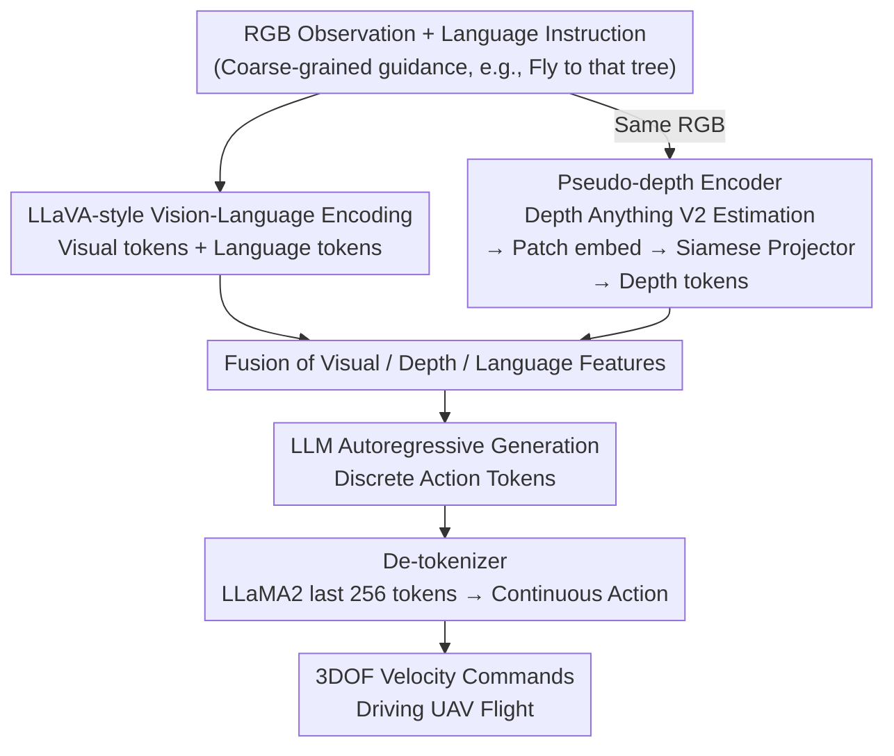

# AutoFly: Vision-Language-Action Model for UAV Autonomous Navigation in the Wild

**Conference**: ICLR 2026  
**arXiv**: [2602.09657](https://arxiv.org/abs/2602.09657)  
**Code**: [https://xiaolousun.github.io/AutoFly](https://xiaolousun.github.io/AutoFly)  
**Area**: Remote Sensing  
**Keywords**: VLA, UAV navigation, pseudo-depth, autonomous navigation, sim-to-real

## TL;DR
The paper proposes AutoFly, an end-to-end VLA model for autonomous UAV navigation in the wild. By using a pseudo-depth encoder to infer spatial information from RGB inputs and a newly constructed autonomous navigation dataset (13K+ trajectories including 1K real flights), it achieves a 3.9% higher success rate and a 2.6% lower collision rate than OpenVLA in both simulated and real environments.

## Background & Motivation
**Background**: UAV Vision-Language Navigation (VLN) primarily relies on detailed step-by-step instructions to fly along predetermined routes, performing well in controlled environments.

**Limitations of Prior Work**: Real-world outdoor exploration occurs in unknown environments where detailed navigation instructions are unavailable, providing only coarse-grained direction or location guidance. Existing methods assume complete environment knowledge and exhaustive instructions, which do not hold in practice. Furthermore, existing datasets over-rely on instruction following rather than autonomous decision-making and lack real-world data.

**Key Challenge**: VLA methods for 2D ground robots are unsuitable for 3D UAV navigation—UAVs require precise depth estimation, omnidirectional obstacle avoidance, and altitude control, where spatial reasoning from RGB input alone is insufficient.

**Goal**: To enable UAVs to complete autonomous navigation, obstacle avoidance, and target recognition given only coarse-grained guidance (e.g., "fly to that tree").

**Key Insight**: Introduce a pseudo-depth encoder to enhance spatial understanding (without extra depth sensors) and construct a navigation dataset emphasizing autonomous behavior modeling.

**Core Idea**: Utilize a pseudo-depth-enhanced VLA model combined with an autonomous navigation dataset to upgrade UAVs from instruction following to autonomous navigation.

## Method

### Overall Architecture
AutoFly enables UAVs to perform obstacle avoidance, target searching, and altitude control in unknown wild environments using only coarse-grained guidance (e.g., "fly to that tree") without relying on step-by-step instructions. The pipeline involves: RGB observations and natural language instructions entering a LLaVA-style vision-language model, while a pseudo-depth encoder infers depth from the same RGB image and encodes it into spatial features. Visual features, depth features, and language are fused and fed into an LLM. The LLM autoregressively outputs discrete action tokens, which are eventually converted back into continuous velocity commands by a de-tokenizer to drive the aircraft. The modular difference lies in the supplementary depth channel, supported by a specialized navigation dataset and a two-stage training strategy to learn "autonomous decision-making."

### Key Designs

**1. Pseudo-depth Encoder: Enabling RGB Models to "Perceive" Distance Without Depth Cameras**
UAV flight in 3D space relies heavily on depth for obstacle avoidance and altitude control, yet pure RGB VLA models lack spatial reasoning capabilities. Directly using depth cameras presents challenges: simulated depth in AirSim is over-idealized, while real-world sensors produce noisy data, enlarging the sim-to-real gap and increasing payload/cost. AutoFly utilizes Depth Anything V2 to estimate depth maps from monocular RGB, followed by patch embedding and a depth projector to align depth tokens with visual tokens in the feature space. A critical detail is the Siamese MLP projector, which shares parameters with the vision encoder. This parameter sharing acts as implicit regularization, forcing both depth and visual paths to learn consistent mappings.

**2. Autonomous Navigation Dataset: Shifting Objectives from "Following" to "Deciding"**
Existing datasets are biased towards instruction following and lack real-world data. AutoFly constructed a 13K+ trajectory dataset where ground-truth trajectories were generated by an SAC reinforcement learning agent (95% success rate) supplemented by expert demonstrations. It covers 12 AirSim environments plus 1K real flight trajectories to capture real-world distributions. To address the prevalence of avoidance behaviors in long-horizon navigation, a segmentation function splits trajectories into "avoidance" and "target searching" phases to rebalance training proportions.

**3. Two-stage Training: Aligning Vision-Language Before Learning Actions with Depth**
The model training is split into two steps. Stage 1 focuses on vision-language alignment initialized with Prismatic-VLMs. Stage 2 introduces depth information for action fine-tuning; the LLM backbone is fine-tuned with a small learning rate ($2 \times 10^{-5}$), while the new depth projector uses a larger rate ($1 \times 10^{-4}$) for rapid learning over 80K steps. This sequence prevents randomly initialized depth channels from disrupting stable vision-language representations.

### Loss & Training
The training objective is the standard cross-entropy loss of the base LLM, predicting action tokens autoregressively. Specifically, the last 256 tokens of the LLaMA2 vocabulary are repurposed as the mapping space for action tokens. Continuous velocity commands are discretized into these 256 slots, and action prediction reuses the language model's next-token prediction mechanism.

## Key Experimental Results

### Main Results

| Method | Overall SR↑ | CR↓ | PER↑ |
|------|------------|-----|------|
| RT-1 | 24.3 | 65.1 | 61.1 |
| RT-2 | 41.9 | 26.0 | 73.7 |
| OpenVLA | 44.0 | 24.5 | 75.1 |
| **Ours** | **47.9** | **21.9** | **77.3** |

### Sim-to-Real

| Scenario | Sim:Real Ratio | SR | CR | PER |
|------|-------------|-----|-----|-----|
| Indoor | 0K:1K | 10 | 40 | 61.1 |
| Indoor | 10K:1K | **60** | 30 | 76.5 |
| Outdoor | 10K:1K | **55** | 35 | 75.1 |

### Key Findings
- The pseudo-depth encoder contributes a 3.9% gain in SR and a 2.6% reduction in CR (compared to depth-less OpenVLA), showing significant advantages in dense obstacle environments.
- The Siamese projector outperforms non-Siamese versions and direct depth fusion, as parameter sharing enforces consistent feature mapping.
- The gap between indoor (60%) and outdoor (55%) success rates in real environments is only 5%, demonstrating strong environmental adaptability.
- Increased simulation data consistently improves real-world performance (SR increasing from 10% to 25% to 60%), validating the large-scale sim + small-scale real strategy.
- Data rebalancing is crucial; the KL divergence for obstacle avoidance behavior is approximately 0.36, and imbalance would otherwise lead to learning bias.

## Highlights & Insights
- **Paradigm Shift**: Unlike existing UAV VLN research focusing on "step-by-step flight," this work systematically explores "flying autonomously with general direction," which is closer to real-world needs.
- **Smart Engineering Choice**: Replacing depth cameras with Depth Anything V2 avoids the sim-to-real gap while reducing hardware dependence.
- **Generality of Data Rebalancing**: Behavioral distribution imbalance is a universal issue in long-horizon control tasks; the phased rebalancing method is highly transferable.

## Limitations & Future Work
- Absolute success rates remain modest (47.9% sim, 55-60% real), indicating a gap before practical deployment.
- The action space is limited to 3DOF (linear velocity), without addressing attitude angle control.
- The dataset scale is relatively small (13K trajectories vs. 100K for OpenFly), and language instructions are brief (avg. 12 words).
- The depth encoder depends on the quality of Depth Anything V2; depth estimation might fail in extreme environments.

## Related Work & Insights
- **vs OpenVLA**: AutoFly builds on OpenVLA by adding a pseudo-depth encoder and a navigation-specific dataset, achieving stable gains across all metrics.
- **vs AerialVLN/OpenUAV**: These datasets emphasize instruction following with long instructions (83-104 words); AutoFly uses only 12 words, fitting real-world coarse-grained scenarios.
- **vs Training-free methods (VLM zero-shot)**: These lack high-frequency reactive control capabilities in dense obstacle environments.

## Rating
- Novelty: ⭐⭐⭐⭐ The autonomous navigation paradigm and pseudo-depth design are innovative.
- Experimental Thoroughness: ⭐⭐⭐⭐ Includes sim+real environments and multiple ablations, though absolute performance is relatively low.
- Writing Quality: ⭐⭐⭐⭐ Clear structure and detailed dataset description.
- Value: ⭐⭐⭐⭐ An important exploration in the direction of autonomous UAV navigation.

<!-- RELATED:START -->

## Related Papers

- [\[ICLR 2026\] UniVLA: Unified Vision-Language-Action Model](unified_vision-language-action_model.md)
- [\[ICLR 2026\] On Robustness of Vision-Language-Action Model against Multi-Modal Perturbations](on_robustness_of_vision-language-action_model_against_multi-modal_perturbations.md)
- [\[ICLR 2026\] WMPO: World Model-based Policy Optimization for Vision-Language-Action Models](wmpo_world_model-based_policy_optimization_for_vision-language-action_models.md)
- [\[ICLR 2026\] Unified Diffusion VLA: Vision-Language-Action Model via Joint Discrete Denoising Diffusion Process](unified_diffusion_vla_vision-language-action_model_via_joint_discrete_denosing_d.md)
- [\[ICLR 2026\] VLM4VLA: Revisiting Vision-Language-Models in Vision-Language-Action Models](vlm4vla_revisiting_vision-language-models_in_vision-language-action_models.md)

<!-- RELATED:END -->
