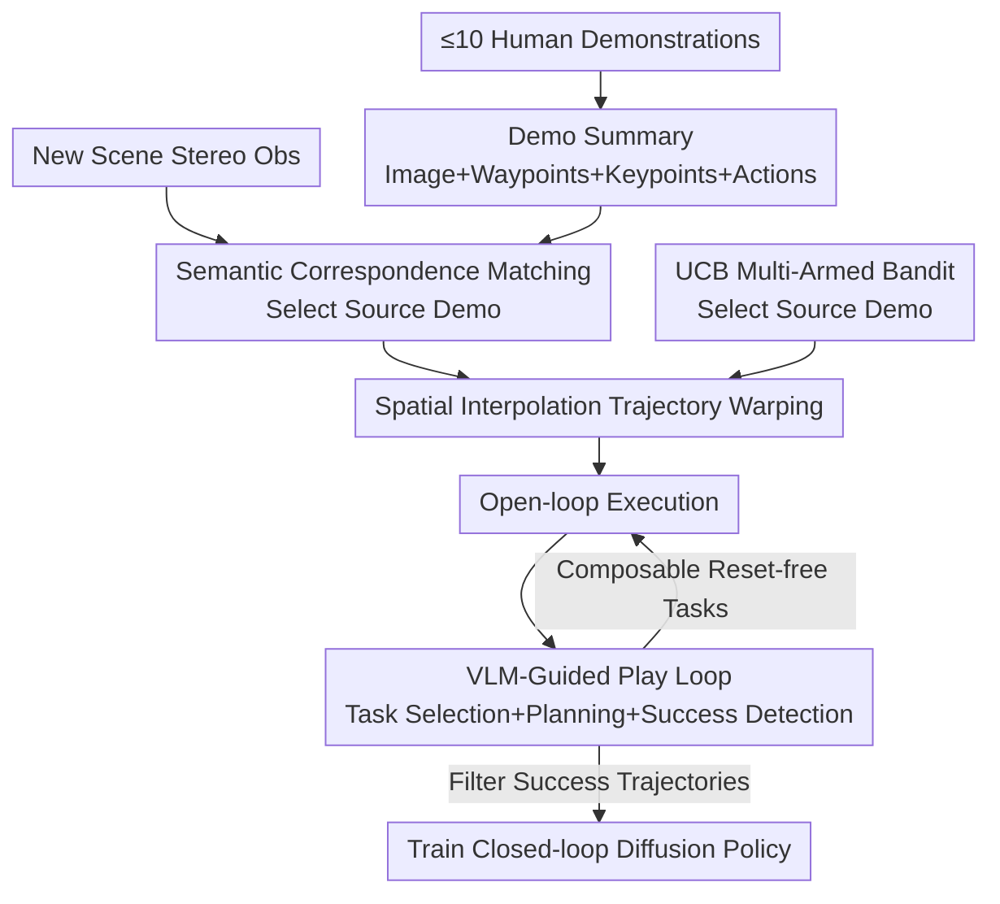

# Autonomous Functional Play with Correspondence-Driven Trajectory Warping

**Conference**: ICLR2026  
**OpenReview**: [https://openreview.net/forum?id=FqDmvMZish](https://openreview.net/forum?id=FqDmvMZish)  
**Code**: Project Page https://tether-research.github.io  
**Area**: Robotics / Embodied AI  
**Keywords**: Autonomous Data Generation, Keypoint Correspondence, Trajectory Warping, Imitation Learning, VLM Guidance

## TL;DR
This paper proposes Tether: an open-loop strategy that "warps" demonstration trajectories (requiring only $\le10$ trials) to new scenes via semantic keypoint correspondence. This is integrated into a closed "autonomous functional play" loop scheduled by a Vision-Language Model (VLM). The system enables a robot to automatically generate 1000+ expert-level trajectories over 26 hours in the real world with minimal human intervention, which are then used to train closed-loop imitation policies that achieve success rates comparable to human teleoperated data.

## Background & Motivation
**Background**: Current real-world robot manipulation largely depends on imitation learning—collecting large-scale human teleoperated demonstrations to train data-hungry neural policies like Diffusion Policy or $\pi_0$.

**Limitations of Prior Work**: The cost of human demonstrations scales linearly with labor, yet these architectures require highly diverse datasets across spatial and semantic domains to generalize. This leads to a deadlock: generalization requires big data, and big data requires massive human effort. Existing "few-shot" approaches (zero-shot foundation models, retrieval-based, or keypoint-conditioned policies) either have low throughput (e.g., Manipulate-Anything collects fewer than 50 trajectories via multi-turn foundation model inference) or fail to extract task-relevant features in cluttered scenes.

**Key Challenge**: Autonomous "play-style" data generation must simultaneously satisfy two conflicting conditions: (1) The strategy must be robust enough to out-of-distribution initial states to recover from errors; (2) The entire pipeline must continuously produce useful experience without requiring human resets. The former usually implies large models/data, while the latter demands near-zero human effort.

**Goal**: Given a small number of demonstrations per task, build a strategy robust enough to support long-term unattended play, and design a closed loop for automatic task selection, success detection, and resets to "snowball" few-shot demos into "big data."

**Key Insight**: The authors draw inspiration from "functional play" in developmental psychology (structured, task-oriented, repetitive practice) and leverage recent breakthroughs in semantic image keypoint correspondence (DINOv2 + Stable Diffusion features). These correspondences remain anchored to semantically equivalent regions (e.g., center of fruit, edge of a container) even when objects vary significantly in appearance and size.

**Core Idea**: Instead of feeding keypoints into a point-conditioned neural policy, a more direct approach is used: **select the best-matching demonstration and geometrically warp its trajectory to the new scene** via keypoint correspondence. A VLM then acts as a "director" to drive this open-loop strategy to play repeatedly, filtering successful data to train a stronger closed-loop policy.

## Method

### Overall Architecture
Tether consists of two major components forming a "few-shot $\rightarrow$ big data $\rightarrow$ strong policy" pipeline. The first is the **trajectory warping open-loop strategy** (Section 3.1): a non-parametric method that preprocesses each demonstration into a compact summary (initial image, waypoints, keypoints, action sequence). When facing a new scene, it matches keypoints against all demonstrations, selects the best source demo based on the deviation between "original waypoints vs. re-projected target waypoints," and warps the source trajectory using spatial linear interpolation. The second is **VLM-guided autonomous functional play** (Section 3.2): the strategy is embedded in an iterative loop where a VLM selects a task based on the scene, provides an executable plan, Tether executes it, and another VLM query judges success. Tasks are designed to be "composable and mutually resetting," allowing play to continue indefinitely without human intervention.

### Key Designs

**1. Demonstration Summary: Compressing each demo into an (Image, Waypoints, Keypoints, Action) tuple**
The strategy is non-parametric and accesses demonstrations at test time. Each demo $\tau_i$ is compressed offline into a summary $\kappa_i = (o, W, K, a)$. $o$ is the dual-camera observation at the start; $W=[w_1,\dots,w_T]$ is the sequence of 3D gripper "waypoints" (frames where gripper state changes); $a=[a_1,\dots,a_M]$ is the full action sequence; $K=[k_1,\dots,k_T]$ are the visual keypoints obtained by projecting waypoints back to $o$. This tuple explicitly separates "how to use a demo" into alignable, geometrically manipulatable components.

**2. Semantic Correspondence Matching and Source Selection: Ranking demos via re-projection error**
To decide which demo to replicate for a new observation $o$, Tether searches for corresponding pixels $\tilde{K}_i=[\tilde{K}_{i,\text{left}},\tilde{K}_{i,\text{right}}]$ of the keypoints $K_i$ in the current images using a SOTA semantic correspondence model. These are re-projected into target 3D waypoints $\tilde{W}_i$. If rays fail to intersect, the demo is deemed unfeasible. Feasible demos are scored by the Euclidean distance between original and target waypoints: $\text{score}_i(o)=\lVert W_i-\tilde{W}_i(o)\rVert_2$. The demo with the lowest score is chosen as the source $\kappa^*$, effectively using "geometric consistency" rather than "image similarity" for selection.

**3. Spatial Linear Interpolation Trajectory Warping: Warping trajectories while preserving spatial relations**
Once a source demo is selected, fine-grained actions between target waypoints $[\tilde{w}_t, \tilde{w}_{t+1}]$ must be filled. For an original action $a$ between $w_t$ and $w_{t+1}$, Tether calculates displacements $d_t=\tilde{w}_t-w_t$ and $d_{t+1}=\tilde{w}_{t+1}-w_{t+1}$. Crucially, **interpolation is performed over space, not time**. A relative distance $\alpha$ is defined based on the action's projection onto the line between $w_t$ and $w_{t+1}$. The warped action is:
$$d_a = (1-\alpha)\,d_t + \alpha\,d_{t+1},\qquad a_{\text{new}} = a + d_a$$ 
Spatial interpolation ensures that critical contact geometries (e.g., alignment before grasping) are preserved even when the trajectory is stretched or skewed.

**4. VLM-Guided Autonomous Functional Play Loop: Task Selection, Planning, and Evaluation**
To turn the strategy into a "data factory," an iterative loop is used. **Task Selection**: To collect data for rare tasks, a softmax over "negative success counts" is used. If a task isn't immediately executable, the VLM provides a **Task Plan** of sub-goals, and Tether executes the first one. **Success Evaluation**: Gemini Robotics-ER 1.5 is used to compare pre- and post-execution images from multiple angles. This VLM achieves 95.2% planning accuracy and 98.4% success detection precision, ensuring high-quality data.

**5. Composable Reset-free Task Design + UCB Demo Selection**
Tasks are designed such that the end state of one is a valid initial state for others (e.g., "place pineapple on table" enables "put in bowl"). This creates a "closed" state distribution where failed attempts naturally randomize object poses. To improve play, Tether models demo selection as a **Multi-Armed Bandit (UCB)**, balancing the exploration of less-tried demos with the exploitation of high-success ones to automatically identify robust demonstrations and avoid faulty ones (e.g., unstable grasps).

### Loss & Training
The system uses **filtered behavioral cloning**: after every 500 play attempts, a Diffusion Policy is trained on the accumulated successful trajectories. The high precision of VLM success detection (98.4%) ensures that only expert-level data enters the training set, preventing the policy from being contaminated by false positives.

## Key Experimental Results

The platform uses a 7-DoF Franka Emika Panda with dual ZED cameras. Tether uses $\le10$ demonstrations per task, and Gemini Robotics-ER 1.5 for high-level logic.

### Main Results
12 tasks were evaluated across three categories: Tabletop/Shelf fruit handling (In-distribution), Out-of-distribution objects (replacing pineapple/bowl with strawberry/basket), and High-skill tasks (whiteboard wiping, cabinet opening, tape hanging, coffee capsule insertion).

| Comparison | Data Volume | Performance Summary |
|------------|-------------|---------------------|
| Tether (Ours, 10 demos) | 10 | Outperforms all baselines across 12 tasks |
| Diffusion Policy | 10 | Fails to generalize with only 10 demos |
| $\pi_0$ Zero-shot | 0 | Works for pick-and-place, fails complex tasks |
| $\pi_0$ Fine-tuned | 10 | Suffers severe overfitting; zero success |
| KAT (Keypoint Action Tokens) | 10 | Fails to extract features in clutter; zero success |

**Highlights**: Despite the strawberry being 1/4 the size of a pineapple, Tether accurately positions the gripper via semantic correspondence. It also completes 8mm tolerance coffee insertion without a wrist camera.

### Ablation Study & Play Statistics

| Configuration / Metric | Value | Description |
|------------------------|-------|-------------|
| Demo Count Ablation | 1 / 5 / 10 | Robust with 10; graceful degradation with fewer |
| Total Play Time | ~26 hours | Real-world continuous reset-free operation |
| Success / Attempts | 1085 / 1946 | 55.8% cumulative success rate across 6 tasks |
| Throughput | 1 attempt / 48s | 1 successful trajectory produced every 86s |
| Human Interventions | 5 times / 0.26% | One intervention every 5.2 hours on average |

### Key Findings
- **Data Flow Improvement**: Diffusion Policies trained on play data progressively improve, eventually approaching 100% success rates, primarily due to increased **spatial robustness**.
- **Human vs. Tether Play Data**: Policies trained on Tether-generated data (141–202 trials) perform as well as or slightly better than those trained on equivalent human-collected data, likely due to more unbiased randomization.
- **Tether is Essential for Play**: A Diffusion Policy trained on human data fails when placed in the play loop, as it cannot handle the wide distribution of states (e.g., tipped bowls) that the Tether strategy manages robustly.
- **Emergent Recovery**: Large-scale play occasionally allows the robot to "accidentally" recover from failure modes, such as flipping a bowl back upright by chance.

## Highlights & Insights
- **"Select + Warp" vs. "Point-conditioned"**: Instead of feeding points into a complex network, Tether uses geometric warping. This avoids high data requirements for end-to-end training and handles hard tasks with only 10 demos.
- **Spatial > Temporal Interpolation**: Preserving spatial contact geometry is key for manipulation. This design allows trajectories to remain valid even when stretched/bent to fit new objects.
- **VLM as Director, not Executor**: VLMs handle high-level semantic logic where they excel, while the robust Tether strategy handles low-level actions, maintaining a high throughput of one attempt every 48 seconds.
- **Multi-Armed Bandit for Demo Quality**: Modeling demo selection as a bandit problem allows the system to self-purify the demonstration set during play.

## Limitations & Future Work
- **Open-loop Nature**: Tether cannot correct or recover in real-time during execution; it is a "data generator" rather than the final policy.
- **Reliance on Correspondence**: The system is bounded by the quality of the DINOv2+SD correspondence model.
- **Suboptimal Data Usage**: Filtered BC discards failed attempts. Using offline RL to leverage suboptimal data remains future work.
- **Irrecoverable Failures**: Certain states (e.g., bowl flipped upside down) still require human intervention as they are unsolvable by a single-arm system.

## Related Work & Insights
- **vs. KAT**: KAT feeds keypoints to an LLM for in-context action generation. Tether's direct geometric warping is much more robust to non-linear speed and orientation variations.
- **vs. $\pi_0$ / Diffusion Policy**: These rely on big data. Tether is few-shot robust and provides the training data these models need.
- **vs. Manipulate-Anything**: Tether achieves much higher throughput and continuous long-term operation through its "director" VLM architecture and reset-free task design.

## Rating
- **Novelty**: ⭐⭐⭐⭐⭐ The combination of "Select + Spatial Warping + VLM Director" is a clear new paradigm for autonomous data generation.
- **Experimental Thoroughness**: ⭐⭐⭐⭐⭐ Covers 12 tasks, 26 hours of continuous play, downstream policy training, and rigorous VLM verification.
- **Writing Quality**: ⭐⭐⭐⭐ Method is clear with precise formulas; some failure mode analysis is relegated to the appendix.
- **Value**: ⭐⭐⭐⭐⭐ Significant impact on reducing real-world robot data costs by "scaling up" 10 human demos into 1000+ expert trajectories.

<!-- RELATED:START -->

## Related Papers

- [\[CVPR 2026\] Scalable Trajectory Generation for Whole-Body Mobile Manipulation](../../CVPR2026/robotics/scalable_trajectory_generation_for_whole-body_mobile_manipulation.md)
- [\[CVPR 2026\] AffordGen: Generating Diverse Demonstrations for Generalizable Object Manipulation with Affordance Correspondence](../../CVPR2026/robotics/affordgen_generating_diverse_demonstrations_for_generalizable_object_manipulatio.md)
- [\[ICLR 2026\] AutoFly: Vision-Language-Action Model for UAV Autonomous Navigation in the Wild](autofly_vision-language-action_model_for_uav_autonomous_navigation_in_the_wild.md)
- [\[ICCV 2025\] Weakly-Supervised Learning of Dense Functional Correspondences](../../ICCV2025/robotics/weakly-supervised_learning_of_dense_functional_correspondences.md)
- [\[CVPR 2026\] DemoFunGrasp: Universal Dexterous Functional Grasping via Demonstration-Editing Reinforcement Learning](../../CVPR2026/robotics/demofungrasp_universal_dexterous_functional_grasping_via_demonstration-editing_r.md)

<!-- RELATED:END -->
