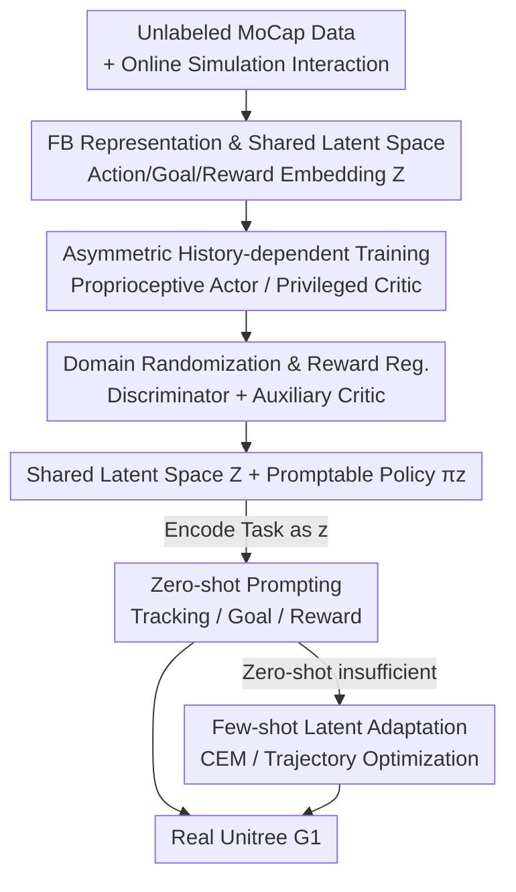

# BFM-Zero: A Promptable Behavioral Foundation Model for Humanoid Control Using Unsupervised Reinforcement Learning

**Conference**: ICLR2026  
**OpenReview**: [https://openreview.net/forum?id=jkhl2oI0g5](https://openreview.net/forum?id=jkhl2oI0g5)  
**Code**: Project Page https://lecar-lab.github.io/BFM-Zero/  
**Area**: Robotics / Humanoid Control / Unsupervised Reinforcement Learning  
**Keywords**: Behavioral Foundation Model, Humanoid Robot, Forward-Backward Representation, Unsupervised RL, sim-to-real

## TL;DR
BFM-Zero employs online off-policy unsupervised RL (Forward-Backward CPR) to encode actions, goals, and rewards into a shared latent space. It trains a "promptable" humanoid whole-body control generalist policy, achieving zero-shot motion tracking, goal reaching, and reward optimization on the real Unitree G1 without retraining, while supporting fast few-shot adaptation.

## Background & Motivation
**Background**: The current mainstream of humanoid whole-body control is the "simulation training + sim-to-real transfer" paradigm. It relies almost entirely on on-policy policy gradients (typically PPO) paired with explicit tracking rewards to train policies specialized for imitating specific motion capture clips or solving single tasks. In manipulation, foundation models like VLA already exist, learning from human demonstrations via behavior cloning.

**Limitations of Prior Work**: Humanoid whole-body control faces a fundamental mismatch—it lacks readily available joint-level action labels and large-scale teleoperation datasets, preventing the direct application of behavior cloning. Existing PPO-based solutions suffer from three persistent issues: ① **Task-specificity**, where a policy only learns to imitate one motion or solve one task; ② **Lack of adaptability**, where the policy is frozen after training and cannot be lightweightly fine-tuned or combined for new tasks; ③ **Lack of a unified, interpretable interface**, making it difficult for human operators to specify goals or assemble learned skills into new behaviors.

**Key Challenge**: To build a foundation model with "one policy for multiple tasks," a space is required that can unify heterogeneous tasks (rewards, goals, demonstrations). However, on-policy RL is inherently designed for single-task reward optimization and struggles to learn such shared representations or support zero-shot prompting without retraining. While multi-task unsupervised RL utilizes off-policy training, off-policy methods have never been verified to withstand the dynamics differences and strong perturbations in real humanoid sim-to-real transfer.

**Goal**: To verify whether off-policy unsupervised RL can train a Behavioral Foundation Model (BFM) for real humanoids, allowing it to handle a wide range of downstream tasks specified by rewards, goals, and demonstrations in a zero-shot manner, and enabling efficient post-training for tasks requiring retraining.

**Key Insight**: The authors leverage Forward-Backward (FB) representations—which provide a goal-centric, interpretable, and smooth latent space. Each latent vector $z$ corresponds to a linear reward $r_z = \phi^\top z$ and its optimal policy $\pi_z$. This transforms a "task" into a "vector in latent space," naturally supporting zero-shot prompting.

**Core Idea**: Based on FB-CPR (FB + online training + motion capture policy regularization), three "sim-to-real remedies" are added: asymmetric history-dependent training, domain randomization, and reward regularization. This applies an unsupervised RL framework, originally intended for virtual characters, to real humanoid hardware for the first time.

## Method

### Overall Architecture
Ours models real humanoid control as a POMDP $(S, O, A, P, \gamma)$: for the 29-DOF G1, the action $a \in \mathbb{R}^{29}$ represents the target for joint PD controllers; the privileged state $s \in \mathbb{R}^{463}$ contains simulation-visible information (root height, pose, velocity); and the observable state $o_t \in \mathbb{R}^{64}$ consists only of proprioception (joint position/velocity, root angular velocity, projected gravity). The pipeline consists of three stages: **Unsupervised Pre-training** → **Zero-shot Inference** → **Optional Few-shot Adaptation**. During pre-training, reward-free online interaction in simulation is combined with an unlabeled motion capture dataset $\mathcal{M}$ to learn a shared latent space $\mathcal{Z} \subseteq \mathbb{R}^d$ and a promptable policy $\pi_z$ conditioned on $z$. During inference, downstream tasks are encoded as $z$ for execution. In the adaptation stage, $z$ is fine-tuned via derivative-free optimization to handle difficult tasks beyond zero-shot coverage.

### Key Designs

**1. FB Representation and Shared Latent Space: Mapping "Tasks" to Latent Vectors**

This is the foundation of the framework, addressing the pain point that PPO-based schemes cannot learn unified multi-task representations. FB learns a finite-rank approximation of the policy's long-term dynamics: given a training state distribution $\rho$, it learns a pair of mappings—Forward $F: S \times A \times \mathbb{R}^d \to \mathbb{R}^d$ and Backward $B: S \to \mathbb{R}^d$, such that the long-term occupancy measure induced by $\pi_z$ decomposes as:

$$M^{\pi_z}(ds' \mid s, a) \simeq F(s, a, z)^\top B(s') \rho(ds')$$

where $M^{\pi_z}(s' \in X \mid s, a) := \sum_t \gamma^t \Pr(s_t \in X \mid s, a, \pi_z)$ is the discounted occupancy probability. Consequently, $F$ is the successor version of the task features $\phi(s) := (\mathbb{E}_\rho[B B^\top])^{-1} B(s)$, which induces a family of linear rewards $r_z(s) = \phi(s)^\top z$. Crucially, $F(s,a,z)^\top z$ equals the Q-function of $\pi_z$ under reward $r_z$. Thus, every latent vector $z$ corresponds to a task and its optimal policy. Unlike standard RL, the "set of rewards of interest" $\{r_z\}$ is learned rather than human-specified. The authors use FB-CPR: introducing a latent-conditioned discriminator to regularize unsupervised learning toward "human-like MoCap behavior" with full online off-policy training.

**2. Asymmetric History-dependent Training: Privileged Critic Guiding Proprioceptive Actor**

Real robots only have proprioception (partial observability), while simulation provides full privileged states—this gap is a core barrier for sim-to-real. The approach uses **asymmetry**: the policy $\pi$ only takes the observable history $o_{t,H} = \{o_{t-H}, a_{t-H}, \dots, o_t\}$, whereas all critics (Forward $F$, Backward $B$, auxiliary critic, discriminator critic) take additional privileged information $(o_{t,H}, s_t)$. The privileged critic provides more accurate value estimates to guide training, while feeding the action history to the actor narrows the information gap with the critic, making the policy robust and adaptable under restricted perception and domain randomization. Both FB and auxiliary critics use Bellman residuals based on successor measures for TD learning, such as the FB objective:

$$L(F, B) = \mathbb{E}\big[(F^\top \bar B - \gamma \bar F^\top \bar B)^2\big] - 2\mathbb{E}[F(o_{t,H}, s_t, a_t, z)^\top B(o_{t+1}, s_{t+1})]$$

($\bar F, \bar B$ are stop-gradient). This TD-based off-policy training allows the robot to "recover naturally after falling and continue tracking"—the policy dynamically retrieves recovery actions from its skill library like a human.

**3. Domain Randomization and Reward Regularization: Shaping with Discriminator and Constraints**

Asymmetric training alone is insufficient to handle dynamics gaps and dangerous behaviors like joint limit collisions. The authors implement: **Domain Randomization (DR)** to randomize link mass, friction, joint offsets, and COM, while adding perturbations and sensor noise. This is paired with massive parallel environments, large replay buffers, and high UTD (update-to-data) ratios to stabilize off-policy unsupervised training. **Reward Regularization** injects $N_{aux}$ penalty rewards (e.g., joint limit penalties) via an auxiliary privileged history critic $Q_R$, learned with standard Bellman residuals to ensure physical feasibility and safety. Additionally, a discriminator $Q_D$ uses a GAN-style objective to pull behavior toward "human-like" styles, serving as both style regularization and a bias for online exploration. The final actor loss is:

$$L(\pi) = -\mathbb{E}\big[F(o_{t,H}, s_t, a_t, z)^\top z + \lambda_D Q_D + \lambda_R Q_R\big]$$

This optimizes for "task completion (FB term) + human-likeness (discriminator term) + safety (auxiliary term)."

**4. Zero-shot Prompting and Few-shot Latent Adaptation: Changing $z$ without Retraining**

Once pre-trained, downstream tasks are solved by "finding the right $z$." For any reward $r(s)$, the optimal prompt $z_r = \mathbb{E}_{s'\sim\rho}[B(s')r(s')]$ can be estimated via sub-sampling as $z_r = \frac{1}{N}\sum_i r(s_i) B(s_i)$. For **goal reaching**, $z_g = B(s_g)$ is used. For **motion tracking**, a sequence of prompts $z_t = \sum_{t'=t}^{t+H} B(s_{t'})$ is generated. When zero-shot performance is insufficient, **Few-shot Latent Adaptation** is performed: optimizing $J(z) = \sum_t (r_{task}(s_t) - \alpha_R \sum_k r_k)$ in simulation. For poses, CEM optimizes $z$ starting from $z_0 = B(s_g, o_g)$. For trajectories, zero-order sampling optimization (DIAL-MPC style) is used with a warm start. Adaptation only modifies $z$, leaving network parameters untouched.

### Loss & Training
Training uses off-policy actor-critic: joint optimization of FB representation $L(F,B)$, auxiliary safety critic $L(Q_R)$, GAN-style discriminator $L(D)$ with its style critic $Q_D$, and the final actor loss $L(\pi)$. Simulation uses IsaacLab for the G1 (200 Hz sim, 50 Hz control). MoCap data uses LAFAN1 (40 clips) retargeted to G1. Large-scale parallel environments and high UTD ensure scalability.

## Key Experimental Results

### Main Results
Simulation zero-shot evaluation (Track and Pose are Mean Per-Joint Position Error $E_{mpjpe}$, lower is better; Rwd is 500-step average return, higher is better):

| Model | Test Env | Test Data | Track ↓ | Rwd ↑ | Pose ↓ |
|------|---------|---------|---------|-------|--------|
| BFM-Zero-priv | Isaac (no DR) | LAFAN1 | 1.0749 | 299.3 | 1.0291 |
| BFM-Zero | Isaac (DR) | LAFAN1 | 1.1015 | 221.9 | 1.1387 |
| BFM-Zero | Mujoco (DR) | LAFAN1 | 1.0789 | 207.3 | 1.1041 |
| BFM-Zero | Mujoco (DR) | AMASS | 1.0342 | 207.3 | 1.4735 |

The deployable BFM-Zero (with DR) compared to the idealized BFM-Zero-priv shows performance gaps of only **2.47% / 25.86% / 10.65%** in tracking, reward, and pose reaching, respectively, indicating that learning dynamics remain correct after sim-to-real modifications.

### Ablation Study

| Configuration | Key Result | Description |
|------|---------|------|
| Privileged (no DR, Isaac) | Baseline | Idealized upper bound, non-deployable |
| +DR (Deployable) | Track -2.47% / Rwd -25.86% / Pose -10.65% | Cost of sim-to-real robustness |
| Sim-to-sim (Isaac→Mujoco) | Differences <7% | Robustness against dynamics changes |
| OOD (AMASS 175 motions/10 poses) | Successful generalization | Generalization to unseen tasks |
| Pose Adaptation (Payload +4kg) | Single-leg stand >15s (<5s without) | $z$ optimization compensates for payload |
| Trajectory Adaptation (Variable friction) | Track error ↓ ~29.1% | Dual-annealing trajectory optimization |

### Key Findings
- **Reward tasks show the largest performance drop (25.86%)**: This is attributed to the sparsity of rewards and lower tolerance for sub-optimal behavior; DR stochasticity makes reward inference on small sub-samples more fragile.
- **DR and history components provide robustness**: The <7% difference in sim-to-sim results indicates that DR and history-dependent architecture provide resilience to dynamics changes.
- **Zero-shot real-world deployment**: A single model achieves various walking styles, dancing, fighting, and motion tracking on the real G1. It recovers naturally from pushes and falls. Goal reaching converges smoothly even for infeasible goals. Rewards can be linearly combined for composite skills.
- **Latent space semantic structure**: t-SNE visualization shows the latent space is clustered by motion style. Spherical linear interpolation (Slerp) generates semantically meaningful intermediate skills zero-shot.

## Highlights & Insights
- **Unified "Task as Vector" Interface**: FB representations reduce rewards, goals, and demonstrations to a single $z$. Zero-shot prompting is merely a $B(\cdot)$ encoding or sub-sample estimation. This interpretable, smooth latent space is a core foundation not possible with PPO.
- **First deployment of Unsupervised RL on Humanoids**: Previous FB/unsupervised RL works were confined to virtual characters; this work bridges sim-to-real with asymmetric training, DR, and reward regularization.
- **Recovery behavior from training paradigm**: Natural recovery after falling stems from TD-based off-policy training + GAN rewards, allowing the policy to draw from a skill library rather than just relying on perturbation robustness.
- **Inference-time prompt optimization**: Few-shot adaptation (CEM/Trajectory optimization) occurs only on the latent $z$, leaving network parameters untouched, yet compensating for payload or friction changes.

## Limitations & Future Work
- **Behavioral range limited by training data**: The skills BFM-Zero can express are tied to the quality and diversity of MoCap data; the authors suggest investigating scaling laws between data size, simulation volume, and performance.
- **Complex motions require stronger online adaptation**: While DR narrowing the sim-to-real gap, more complex motions may require algorithms with stronger online adaptation capabilities.
- **Limited understanding of fast adaptation**: Test-time adaptation was only explored preliminarily; a systematic understanding of fast adaptation vs. fine-tuning is needed.
- **Reward inference fragility**: Sparse rewards under DR can lead to poor inference results from sub-sampling, which may require more robust estimation for critical tasks.

## Related Work & Insights
- **vs. PPO-based sim-to-real tracking (e.g., He et al. 2025)**: These use on-policy PPO + explicit tracking rewards for single-task experts. Ours uses off-policy unsupervised RL for multi-task generalists, where tasks are learned latent vectors.
- **vs. VLA Foundation Models (e.g., OpenVLA)**: VLAs rely on humanoid-level action labels, which are scarce. Ours uses unsupervised RL + MoCap regularization to bypass the need for explicit joint labels.
- **vs. FB-CPR (Tirinzoni et al. 2025)**: FB-CPR is the algorithmic base, but it was only verified in virtual environments. This work's contribution is the sim-to-real design that enables deployment on real hardware.

## Rating
- Novelty: ⭐⭐⭐⭐⭐ First to bring off-policy unsupervised RL to real humanoids.
- Experimental Thoroughness: ⭐⭐⭐⭐ Extensive sim-to-real and real-world validation, though lacks direct quantitative comparison with a PPO baseline.
- Writing Quality: ⭐⭐⭐⭐ Clear derivations and well-explained motivations.
- Value: ⭐⭐⭐⭐⭐ High potential for guiding future work in promptable humanoid foundation models.

<!-- RELATED:START -->

## Related Papers

- [\[ICML 2026\] From Abstraction to Instantiation: Learning Behavioral Representation for Vision-Language-Action Model](../../ICML2026/robotics/from_abstraction_to_instantiation_learning_behavioral_representation_for_vision-.md)
- [\[AAAI 2026\] Coordinated Humanoid Robot Locomotion with Symmetry Equivariant Reinforcement Learning Policy](../../AAAI2026/robotics/coordinated_humanoid_robot_locomotion_with_symmetry_equivariant_reinforcement_le.md)
- [\[ICLR 2026\] From Seeing to Experiencing: Scaling Navigation Foundation Models with Reinforcement Learning](from_seeing_to_experiencing_scaling_navigation_foundation_models_with_reinforcem.md)
- [\[ICLR 2026\] Embodied Navigation Foundation Model](embodied_navigation_foundation_model.md)
- [\[CVPR 2026\] End-to-End Language-Action Model for Humanoid Whole Body Control](../../CVPR2026/robotics/end-to-end_language-action_model_for_humanoid_whole_body_control.md)

<!-- RELATED:END -->
