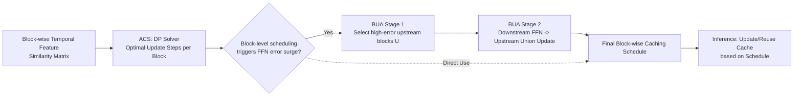

# Block-wise Adaptive Caching for Accelerating Diffusion Policy

**Conference**: ICLR 2026  
**OpenReview**: [https://openreview.net/forum?id=c6ZWfQLOWD](https://openreview.net/forum?id=c6ZWfQLOWD)  
**Code**: [https://block-wise-adaptive-caching.github.io](https://block-wise-adaptive-caching.github.io)  
**Area**: Robotics / Embodied AI · Inference Acceleration  
**Keywords**: Diffusion Policy, Feature Caching, Training-free Acceleration, VLA, Dynamic Programming, Error Propagation  

## TL;DR
BAC adapts the "feature caching" concept from image diffusion to Diffusion Policy. It utilizes dynamic programming to schedule cache update intervals for each Transformer sub-block individually and introduces the Bubbling Union Algorithm to intercept inter-block error propagation in FFN blocks. This training-free, plug-and-play method accelerates diffusion policy inference by 3× with almost no loss in success rate.

## Background & Motivation
**Background**: Diffusion Policy models robotic visuo-motor control as a conditional denoising sampling process. Due to its high expressivity, it has been widely adopted by VLA models for dexterous and complex manipulations. However, it requires $K$ denoising iterations, leading to massive computational overhead—for a 6-DoF arm grasping task, 50 denoising steps at 1ms each reduces the action update rate to 10 Hz, far below the 30–50 Hz required for smooth real-time control.

**Limitations of Prior Work**: Mature caching acceleration methods exist in image/video diffusion (e.g., DeepCache, TeaCache, δ-DiT), which leverage temporal redundancy between denoising steps by reusing intermediate features. However, these methods **cannot be directly transferred to Diffusion Policy**: ① Early methods target U-Net structures and do not adapt to Transformer backbones; ② Most Transformer-based caching uses **unified scheduling** (all blocks update together at fixed intervals), which is too coarse; ③ Rare fine-grained methods either require additional training or are tailored for image generation feature patterns, failing to match the data characteristics and model structures of action generation.

**Key Challenge**: The temporal dynamics of feature similarity in Diffusion Policy are **non-uniform**, and **similarity patterns vary significantly across different blocks** (Self-Attention, Cross-Attention, and FFN blocks each have distinct change curves). Unified uniform caching schedules fail to fit this "block-specific, interval-specific" redundant structure, leading to success rate collapse under aggressive caching.

**Goal**: Design a **training-free** feature caching method customized for Diffusion Policy that adaptively decides when to update or reuse cache at the block level, achieving near-lossless acceleration for action generation.

**Key Insight**: **[Block-level Adaptive Scheduling]** Rewrite the task of "selecting update steps" as a dynamic programming problem targeting global feature similarity, solving for the optimal update intervals for each block independently. **[Error Propagation Interception]** Block-level scheduling was found to trigger error surges in FFN blocks (inter-block error propagation). The Bubbling Union Algorithm is proposed to force high-error upstream blocks to update before downstream FFNs, cutting off the propagation chain.

## Method

### Overall Architecture
BAC (Block-wise Adaptive Caching) consists of two serial components. First, the **Adaptive Caching Scheduler (ACS)** calculates an optimal cache update schedule for each block (SA / CA / FFN) in the DiT decoder to minimize "reuse-induced error." Since naive block-level scheduling causes error surges in FFN blocks, the **Bubbling Union Algorithm (BUA)** then revises the schedule, forcing high-error upstream blocks to update whenever a downstream FFN is updated, thereby intercepting inter-block error propagation. This process is computed once before inference (episodes of the same task are highly homogeneous) with near-zero overhead during execution.

### Key Designs

**1. Adaptive Caching Scheduler: Formulating Cache Scheduling as Dynamic Programming.** Each layer in a DiT contains a Cross-Attention block, a Self-Attention block, and an FFN block. The layer output is the sum of these residuals: $h_k^{(l)} = h_k^{(l-1)} + \text{SA}_k^{(l)} + \text{CA}_k^{(l)} + \text{FFN}_k^{(l)}$. BAC follows the "update-reuse" paradigm: at update steps $k\in C$, the block cache $b_k$ is recalculated; at reuse steps, the most recent cache is reused. The key is selecting the update set $C$. The authors use cosine similarity to measure directional consistency of features at adjacent steps $s_k = \cos(b_k, b_{k-1})$ and define interval similarity as $\phi(i,j)=\sum_{k=i+1}^{j} s_k$. The problem of selecting $M$ update steps is formulated to maximize $\sum_{m=0}^{M}\phi(c_m, c_{m+1}-1)$. This is **reconstructed as a Dynamic Programming** problem: the state $\text{DP}[m][j]$ represents the maximum cumulative similarity when the $m$-th update occurs at step $j$, with the transition $\text{DP}[m][j]=\max_{0\le i<j}\{\text{DP}[m-1][i]+\phi(i,j)\}$. Optimal update sets $C^*$ are retrieved via backtracking.

**2. Error Surge Phenomenon and Inter-block Propagation Analysis.** Naively extending ACS to the block level causes performance collapse, as block-level updates can increase error, specifically manifesting as sudden error surges in FFN blocks. The authors find that caching error involves "reuse error" (mismatch between cached features and shifted ground truth) and "update error" (inaccurate input caused by upstream block errors). Error surges occur during FFN **update steps**, indicating the update process is contaminated by upstream errors. Using a first-order expansion of $\text{FFN}(X)=W_{out}\phi(W_{in}\text{LN}(X)+b_1)+b_2$ (Proposition 3.1), given upstream error $\delta$, the update error is $\Delta = W_{out}\,\text{diag}(\phi'(U))\,W_{in}(A-B)\delta + O(\|\delta\|^2)$. FFNs lack intermediate normalization, causing them to absorb upstream errors linearly. A toy experiment showed a Pearson correlation of $r=0.9894$ between upstream cache error and downstream FFN update error, confirming propagation.

**3. Bubbling Union Algorithm: Updating High-Error Upstream Blocks to Intercept Propagation.** The core insight is that if an FFN block updates its cache, its high-error upstream blocks should also update to minimize the absorbed upstream error $\delta$. The algorithm has two stages. **Stage 1: Select high-error upstream blocks**: Use the mean $\ell_1$ norm of features between all denoising steps to estimate the reuse error magnitude $\ell_j=\frac{1}{K^2}\sum_{t}\sum_{u}\|X_j^{(t)}-X_j^{(u)}\|_1$, selecting the top-$n$ blocks as set $U$. **Stage 2: Union update steps from downstream FFN to upstream**: For each upstream block $u\in U$, merge the update steps of all its downstream FFN blocks $D(u)$ into its own schedule: $C(u)=C(u)\cup\bigcup_{v\in D(u)} C(v)$. This ensures high-error upstream blocks always update before downstream FFNs.

## Key Experimental Results

### Main Results (RoboMimic PH Data, DP-T, Success Rate = Max/Last 10 Mean, AVG/FLOPs/Speedup)

| Method | Square | Transport | Tool Hang | AVG | FLOPs | Speed× |
|---|---|---|---|---|---|---|
| Full Precision | 0.82/0.88 | 0.78/0.81 | 0.43/0.53 | 0.76 | 15.77G | – |
| Uniform(fastest) | 0.73/0.83 | 0.73/0.78 | 0.23/0.64 | 0.76 | 2.72G | 3.20 |
| TeaCache(fastest) | 0.67/0.82 | 0.77/0.52 | 0.44/0.38 | 0.72 | 2.78G | 3.14 |
| **BAC(S=10)** | **0.82/0.89** | **0.77/0.82** | **0.49/0.55** | **0.79** | 2.66G | 3.40 |

In multi-stage tasks (Block-Pushing + Kitchen, specifically the difficult Kitchen p4): Uniform(fastest) achieved an AVG of only 0.66 and TeaCache collapsed to 0.25, while **BAC(S=10) achieved 0.98** (matching full precision), with 3.60× acceleration.

Real-world (Franka Research 3 grasping a soft bag): **BAC(S=7) achieved a 71% success rate at 39.2 Hz**; a more aggressive BAC(S=5) reached 45.1 Hz while maintaining 63%. In contrast, DDPM(K=100) managed only 7.8 Hz/3%, DDIM(K=50) 52%, and Uniform(S=20) 40%.

### Ablation Study

| Variant | Design | Best AVG | Description |
|---|---|---|---|
| Uniform | Uniform interval unified update | Baseline | Coarse-grained |
| Unified ACS | ACS calculated for Layer 0 SA only | ↑ Better than Uniform | Proves reuse error reduction is effective |
| Block-wise ACS | ACS calculated per block | ↓ Lower than Unified ACS | Exposes the error surge phenomenon |
| **Block-wise ACS + BUA** | Full BAC | **0.79 (Full recovery)** | Proves BUA intercepts propagation effectively |

### Key Findings
- **Block-level scheduling backfires without BUA**: Block-wise ACS performed worse than Unified ACS, empirically proving the error surge; BUA is essential to recover full precision across all tasks.
- **Advantages are most significant in difficult tasks**: In long-horizon multi-stage tasks like Kitchen p4, where Uniform/TeaCache fail, BAC maintains high success rates.
- **Cross-model generalization**: On RDT-1B VLA with DPMSolver, BAC achieves 3.55× acceleration with near-lossless performance.
- BAC consistently maintains 3.4×+ speedup and occasionally outperforms full precision slightly (caching may smooth out some noise).

## Highlights & Insights
- **Elegant Problem Reformulation**: Rewriting cache scheduling from an exponential search space into a DP problem using similarity as a score and global similarity as the objective. One-time pre-computation yields block-optimal solutions by leveraging episode homogeneity.
- **Diagnosis and Targeted Solution**: Beyond proposing an acceleration method, the authors identify why block-level scheduling fails (inter-block error propagation due to lack of normalization in FFNs) through theory (first-order expansion) and experiments (Pearson correlation).
- **Focus on Real-time Control**: Instead of just reporting FLOPs, the authors measure inference frequency and end-to-end latency on real hardware, revealing how slow inference in DDPM leads to "observation-action desync" and subsequent failures.
- **Plug-and-play**: Training-free and compatible with both Transformer-based Diffusion Policy and VLA models.

## Limitations & Future Work
- **Dependence on Episode Homogeneity**: The schedule is pre-computed, assuming similar feature patterns within a task. In scenarios with high distribution shift or online adaptation, the fixed schedule might become inaccurate.
- **Transformer-specific**: The method is designed for DiT's SA/CA/FFN structure and is not directly applicable to U-Net based Diffusion Policy.
- **BUA as an Approximation**: It ignores upstream update errors (which are rare and hard to estimate). Some residual propagation might occur under extreme inter-block coupling.
- **Acceleration Ceiling**: Most results are in the ~3× range; more aggressive caching (smaller $S$) begins to show performance drops.

## Related Work & Insights
- **Diffusion Caching Lineage**: Progressing from DeepCache (U-Net high-level feature caching) to TeaCache/δ-DiT (unified Transformer caching), BAC pushes the granularity to "block-wise adaptive + error-propagation aware."
- **Inspiration for Acceleration**: Fine-grained scheduling is not a "free lunch"—it can amplify inter-block error coupling. Analyzing error propagation is as important as the scheduling itself.
- **Inspiration for Robotics**: Real-time capability is a hard constraint for VLA deployment. Re-tailoring image diffusion tools to action generation data characteristics is a pragmatic path for VLA engineering.

## Rating
- **Novelty**: ⭐⭐⭐⭐
- **Experimental Thoroughness**: ⭐⭐⭐⭐
- **Writing Quality**: ⭐⭐⭐⭐
- **Value**: ⭐⭐⭐⭐

<!-- RELATED:START -->

## Related Papers

- [\[ICLR 2026\] H$^3$DP: Triply-Hierarchical Diffusion Policy for Visuomotor Learning](h3dp_triplyhierarchical_diffusion_policy_for_visuomotor_learning.md)
- [\[ICLR 2026\] Unified Diffusion VLA: Vision-Language-Action Model via Joint Discrete Denoising Diffusion Process](unified_diffusion_vla_vision-language-action_model_via_joint_discrete_denosing_d.md)
- [\[CVPR 2026\] GraspLDP: Towards Generalizable Grasping Policy via Latent Diffusion](../../CVPR2026/robotics/graspldp_towards_generalizable_grasping_policy_via_latent_diffusion.md)
- [\[NeurIPS 2025\] VLA-Cache: Efficient Vision-Language-Action Manipulation via Adaptive Token Caching](../../NeurIPS2025/robotics/vla-cache_efficient_vision-language-action_manipulation_via_adaptive_token_cachi.md)
- [\[ICLR 2026\] Compositional Diffusion with Guided Search for Long-Horizon Planning](compositional_diffusion_with_guided_search_for_long-horizon_planning.md)

<!-- RELATED:END -->
