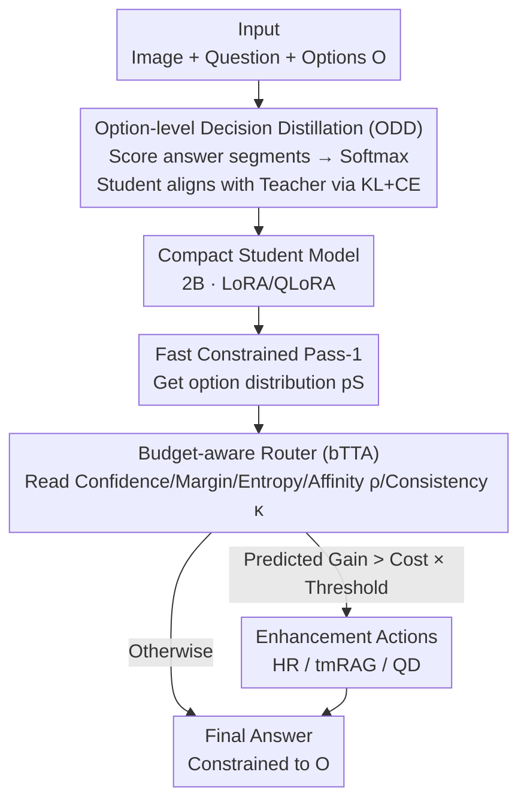

# BOLT: Decision‑Aligned Distillation and Budget-Aware Routing for Constrained Multimodal QA on Robots

**Conference**: ICLR2026  
**OpenReview**: [https://openreview.net/forum?id=Vsy3nAnaX6](https://openreview.net/forum?id=Vsy3nAnaX6)
**Code**: https://github.com/A-leyenda/BOLT  
**Area**: VLM Efficiency / Knowledge Distillation / Adaptive Inference / Robotic Multimodal QA  
**Keywords**: Decision-aligned Distillation, Budget-aware Routing, Constrained Decoding, Compact VLM, Calibration

## TL;DR
BOLT decomposes "constrained multiple-choice QA on robots" into **option-level decision distillation** during training (aligning a 2B student directly with a 13B teacher's preferences over option sets) and **budget-aware routing** during inference (triggering expensive signals like high-resolution re-evaluation, retrieval, or question decomposition only when cheap signals predict positive gains). Using a 2B student, it achieves 50.50% accuracy on Robo2VLM-1, surpassing the 36.74% of the 13B teacher while reducing VRAM from 26.9GB to 3.8GB and energy consumption by 82.5%.

## Background & Motivation
**Background**: Robots and embedded platforms increasingly utilize Vision-Language Models (VLMs) for perception and decision-making. Many robotic benchmarks adopt a "constrained output" format—where answers are restricted to a finite set of options (colors, directions, A–E, yes/no)—as deterministic interfaces facilitate safety checks and real-time control loops. However, large VLMs (e.g., LLaVA-1.5-13B) are impractical for edge hardware due to latency, VRAM, and energy constraints.

**Limitations of Prior Work**: Existing methods for transferring large model capabilities to small models have several drawbacks: ① **Token-level Knowledge Distillation** (inherited from text LMs) aligns "surface character sequences" under specific prompt templates rather than the "decision surface over option sets" used in constrained decoding. This makes students fragile and decoupled from evaluation. It also penalizes word choices irrelevant to the final answer. ② **Always-on Test-Time Augmentation** (high-resolution re-evaluation, retrieval-augmented prompting) improves accuracy but violates hardware budgets if applied universally. Simple question decomposition may also introduce hallucinations contradicting visual evidence. ③ Compact VLMs generally suffer from **poor calibration**, causing confidence-based selective computation to fail. Small models also exhibit severe **hallucinations** and lack explainability.

**Key Challenge**: Simultanously meeting "decision quality" and "latency/VRAM/energy budget" requirements. Existing methods either align the wrong target (tokens instead of the decision surface) or apply computation indiscriminately. Few works can simultaneously improve decision accuracy, enhance explainability, and suppress hallucinations under strict on-device budgets.

**Goal**: Decompose the problem into two sub-problems: (1) faithfully transferring the teacher's "option-level decision quality" to compact students during training, and (2) selectively increasing computation during inference only when cost-effective under explicit power/compute budgets.

**Key Insight**: The essence of constrained multiple-choice QA is a **decision surface** (preference ranking over the option set). Since evaluation occurs on this surface, training should align the student with the teacher at the option level, and inference should selectively allocate extra compute to samples with high uncertainty on this specific surface.

**Core Idea**: Use "option-level decision distillation" (scoring only answer segments to align teacher option distributions) and "budget-aware risk-calibrated routing" (triggering high-cost enhancements only when cheap signals predict positive gains) to unify decision alignment and selective computation.

## Method

### Overall Architecture
BOLT (Budgeted Option-Level Transfer) is a "decision-centric" framework for robotic constrained multimodal QA. It consists of two stages: **Offline Training** uses Option-level Decision Distillation (ODD) to inject the 13B teacher's preferences into a 2B student. **Online Inference** first performs a fast constrained decoding (pass-1) with the distilled student, then uses a Budget-aware Router (bTTA) to read cheap signals and decide whether to trigger three enhancements: High-Resolution (HR) re-evaluation, Type-Matched Retrieval (tmRAG), or Question Decomposition (QD).

Problem Setting: Each sample is $(x, q, O, y)$, where $x$ is the image, $q$ is the question, $O=\{o_1,\dots,o_K\}$ is the option set, and $y$ is the ground truth index. The model must output exactly one option string under constrained decoding. The key technique is scoring only the "answer segment"—fixing a chat template where $(x,q)$ is the user turn and the answer is the assistant turn, then summing log-likelihoods for tokens in option $o_k$:

$$s_M(k\mid x,q) := \sum_{t\in A(k)} \log p_M\!\left(a^{(k)}_{t-L_0}\mid z^{(k)}_{<t}\right)$$

This strips prompt wording from the supervision signal and focuses precisely on the segment evaluated during constrained decoding.

### Key Designs

**1. Option-level Decision Distillation (ODD): Shifting Distillation Target to the Decision Surface**

Addressing the "wrong target" of token-level KD, ODD stops imitating token-by-token. Instead, it sums log-likelihoods of the answer segment for each option to get scores, then converts teacher scores into a calibrated preference distribution via temperature softmax:

$$p_T(k\mid x,q) = \frac{\exp(s_T(k)/\tau_{kd})}{\sum_{j=1}^{K}\exp(s_T(j)/\tau_{kd})}$$

Teacher distributions $\{p_T(k)\}$ are **cached offline**, so the student only compares against this fixed distribution without querying the teacher during training. The student constructs its own distribution $p_S$ from its scores using the same softmax (without temperature $\tau_{kd}$). The final objective minimizes a decision-alignment loss: KL divergence pulls the student toward the teacher, while a small Cross-Entropy term anchors to the ground truth:

$$\mathcal{L}_{ODD}(\theta) = \lambda_{KL}\,\mathrm{KL}(p_T\,\|\,p_S) + \lambda_{CE}\,\mathrm{CE}(\delta_y\,\|\,p_S)$$

The KL term shapes the student's decision surface, while the CE term stabilizes training and ensures recall for rare options. This objective is robust to benign tokenization changes and directly targets the decision surface.

**2. Budget-aware Routing (bTTA): Selective Computation**

Addressing "universal costs of TTA," bTTA models extra computation as cost-constrained action selection. The distilled student performs a fast pass-1 to extract cheap routing features: confidence $p_{\max}=\max_k p_S(k)$, margin $\Delta=p_{(1)}-p_{(2)}$, entropy $H=-\sum_k p_S(k)\log p_S(k)$, **type-matched retrieval affinity** $\rho$ (mean cosine similarity of top-$K_r$ same-task samples), and **decomposition consistency** $\kappa$ (inverse measure of JS divergence between multiple short decompositions).

Each action $a$ has a normalized cost $C_a$ and a gain model $g_\omega(f,a)\approx\Pr[\Delta\mathrm{Acc}_a=1\mid f]$ learned from validation logs. Sample-level decisions solve a 0/1 knapsack problem under budget $B$. A simple threshold rule is derived:

$$\text{Trigger } a \iff g_\omega(f,a)\,W_a \ge \tau\,C_a,\quad \text{Total Cost} \le B$$

This triggers an enhancement only if the predicted gain outweighs the cost by threshold $\tau$, which is tuned on the validation set to meet average budgets.

**3. Enhancement Actions (HR / tmRAG / QD)**

Each action covers a specific shortfall: **HR (High-Resolution)** re-evaluates with a larger image side to fix resolution-limited errors (gated by entropy $H$). **tmRAG (Type-Matched RAG)** pulls top-$K_r$ **same-task** examples into the prompt to provide domain knowledge (gated by affinity $\rho$). **QD (Question Decomposition)** generates $K_d$ short decomposition paths and uses voting to reduce reasoning variance (gated by consistency $\kappa$).

**4. Constrained Decoding: Suppressing Hallucinations and Providing Evidence**

Restricting output to the valid option set eliminates character-level hallucinations (Invalid Option Rate IOR=0) by design. It reduces the misuse of "none of the above" sentinels from 1.08% (zero-shot) to 0.22% (ODD+bTTA). Simultaneously, tmRAG and QD expose retrieved evidence and reasoning trajectories, making decisions inspectable.

### Loss & Training
The training uses the ODD loss. The student is Qwen2-VL-2B-Instruct, trained using LoRA/QLoRA on attention and MLP projections. Only adapter weights are updated. During inference, fixed costs for actions are set as $(C_{HR},C_{tmRAG},C_{QD})=(0.50,0.30,0.35)$, with the base pass cost at 1.00. Gain saturates as budget $B$ approaches 2.00.

## Key Experimental Results

### Main Results
Evaluation is performed on Robo2VLM-1 (panel-style robot perception QA). 

| Model | Parameters | Accuracy (%) |
|------|--------|-----------|
| LLaVA-1.5-13B (Teacher, zero-shot) | 13B | 36.74 |
| Qwen2-VL-2B (Zero-shot) | 2B | 28.66 |
| 2B Student (LLaVA-13B → Token-KD) | 2B | 37.58 |
| 2B Student (LLaVA-13B → Token-KD) + bTTA | 2B | 47.02 |
| **2B Student (LLaVA-13B → ODD, Ours)** | 2B | **42.89** |
| **2B Student (LLaVA-13B → ODD) + bTTA** | 2B | **50.50** |

The 2B student reaches 42.89% via ODD alone, **surpassing the 13B teacher (36.74%)**. With bTTA, it reaches 50.50%. ODD outperforms Token-KD by 5.31 points (42.89 vs 37.58). Results are consistent across different teacher/student architectures.

### Ablation Study

| Configuration | HR | tmRAG | QD | Accuracy (%) |
|------|----|-------|----|-----------|
| ODD Student (Pass-1) | N | N | N | 42.89 |
| + tmRAG | N | Y | N | 44.31 |
| + QD | N | N | Y | 45.47 |
| + HR | Y | N | N | 46.64 |
| + HR + tmRAG | Y | Y | N | 48.25 |
| + HR + QD | Y | N | Y | 48.92 |
| + All Three | Y | Y | Y | 50.50 |

Gains are monotonic and approximately additive. In terms of efficiency, the 2B student uses 3,035 MB VRAM (88.7% less than the 13B teacher). Even with all enhancements, it only uses 3,817 MB. BOLT provides ~2.5× speedup and 82.5% energy reduction compared to the 13B teacher.

### Key Findings
- **HR provides the largest single gain** (42.89→46.64).
- **Clear signal-to-action mapping**: Entropy $H$ gates HR, affinity $\rho$ gates tmRAG, and consistency $\kappa$ gates QD.
- **Hallucinations decrease with augmentation**: Constrained interfaces ensure IOR=0; Over-confident wrong (OCW@0.7) predictions drop from 4.18% to 0.19%.
- The routing mechanism outperforms single-signal baselines (e.g., HR thresholding or early exit) across the accuracy-budget frontier.

## Highlights & Insights
- **Aligning the actual evaluation decision surface**: Constrained QA happens at the option level, so training should align there. This avoids the "prompt-answer conflict" in token-level KD.
- **Budgeted TTA as a Knapsack problem**: The $g_\omega(f,a)W_a\ge\tau C_a$ rule makes the trade-off between "when to compute" and "what to compute" tunable and interpretable.
- **Explainability as a byproduct**: Not an added module, but an inherent result of the constrained interface (designed to be safe) and enhancements like tmRAG/QD (exposing trajectories).

## Limitations & Future Work
- Evaluation is limited to the Robo2VLM-1 benchmark; cross-dataset generalization remains to be fully verified.
- **Retrieval-driven hallucinations**: tmRAG can conflict with visual evidence if retrieved examples are mismatched (RCR 21.73%).
- **Speed**: At 8.97s/query, it is suitable for high-level reasoning but not yet for strictly real-time low-level control.
- Future work aims to incorporate robot interaction logs for on-policy distillation and replace tmRAG with conflict-aware filtering.

## Related Work & Insights
- **vs. Token-level KD**: ODD matches distributions on the option decision surface rather than tokens, outperforming Token-KD by ~5 points.
- **vs. Always-on TTA/RAG**: BOLT uses budget-aware routing to gate enhancements per sample, achieving better accuracy-budget frontiers.
- **vs. Selective Prediction/Early Exit**: BOLT uses multiple signals (entropy, affinity, consistency) to decide between multiple actions rather than just a binary exit/stay decision.

## Rating
- Novelty: ⭐⭐⭐⭐ 
- Experimental Thoroughness: ⭐⭐⭐ 
- Writing Quality: ⭐⭐⭐⭐ 
- Value: ⭐⭐⭐⭐ 

<!-- RELATED:START -->

## Related Papers

- [\[ICLR 2026\] VER: Vision Expert Transformer for Robot Learning via Foundation Distillation and Dynamic Routing](ver_vision_expert_transformer_for_robot_learning_via_foundation_distillation_and.md)
- [\[NeurIPS 2025\] CogVLA: Cognition-Aligned Vision-Language-Action Model via Instruction-Driven Routing & Sparsification](../../NeurIPS2025/robotics/cogvla_cognition-aligned_vision-language-action_model_via_instruction-driven_rou.md)
- [\[ICLR 2026\] Accelerated co-design of robots through morphological pretraining](accelerated_co-design_of_robots_through_morphological_pretraining.md)
- [\[ICLR 2026\] RRNCO: Towards Real-World Routing with Neural Combinatorial Optimization](rrnco_towards_real-world_routing_with_neural_combinatorial_optimization.md)
- [\[ICLR 2026\] Difference-Aware Retrieval Policies for Imitation Learning](difference-aware_retrieval_policies_for_imitation_learning.md)

<!-- RELATED:END -->
