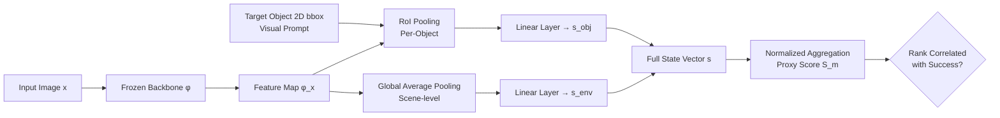

# Capturing Visual Environment Structure Correlates with Control Performance

**Conference**: ICLR 2026  
**OpenReview**: [https://openreview.net/forum?id=AmczI1k3Yk](https://openreview.net/forum?id=AmczI1k3Yk)  
**Code**: Project Page (Abstract notes "Code and models available")  
**Area**: Robotics / Embodied AI (Visual Representation Selection)  
**Keywords**: Visual Representation, Robotic Manipulation, State Prediction, Proxy Metric, Sim-to-Real, World State Modeling  

## TL;DR
The authors propose using "regressing the simulator's full state (geometry/object structure/physical properties) from images" as a lightweight proxy task. They demonstrate that this probing accuracy is highly correlated with downstream robot policy success rates, enabling efficient selection of visual backbones without running expensive policy rollouts.

## Background & Motivation
- **Background**: General robotic manipulation policies rely heavily on pre-trained visual representations. However, evaluating which "backbone is best" typically requires running policy rollouts, which is extremely expensive and slow even in simulation, creating a bottleneck for iteration.
- **Limitations of Prior Work**: Existing proxy metrics (e.g., segmentation accuracy from Burns et al. 2024, ImageNet recognition, shape bias, depth estimation) characterize only a **narrow aspect** of the visual world (e.g., object shape). Consequently, they generalize poorly across environments—a segmentation metric effective in RoboCasa may fail in MetaWorld.
- **Key Challenge**: Control tasks require encoding the **complete physical state** of the environment (pose, geometry, material, articulation, lighting). Single-faceted metrics fail to capture this holistic requirement, yet ground-truth labels for these states are unavailable in real-world scenarios.
- **Goal**: Find an **inexpensive, policy-free, and cross-environment generalizable** proxy metric to reliably predict the performance of a visual representation for control.
- **Key Insight**: Simulators naturally provide full-state labels for free. The authors treat "decoding the full environment state from images" as a probing task—how accurately a representation can recover the underlying physical state serves as a strong signal for its utility in control.

## Method

### Overall Architecture
The method treats any visual backbone as a frozen feature extractor and attaches a lightweight "state prediction head." This head regresses a compact full-state vector provided by the simulator from a single image. The prediction accuracy is normalized and aggregated into a single proxy score $S_m$, and rank correlation is used to measure its alignment with policy success rates. The entire pipeline requires no policy training or evaluation.

### Key Designs

**1. Unified Low-dimensional Full-State Representation: Compressing heterogeneous environment states into a task-agnostic vector.** This ensures regression errors directly reflect the representation's ability to capture physical structures without perceptual noise. The state is split into $N_o$ object-level vectors and 1 scene-level vector: each object $s_{obj,i}=[p^i_{pose}, q^i_{pose}, s^i_{shape}, m^i_{mat}]\in\mathbb{R}^{3+4+3+M}$ includes 3D position, quaternion orientation, bounding box size, and one-hot material. The scene-level $s_{env}=[\ell, q_J, p_{ee}]\in\mathbb{R}^{1+N_j+N_{ee}}$ includes lighting lighting category, robot joint angles, and end-effector pose. Concatenated as $s\in\mathbb{R}^D$, where $D=N_o(3+4+3+M)+(1+N_j+N_{ee})$. This decoupled "object + scene" design allows for both per-object analysis and holistic scene analysis, working out-of-the-box for new simulation environments.

**2. Single-Forward State Prediction with Visual Prompts: Using 2D bounding boxes to resolve multi-object ambiguity.** This informs the backbone "where to look." For each target object box $b_i$, RoI average pooling is applied to the feature map $u_i=\frac{1}{|b_i|}\sum_{(u,v)\in b_i}\phi(x)_{u,v}$, followed by a single-layer linear mapping to $s_{obj,i}$. For scene-level factors, global average pooling $v=\frac{1}{HW}\sum_{u,v}\phi(x)_{u,v}$ is mapped to $s_{env}$. All state vectors are output simultaneously in one forward pass, with invisible objects masked out, ensuring the "lightweight" nature of the proxy.

**3. Divide-and-Conquer Encoding and Losses for Discrete/Continuous States**: Materials, lighting, and quantized shape bins are represented as one-hot vectors, predicted via softmax, and trained with cross-entropy. Quantities closely related to motion planning, such as position $p_{pose}$, rotation $q_{pose}$, joint angles, and end-effector poses, are dimension-wise standardized $z_i=\frac{x_i-\mu_i}{\sigma_i}$ and trained with L2 regression. This distinction ensures each state type uses the most appropriate supervision, allowing regression errors to truly reflect representation quality.

**4. Rank Correlation Evaluation Protocol: Using MMRV instead of absolute values to measure proxy reliability.** Classification accuracy is used for categorical states, and negative MSE for continuous states. Min-max normalization is applied per state and averaged to obtain the proxy score $S_m=\frac{1}{|A|}\sum_{a\in A}\frac{r_{m,a}-\min r_{\tilde m,a}}{\max r_{\tilde m,a}-\min r_{\tilde m,a}}$. Mean Maximum Rank Violation (MMRV) measures ranking consistency with policy success rates: pairwise violations are calculated as $\text{RankViolation}_{ij}=|R_i-R_j|\cdot\mathbb{1}[(S_i<S_j)\neq(R_i<R_j)]$, followed by the mean of the worst-case for each policy $\text{MMRV}=\frac{1}{N}\sum_i \max_j \text{RankViolation}_{ij}$, supplemented by Pearson $r$. A low MMRV and high $r$ indicate the proxy can reliably replace expensive policy training to rank backbones.

## Key Experimental Results

### Main Results: Proxy Rank Correlation (MMRV ↓ / Pearson r ↑)
Across three simulation environments (MetaWorld, RoboCasa, and SimplerEnv's Google Robot and WidowX), 7 proxy metrics were compared against 9 pre-trained backbones:

| Proxy Metric | Mean MMRV ↓ | Mean Pearson r ↑ |
|---|---|---|
| Few-Shot (Requires Policy Eval) | 0.068 | 0.347 |
| Action MSE (Requires Policy Training) | 0.089 | -0.294 |
| ImageNet Recognition | 0.141 | -0.020 |
| Shape Bias | 0.093 | -0.069 |
| Segmentation (Burns 2024) | 0.105 | -0.042 |
| Depth | 0.096 | -0.071 |
| **Ours (State Prediction)** | **0.035** | **0.753** |

Ours policy-free proxy achieved the lowest MMRV across all four environments, with an average correlation of 0.753, far exceeding the runner-up and even outperforming privileged baselines (Few-Shot and Action MSE). The highest single-environment correlation reached $r=0.871$ and MMRV=0.023 on SimplerEnv-G.

### Ablation Study: Predictive Power of State Dimensions (MMRV ↓)

| Environment | $s_{shape}$ | $q_{pose}$ | $p_{ee}$ | Full $(S_m)$ |
|---|---|---|---|---|
| MetaWorld | 0.032 | 0.089 | 0.069 | **0.037** |
| RoboCasa | 0.011 | 0.017 | 0.027 | **0.010** |
| SimplerEnv (G) | 0.082 | 0.100 | 0.038 | **0.023** |
| SimplerEnv (W) | 0.126 | 0.032 | 0.048 | **0.069** |

Different environments require different representation capabilities: MetaWorld/RoboCasa rely on 2D object localization ($s_{shape}$), while SimplerEnv prioritizes 3D end-effector pose $p_{ee}$ and object orientation $q_{pose}$. However, the Full version regressing the **entire state vector** remains the most robust, serving as a general-purpose proxy.

### Key Findings
- **No Universal Representation**: MetaWorld (non-photorealistic) prefers ImageNet backbones; CLIP/DINOv2 perform poorly due to distribution shifts. RoboCasa prefers DINOv1/v2 for object localization. SimplerEnv prefers R3M, which was pre-trained on real robot data.
- **Sim Conclusions Transfer to Real**: By replicating two WidowX tasks on a physical Xarm6, the study found that sim-state prediction accuracy correlates with real-world success rates (MMRV/$r$) at levels comparable to pure simulation results, bridging significant domain gaps.
- **State Prediction as a Training Objective**: Jointly optimizing $L_{joint}=L_{policy}+\lambda L_{state}$ consistently improved success rates for ViT-IN, MoCoV3, MAE, CLIP, and DINOv2 on MetaWorld (e.g., CLIP 0.765→0.801, DINOv2 0.767→0.795). This indicates that "learning to encode the full state" is a beneficial signal for representation learning.

## Highlights & Insights
- **Replacing Expensive Policy Evaluation with a Cheap Forward Pass**: By leveraging free simulator state labels for probing, the method bypasses expensive policy rollouts, providing a highly practical tool for backbone selection.
- **"Holism" Defeats "Single-Facetedness"**: The experiments strongly prove that characterizing the complete physical state generalizes across environments better than testing segmentation, depth, or shape alone, explaining why prior proxy metrics failed.
- **Proxy Tasks as Training Objectives**: State prediction can both select models and improve their performance, suggesting that "predictive world modeling" is a promising direction for improving visual representations in control.

## Limitations & Future Work
- **Strong Dependency on Simulator State Labels**: The proxy scoring must be performed in simulation environments that provide ground-truth states; it cannot be directly calculated in the real world (relying on sim-proxy + transfer assumptions).
- **Visual Prompts Require 2D Bounding Boxes**: Multi-object scenes require target boxes, introducing additional dependencies on detection or manual annotation.
- **Limited Backbone and Policy Architectures**: Main experiments used frozen backbones with Multi-task Diffusion Policies. Although the appendix adds fine-tuning and other BC algorithms, robustness across larger VLA models or more policy families needs further verification.
- **Correlation ≠ Causality**: While high state prediction accuracy correlates strongly with success rates, the discriminative power decreases among backbones with similar success rates (a limitation acknowledged in the paper). There remains an upper bound for fine-grained ranking.

## Related Work & Insights
- **Reconstructive Pre-training**: Works like MVP, RPT, and R3M use masked reconstruction or contrastive learning from robot videos. This paper's "full-state regression" can be seen as an explicit, measurable realization of the "sparse environment state reconstruction" concept.
- **Representation Analysis**: Qi et al. (2025) found that representations trained via BC cluster toward task-relevant states. This paper further quantifies "which state dimensions drive manipulation performance" at a state-space level.
- **Sim-to-Real Evaluation**: This work extends the idea from SimplerEnv (Li et al. 2024) that simulation can faithfully proxy real-world rankings, generalizing it from policy rankings to representation rankings.
- **Insight**: The methodology of "constructing a measurable proxy using free simulation labels and validating its correlation with real downstream tasks" can be transferred to navigation, grasping, and other embodied perception tasks.

## Rating
- **Novelty**: ⭐⭐⭐⭐ — The perspective of "full-state regression as a policy-free proxy" is clear and counter-intuitively outperforms privileged baselines, unifying fragmented analysis into a single actionable metric.
- **Experimental Thoroughness**: ⭐⭐⭐⭐ — Covers 3 types of simulation, 4 domains, 9 backbones, 7 comparison proxies, real-robot validation, and training objective gains. The chain of evidence is complete; points deducted for slightly narrow policy families.
- **Writing Quality**: ⭐⭐⭐⭐ — Logic flows smoothly from motivation to method to validation. Charts (correlation scatter plots, MMRV tables) provide strong support, and formulas are clearly defined.
- **Value**: ⭐⭐⭐⭐ — Provides a cheap and reliable tool for visual backbone selection and points toward state prediction as a new direction for representation learning, offering direct practical value to the embodied AI field.

<!-- RELATED:START -->

## Related Papers

- [\[ICLR 2026\] WorldGym: World Model as an Environment for Policy Evaluation](worldgym_world_model_as_an_environment_for_policy_evaluation.md)
- [\[ICLR 2026\] MolLangBench: A Comprehensive Benchmark for Language-Prompted Molecular Structure Recognition, Editing, and Generation](mollangbench_a_comprehensive_benchmark_for_language-prompted_molecular_structure.md)
- [\[CVPR 2026\] EgoRoC: Towards Egocentric Robotic Control via Task-Agnostic Visual Alignment](../../CVPR2026/robotics/egoroc_towards_egocentric_robotic_control_via_task-agnostic_visual_alignment.md)
- [\[ICLR 2026\] On Entropy Control in LLM-RL Algorithms](on_entropy_control_in_llm-rl_algorithms.md)
- [\[AAAI 2026\] Towards Reinforcement Learning from Neural Feedback: Mapping fNIRS Signals to Agent Performance](../../AAAI2026/robotics/towards_reinforcement_learning_from_neural_feedback_mapping_.md)

<!-- RELATED:END -->
