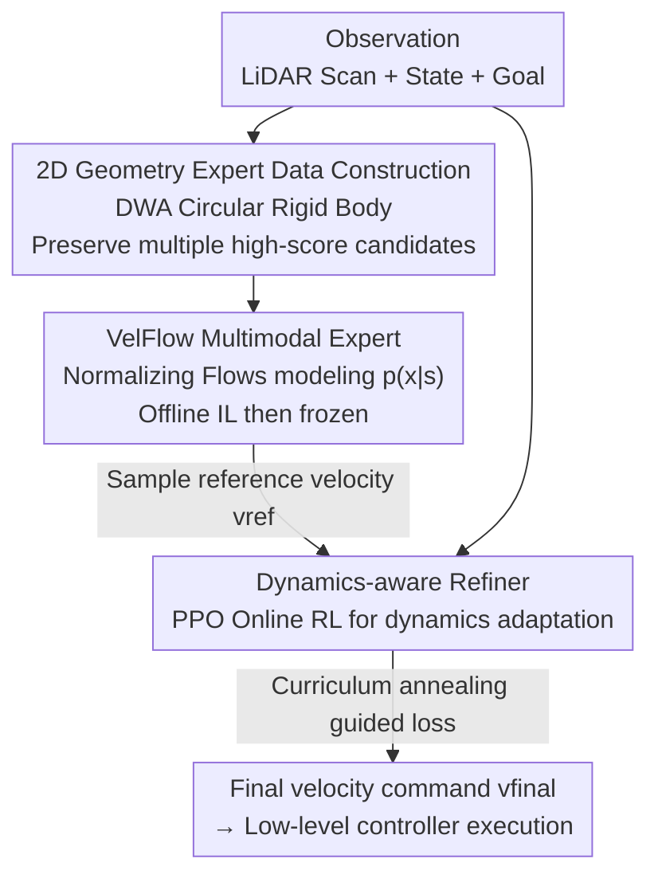

# CE-Nav: Flow-Guided Reinforcement Refinement for Cross-Embodiment Local Navigation

**Conference**: ICLR2026  
**OpenReview**: [https://openreview.net/forum?id=apaLoTumdO](https://openreview.net/forum?id=apaLoTumdO)  
**Code**: To be confirmed  
**Area**: Robotics / Cross-Embodiment Navigation  
**Keywords**: Cross-embodiment navigation, Normalizing Flows, Imitation Learning, Reinforcement Learning, Multimodal decision making

## TL;DR
CE-Nav proposes a two-stage framework: first, an offline imitation learning stage trains a normalizing flow expert (VelFlow) that is independent of any specific robot embodiment and focuses solely on geometric obstacle avoidance; second, this expert is frozen as a prior for a lightweight online RL refiner to adapt to the specific dynamics of new robots. It achieves SOTA navigation performance on quadruped, biped, and quadrotor platforms while reducing the adaptation time for new robots from 50 hours to 6 hours.

## Background & Motivation

**Background**: Enabling a local navigation policy to be reused across different robot embodiments (quadruped dogs, bipedal humans, quadrotors) is a core challenge in mobile robotics. Current learning-based approaches fall into two extremes: one side is end-to-end (E2E) policies that directly map sensor observations to low-level joint commands, which are powerful but couple high-level planning and robot dynamics so tightly that they fail when platforms change; the other side is hierarchical methods that plan a sequence of waypoints to decouple planning and control, but the high-level planner makes decisions on an idealized controller model, failing to compensate for unmodeled dynamics and tracking errors.

**Limitations of Prior Work**: Intermediate "hierarchical velocity planning" (high-level outputs $(v_x, v_y, v_{yaw})$ body velocity commands, low-level controller tracks them) is considered a more stable route, but it faces two fatal bottlenecks. First, **expert data carries embodiment bias**: trajectories are collected either with a real robot or through physics-based simulation, naturally biasing the data toward that specific robot, which limits generalization and scalability while incurring high costs. Second, the **deterministic learning paradigm**: treating navigation as a deterministic regression task fails to express the inherent multimodality of navigation—turning left or right at a T-junction are both correct, but a deterministic model will average these two correct actions into "crashing straight ahead," which the paper terms "disastrous averaging."

**Key Challenge**: General geometric reasoning (obstacle avoidance logic, which remains consistent regardless of the vehicle) and embodiment-specific dynamics adaptation (response delays, tracking errors of a specific robot) are learned simultaneously in a single model, resulting in poor acquisition of general knowledge and high migration costs. Furthermore, multimodal decision-making naturally conflicts with deterministic regression frameworks.

**Goal**: Decompose the problem into two sub-problems: (1) learning a universal geometric expert that does not touch real robot data and can express multimodal decisions; (2) for any new robot, "translating" this universal plan into commands feasible for its dynamics using minimal online interaction.

**Key Insight**: The authors observe that geometric obstacle avoidance is independent of the robot's identity—by abstracting the robot as a 2D circular rigid body, a classical DWA planner can generate geometrically correct obstacle avoidance decisions across massive random obstacle fields. These decisions are inherently multimodal (DWA often ranks multiple candidate actions as nearly optimal). Thus, geometric knowledge can be learned offline, cheaply, and without bias, while the remaining "how this robot actually tracks" constitutes the small incremental knowledge to be learned online.

**Core Idea**: A total decoupling via an "IL-then-RL" two-stage approach—offline imitation learning trains a VelFlow expert to model the full distribution of actions (solving disastrous averaging), followed by a frozen geometric prior that guides a lightweight RL refiner to adapt online to each new embodiment's dynamics.

## Method

### Overall Architecture

CE-Nav splits the training of the high-level navigation policy $\pi_{high}$ into two serial stages. Both stages share the observation set of "2D LiDAR scan + robot state + relative target position" and output uniform body velocity commands $(v_x, v_y, v_{yaw})$, which are then executed by any embodiment's native low-level motion controller $\pi_{low}$.

**Stage I (Offline IL)**: The robot is treated as a circular rigid body in a pure 2D geometric simulation. A classical DWA planner runs across tens of thousands of random obstacle fields to collect 10 million state-action pairs, **purposefully retaining multiple high-score candidate actions** (storing all actions within 10% of the optimal score). These are fed to the VelFlow normalizing flow network to learn the full conditional distribution $p(x|s)$. Once trained, VelFlow is frozen.

**Stage II (Online RL)**: Transitioning to Isaac Sim physics simulation with a specific robot (and its non-ideal low-level controller), the frozen VelFlow samples a reference velocity $v_{ref}$ in real-time as a guiding prior. A lightweight refiner (actor-critic, trained with PPO) takes "state encoding + $v_{ref}$" as input and outputs the final velocity command $v_{final}$. The crucial reward is calculated based on the robot's **actual trajectory** (rather than the commanded velocity), forcing the refiner to compensate for the low-level controller's latency and tracking errors. The guidance strength $\lambda$ follows a curriculum annealing, gradually shifting from strong guidance to autonomous exploration.

### Key Designs

**1. Two-stage IL-then-RL Decoupling: Separating "General Geometric Reasoning" from "Embodiment Dynamics Adaptation"**

Addressing the core contradiction of learning general knowledge and embodiment adaptation in one model, CE-Nav splits the high-level policy into an offline universal expert $\pi_{expert}$ and an online refiner. The expert reasons only at the geometric/logical level—how to perceive paths and avoid obstacles. This knowledge is naturally embodiment-independent, allowing it to be learned once offline and shared across all robots. Dynamics adaptation (response characteristics, tracking errors) is handled by training a lightweight refiner for each new robot. Migration requires only freezing the expert and training the small refiner, making adaptation fast and stable (6 hours vs. ~52 hours for pure RL). This modular "frozen prior + lightweight increment" design contrasts with full end-to-end RL fine-tuning of generative policies, which often suffers from aggressive dynamics gradients washing out geometric priors (catastrophic interference).

**2. VelFlow: Modeling Full Action Distributions with Conditional Normalizing Flows to Cure "Disastrous Averaging"**

To address the pain point where deterministic regression averages multiple correct actions into a single incorrect one, VelFlow aims to learn the full conditional probability distribution $p(x|s)$ of expert actions rather than a point mapping. Why choose Normalizing Flows over Diffusion or Flow Matching? While Diffusion and Flow Matching offer diverse sampling, they require multiple steps, making them too slow for real-time control. Conditional Normalizing Flows can model and sample complex multimodal distributions in a **single forward pass** and provide exact, computable likelihoods, which is beneficial for both interpretability and stable control. Specifically based on the Real-NVP architecture with 12 coupling layers and a 512 hidden dimension, it maps a standard Gaussian base distribution $p_z(z)$ to the expert velocity distribution $p_x(x|s)$. The training objective is to minimize the negative log-likelihood of expert demonstrations:

$$\mathcal{L}_{NLL} = -\mathbb{E}_{(s,x)\sim D_{expert}}[\log p(x|s)]$$

After training, sampling $z$ from the base distribution and transforming it through the network yields diverse and reasonable reference velocities $v_{ref} = f_{VelFlow}(z; s)$. The accompanying state encoder processes 144 beams of 360° LiDAR scans through a three-layer CNN, concatenates it with a 7-dimensional embodiment state (normalized 3D goal direction + 2D linear velocity + 1D angular velocity + 1D Euclidean distance to goal), and passes it through a two-layer MLP to obtain a 256-dimensional condition embedding. Ablations show VelFlow is the cornerstone of success: replacing it with an MLP regression expert of equal parameters (CE-Nav$_{regr-rl}$) results in an "averaged, unimodal" prior that actively misleads RL, leading to a success rate worse than pure RL—demonstrating that "a suboptimal teacher is worse than no teacher."

**3. Dynamics-aware Refiner + Trajectory-based Rewards: Online Compensation for Low-level Controller Imperfections**

To solve the problem where high-level planners assume an ideal velocity tracker but fail to compensate for real tracking errors, the refiner is explicitly trained to perform "dynamics refinement on a single guidance proposal." it processes the state in two parallel paths: one fed into the frozen VelFlow to get $v_{ref}$, and the other through its own encoder. Both are concatenated into a guided state $s_{guided}$ for the actor/critic. For the action, it predicts a normalized vector $v_{norm}\in[0,1]$, scaled to the velocity limit $v_{final} = V_{lim}\cdot(2\cdot v_{norm}-1)$. Crucially, because the refiner is trained in a closed loop with the specific $\pi_{low}$ and rewards are based on the **actually navigated trajectory** rather than commanded velocity, it naturally learns a compensation strategy to absorb the low-level controller’s system latency and tracking errors. Rewards include three categories: efficiency/goal terms (progress $R_{distance}$, checkpoints $R_{checkpoint}$, heading $R_{heading}$, goal reach $R_{goal}$), smoothness/stability terms (jitter punishment, excessive tilt punishment), and safety terms (LiDAR-based repulsive potential field $R_{safety}$, collision penalty $P_{collision}$).

**4. Curriculum Guided Loss "Principled Deviation": Dynamic Annealing Between Imitation and Exploration**

The refiner must listen to the expert (for stability and fast bootstrapping) but not follow blindly (the expert is short-sighted and geometrically optimal, which might not be truly optimal in the physical world). CE-Nav uses a hybrid loss to balance the two:

$$\mathcal{L}_{guide} = \|\pi_{refiner}(s_{guided}) - scale\cdot v_{ref}\|^2, \quad \mathcal{L}_{total} = \mathcal{L}_{PPO} + \lambda\cdot\mathcal{L}_{guide}$$

Where $\mathcal{L}_{PPO}$ is the standard PPO objective to maximize environmental rewards; $\mathcal{L}_{guide}$ is an auxiliary guidance term that anchors the refiner's behavior near the expert proposal as an inductive bias ($scale$ is an automatically calculated embodiment-specific scaling coefficient to bring $v_{ref}$ into a reasonable range). The core is that $\lambda$ **is not static** but curriculum-annealed: initially (0–1k steps, $\lambda=0.5$), strong guidance helps the refiner quickly learn basic navigation logic; in the middle (1k–5k steps, $\lambda$ decay exponentially from 0.5 to 0.05), it is allowed to explore autonomously based on coupled system dynamics; finally (>5k steps, $\lambda=0.05$), weak guidance acts only as a regularizer to prevent catastrophic forgetting or policy drift. Ablations show that a fixed $\lambda=0.5$ (constant strong guidance), while better than no guidance, is significantly worse than curriculum annealing—dogmatically following the expert stifles exploration and prevents the agent from learning superior strategies that transcend the expert's short-sightedness.

### Loss & Training

Stage I IL: Negative log-likelihood $\mathcal{L}_{NLL}$, learning rate $5\times 10^{-4}$, frozen after training. Stage II RL: PPO, learning rates for actor/critic/shared feature extractor are $5\times 10^{-4}$, $1\times 10^{-3}$, and $1\times 10^{-3}$ respectively. Total loss $\mathcal{L}_{total}=\mathcal{L}_{PPO}+\lambda\mathcal{L}_{guide}$, with $\lambda$ following the aforementioned curriculum annealing. Training uses 1024 parallel environments in Isaac Sim on a single RTX 4090.

## Key Experimental Results

### Main Results

Comparison against various baselines on the Unitree Go2, reporting averages across four test environments (mSR = mean Success Rate, mSPL = Success weighted by Path Length, ETT = Extra RL Training wall-clock Time for new embodiment adaptation in hours):

| Method | mSR ↑ | mSPL ↑ | ETT(h) ↓ |
|------|-------|--------|----------|
| DWA (Classical Planner) | 0.6400 | 0.6022 | N/A |
| BC (Behavior Cloning) | 0.0275 | 0.0253 | N/A |
| DP (Diffusion Policy) | 0.0725 | 0.0644 | N/A |
| NavRL (Prev. SOTA E2E RL) | 0.6925 | 0.6460 | 50 |
| **CE-Nav (Ours)** | **0.8575** | **0.8190** | **6** |

CE-Nav significantly outperforms the SOTA NavRL in both success rate and path efficiency (mSR 0.86 vs. 0.69), while reducing adaptation time from 50 hours to 6 hours. Pure IL baselines (BC/DP) fail almost entirely (mSR < 0.08), confirming the severe covariate shift issues in pure imitation.

Cross-embodiment generalization (five vastly different robots, averaged over four environments):

| Robot Platform | mSR ↑ | mSPL ↑ |
|------------|-------|--------|
| Unitree Go2 (Quadruped) | 0.8575 | 0.8190 |
| Spot (Quadruped) | 0.8325 | 0.7123 |
| MagicDog (Quadruped) | 0.8600 | 0.8231 |
| Unitree H1 (Biped) | 0.7450 | 0.7223 |
| Hummingbird (Quadrotor) | 0.8025 | 0.7491 |

Across quadruped, biped, and quadrotor morphologies, CE-Nav maintains mSR ≥ 0.74, validating the plug-and-play generalization capability of the "frozen universal expert + lightweight refiner" approach.

### Ablation Study

Ablation across four obstacle densities ($N_o\in\{100,300,500,700\}$) on Go2 (SR is success rate):

| Configuration | $N_o$=100 SR | $N_o$=500 SR | $N_o$=700 SR | ETT(h) | Description |
|------|------|------|------|------|------|
| CE-Nav (Full) | 0.9796 | 0.7796 | 0.7167 | 6 | Full model |
| CE-Nav$_{pure-rl}$ | 0.9452 | 0.5106 | 0.5179 | 52 | Pure RL without expert; ~9× training time and large drop |
| CE-Nav$_{regr-rl}$ | 0.4215 | 0.2666 | 0.3320 | 7 | VelFlow replaced by MLP regression; worse than pure RL |
| CE-Nav$_{dp-rl}$ | 0.9622 | 0.7231 | 0.6664 | 52 | VelFlow replaced by Diffusion Policy; 8× slower inference |
| GE-Only$_{velflow}$ | 0.3675 | 0.0000 | 0.0000 | N/A | Expert only without refiner; fails in dense obstacles |
| CE-Nav$_{\lambda=0.5}$ | 0.9772 | 0.7019 | 0.6871 | 6 | Constant strong guidance; inferior to curriculum |

### Key Findings

- **Multimodal prior is the cornerstone**: Replacing VelFlow with MLP regression (CE-Nav$_{regr-rl}$) causes success rates to plummet—even below pure RL. The regression provides an "averaged, unimodal" prior that actively misleads RL. This is the strongest insight: "A suboptimal teacher is worse than no teacher."
- **Refiner is indispensable**: Using only the expert without RL refinement (GE-Only) results in nearly zero success rates in medium-to-high density obstacles, exposing the covariate shift of pure IL and proving the online refiner is key to learning robust recovery strategies.
- **Diffusion is feasible but inefficient**: While CE-Nav$_{dp-rl}$ outperforms regression and pure RL, it is 8× slower than VelFlow and still trails in performance, suggesting that single-step sampling Normalizing Flows are superior for real-time control.
- **Curriculum annealing > Fixed guidance**: While fixed $\lambda=0.5$ is better than no guidance, it is significantly worse than the annealing strategy, as dogmatically following the expert stifles exploration of strategies that could exceed the expert's performance.
- Figure 4 visualization shows that when 100 robots encounter obstacles, they naturally split into two groups (left/right). The expert's $v_{ref}$ shows a bimodal cluster, and the refiner's $v_{final}$ preserves this bimodal structure while adjusting for dynamics—visually proving successful retention of multimodal decision-making.

## Highlights & Insights
- **Decoupling philosophy of "Frozen Geometry Prior + Lightweight Dynamics Increment"**: By learning "universal obstacle avoidance logic" once offline without bias and treating "how this robot moves" as a small online increment, the cost of real-world data is bypassed and migration cost is reduced to 1/8. This logic can be transferred to any robot task involving "universal skills + embodiment/environment adaptation."
- **Classical planners as multimodal data sources**: By intentionally retaining multiple candidate actions near the DWA optimal score (within a 10% threshold), the inherent decision ambiguity of classical planners is transformed into free multimodal labels for training generative models. This effectively turns "classical multi-solution ambiguity" from a weakness into an asset.
- **Rewards based on actual trajectories**: A small but critical design—calculating rewards based on the robot's actual path rather than commanded velocity automatically encodes "compensation for low-level tracking error" into the optimization objective without requiring explicit controller modeling.
- **The counter-intuitive conclusion of "Suboptimal teachers are worse than no teachers"**: Using a poor-quality prior to guide RL can be counterproductive, serving as a reminder that when performing guided RL or offline-to-online transitions, the quality and modal completeness of the prior must be ensured.

## Limitations & Future Work
- **Dependency on 2D velocity interface abstraction**: High-level unified commands $(v_x,v_y,v_{yaw})$ simplify quadrotors into 2.5D navigation at a fixed height. This may be insufficient for aircraft requiring true 3D maneuvers (e.g., crossing obstacles of different heights) or complex terrain requiring whole-body control.
- **Geometric expert based on 2D circular rigid body assumption**: Abstracting robots as circular rigid bodies for 2D planning may cause the expert's geometric assumptions to fail for elongated robots that need to consider orientation to pass through narrow gaps, or for non-planar terrains.
- **Mainly simulation-based with limited real-world scale**: While real-world deployment is shown, quantitative real-world data is limited. The robustness of sim-to-real in more complex real-world scenarios requires more systemic verification.
- Future improvements: Extending high-level action spaces to higher dimensions (including height/pose), making the geometric expert embodiment-aware (e.g., conditioned on robot envelopes), and exploring whether the expert itself can be partially updated online rather than completely frozen.

## Related Work & Insights
- **vs. End-to-End (E2E) RL (e.g., NavRL)**: E2E maps observations directly to low-level commands, entangling planning and dynamics. This requires massive embodiment randomization and slow training (50h). CE-Nav uses hierarchical decoupling, training only a lightweight refiner (6h) with higher performance (mSR 0.86 vs. 0.69).
- **vs. Pure Imitation (BC / Diffusion Policy)**: Pure IL suffers from severe covariate shift and fails almost entirely in medium-to-high density obstacles (mSR < 0.08). CE-Nav uses an online RL refiner to learn robust recovery, compensating for IL distribution shift.
- **vs. Residual RL**: Residual RL uses an additive architecture and implicitly assumes local optimality. It struggles to make large corrections when required dynamics-aware actions significantly deviate from the reference. CE-Nav uses a "conditional refinement" framework rather than additive residuals, explicitly learning to deviate from ideal plans to adapt to unseen dynamics.
- **vs. Deterministic Guided RL / Curriculum Methods**: Traditional demo-guided RL often collapses multimodal demonstrations into deterministic policies (leading to averaging). Curriculum methods often treat priors as "ground truth." CE-Nav uses Normalizing Flows to preserve multimodal "common sense" while employing an annealing curriculum to allow the refiner to deviate from the prior with principle (Principled Deviation).

## Rating
- Novelty: ⭐⭐⭐⭐⭐ Decoupling IL-then-RL with a Normalizing Flow multimodal expert is clear and novel.
- Experimental Thoroughness: ⭐⭐⭐⭐ Cross-embodiment validation across five platforms + key ablations + real-world deployment is solid; more real-world quantitative data would be better.
- Writing Quality: ⭐⭐⭐⭐⭐ Motivation is clearly derived, and ablations thoroughly explain the necessity of each component. Insights like "suboptimal teacher is worse" are well-articulated.
- Value: ⭐⭐⭐⭐⭐ Reducing cross-embodiment adaptation cost to 1/8 while achieving SOTA performance has direct value for actual multi-platform robot deployment.

<!-- RELATED:START -->

## Related Papers

- [\[ICLR 2026\] Cross-Embodiment Offline Reinforcement Learning for Heterogeneous Robot Datasets](cross-embodiment_offline_reinforcement_learning_for_heterogeneous_robot_datasets.md)
- [\[ICLR 2026\] X-VLA: Soft-Prompted Transformer as Scalable Cross-Embodiment Vision-Language-Action Model](x-vla_soft-prompted_transformer_as_scalable_cross-embodiment_vision-language-act.md)
- [\[ICLR 2026\] Scalable Exploration for High-Dimensional Continuous Control via Value-Guided Flow](scalable_exploration_for_high-dimensional_continuous_control_via_value-guided_fl.md)
- [\[CVPR 2026\] GraspGen-X: Cross-Embodiment 6-DOF Diffusion-based Grasping](../../CVPR2026/robotics/graspgen-x_cross-embodiment_6-dof_diffusion-based_grasping.md)
- [\[CVPR 2026\] GeniNav: Generative Model Driven Image-Goal Navigation via Imagination-Guided Consistency Flow Matching](../../CVPR2026/robotics/geninav_generative_model_driven_image-goal_navigation_via_imagination-guided_con.md)

<!-- RELATED:END -->
