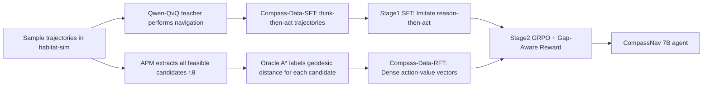

# CompassNav: Steering From Path Imitation to Decision Understanding In Navigation

**Conference**: ICLR 2026  
**OpenReview**: [https://openreview.net/forum?id=eqcDckWHik](https://openreview.net/forum?id=eqcDckWHik)  
**Code**: [https://linengcs.github.io/CompassNav](https://linengcs.github.io/CompassNav)  
**Area**: Embodied Navigation / Vision-Language Models / Reinforcement Fine-Tuning  
**Keywords**: Goal Navigation, LVLM, Decision Understanding, GRPO, Reward Design, Object-Goal  

## TL;DR
CompassNav shifts the goal navigation training paradigm from "imitating a single expert trajectory" to "decision understanding." By scoring all candidate actions at each step using A\* geodesic distances to construct dense supervision, and combining it with a gap-aware hybrid reward for GRPO fine-tuning, the 7B Qwen2.5-VL learns to evaluate the "relative merits of each move," outperforming GPT-4o and even o4-mini on HM3D/MP3D.

## Background & Motivation
**Background**: Goal-driven navigation (e.g., "find a chair") provides only sparse high-level goals without step-by-step instructions, requiring agents to perform autonomous exploration and spatial reasoning under uncertainty. Recently, Large Vision-Language Models (LVLMs) have become mainstream for end-to-end navigation, avoiding the fragile dependence of modular systems on explicit mapping while naturally understanding natural language intent.

**Limitations of Prior Work**: Current LVLM navigation relies almost entirely on **Path Imitation**—simplifying navigation to sequence replication of a single expert trajectory to minimize deviation from the ground truth. However, in real environments, "feasible paths are almost never unique." Strictly imitating one path penalizes all equally reasonable alternatives, treating navigation as a memorization task and failing to learn the causal structure of "why this action is better than that one." Corresponding rewards are also inadequate—sparse rewards are unsolvable over long horizons, Euclidean-based dense heuristics ignore obstacles, and binary preference rewards lose subtle "gap magnitude and ambiguity" information.

**Key Challenge**: The mismatch between sparse supervision from a single optimal path and the multi-path, relative-value-judgment nature of real navigation leads to agents that "memorize paths" rather than "make decisions."

**Goal**: To build an agent that truly "understands how to navigate" rather than just "following along," shifting from single-path to panoramic value assessment in both data supervision and reward signals.

**Core Idea**:
- **Decision Understanding Paradigm**: Instead of labeling only the optimal action, A\* geodesic distances are used to label "distance to goal" for all feasible candidate actions at the current state, forming a dense "correctness gradient field."
- **Gap-aware Hybrid Reward**: Feedback is adaptively adjusted based on the "gap between optimal and sub-optimal"—providing decisive signals for clear scenarios and nuanced scores for ambiguous ones to encourage exploration.
- **SFT-then-RFT recipe**: Stage 1 uses SFT to solve the cold start and inject the "think-then-act" structure; Stage 2 applies GRPO reinforcement fine-tuning to align the policy with true decision understanding.

## Method

### Overall Architecture
CompassNav is built on two pillars: "data" and "training." On the data side, it produces **Compass-Data-22k**: the RFT subset uses an A\* Oracle to label geodesic distances (dense value vectors) for every candidate action at each step; the SFT subset involves a Qwen-QvQ teacher performing ObjectNav in habitat-sim, retaining only complete think-then-act reasoning trajectories from successful episodes. The training side consists of two stages: Stage 1 uses SFT to imitate the teacher's "reason-then-act" structure to solve the cold start; Stage 2 uses GRPO with gap-aware hybrid rewards on this initialized policy to push it toward "decision understanding."

### Key Designs

**1. Dense Panoramic Supervision: Oracle A\* Labeling for All Candidates.** Unlike traditional data that labels only the single optimal action, Compass-Data-RFT first uses an Action Proposal Module (APM) with real-time depth maps and occupancy grids to identify all feasible candidates and discretize them into polar coordinates $(r,\theta)$. Then, an Oracle A\* Annotator uses global simulator information to calculate the shortest geodesic distance to the goal for each candidate, yielding a complete "action-value vector." This effectively plots a correctness gradient field in the decision space. To enhance diversity, a backtracking mechanism is introduced: the agent actively retreats at "ambiguous points" (states with multiple feasible options) to explore and record alternative trajectories rather than strictly following the shortest path. This transforms the training signal from "one sparse optimal path" into "panoramic relative value assessment."

**2. Cold-start Initialization: Distillation-style SFT.** Running RFT directly from a base LVLM is inefficient due to poor initial policies and sparse rewards. Instead of fabricating reasoning post-hoc for preset paths, a strong teacher (Qwen-QvQ) is deployed to perform ObjectNav in habitat-sim. Only complete reasoning and actions from successful episodes are recorded and formatted as `<think>...</think><answer>k</answer>`. This ensures SFT data reflects "emergent effective exploration strategies." SFT uses standard cross-entropy over the teacher sequence: $\mathcal{L}_{SFT}(\theta)=\mathbb{E}\big[\sum_{u}-\log p_\theta(y_{t,u}\mid x_t,y_{t,<u})\big]$. To ensure output actions are always valid, masked multiple-choice decoding is employed—applying a constrained softmax to the answer token logits normalized only over the set of legal candidate indices $V_t$: $\pi_\theta(j\mid x_t)=\frac{\exp(z_j)}{\sum_{j'\in V_t}\exp(z_{j'})}$, ensuring every generated action is executable and stabilizing subsequent RFT.

**3. Gap-Aware Hybrid Reward: Adaptive Determinacy-based Feedback.** This is the core of the work. The reward consists of a "continuous base score" and a "determinacy-modulated dynamic bonus." The base score provides a continuous evaluation for all candidates using a distance-based softmax, where shorter distances yield higher scores: $s_t^{(i_j)}=\frac{\exp(-d_t^{(i_j)}/\tau)}{\sum_{k\in A_t}\exp(-d_t^{(k)}/\tau)}$, where $\tau$ controls distribution sharpness. A determinacy factor $g_t$ measures the normalized gap between the best and second-best options: $g_t=\mathrm{clip}\big(\frac{d_t^{(2)}-d_t^{(1)}}{|d_t^{(1)}|+\epsilon},0,1\big)$—large $g_t$ indicates clear choice, while small $g_t$ indicates ambiguity. The final reward applies a $g_t$-modulated bonus only when the optimal action $i^*$ is selected: $r_t^{(i_j)}=s_t^{(i_j)}+\beta_{max}\cdot g_t\cdot\mathbb{1}[i_j=i^*]$, clipped to $[0,1]$. Thus, in "decisive scenarios" (e.g., distances [1, 2, 4, 8]), the reward provides a strong signal with a large interval (1.00 vs 0.12). In "ambiguous scenarios" ([1.00, 1.01, 1.03, 1.10]), it gives similar, non-extreme scores to encourage exploration. In "indiscernible scenarios" ([1, 1, 1, 1]), it honestly gives a low score of 0.25 rather than a misleading full score, preventing the agent from receiving inflated rewards for guessing.

**4. GRPO Alignment.** Stage 2 utilizes Group-wise Reward Policy Optimization: sampling $G$ outputs for the same prompt, parsing the selected actions, and scoring them using the gap-aware reward and pre-computed A\* distances. Normalized as advantage $A(y_j)$, the loss is $\mathcal{L}_{GRPO}(\theta)=-\mathbb{E}\big[\sum_j A(y_j)\log\pi_\theta(y_j\mid x_t)\big]+\beta_{KL}\cdot\mathrm{KL}(\pi_\theta\|\pi_{SFT})$, where the frozen SFT policy serves as the reference model to stabilize updates.

## Key Experimental Results
Training data was generated on the HM3Dv2 train split of habitat-sim. Evaluation was conducted on three strictly held-out validation sets (HM3Dv1, HM3Dv2, MP3D) for Object-Goal and Instance-Image-Goal navigation. Metrics include SR (Success Rate) and SPL (Success weighted by Path Length). The base model is Qwen2.5-VL-7B.

### Main Results

Comparison with modular methods (HM3D / MP3D):

| Method | Type | HM3D SR | HM3D SPL | MP3D SR | MP3D SPL |
|------|------|---------|----------|---------|----------|
| VLFM (ICRA'24) | Modular+ME | 52.4 | 30.4 | 36.4 | 17.5 |
| SG-Nav (NeurIPS'24) | Modular+ME | 54.0 | 24.9 | 40.2 | 16.0 |
| UniGoal (CVPR'25) | Modular+ME | 54.5 | 25.1 | 41.0 | 16.4 |
| **CompassNav** | **E2E no explicit memory** | **56.6** | **27.6** | **42.0** | **17.5** |

Comparison with open/closed-source LVLMs (Average of ObjNav + InsImageNav):

| Model | AVG SR | AVG SPL |
|------|--------|---------|
| Qwen2-VL-7B | 20.6 | 9.20 |
| GPT-4o | 41.1 | 18.4 |
| GPT-o4-mini | 46.5 | 20.1 |
| Base (Qwen2.5-VL-7B) | 32.6 | 11.4 |
| CompassNav (SFT) | 39.0 | 15.5 |
| **CompassNav (SFT+RFT)** | **48.6** | **21.3** |

The 7B model achieves an AVG SR of 48.6, exceeding GPT-4o (41.1) and o4-mini (46.5). On HM3D-OVON, it also outperforms concurrent work Nav-R1 while using only 1/10 of the training data and starting from a general LVLM rather than a 3D-specialized model.

### Ablation Study

Necessity of SFT Stage & Reward/Hyperparameter Ablation:

| Configuration | SR | SPL |
|------|----|----|
| Base Model | 19.8 | 5.20 |
| SFT (Action only) | 17.9 | 5.78 |
| SFT (Full) | 23.3 | 7.90 |
| RFT (from Scratch) | 23.5 | 6.95 |
| **RFT (from SFT)** | **35.6** | **14.8** |

| Reward Function | SR | SPL |
|---------|----|----|
| Binary | 29.5 | 11.1 |
| Min-Max | 29.2 | 12.5 |
| **Gap-Aware (Ours)** | **35.6** | **14.8** |

Hyperparameters: Max Bonus $B=1.0$ (31.3/35.6/27.9 over 0.5/1.0/1.5) and Temperature $\tau=0.5$ (33.2/35.6/33.7 over 0.2/0.5/0.8) proved optimal.

### Key Findings
- **Two stages are synergistic**: RFT directly from the base model adds only +3.7 SR, whereas RFT after SFT initialization provides an additional +12.3 SR. "SFT (Action only)" performs worse than the base model, indicating that merely learning action formats damages performance in difficult goal navigation.
- **Reward alignment > Reward magnitude**: Binary/Min-Max methods show artificially high training scores (as they perfectly imitate the simple proxy task of a single optimal action), but the gap-aware reward, though yielding lower absolute scores, provides more meaningful signals and better generalization.
- **Decision understanding is quantifiable**: On the NavNuances benchmark, CompassNav outperfoms the base model by ~3× in Vertical Movement (VM) and matches/exceeds NavGPT-4V, proving it has learned structural connectivity and 3D reasoning. However, it still trails GPT-4V in DC/NU tasks (task alignment differences between goal-oriented vs. instruction following + 7B hallucination in long-context memory).

## Highlights & Insights
- **Clear Paradigm Shift**: The "path imitation → decision understanding" transition serves as a unifying theme. Both the data side (dense A\* labeling) and training side (gap-aware reward) serve this central claim.
- **Brilliant Reward Design**: Using normalized gaps to distinguish "decisive/ambiguous/indiscernible" scenarios and honestly assigning low scores to indiscernible ones prevents the agent from learning that "guessing gets full marks," making it more robust than Binary/Min-Max for multi-path navigation.
- **Impressive Efficiency**: The 7B open-source model outperforms GPT-4o/o4-mini using 1/10 of the data of Nav-R1, offering significant value for the open-source community to lower deployment barriers.
- **Real-robot Validation**: Achieved robust real-world goal navigation on physical robots, extending beyond simulation.

## Limitations & Future Work
- **Weak Instruction Following**: Lags behind GPT-4V in DC/NU tasks; the model is optimized for goal-oriented exploration rather than strict VLN-style instruction following.
- **Limited Long-Context Memory**: Historical frames were excluded to maintain compatibility with external memory modules; NU metrics (counting/sequence memory) are weak, and the 7B scale remains prone to hallucination in memory-dependent tasks.
- **Simulator Oracle Dependency**: Dense A\* labeling relies on global habitat-sim info and APM depth/occupancy grids; the cost and noise of obtaining such dense value labels in real scenarios are not fully discussed.
- **Future Work**: Integrating external history memory modules and scaling the model to improve instruction following could further close the gap with larger LLMs.

## Related Work & Insights
- **vs. Modular Navigation (CogNav/UniGoal/VLFM)**: Abandons explicit mapping and modular stitching to avoid error propagation and engineering complexity, distilling spatial reasoning directly into model parameters.
- **vs. Path Imitation RFT (Nav-R1, etc.)**: Existing navigation RFT still rewards fidelity to a single reference trajectory, reinforcing rigid replication. CompassNav breaks this limit with dense panoramic supervision.
- **Insight**: The approach of "upgrading single-point supervision to whole-candidate value vectors + determinacy-adaptive rewards" is transferable to other sequential decision tasks requiring relative judgment among multiple near-feasible options (manipulation planning, dialogue action selection, etc.).

## Rating
- Novelty: ⭐⭐⭐⭐ The combination of the decision understanding paradigm and gap-aware hybrid reward has clear motivation. The "honest low score" mechanism is clever, though the underlying SFT-then-RFT + GRPO framework follows existing methods.
- Experimental Thoroughness: ⭐⭐⭐⭐ Comprehensive across three datasets, comparisons with modular/open/closed-source models, NavNuances atomic capability evaluation, thorough reward/hyperparameter ablations, and real-robot validation.
- Writing Quality: ⭐⭐⭐⭐ The paradigm narrative unifies the paper. Diagrams and three-scenario reward comparisons are intuitive; some equation layouts are slightly cluttered.
- Value: ⭐⭐⭐⭐ 7B model outperforming GPT-4o/o4-mini with high data efficiency provides strong momentum for the open-source embodied navigation community.

<!-- RELATED:START -->

## Related Papers

- [\[ICLR 2026\] RFS: Reinforcement Learning with Residual Flow Steering for Dexterous Manipulation](rfs_reinforcement_learning_with_residual_flow_steering_for_dexterous_manipulatio.md)
- [\[ICML 2026\] PSG-Nav: Probabilistic Scene Graph Navigation via Multiverse Decision Making](../../ICML2026/robotics/psg-nav_probabilistic_scene_graph_navigation_via_multiverse_decision_making.md)
- [\[ICLR 2026\] Geometry-Aware Policy Imitation](geometry-aware_policy_imitation.md)
- [\[ICLR 2026\] From Seeing to Doing: Bridging Reasoning and Decision for Robotic Manipulation](from_seeing_to_doing_bridging_reasoning_and_decision_for_robotic_manipulation.md)
- [\[ICLR 2026\] Vision-Language-Action Instruction Tuning: From Understanding to Manipulation](vision-language-action_instruction_tuning_from_understanding_to_manipulation.md)

<!-- RELATED:END -->
