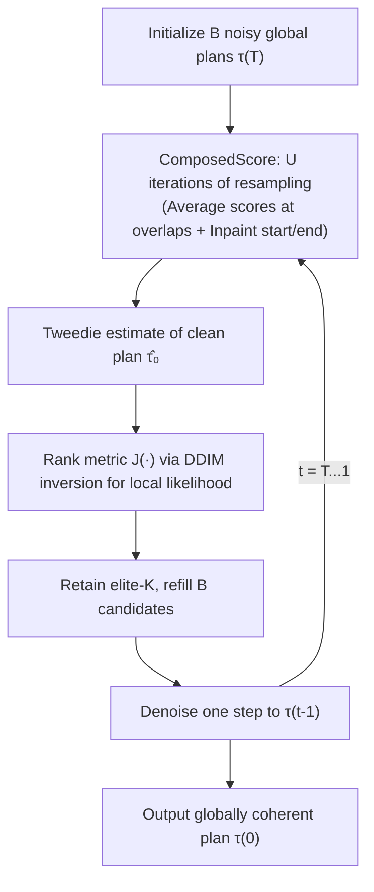

# Compositional Diffusion with Guided Search for Long-Horizon Planning

**Conference**: ICLR 2026  
**OpenReview**: [https://openreview.net/forum?id=b8avf4F2hn](https://openreview.net/forum?id=b8avf4F2hn)  
**Project Page**: [https://cdgsearch.github.io/](https://cdgsearch.github.io/)  
**Area**: Long-Horizon Robot Planning / Compositional Diffusion / Inference-Time Search  
**Keywords**: compositional diffusion, long-horizon planning, mode averaging, guided search, TAMP, inference-time scaling  

## TL;DR
This work embeds "population-based search" directly into the diffusion denoising process. By using iterative resampling for local-to-global message passing and pruning based on likelihoods derived from DDIM inversion, it enables short-range diffusion models to compose long-horizon plans that are both locally feasible and globally coherent. The method generalizes across robot planning, panorama synthesis, and long-video generation.

## Background & Motivation
- **Background**: Leveraging generative models (especially diffusion) for planning is gaining traction. "Compositional generation"—stitching multiple local, modular short-range models into a long-range distribution—is a mainstream strategy to bypass the high cost of long-horizon data and the extrapolation limits of single-model horizons. This applies to multi-step manipulation, panorama synthesis, and long-video generation.
- **Limitations of Prior Work**: When the local distributions are **multimodal**, composing local plans into a global plan inherits "compositional multimodality"—where each global mode corresponds to a sequence of different local modes. Existing methods (e.g., GSC) rely on score-averaging to combine local modes, which fails to handle this combinatorial explosion. This leads to **mode averaging**, where incompatible local modes are averaged together, resulting in invalid plans that are neither locally feasible nor globally coherent.
- **Key Challenge**: High-likelihood local segments may be reasonable in isolation, but the resulting mode sequences can conflict. Solving this requires **jointly reasoning about the compatibility between local modes** and navigating an exponentially large search space—where pure sampling collapses into incoherent averages.
- **Goal**: To identify a sequence of mutually compatible local modes that compose a globally coherent plan, while operating entirely within standard diffusion denoising, requiring no long-horizon training data, and offering plug-and-play cross-domain capabilities.
- **Key Insight**: **Translate classical search concepts into diffusion denoising.** Perform population search on a batch of candidate global plans during each denoising step: (i) **Iterative resampling** to enhance local-global information transfer for proposing globally plausible candidates, and (ii) **Likelihood-based pruning** to eliminate incoherent candidates that fall into low-likelihood regions due to mode averaging.

## Method

### Overall Architecture
A long-horizon plan $\tau=(x_1,\dots,x_N)$ is represented as a factor graph composed of overlapping local distributions. Using the Bethe approximation, the joint distribution is written as $p(\tau)=\frac{\prod_j p(y_j)}{\prod_i p(x_i)^{d_i-1}}$, allowing the sampling of long-horizon $p(\tau)$ using only short-range local distributions $p(y)$. The composed score $\nabla\log p(\tau)$ is calculated by summing factor scores and variable scores (averaging conditional scores for overlapping variables). CDGS transforms the denoising process into a guided population search: it maintains $B$ candidate global plans at each step, calculates composed scores via iterative resampling, ranks them by a likelihood metric to retain the elite-$K$, and refills the population before the next step.

**Intuition (1D running example in Fig.3):** To go from start $x_1$ to goal $x_7$, there are two feasible paths: "top" and "bottom." Naive composition might mix a "top start" with a "bottom end," forcing the middle factor to average both modes and produce an infeasible red transition. Adding iterative resampling reduces the frequency of mode averaging, and pruning completely eliminates plans containing infeasible transitions.

### Key Designs

**1. Population-based sampling embedded in denoising: Cross-Entropy Search with modified transition distributions.** The backbone of CDGS is that at each denoising step $t$, it no longer merely samples from the diffusion transition $p(\tau^{(t-1)}|\tau^{(t)})$. Instead, it samples from a distribution reshaped by a ranking metric: $p_J(\tau^{(t-1)}|\tau^{(t)})\propto p(\tau^{(t-1)}|\tau^{(t)})\exp\!\big(-J(\hat\tau_0^{(t-1)})/\beta_t\big)$, where $\hat\tau_0$ is the Tweedie estimate of the clean plan and $\beta_t$ controls the exploration-exploitation trade-off. This is approximated via a Monte Carlo process similar to the Cross-Entropy Method (CEM): draw a batch of $B$ candidates, rank them by $J$, retain the elite-$K$, and refill. The elite count $K$ acts as a tunable knob; harder problems with larger search spaces can be addressed with more parallel exploration, naturally providing an adaptive inference-time scaling property.

**2. DDIM inversion approximating local likelihood as a pruning metric.** The key insight is that "a global plan is feasible ⟺ all its local transitions are feasible." Since local models $p(y)$ are trained to model feasible short-range behaviors, **high-likelihood local segments are strong signals for local feasibility.** Since exact likelihoods are intractable in diffusion models, the authors use DDIM inversion as an approximation: each local segment $y$ is moved forward in time via the learned score network. High-likelihood samples follow low-curvature trajectories, while low-likelihood samples require high curvature to be pulled back into the distribution. This defines the curvature smoothness $g(y^{(0)})=\sum_{i=1}^{T}\big\|\tfrac{\partial \epsilon_\theta(y^{(i-1)},i)}{\partial i}\big\|^2$, aggregated into a global ranking metric $J(\tau^{(0)})=\sum_{m=1}^{M}\exp(-g(y_m^{(0)}))$. A larger $g$ indicates a sample is further from the nearest mode of $p(y)$, representing lower likelihood; such low-quality plans are more likely to be pruned.

**3. Iterative resampling for local-to-global message passing.** Ranking is insufficient if the candidates themselves occupy poor regions of the space. Standard compositional sampling cannot propagate long-range dependencies through overlapping segments (e.g., $y_1$ knows nothing about $y_6$ after one step). CDGS adopts RePaint-style resampling: when calculating the composed score, it repeatedly alternates between "forward diffusion $\tau^{(t)}\sim p(\tau^{(t)}|\tau^{(t-1)})$ + denoising," inpainting the start/end goals back into the population each round. Mathematically, this is equivalent to belief propagation on a chain of factors: the belief of each local plan $y_m$ is updated via its neighbors $p(y_m|y_{m-1},y_{m+1})\propto p(y_m)\,p(y_m|y_m\cap y_{m-1})\,p(y_m|y_m\cap y_{m+1})$. After $U$ rounds, information permeates the entire sequence, producing globally coherent candidates. Both $U$ and $B$ can be scaled with the horizon/search space to provide scalable inference-time compute.

## Key Experimental Results

### Main Results: Robot Planning (OGBench)
Receding-horizon control success rates (100 trials × 3 seeds) using models learned from stitch/play data:

| Environment | Size | HIQL | GSC | CompDiffuser | Ours w/o PR | Ours |
|---|---|---|---|---|---|---|
| PointMaze (Stitch) | Medium | 74 | 100 | 100 | 100 | **100** |
| PointMaze (Stitch) | Giant | 0 | 29 | 68 | 78 | **87** |
| AntMaze (Stitch) | Large | 67 | 66 | 86 | 86 | **88** |
| AntMaze (Stitch) | Giant | 21 | 20 | 65 | 82 | **85** |
| HumanoidMaze (Stitch) | Large | 31 | 70 | 72 | 70 | **74** |
| Scene (Play) | - | 38 | 8 | 13 | 36 | **51** |

Key takeaway: CDGS improves over naive composition (GSC) in a **training-free** manner, even **outperforming CompDiffuser**, which requires specialized training with overlap supervision. The advantage is most pronounced in the challenging Giant scales.

### Main Results: TAMP Task Suite (Success Rate, 50 trials)

| Method | Task Info | Hook Reach T1/T2 | Rearr. Push T1/T2 | Rearr. Memory T1/T2 |
|---|---|---|---|---|
| STAP CEM | Privileged PDDL | 0.66 / 0.70 | 0.76 / 0.70 | 0.00 / 0.00 |
| LLM-T2M (n=11) | LLM prompting | 0.0 / 0.48 | 0.72 / 0.06 | 0.0 / 0.0 |
| GSC (no task plan) | Skill-level only | 0.18 / 0.04 | 0.00 / 0.00 | 0.07 / 0.00 |
| **CDGS (ours)** | Skill-level only | **0.64 / 0.58** | **0.84 / 0.48** | **0.42 / 0.18** |

Without relying on symbolic search or LLM/VLM supervision, CDGS **substantially outperforms privileged methods** on tasks requiring long-term memory like Rearrangement Memory.

### Ablation Study & Cross-Domain Results
- **Ablation (Ours w/o PR vs Ours)**: Removing pruning + resampling causes success rates in TAMP tasks to plummet (e.g., Hook Reach T1 from 0.64 → 0.24). Scaling analysis shows that **increasing batch size $B$ or resampling $U$ in isolation is insufficient**; they must synergize to ensure long-horizon planning success.
- **Panoramas (SD2.0, 512×4608)**: CDGS matches Sync-Diffusion without explicit perceptual losses. It achieves an Intra-Style-L of 1.38 (vs 2.96 for Multi-Diffusion) and the highest CLIP-S of 32.51, balancing local consistency with global context.
- **Long Video (CogVideoX-2B → 350 frames, 720p, 7× extrapolation)**: Subject consistency (91.67) and prompt alignment (26.13) both exceed GSC, with only a minor aesthetic trade-off.

### Key Findings
Naive composition often "hallucinates" out-of-distribution transitions (e.g., `place(hook)` where the "in-hand" precondition is never met). CDGS's pruning objective ensures that only feasible plans consistent with the local transition model are retained. Scaling analysis (Fig.5c/d) shows task planning success increases monotonically with batch size, while motion planning success requires both large batches and resampling iterations to be effective.

## Highlights & Insights
- **Identifies mode-averaging as a first-class problem** in compositional generation, attributing it to global compositional multimodality rather than mere sampling noise.
- **Training-free and Plug-and-play**: It requires no training modifications, long-horizon data, or task-skeleton supervision. Changing only the inference-time sampling process achieves generalization across robot planning, panoramas, and video.
- **DDIM Inversion Curvature ≈ Local Likelihood**: This proxy elegantly bypasses the intractability of diffusion likelihoods, turning feasibility verification into a batchable ranking signal.
- **Adaptive Inference-Time Compute**: Harder tasks can trade $B$ and $U$ for higher success rates, providing a clean example of inference-time scaling for compositional distributions.

## Limitations & Future Work
- **Inference cost increases with $B \times U$**: Population search, multiple resampling rounds, and per-segment DDIM inversion introduce significant overhead. Wall-clock/FLOPs comparisons with baselines are not provided.
- **Reliance on low-dimensional states**: Robot experiments use state spaces (end-effector and object poses). End-to-end planning from pixels remains unverified in this work.
- **Approximation of the likelihood proxy**: DDIM curvature is a heuristic. Ranking may falter if local models are underfit or when samples fall into the extreme tails of the distribution.
- **Aesthetic vs. Consistency trade-off**: In long-video generation, gains in subject consistency come at the cost of minor aesthetic degradation, a common issue in compositional video tools.

## Related Work & Insights
- **Compositional Planning/Sampling**: Diffusion-CCSP, GSC, and GFC all utilize compositional sampling but typically rely on task skeletons or constraint graphs to avoid mode-averaging. CDGS addresses this challenge directly.
- **Inference-Time Scaling**: Shares roots with verifier-guided search and diffusion scaling but specifically targets mode-averaging limitations in chainable compositional distributions.
- **Long-Horizon Content Generation**: Belongs to the "extrapolating from short-range modules" family (Multi-Diffusion, Sync-Diffusion, Gen-L-Video). CDGS unifies planning and generation under a single search framework.
- **Key Insight**: Remedying distribution collapse in generative models via search is a portable concept—applicable to any scenario stitching short-range modules into long-range structures (e.g., code synthesis, long documents, trajectory optimization).

## Rating
- **Novelty**: ⭐⭐⭐⭐ Combines population search, DDIM-likelihood pruning, and resampling into a coherent solution for mode-averaging.
- **Experimental Thoroughness**: ⭐⭐⭐⭐ Covers OGBench, TAMP, panoramas, and video with strong baselines and scaling analysis. Lacks wall-clock/latency comparisons.
- **Writing Quality**: ⭐⭐⭐⭐ Intuitive running examples. Algorithm and formulas are complete, though DDIM inversion equations have a high entry barrier.
- **Value**: ⭐⭐⭐⭐ Provides a training-free, cross-domain paradigm for long-horizon planning and generation with high transferability.

> Resources: The project page contains interactive demos and qualitative results for panoramas and long videos at [https://cdgsearch.github.io/](https://cdgsearch.github.io/).

<!-- RELATED:START -->

## Related Papers

- [\[ICML 2026\] HDFlow: Hierarchical Diffusion-Flow Planning for Long-horizon Tasks](../../ICML2026/robotics/hdflow_hierarchical_diffusion-flow_planning_for_long-horizon_tasks.md)
- [\[ICLR 2026\] CoNavBench: Collaborative Long-Horizon Vision-Language Navigation Benchmark](conavbench_collaborative_long-horizon_vision-language_navigation_benchmark.md)
- [\[ICLR 2026\] SARM: Stage-Aware Reward Modeling for Long Horizon Robot Manipulation](sarm_stage-aware_reward_modeling_for_long_horizon_robot_manipulation.md)
- [\[ICML 2026\] Drift is a Sampling Error: SNR-Aware Power Distributions for Long-Horizon Robotic Planning](../../ICML2026/robotics/drift_is_a_sampling_error_snr-aware_power_distributions_for_long-horizon_robotic.md)
- [\[ICML 2025\] Closed-loop Long-horizon Robotic Planning via Equilibrium Sequence Modeling](../../ICML2025/robotics/closed-loop_long-horizon_robotic_planning_via_equilibrium_sequence_modeling.md)

<!-- RELATED:END -->
