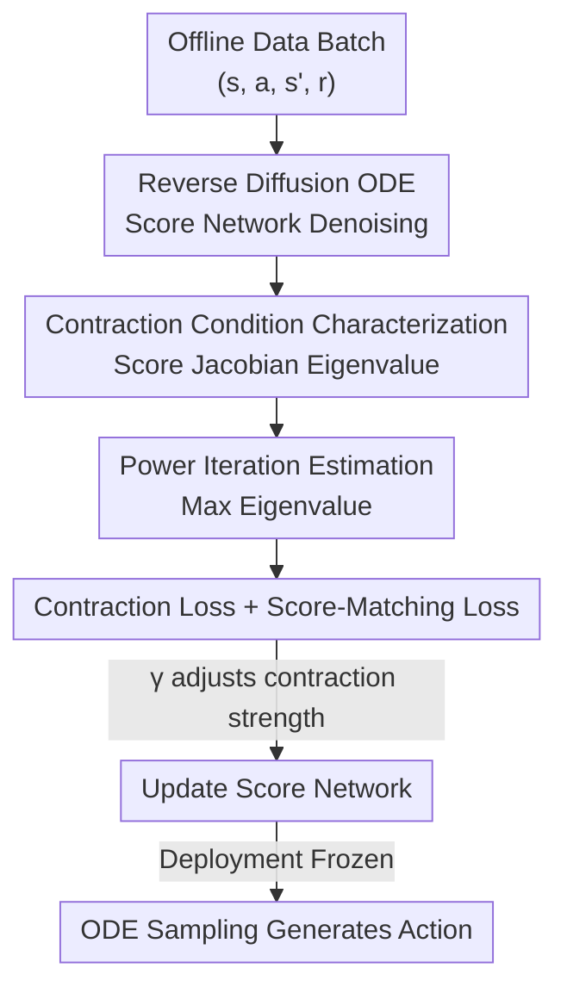

# Contractive Diffusion Policies

**Conference**: ICLR2026  
**OpenReview**: [https://openreview.net/forum?id=iKJbmx1iuQ](https://openreview.net/forum?id=iKJbmx1iuQ)  
**Code**: contractive-diffusion.github.io (Project Page)  
**Area**: Robotics / Offline Policy Learning / Diffusion Policy  
**Keywords**: Diffusion Policy, Contraction Theory, Offline RL, Imitation Learning, score Jacobian

## TL;DR
To address the issue where "sampler error + score estimation error" progressively accumulates/pushes actions away from data support in offline control, this paper uses contraction theory to transform "bringing adjacent denoising trajectories closer" into a differentiable penalty on the maximum eigenvalue of the score network's Jacobian. By adding only one hyperparameter and a lightweight loss term, it can be integrated into existing diffusion policies, with particularly significant gains in data-scarce scenarios.

## Background & Motivation
**Background**: Diffusion policies have become a mainstream generative approach for offline policy learning, especially in robotics and control. They involves progressively adding noise to data actions and learning a state-conditioned score function to denoise them back to actions step-by-step along a reverse diffusion SDE/ODE. This score-based iterative sampling allows the model to characterize long-horizon, multi-modal behavior distributions.

**Limitations of Prior Work**: However, the same mechanism comes with a cost. Reverse sampling depends on ODE/SDE solvers, which accumulate errors from three sources: (i) inaccurate score estimation, (ii) discretization errors, and (iii) numerical integration errors. These stack over denoising steps, causing the "same state, twice-sampled actions to be inconsistent." While such deviations are negligible in image generation, they are fatal in control—slight deviations from the data distribution amplify exponentially, eventually pushing the policy out of the dataset's support region and causing safety issues on real robots.

**Key Challenge**: Score-based iterative sampling is both the source of multi-modal expressiveness and the source of these inaccuracies. One cannot simply "make sampling more deterministic" as that sacrifices multi-modality; however, allowing iterative errors to accumulate leads to control failure. Existing contractive diffusion probabilistic models (Tang & Zhao, 2024) prove that enforcing contraction can suppress score-matching and discretization errors, but they enforce global contraction, which may collapse distribution diversity and is difficult to integrate efficiently into offline learning.

**Goal**: To imbue the diffusion sampling process with "contraction" properties without destroying multi-modal expressiveness or significantly increasing computational overhead, thereby suppressing solver and score errors and reducing meaningless action variance.

**Key Insight**: The authors introduce contraction theory—the study of whether solutions of a differential equation converge toward each other over time. A contractive ODE can quickly "forget" small perturbations in initial conditions, naturally suppressing error growth. Applying this to the reverse diffusion ODE, "contraction" corresponds to "pulling adjacent denoising flows toward the primary modes of the action distribution."

**Core Idea**: Strictly reducing the "promotion of sampling contraction" to a "constraint on the maximum eigenvalue of the symmetric part of the score network's Jacobian," and then penalizing it with a differentiable contraction loss efficiently estimated via power iteration. This can be integrated as a plug-and-play module into existing diffusion policies.

## Method

### Overall Architecture
CDP does not change the network architecture of the diffusion policy; instead, it modifies the training objective. Given an offline dataset $D=\{(s,a,s',r)\}$, the diffusion policy learns a state-conditioned scaled score network $\epsilon_\theta(a_t,s,t)\approx-\sigma_t\nabla_{a_t}\log p_t(a_t\mid s)$. During deployment, the network is frozen and actions are sampled along the reverse diffusion ODE. The approach here is: beyond the standard score-matching loss, calculate the Jacobian of the score for each batch at each denoising step and punish its maximum eigenvalue with a "contraction loss," forcing the sampling dynamics to become contractive. The final training loss adds only one term $\gamma L_c$ and one hyperparameter $\gamma$.

Why does penalizing the Jacobian control contraction? The authors rewrite the reverse diffusion ODE as a form with a linear drift term and a score term $da_t=[f(t)a_t+h(t)\epsilon_\theta(a_t,s,t)]\,dt=F_\theta(a_t,t)\,dt$, and then compute the Jacobian with respect to the action:

$$J_{F_\theta}=f(t)I+h(t)J_{\epsilon_\theta}.$$

Here $f(t)I$ and $h(t)$ are fixed by the forward diffusion schedule and are not trainable; the only trainable part is the score Jacobian $J_{\epsilon_\theta}$—this is the lever to pull. The pipeline is as follows:

### Key Designs

**1. Contraction Condition Characterization: Translating "Sampling Contraction" into Constraints on Score Jacobian Eigenvalues**

Contraction theory provides a sufficient condition: an ODE $F(a_t,t)$ is contractive if and only if the symmetric part of its Jacobian is negative definite, i.e., $\lambda_{\max}(J_F+J_F^\top)<0$. Core Theorem 3.1 applies this to the diffusion ODE: taking the symmetric part $J_{F_\theta}^{\mathrm{sym}}=f(t)I+h(t)J_{\epsilon_\theta}^{\mathrm{sym}}$, then $F_\theta$ is contractive if and only if:

$$\lambda_{\max}(J_{\epsilon_\theta}^{\mathrm{sym}})<-f(t)\,h(t)^{-1},\quad \forall t\in[0,1].$$

This formula is critical: the drift term $f(t)I$ is often inherently contractive, pulling adjacent flows together at each solver step; the score term, however, may locally be expansive or contractive. The theorem guarantees that as long as the maximum eigenvalue of the score Jacobian is suppressed below the threshold, the contraction of the drift term can override any local expansion from the score. Corollary 3.1.1 further provides an upper bound on action variance—the difference between two flows $\|\delta a_t\|\le\exp\!\big(\int_t^1\lambda_{\max}(J_{F_\theta}^{\mathrm{sym}}(\tau))\,d\tau\big)\|\delta a_0\|$, meaning contraction directly translates to "insensitivity to initial random seeds and more stable actions in similar states." Unlike older global contraction methods, this anchors the constraint precisely on a trainable quantity, leaving room for "only constraining what needs to be constrained" without over-contraction.

**2. Power Iteration Estimation: Making Max Eigenvalue Penalty Cheap Enough to Compute at Every Denoising Step**

Directly calculating all eigenvalues of $J_{\epsilon_\theta}^{\mathrm{sym}}$ for every state-action pair at every denoising step would be computationally prohibitive. The authors use power iteration to approximate the maximum eigenvalue: starting from a random vector $v_0\sim\mathcal N(0,I)$, they repeatedly perform $v_{k+1}=J_{\epsilon_\theta}^{\mathrm{sym}}v_k/\|J_{\epsilon_\theta}^{\mathrm{sym}}v_k\|_2$ and take $\hat\lambda_{k+1}=v_{k+1}^\top J_{\epsilon_\theta}^{\mathrm{sym}}v_{k+1}$. The estimate converges to $\lambda_{\max}$ at a linear rate. Each iteration requires only one Jacobian-vector product (JVP, which is back-propagatable), and in practice, $K=3$ or $4$ iterations are stable enough. This step is the key engineering point that turns the theory from "elegant but uncomputable" to "something that can actually fit into the training loop."

**3. Contraction Loss: Eigenvalue Penalty with Margin to Facilitate Contraction and Prevent Mode Collapse**

With efficient estimation, the loss can be formulated. The per-sample contraction loss is $L_c(\theta)=\max(-\beta,\ \hat\lambda_{\max}(J_{\epsilon_\theta}^{\mathrm{sym}})+f(t)h(t)^{-1})$, where $\beta>0$ is the desired contraction margin; the authors also provide an equivalent Frobenius norm form $L_c(\theta)=\|J_{\epsilon_\theta}^{\mathrm{sym}}+\beta I\|_{\mathrm{Frob}}$ (as the Frobenius norm relates to eigenvalues for symmetric matrices). The $\max(-\beta,\cdot)$ truncation is vital: it excludes "over-contraction"—where eigenvalues are pushed excessively negative—thus avoiding merging separate action modes that should be preserved, which prevents mode collapse. This is exactly where it outperforms the "global forced contraction" of previous methods: it only contracts until "enough."

**4. Plug-and-Play Integration: One Loss, One Hyperparameter, Independent of Specific Policy Learning Algorithms**

The final training loss is the score-matching loss $L_d$ plus $\gamma L_c$:

$$L(\theta)=\mathbb E_{(a,s)\sim D}\Big[\mathbb E_{t,a_t}\big[\|\epsilon_\theta+\sigma_t\nabla_{a_t}\log p_t(a_t\mid s)\|_2^2+\gamma L_c(\theta)\big]\Big].$$

Only one additional positive hyperparameter $\gamma$ controls the contraction strength. The presence of $L_d$ is crucial: penalizing the Jacobian alone would push the model toward a "trivially contractive but meaningless" field, while score-matching simultaneously requires accurately captured scores; together they force out "flows that are both contractive and meaningful." Since the contraction term is calculated only from the diffusion ODE and is decoupled from the policy learning method, it can be attached to any differentiable score function—Ours is built on EDP (Offline RL) and DBC (Imitation Learning) with nearly zero modification.

### Loss & Training
Trained for 200k–500k gradient steps (depending on task difficulty and observation modality), using 10 random seeds per dataset. $\gamma$ was simply selected from $\{0.001, 0.01, \dots, 100\}$, eventually fixed at $\gamma=0.1$; results are insensitive to other hyperparameters besides $\gamma$. Power iteration $K=3\!\sim\!4$.

## Key Experimental Results

### Main Results
Offline RL on D4RL comparing diffusion-based methods (normalized return, higher is better):

| Dataset | BC | DQL | EDP | IDQL | CDP |
|--------|----|-----|-----|------|-----|
| Average over all envs | 35.1 | 58.8 | 61.2 | 60.3 | **65.7** |
| Hopper-MR | 18.9 | 50.4 | 55.1 | 51.5 | **63.5** |
| Walker2D-MR | 27.8 | 76.8 | 82.0 | 84.6 | **89.7** |
| Kitchen-Complete | 27.3 | 35.7 | 32.9 | 31.6 | **51.0** |

Imitation Learning on Robomimic (success rate):

| Task | BC-GMM | DP-DiT | DP-Unet | DBC-DiT | CDP-DiT | CDP-Unet |
|------|--------|--------|---------|---------|---------|----------|
| Average | 0.50 | 0.76 | 0.88 | 0.64 | 0.78 | **0.90** |
| Transport-L | 0.21 | 0.56 | 0.74 | 0.13 | 0.48 | **0.81** |
| Transport-H | 0.14 | 0.41 | 0.68 | 0.29 | 0.52 | **0.75** |

### Ablation Study

| Configuration | Key Observation | Explanation |
|------|---------|------|
| Data reduced to 10% (D4RL / Robomimic) | CDP significantly outperforms all baselines | Score errors are amplified under data scarcity; the error-suppressing effect of contraction is most prominent here |
| Physical Franka Arm (4 IL tasks, 20 runs each) | Solves 3/4 tasks, success rate higher than DBC | Clear advantage in harder tasks like Slide and Peg |
| Computational cost (100k steps) | RL 5236s vs EDP 4594s; IL 9056s vs DP-Unet 8210s | The overhead from the contraction term is moderate |

### Key Findings
- **Data scarcity is the biggest sweet spot for CDP**: While gains are modest under standard data volumes—even slightly dropping in some near-optimal tasks due to extra robustness—CDP leads decisively when data is reduced to 10%. This validates that "contraction suppresses the score-matching errors amplified by low data."
- **Hyperparameter Robustness**: Except for the contraction weight $\gamma$, the model is insensitive to other hyperparameters; a uniform $\gamma=0.1$ is sufficient.
- **Still trails DP-Unet in IL**: CDP consistently outperforms the DBC it is based on, but lags behind the UNet version of diffusion policies. The authors attribute this to the architectural advantages of UNet and its ability to generate longer action sequences—indicating that contraction is an orthogonal Gain but cannot bridge gaps in the backbone network itself.

## Highlights & Insights
- **Precise connection of "contraction" from control theory to the generative model Jacobian**: Theorem 3.1 provides the necessary and sufficient condition "sampling contraction ⟺ score Jacobian max eigenvalue below threshold." This equivalence is the fulcrum of the paper, transforming a vague desire for "stable sampling" into an optimizable quantity.
- **$\max(-\beta,\cdot)$ truncation prevents mode collapse**: A common failure of contraction/regularization methods is over-compression at the expense of diversity. Using a margin to enforce "contraction only until sufficient" is an idea transferable to any generative policy where one wants regularization without collapse.
- **Power iteration + JVP makes second-order quantities trainable**: $K=3\!\sim\!4$ iterations with one JVP per step approximates the max eigenvalue. This engineering paradigm—"don't compute the full spectrum, just hunt the max eigenvalue"—is worth reusing in any scenario requiring spectral constraints.

## Limitations & Future Work
- **Non-universal Gains**: On tasks where all methods are already near-optimal, CDP only breaks even; in some cases, extra robustness may slightly hinder performance—contraction is a targeted remedy for "low data/high error" scenarios rather than a universal gain.
- **Lag behind stronger backbones**: Lagging behind DP-Unet on IL suggests that contraction loss cannot compensate for gaps in network architecture and action sequence length; the two should be combined rather than substituted.
- **Jacobian needs calculation every step**: Although cheap per step, it must be calculated for every denoising step and every state-action pair; the cumulative cost is non-zero for long horizons or large batches; $\beta$ and contraction margins still require empirical setting.
- **Theoretical foundations rely on ODE forms and certain step-size bounds**: The gap between these and actual discrete samplers, as well as the contraction-diversity tradeoff in more complex multi-modal distributions, deserves further characterization.

## Related Work & Insights
- **vs. Contractive Diffusion Probabilistic Models (Tang & Zhao, 2024)**: Both use contraction to suppress score-matching/discretization errors, but they enforce global contraction, which may crush diversity and is inconvenient for offline learning. Ours uses a local penalty with a margin, contracting only until sufficient to preserve separate action modes, and is explicitly built as a plug-and-play offline learning component.
- **vs. Diffusion Offline RL (DQL / EDP / IDQL)**: These methods layer value maximization on top of score-matching to balance "closeness to behavior policy" with "high returns," focusing on the training pipeline. CDP orthogonally transforms the sampling dynamics themselves and can be built directly on EDP for additional Gains.
- **vs. Diffusion Imitation Learning (Diffusion Policy / DBC)**: These focus on conditional action distribution modeling and multi-modal fusion, treating the sampling process as a black box. CDP is the first to treat the contractivity of sampling dynamics as a first-class optimization objective, thus consistently outperforming DBC.
- **vs. Contractive Autoencoders (Rifai et al., 2011)**: Also use Jacobian penalties for robustness to input perturbations, but that was for representation learning in encoders. Ours applies this to the temporal dynamics of the reverse diffusion ODE, constraining sampling trajectories rather than features.

## Rating
- Novelty: ⭐⭐⭐⭐⭐ Precisely linking contraction theory to score Jacobian eigenvalues and creating a plug-and-play loss is both a new perspective and solid implementation.
- Experimental Thoroughness: ⭐⭐⭐⭐ Covering D4RL + Robomimic + Physical Franka arm with 10 seeds across RL/IL/Real-world; however, IL did not surpass the strongest backbone, and gains in some tasks were limited.
- Writing Quality: ⭐⭐⭐⭐⭐ Mathematical derivations are clear; the flow from necessary/sufficient conditions to efficient implementation to the loss is seamless. Visualizations are intuitive.
- Value: ⭐⭐⭐⭐ A practical gain for low-data offline control scenarios, orthogonal and stackable with existing methods; non-universal gains limit the ceiling.

<!-- RELATED:START -->

## Related Papers

- [\[ICLR 2026\] Abstracting Robot Manipulation Skills via Mixture-of-Experts Diffusion Policies](abstracting_robot_manipulation_skills_via_mixture-of-experts_diffusion_policies.md)
- [\[ICLR 2026\] Demystifying Robot Diffusion Policies: Action Memorization and a Simple Lookup Table Alternative](demystifying_robot_diffusion_policies_action_memorization_and_a_simple_lookup_ta.md)
- [\[CVPR 2026\] REACH: Explicit Recovery Behavior for Diffusion Policies](../../CVPR2026/robotics/reach_explicit_recovery_behavior_for_diffusion_policies.md)
- [\[ICML 2026\] Online Self-Training for Co-Adaptation in Hierarchical Diffusion Policies](../../ICML2026/robotics/online_self-training_for_co-adaptation_in_hierarchical_diffusion_policies.md)
- [\[ICML 2026\] Lagrangian Perturbation Diffusion Steering: Latent Reinforcement Learning for Generative Policies](../../ICML2026/robotics/lagrangian_perturbation_diffusion_steering_latent_reinforcement_learning_for_gen.md)

<!-- RELATED:END -->
