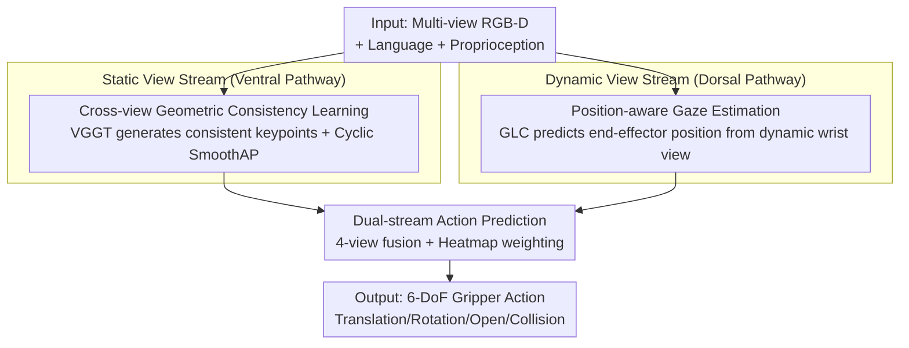

# Cortical Policy: A Dual-Stream View Transformer for Robotic Manipulation

**Conference**: ICLR2026  
**OpenReview**: [https://openreview.net/forum?id=eWe8zqGvs5](https://openreview.net/forum?id=eWe8zqGvs5)  
**Code**: To be confirmed (anonymous source code in supplementary materials)  
**Area**: Robotics / Embodied Manipulation  
**Keywords**: View Transformer, Dual-Stream Architecture, Imitation Learning, Cross-View Geometric Consistency, Egocentric Gaze Estimation

## TL;DR
Inspired by the division of labor in the human visual cortex—where the "ventral stream" perceives static scenes and the "dorsal stream" observes dynamic motion—this paper proposes Cortical Policy. It features a dual-stream View Transformer consisting of a static stream (using VGGT to supervise cross-view geometric consistency for 3D spatial reasoning) and a dynamic stream (using a pre-trained gaze estimation model to predict end-effector positions from an egocentric dynamic perspective). Cortical Policy significantly outperforms SOTA models like RVT-2 on RLBench, COLOSSEUM, and real-world tasks (RLBench success rate 81.0% vs. 77.5%, COLOSSEUM +9.4%, and 80% success under dynamic disturbances on real robots vs. 0% for static methods).

## Background & Motivation
**Background**: View Transformers (such as RVT, RVT-2, VIHE) have become the mainstream architecture for language-conditioned robotic manipulation. They render multiple static camera views (or virtual orthogonal views projected from point clouds) around the robot's workspace. Combined with language instructions and proprioception, they predict 6-DoF gripper poses, open/close states, and collision flags, offering higher efficiency and scalability than explicit 3D representation methods.

**Limitations of Prior Work**: Such methods exhibit two recurring failure modes. The first is **insufficient spatial reasoning**—they extract 2D features separately within each view and perform "naive concatenation" without modeling cross-view relationships, failing to correctly fuse different camera perspectives of the same scene in 3D. An example in Figure 1 shows "placing a block between two bottles": RVT-2 misplaces the block because it fails to fuse multi-view information into 3D. The second is **failure in dynamic adaptation**—static camera configurations lack motion perception. When target objects move while the arm is approaching, existing methods stubbornly follow the original planned trajectory until the task fails.

**Key Challenge**: The scene perception provided by current View Transformers is "incomplete." They treat visual representation as something static and view-local, lacking a unified 3D geometric prior and any time-varying, action-oriented dynamic feedback channel. Spatial geometric understanding and dynamic motion adaptation are forced together into a single static stream, resulting in poor performance for both.

**Key Insight**: The authors turn to neuroscience—the human brain processes vision via two cortical pathways. The **ventral stream** processes static views using an allocentric reference frame to form stable scene understanding for recognition and planning. The **dorsal stream** processes dynamic views using an egocentric reference frame, translating retinal input into adaptive motor signals in real-time to estimate object properties and adjust trajectories. These two pathways are functionally distinct and structurally complementary, both essential for precise motor control.

**Core Idea**: This cortical principle is integrated into a computational framework by replacing the single static stream with **two independent and complementary parallel streams**: a static stream encoding persistent environmental structures (3D spatial understanding) and a dynamic stream deriving actions from motion cues (dynamic adaptation). The final action is decided by fusing the view representations from both streams.

## Method

### Overall Architecture
Cortical Policy is an imitation learning framework centered on a dual-stream View Transformer. The input consists of multi-view RGB-D observations at time $t$, language instructions, and proprioception. The output is a 6-DoF gripper action (3-DoF translation + 3-DoF rotation + open/close state + collision flag). The pipeline consists of three steps: The **static stream** adopts the RVT-2 backbone but adds a cross-view geometric consistency objective supervised by VGGT (a strong 3D reconstruction foundation model) to align features in a shared 3D space. The **dynamic stream** is a new design using a position-aware pre-trained model adapted from an egocentric gaze estimation model (GLC) to process dynamic eye-in-hand frames and estimate end-effector positions, producing action-oriented feature maps and heatmaps. Finally, an **action head** fuses the complementary representations from both streams to decode precise actions. In the implementation, a scene at any given time is represented by four viewpoints—three static views and one dynamic view.

### Key Designs

**1. Static Stream: Enhancing 3D Spatial Reasoning via VGGT-supervised Cross-View Geometric Consistency**

To address the issue where multi-view features are only concatenated in 2D, the static stream forces features at the same 3D position in different views to be consistent. This involves two steps. **3D Supervision Signal Generation**: VGGT predicts depth maps, confidence maps, and camera parameters for $N$ static views, back-projects them into point maps $\{P_i\}_{i=1}^{N}$ in the camera frame, and transforms them into the world frame to find "co-visible 3D points." Non-maximum suppression is applied to the first viewpoint's co-visible points to select $M$ high-confidence keypoints $K_1$, which are then tracked across viewpoints to obtain the geometrically consistent keypoint set $\{K_i\}_{i=1}^{N}$. These points primarily fall on objects or the robot, providing task-relevant 3D structural cues. **Feature Consistency Optimization**: A trainable $3\times3$ convolution follows the RVT Encoder to refine feature resolution. For each keypoint, features $f_i^{v_j}$ are bilinear sampled, and a SmoothAP loss optimizes cross-view feature ranking—ensuring that features corresponding to the same 3D point have the highest similarity:

$$\text{SmoothAP}(v_p \to v_q) = \frac{1}{|K_p|}\sum_{i=1}^{|K_p|} \frac{1 + \sum_{k_j \in K(i)} G(D_{ij})}{1 + \sum_{k_j \in K(i)} G(D_{ij}) + \sum_{k_j \in N(i)} G(D_{ij})}$$

Where the positive set $K(i)=\{k_i^{v_q}\}$ contains the same point in the target viewpoint, and the negative set $N(i)=\{k_j^{v_q}\mid j\neq i,\ \|p_i-p_j\|_2>\zeta\}$ contains points with a 3D distance greater than threshold $\zeta$. $G(\cdot)$ is the sigmoid function. To suppress error accumulation from sequential pairwise matching, the authors propose a **cyclic geometric consistency loss** $L_{cgc}$: connecting $N$ views into a closed loop $v_1\to v_2\to\cdots\to v_N\to v_1$, calculating and averaging SmoothAP for each edge ($L_{cgc}=1-\frac{1}{N}\sum_p \text{SmoothAP}(v_p\to v_{p\oplus 1})$). The cyclic constraint aligns features from the same 3D position, reducing accumulated action estimation errors and learning viewpoint-invariant representations.

**2. Dynamic Stream: Gaze Estimation as Action Inference for End-Effector Position Prediction**

To address the lack of dynamic perception in static cameras, the dynamic stream asks "how the action is executed" rather than "what action happened," directly predicting kinematic parameters like gripper translation. The key observation is that **predicting the end-effector position** is formally isomorphic to **egocentric gaze estimation** (predicting human visual attention maps from first-person video): both generate a saliency map from a dynamic perspective. Thus, the SOTA gaze model GLC is used as a feature extractor. This stream has three components. **Egocentric Video Rendering**: Three data issues are addressed—field-of-view (FOV) differences between human and wrist cameras, the invariance of end-effector positions in fixed wrist camera projections, and distribution alignment. The solution uses real-time wrist camera extrinsics to construct **dynamic virtual cameras** in the RVT renderer, matching human egocentric FOV, diversifying end-effector projections, and aligning with static viewpoints while retaining motion dynamics. 3,600 annotated videos were constructed. **Position-aware Pre-training**: The GLC backbone is initialized with Ego4D weights and fine-tuned on egocentric videos using a KL divergence loss for 15 epochs. GLC ensures robust localization via temporal attention shifts and a Global-Local Correlation module. **Dynamic View Feature Extraction**: During Cortical Policy training, GLC is frozen. Two representations are extracted: visual tokens from the Gaze Encoder (projected into feature maps) and saliency maps from the Transformer Decoder (used as view heatmaps). The feature map $F$ is a projection of concatenated spatial and global-local tokens: $F = \text{LP}([F_{SA}, F_{GLC}]_c)$.

**3. Dual-Stream Action Prediction: 4-View Fusion + Heatmap Weighting**

The action head fuses complementary representations from both streams. A scene is represented by four views, each providing a feature map $F_j$ and a heatmap $H_j$. 3-DoF translation follows the highest-scoring 3D point from back-projected heatmaps. 3-DoF rotation, gripper state, and collision flags use fused global and local features. Local features are pooled from $F_j$ at heatmap coordinates. Global feature vectors combine $\phi(F_j\odot H_j)$ (heatmap-weighted sum pooling) and $\psi(F_j)$ (max pooling). The **heatmap weighting rule** $F_j\odot H_j$ is crucial: $H_4$ from GLC highlights task-relevant egocentric cues (e.g., end-effector position), injecting dynamic "where to look" information into the decision-making process.

### Loss & Training
The total loss combines action prediction loss and cross-view geometric consistency loss:

$$L = L_{action} + \lambda L_{cgc}$$

where $L_{action}$ is the sum of cross-entropy losses for action components, and $\lambda = 1$. The dynamic stream's GLC remains frozen during the main training phase (pre-training is a separate offline stage).

## Key Experimental Results

### Main Results
In the RLBench 18-task multi-task setting (100 demonstrations per task, single checkpoint evaluation), Cortical Policy achieves the highest average success rate, an absolute 3.5% improvement over RVT-2, and ranks top-1 or top-2 in 14/18 tasks. It leads by 1.3%–4.0% in multi-object tasks requiring spatial relationship understanding (e.g., "stack cups"), validating the 3D priors from the static stream.

| Dataset | Metric | Ours | Prev. SOTA (RVT-2) | Gain |
|--------|------|------|----------|------|
| RLBench (18 tasks) | Avg. Success Rate ↑ | 81.0% | 77.5% | +3.5% |
| RLBench (18 tasks) | Avg. Rank ↓ | 1.8 | 3.5 | — |
| COLOSSEUM (4 tasks / multi-disturb) | Avg. Success Rate ↑ | 69.9% | 60.5% | +9.4% |

On COLOSSEUM (unseen disturbances in color, size, lighting, distractors, etc.), Cortical Policy outperforms RVT-2 by 9.4%. Ablations show the **dynamic stream is the primary driver of this robustness**, providing significantly higher gains than $L_{cgc}$ under heavy disturbance.

### Ablation Study
Ablations on RLBench (Table 2). Arch.=Single/Dual Stream; Lcgc=Cyclic Consistency Loss; Pre.=Position-aware Pre-training; Heat.=Dynamic View Heatmap.

| Config | Arch. | Lcgc | Pre. | Heat. | Avg. Success | Description |
|------|-------|------|------|-------|-----------|------|
| A | Single | ✗ | – | – | 77.5% | Pure static stream (≈RVT-2 baseline) |
| B | Single | ✔ | – | – | 80.1% | Static + $L_{cgc}$, +2.6% over A |
| C | Dual | ✗ | ✗ | ✔ | 77.6% | GLC joint training, no pre-training |
| D | Dual | ✗ | ✔ | ✗ | 73.3% | Dynamic stream w/o heatmap -> worse than single |
| E | Dual | ✗ | ✔ | ✔ | 79.5% | Full dynamic stream w/o $L_{cgc}$ |
| F (Ours) | Dual | ✔ | ✔ | ✔ | 81.0% | Full model |

### Key Findings
- **Cross-view geometric consistency $L_{cgc}$ is universally effective**: Improving performance for both single and dual streams by 1.5%–2.6%, proving the utility of viewpoint-invariant representation learning.
- **Position-aware pre-training is superior to joint training**: Freezing pre-trained GLC (E) outperforms joint training (C) by 1.9% and is more stable across tasks.
- **Heatmaps are vital for the dynamic stream**: Removing the heatmap (D) caused performance to drop below the single-stream baseline, showing that explicit "where to look" action cues are essential.
- **Real-world dynamic adaptation**: Achieved an 80% success rate on dynamic tasks (moving targets/bases) where pure static methods failed completely (0%).

## Highlights & Insights
- **Neuroscience-to-Architecture Mapping**: The "dual-pathway" principle is successfully translated into a trainable dual-stream architecture with specific loss functions and data pipelines.
- **End-effector position prediction ≅ Egocentric gaze estimation**: This isomorphism allows the reuse of Ego4D pre-trained GLC models and human gaze priors, transferring spatiotemporal localization knowledge to robots.
- **Dynamic Virtual Cameras**: This technique addresses FOV domain gaps, end-effector projection invariance, and distribution alignment, providing a scalable way to "standardize" wrist camera data.
- **Cyclic Consistency**: Using a closed loop instead of pairwise matching suppresses error accumulation in multi-view alignment.

## Limitations & Future Work
- **Zero-shot transfer difficulty**: Success rates on unseen tasks (e.g., "close laptop lid") are only 24%. Future work aims to enhance compositional abstraction.
- **Dependency on Foundation Models**: Performance is tied to the quality of pre-trained VGGT and GLC models.
- **Single Target Tracking**: The dynamic stream currently tracks only the end-effector; it could be extended to multiple objects or affordance points.
- **Synthetic Data Reliance**: The egocentric videos were generated in simulation; their coverage of complex real-world motions requires further investigation.

## Related Work & Insights
- **vs. RVT-2 / VIHE**: These rely on multi-stage static refinement. Ours adds cross-view 3D constraints and a dynamic stream to fix deficiencies in 3D relation modeling and dynamic adaptation.
- **vs. 3D-MVP / SAM-E**: While they enhance static views with foundation models, ours is the first to use VGGT's 3D knowledge for view-invariant feature learning.
- **vs. Voxel/Point Cloud Methods (PerAct)**: Ours avoids the high computation of voxels and the alignment issues of point clouds by using multi-view projections with explicit 3D relationship modeling.

## Rating
- Novelty: ⭐⭐⭐⭐⭐ Dual-stream cortical architecture + "position ≅ gaze" discovery + integration of VGGT.
- Experimental Thoroughness: ⭐⭐⭐⭐⭐ Multi-task (RLBench), multi-perturbation (COLOSSEUM), and real-robot evaluations.
- Writing Quality: ⭐⭐⭐⭐ Clear motivation and comprehensive charts.
- Value: ⭐⭐⭐⭐ 80% vs. 0% success on dynamic tasks provides a convincing paradigm for dynamic perception in visual robot control.

<!-- RELATED:START -->

## Related Papers

- [\[ICLR 2026\] EquAct: An SE(3)-Equivariant Multi-Task Transformer for 3D Robotic Manipulation](equact_an_se3-equivariant_multi-task_transformer_for_3d_robotic_manipulation.md)
- [\[CVPR 2026\] DiffuView: Multi-View Diffusion Pretraining for 3D-Aware Robotic Manipulation](../../CVPR2026/robotics/diffuview_multi-view_diffusion_pretraining_for_3d_aware_robotic_manipulation.md)
- [\[ICLR 2026\] Masked Generative Policy for Robotic Control](masked_generative_policy_for_robotic_control.md)
- [\[ICML 2026\] Dual-Stream Diffusion for World-Model Augmented Vision-Language-Action Model](../../ICML2026/robotics/dual-stream_diffusion_for_world-model_augmented_vision-language-action_model.md)
- [\[CVPR 2026\] Learning to See and Act: Task-Aware Virtual View Exploration for Robotic Manipulation](../../CVPR2026/robotics/learning_to_see_and_act_task-aware_virtual_view_exploration_for_robotic_manipula.md)

<!-- RELATED:END -->
