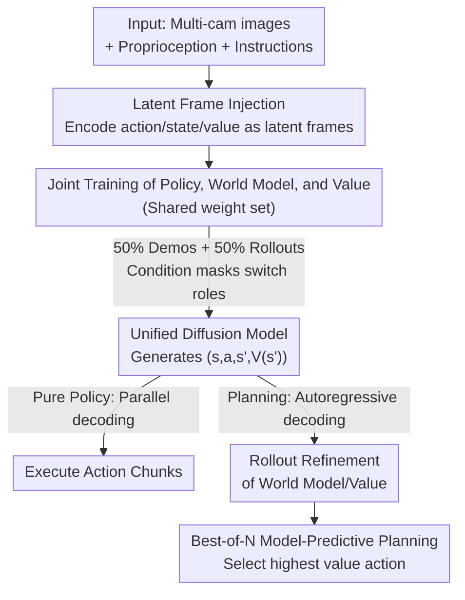

# Cosmos Policy: Fine-Tuning Video Models for Visuomotor Control and Planning

**Conference**: ICLR2026  
**OpenReview**: [https://openreview.net/forum?id=wPEIStHxYH](https://openreview.net/forum?id=wPEIStHxYH)  
**Code**: https://research.nvidia.com/labs/dir/cosmos-policy/  
**Area**: Robotics / Embodied AI  
**Keywords**: Video Foundation Models, Visuomotor Policy, World Models, Value Functions, Model-predictive Planning

## TL;DR
This work utilizes the pre-trained video generation foundation model Cosmos-Predict2-2B as a base, **without modifying any network architecture and using only one-stage fine-tuning**. It "encodes" robot actions, future states, and state values as "latent video frames" for joint denoising and generation. This allows the model to simultaneously serve as a policy, world model, and value function. It achieves SOTA on LIBERO (98.5%), RoboCasa (67.1%), and real-world dual-arm ALOHA tasks, with an additional 12.5-point improvement using best-of-N planning.

## Background & Motivation
**Background**: Utilizing large models as foundations for robot policies is a current mainstream trend. One category is VLA (vision-language-action) models, such as RT-2, OpenVLA, and π0.5, which fine-tune vision-language models pre-trained on "static image-text pairs" by adding action heads. Another recent direction utilizes video generation models, as they learn temporal causality, implicit physics, and motion patterns from massive video datasets—spatiotemporal priors that are naturally valuable for manipulation tasks.

**Limitations of Prior Work**: Existing "video models as policies" are generally cumbersome. They either fine-tune a video model on robot data first and then separately train an action decoder or inverse dynamics module (multi-stage + new architecture), or they train a unified video-action model **from scratch** without using pre-trained weights, thereby losing spatiotemporal priors. Both paths are either complex or waste the most valuable aspects of large video models.

**Key Challenge**: To benefit from the spatiotemporal priors of video models, one must "reuse its structure and learning algorithms as-is." However, video models do not natively support the inputs and outputs required by robot policies (proprioception, action chunks, multi-camera views, state values). Past approaches added structures or stages to support these modalities, which diluted the priors. How can these heterogeneous modalities be embedded into video models with "zero structural changes"?

**Goal**: (1) Fine-tune a pre-trained video model into an effective robot policy in a single stage without adding new components; (2) Enable the same model to function simultaneously as a policy, world model, and value function; (3) Refine the world model/value function using rollout data to support model-predictive planning at test time.

**Key Insight**: The authors observe that video diffusion models are inherently skilled at modeling complex, high-dimensional, and multi-modal distributions while generating hundreds of temporally coherent frames. Therefore, their learning algorithms are **equally suitable for modeling actions and other modalities as "frames."** Consequently, action chunks, proprioceptive states, and values can be "disguised" as video frames in the latent space and denoised alongside images.

**Core Idea**: Use "latent frame injection" to encode actions, proprioception, future states, and values into new frames within the video model's latent sequence. This allows the native video diffusion objective to jointly model $(s, a, s', V(s'))$ simultaneously, resulting in a unified model that acts as a policy, world model, and value function without any structural modifications.

## Method

### Overall Architecture
The foundation of Cosmos Policy is Cosmos-Predict2-2B-Video2World, a latent video diffusion model. It takes an initial image and text description as input, uses a Wan2.1 spatiotemporal VAE to compress video into a latent frame sequence, and trains a diffusion transformer $D_\theta$ to predict clean frames using the EDM denoising objective $L(D_\theta, \sigma) = \mathbb{E}_{x_0, c, n}\left[\|D_\theta(x_0 + n; \sigma, c) - x_0\|_2^2\right]$. The VAE compresses $(1+T)\times H\times W\times 3$ video into a $(1+T')\times H'\times W'\times 16$ latent sequence, where the first frame is not temporally compressed to facilitate conditioning on a single image.

Cosmos Policy "translates" all modalities required for the robot policy into extra frames within this latent sequence. New modality frames (proprioception, action chunks, future state values) are inserted between image frames, and multi-camera views are inserted at the image level. The entire sequence is ordered as $(s, a, s', V(s'))$ so that autoregressive decoding naturally yields "action → future state → future value." Training uses a single video diffusion denoising objective, with **condition masks** determining which frames are conditions and which are targets. This allows the same network to play different roles: policy $p(a, s', V(s')\,|\,s)$, world model $p(s', V(s')\,|\,s, a)$, or value function $p(V(s')\,|\,s, a, s')$. Deployment can be pure-policy (parallel decoding of actions only) or planning-enabled (autoregressive decoding of future states/values followed by best-of-N search).

### Key Designs

**1. Latent Frame Injection: Disguising heterogeneous modalities as video frames for zero-structure integration**

This addresses the pain point of adding architecture to video models. Video models do not natively handle proprioception, actions, values, or multi-camera views. Rather than modifying the network, the authors fill each new modality into an $H'\times W'\times C'$ latent frame volume. Specifically, proprioceptive states, action chunks, and values are **normalized to $[-1, +1]$ and tiled** across the latent frame. Multi-camera images are inserted directly as view frames in the sequence. For a setup with "two third-person cameras and one wrist camera," the sequence contains 11 frames: (1) blank placeholder, (2) proprioception, (3) wrist image, (4)(5) two third-person images, (6) action chunks, (7) future proprioception, (8)(9)(10) three future images, and (11) future state value. This ordering follows $(s, a, s', V(s'))$, enabling autoregressive decoding. This mechanism reuses the diffusion learning algorithm to capture complex action distributions without changing a single line of structural code.

**2. Joint Training of Policy, World Model, and Value Function: One set of weights for three roles via condition masking**

With all modalities in the same latent sequence, the training target depends only on which parts are conditions and which are targets. Each training step samples a batch of $(s, a, s', V(s'))$ tuples: 50% from demonstration data to train the policy $p(a, s', V(s')\,|\,s)$, and 50% from rollout data, split between training the world model $p(s', V(s')\,|\,s, a)$ and the value function $p(V(s')\,|\,s, a, s')$. Notably, policies and world models include **auxiliary objectives**—the policy learns future states and values alongside actions, and the world model learns values alongside states. Ablations show this auxiliary supervision significantly improves performance. Values use Monte Carlo returns $G_t = \gamma^{H-t} R(s_H, a_H)$ as labels (sparse rewards, terminal reward of $[0,1]$ backpropagated via discount factor $\gamma$).

**3. Rollout Learning + Dual-Model Deployment: Reliable planning by exposing the world model to failures**

World models/value functions trained only on demonstrations suffer because demonstrations consist almost entirely of successful trajectories. The state-action distribution is too narrow; if the policy deviates, the model's predictions become inaccurate, causing planning to fail. The authors emphasize collecting rollout data (deploying the policy and recording trajectories/outcomes) for refinement. During refinement, 90% of the batch weight is assigned to the world model and value function, with 10% for the policy. **Dual-model deployment** is then used: the original checkpoint acts as the "policy model," while the refined checkpoint acts as the "planning model" for world modeling and value prediction. The value function can also be switched via input masking to $V(s')$ (masking $(s,a)$) or $Q(s,a)$ (masking $s'$).

**4. Best-of-N Model-Predictive Planning: Executing actions with the highest predicted value**

Planning involves an "imagine-rank-execute" cycle: (1) Sample multiple candidate actions from the policy; (2) Predict future states and values for each candidate using the planning model; (3) Execute the action with the highest predicted value. To combat high variance in value predictions, the authors use an ensemble: for each action, 3 world model queries and 5 value function queries are made (15 total predictions), which are aggregated using a "majority mean." This classifies the majority outcome (success or failure) and takes the mean of that group, making it more robust to outliers than a simple average.

## Key Experimental Results

### Main Results

Success rates across four sub-task suites in LIBERO (single-arm, average of 6000 trials):

| Method | Spatial | Object | Goal | Long | Mean |
|------|---------|--------|------|------|------|
| Diffusion Policy | 78.3 | 92.5 | 68.3 | 50.5 | 72.4 |
| π0.5 | 98.8 | 98.2 | 98.0 | 92.4 | 96.9 |
| OpenVLA-OFT | 97.6 | 98.4 | 97.9 | 94.5 | 97.1 |
| CogVLA | 98.6 | 98.8 | 96.6 | 95.4 | 97.4 |
| **Ours (Cosmos Policy)** | 98.1 | **100.0** | 98.2 | **97.6** | **98.5** |

RoboCasa (24 kitchen tasks, 3600 trials average)—Ours exceeds results using 300~3000 demonstrations using only **50**:

| Method | Demos per task | Average Success Rate (%) |
|------|------------|---------------|
| GR00T-N1 | 300 | 49.6 |
| π0 | 300 | 62.5 |
| GR00T-N1.5 | 300 | 64.1 |
| FLARE | 300 | 66.4 |
| **Ours (Cosmos Policy)** | **50** | **67.1** |

On four real-world dual-arm ALOHA tasks (101 trials), Cosmos Policy achieved the highest composite score and outperformed all competitors in three tasks. It was significantly more stable in "Put candy in bowl" (highly multi-modal) and "Put candy in ziploc bag" (millimeter precision).

### Ablation Study

| Configuration | Relative Success Rate | Description |
|------|--------------|------|
| Full Cosmos Policy | Baseline | Includes auxiliary goals + video priors |
| w/o auxiliary loss | −1.5% | Removed joint $s'/V(s')$ auxiliary supervision |
| Train from scratch | −3.9% | Random initialization, equal gradient steps |

In the "fold shirt" ALOHA task, the scratch version scored 80.8, which is 18.7 points lower than the full version (≈99.5), exhibiting jittery movement.

### Key Findings
- **Video priors are crucial**: Training from scratch dropped success by 3.9% (sim) and 18.7 points (real-world), proving pre-trained video models provide strong initialization without extra robot data.
- **Auxiliary supervision is beneficial**: Predicting future states and values alongside actions improves the policy (+1.5%) as "free" regularization.
- **Planning requires rollout support**: World models trained only on demonstrations cannot predict failures. Refinement with 648 rollouts improved state prediction and added +12.5 points in planning for difficult tasks.
- **Model-based outperforms model-free**: $V(s')$ (with world model) planning was more stable than $Q(s,a)$ (model-free), as the latter is harder to learn accurately with limited rollout data.

## Highlights & Insights
- **"Treating everything as a frame" is elegant**: Mapping non-image modalities into the latent sequence using tiled frames resolves the conflict between "reusing pre-trained priors" and "supporting new modalities."
- **Unified weights for three roles**: Using condition masks to let one network act as a policy, world model, and value function saves resources and ensures shared representations.
- **Dual-model strategy**: Using on-policy rollouts for refinement ensures the planning model is robust on the distribution generated by the policy itself.
- **Remarkable data efficiency**: Outperforming models trained on 3000 demonstrations with only 50 demonstrations in RoboCasa shows that spatiotemporal priors significantly reduce the need for action-labeled robot data.

## Limitations & Future Work
- **Planning latency**: Model-based planning takes ~5 seconds per action chunk, making it difficult for dynamic/real-time tasks.
- **Requirement for rollouts**: Effective planning requires significant rollout data to correct the world model; learning from fewer rollouts remains a challenge.
- **Shallow search**: Only one step of the search tree is expanded; multi-step planning could further improve performance.
- **Lack of history**: $s$ and $s'$ only utilize instantaneous observations without historical sequences, which may limit modeling of long-term dependencies.

## Related Work & Insights
- **vs. Multi-stage video policies**: Unlike methods that separately train action decoders or inverse dynamics, this is a single-stage, zero-structure change method.
- **vs. Unified video-action models**: This method utilizes pre-trained Cosmos weights for spatiotemporal priors, whereas many unified models train from scratch.
- **vs. VLA**: VLA models are based on static image-text data; this work argues that spatiotemporal physics priors from video are more suitable for low-level control, outperforming VLAs in high-precision tasks.
- **vs. Classical World Models**: Instead of three independent modules (e.g., Dreamer), this uses a unified architecture and pre-trained initialization.

## Rating
- Novelty: ⭐⭐⭐⭐⭐ The paradigm of "treating action/value as latent frames" is a clean and insightful realization.
- Experimental Thoroughness: ⭐⭐⭐⭐⭐ Dual benchmarks + real-world arm tasks with SOTA comparisons and detailed ablation.
- Writing Quality: ⭐⭐⭐⭐ Clear logic and helpful visualizations; some implementation details are relegated to the appendix.
- Value: ⭐⭐⭐⭐⭐ Open-source code/models/data and high data efficiency provide strong evidence for video models as policy foundations.

<!-- RELATED:START -->

## Related Papers

- [\[ICLR 2026\] H$^3$DP: Triply-Hierarchical Diffusion Policy for Visuomotor Learning](h3dp_triplyhierarchical_diffusion_policy_for_visuomotor_learning.md)
- [\[ICLR 2026\] Actions as Language: Fine-Tuning VLMs into VLAs Without Catastrophic Forgetting](actions_as_language_fine-tuning_vlms_into_vlas_without_catastrophic_forgetting.md)
- [\[ICLR 2026\] EVLP: Learning Unified Embodied Vision-Language Planner with Reinforced Supervised Fine-Tuning](evlp_learning_unified_embodied_vision-language_planner_with_reinforced_supervise.md)
- [\[ICLR 2026\] Masked Generative Policy for Robotic Control](masked_generative_policy_for_robotic_control.md)
- [\[NeurIPS 2025\] PROFIT: A Specialized Optimizer for Deep Fine Tuning](../../NeurIPS2025/robotics/profit_a_specialized_optimizer_for_deep_fine_tuning.md)

<!-- RELATED:END -->
