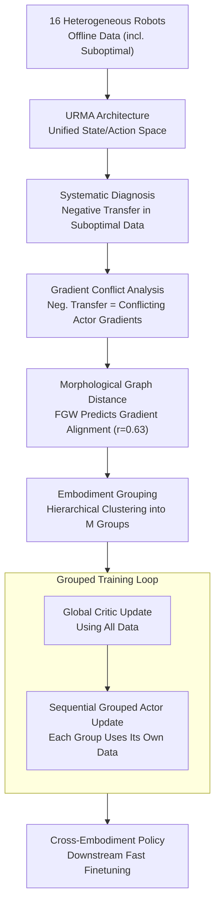

# Cross-Embodiment Offline Reinforcement Learning for Heterogeneous Robot Datasets

**Conference**: ICLR 2026  
**arXiv**: [2602.18025](https://arxiv.org/abs/2602.18025)  
**Code**: TBD  
**Area**: Reinforcement Learning / Robotics  
**Keywords**: cross-embodiment learning, offline RL, gradient conflict, robot foundation model, morphology grouping

## TL;DR
This paper systematically investigates cross-embodiment offline RL pre-training paradigms. It finds that gradient conflicts lead to negative transfer when the ratio of suboptimal data and robot diversity increase. It proposes Embodiment Grouping (EG), which clusters robots based on morphological graph distance and performs grouped actor updates. EG significantly alleviates negative transfer on 16 robot locomotion benchmarks (e.g., IQL+EG outperforms IQL by 34% on 70% suboptimal datasets).

## Background & Motivation

**Background**: Robot foundation models (e.g., RT-2, Octo, π0) learn general control priors from diverse robot data via cross-embodiment learning. However, these models rely almost entirely on imitation learning, which requires expensive, high-quality expert demonstrations.

**Limitations of Prior Work**: (a) Imitation learning can only replicate behaviors in the dataset and cannot exceed the data quality upper bound; (b) Offline RL can utilize suboptimal data to learn better policies through trajectory stitching but hasn't been systematically combined with cross-embodiment learning; (c) Naive joint training on heterogeneous robot data causes conflicting gradients between different embodiments, leading to performance degradation.

**Key Challenge**: Cross-embodiment learning increases data scale (favorable), but gradients of robots with large morphological differences may conflict (harmful). These conflicts exacerbate when the proportion of suboptimal trajectories is high.

**Goal**: Systematically analyze the advantages and issues of cross-embodiment offline RL and design methods to mitigate gradient conflicts between heterogeneous embodiments.

**Key Insight**: Each robot is represented as a morphological graph (with joints/end-effectors as nodes), and similarities are calculated using the Fused Gromov-Wasserstein (FGW) distance. Morphological similarity is highly correlated with gradient cosine similarity ($r=0.63$), suggesting that actor updates should be grouped by morphological distance.

**Core Idea**: Robots with similar morphologies share similar policy gradient directions. Grouping actor updates by morphological clustering effectively mitigates gradient conflicts in cross-embodiment offline RL.

## Method

### Overall Architecture
This work addresses whether cross-embodiment learning and offline RL can be combined so that robot foundation models rely on mixed data (including suboptimal trajectories) instead of expensive demonstrations. The logical chain is: feed offline data from 16 robots into the URMA architecture to unify heterogeneous state/action spaces; **diagnose** negative transfer in joint training under suboptimal data; **attribute** negative transfer to conflicting actor gradient directions; identify a pre-training proxy—**morphological graph distance**—to predict gradient alignment; and finally design **Embodiment Grouping (EG)** to cluster robots morphologically and update the actor sequentially by group.

### Key Designs

**1. Systematic Diagnosis of Cross-Embodiment Offline RL**
Before designing the method, BC and IQL performance was compared across different data qualities. On expert data, BC $\approx$ IQL. However, on suboptimal data, IQL significantly outperforms BC due to trajectory stitching. Notably, a "catastrophic negative transfer" occurred for bipeds in 70% suboptimal data settings, where Unitree H1 performance dropped from 54.47 to 6.00. This confirms that cross-embodiment offline RL is not unconditionally effective.

**2. Gradient Conflict Analysis**
Negative transfer is attributed to conflicting policy gradient directions. The gradient cosine similarity $C$ is calculated for each robot pair $\tau_i, \tau_j$:

$$C[\tau_i, \tau_j] = \frac{\langle g_{\tau_i}, g_{\tau_j} \rangle}{\|g_{\tau_i}\| \|g_{\tau_j}\|}$$

Observations show that higher suboptimal data ratios and higher robot diversity lead to more negative cosine similarities. Transfer gain is highly correlated with average gradient cosine ($r=0.815$).

**3. Morphological Graph Distance and Gradient Alignment**
To predict gradient alignment without training, robots are represented as morphological graphs (nodes: torso/joints/feet; edges: mechanical connections). The Fused Gromov-Wasserstein (FGW) distance measures similarity between graphs. Results show a Pearson correlation of $r=0.63$ ($p = 1.26 \times 10^{-14}$) between morphological similarity and gradient cosine similarity, allowing the use of morphology as a proxy for gradient alignment.

**4. Embodiment Grouping (EG)**
Hierarchical clustering is applied to FGW distances to partition 16 robots into $M$ groups. During training, a global critic/value update is performed using a full mini-batch. Then, the actor is updated sequentially for each group $\mathcal{G}_m$ using only its respective data $\mathcal{B}_m$. This ensures intra-group gradient consistency and prevents inter-group gradient cancellation.

### Loss & Training
The method is built on the IQL framework. The critic fits state value $V_\psi(s)$ via expectile regression and updates $Q_\theta(s,a)$ via TD learning. The actor uses advantage-weighted regression:

$$\mathcal{L}_\tau^\pi(\theta) = -\mathbb{E}_{(s,a) \sim \mathcal{D}_\tau}\big[w(s,a) \log \pi_\theta(a|s)\big]$$

where $w(s,a) = \exp\big(\beta(Q(s,a) - V(s))\big)$. EG modifies only the actor update step from "all-data joint update" to "morphology-based sequential grouped update."

## Key Experimental Results

### Main Results

| Method | Expert Forward | 70% Suboptimal Forward | 70% Suboptimal Backward | Mean |
|------|---------------|-------|-------|------|
| BC | 63.31 | 30.52 | 41.42 | 49.17 |
| IQL | 63.39 | 36.62 | 38.69 | 52.05 |
| IQL+PCGrad | 63.37 | 39.63 | 41.04 | 53.48 |
| IQL+SEL | 63.37 | 44.59 | 44.45 | 55.07 |
| **IQL+EG (Ours)** | **63.52** | **51.19** | **49.60** | **57.29** |

In the 70% suboptimal setting, IQL+EG improves by 34% over IQL, 16% over PCGrad, and 16% over SEL.

### Ablation Study

| Grouping Strategy | 70% Suboptimal Forward | Gain vs. IQL |
|---------|----------------------|-------------|
| IQL (baseline) | 37.57 | 0% |
| Random grouping | 38.73 | +3.08% |
| Heuristic (bipeds/quads) | 34.45 | -8.31% |
| **EG (Ours)** | **51.98** | **+38.34%** |

### Key Findings
- **EG's advantage exceeds simple update counts**: In computation-normalized experiments, EG still outperforms IQL by 7.78 points.
- **Intuitive grouping fails**: Simple heuristic grouping (e.g., by leg count) degrades performance, as it fails to capture fine-grained morphological impacts on gradients.
- **Robustness**: EG is effective across different RL algorithms (BC, TD3+BC, IQL).
- **Optimal Grouping**: $M=2 \sim 4$ groups are sufficient; more groups yield diminishing returns relative to training time.

## Highlights & Insights
- **Morphological Distance Predicts Conflict**: A key discovery is that physical structure similarity correlates with policy gradient alignment, allowing safe joint training predictions.
- **Simple Grouping > Complex De-confliction**: Static morphological clustering (EG) outperforms dynamic gradient projection (PCGrad) or dynamic task grouping (SEL), proving domain-knowledge-driven grouping is more reliable.
- **Complementarity**: Cross-embodiment provides data diversity, while offline RL utilizes suboptimal data. This synergy reduces the dependency on expert demonstrations for foundation models.

## Limitations & Future Work
- Evaluation is limited to MuJoCo locomotion; real-robot and manipulation tasks are not yet explored.
- FGW distance requires pre-defined graph structures, which may need manual modeling for new robots.
- Grouping is static; dynamic gradient conflict patterns during training could be addressed with adaptive grouping.
- Data scale (1M steps per robot) is relatively small compared to massive-scale foundation models.

## Related Work & Insights
- **vs. Open X-Embodiment**: While OXE focuses on cross-embodiment imitation, this is the first systematic study of cross-embodiment offline RL.
- **vs. Q-Transformer**: Q-Transformer applies offline RL at scale but on single platforms; this work scales to 16 morphologies.
- **vs. PCGrad/SEL**: EG leverages static morphological priors, which proves more effective than dynamic runtime inference of task relationships in cross-embodiment settings.

## Rating
- Novelty: ⭐⭐⭐⭐ First systematic study of cross-embodiment offline RL with a novel morphology-gradient link.
- Experimental Thoroughness: ⭐⭐⭐⭐⭐ 16 robots, 6 datasets, comparisons with 8 methods, and extensive ablations.
- Writing Quality: ⭐⭐⭐⭐⭐ Clear logical chain from problem discovery to solution.
- Value: ⭐⭐⭐⭐ Provides a practical direction for scaling robot foundation models using diverse, lower-quality data.

<!-- RELATED:START -->

## Related Papers

- [\[ICLR 2026\] Hierarchical Value-Decomposed Offline Reinforcement Learning for Whole-Body Control](hierarchical_value-decomposed_offline_reinforcement_learning_for_whole-body_cont.md)
- [\[ICLR 2026\] CE-Nav: Flow-Guided Reinforcement Refinement for Cross-Embodiment Local Navigation](ce-nav_flow-guided_reinforcement_refinement_for_cross-embodiment_local_navigatio.md)
- [\[ICLR 2026\] Statistical Guarantees for Offline Domain Randomization](statistical_guarantees_for_offline_domain_randomization.md)
- [\[CVPR 2026\] TraceGen: World Modeling in 3D Trace Space Enables Learning from Cross-Embodiment Videos](../../CVPR2026/robotics/tracegen_world_modeling_in_3d_trace_space_enables_learning_from_cross-embodiment.md)
- [\[CVPR 2026\] GraspGen-X: Cross-Embodiment 6-DOF Diffusion-based Grasping](../../CVPR2026/robotics/graspgen-x_cross-embodiment_6-dof_diffusion-based_grasping.md)

<!-- RELATED:END -->
