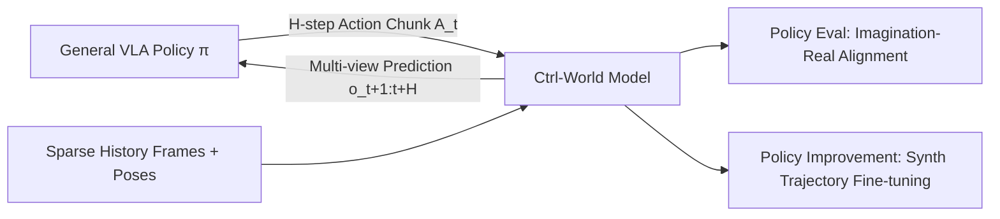

# Ctrl-World: A Controllable Generative World Model for Robot Manipulation

**Conference**: ICLR 2026  
**OpenReview**: [https://openreview.net/forum?id=748bHL2BAv](https://openreview.net/forum?id=748bHL2BAv)  
**Project Page**: [https://ctrl-world.github.io](https://ctrl-world.github.io)  
**Area**: Robotics / Embodied AI, World Models, Video Generation  
**Keywords**: World Model, VLA Policy, Multi-View Prediction, Action Conditioning, Policy Evaluation, DROID  

## TL;DR
Ours transforms pre-trained passive video diffusion models into a **controllable, multi-view, and long-term consistent** robotic world model. This allows general-purpose VLA policies to perform closed-loop rollouts in "imaginary space," enabling policy evaluation without real robots and improving success rates by 44.7% through fine-tuning on synthesized success trajectories.

## Background & Motivation
- **Background**: Vision-Language-Action (VLA) general-purpose policies can perform various manipulation skills but remain fragile when facing unfamiliar objects or instructions in open-world settings. Evaluating these policies requires massive real-robot rollouts, and improving them requires expensive expert error-correction data—both of which are slow, costly, and difficult to scale.
- **Limitations of Prior Work**: World models are scalable alternatives, but most existing action-conditioned world models are limited to **passive video prediction** and cannot truly interact with advanced general-purpose policies in a policy-in-the-loop manner. Specifically, they suffer from three flaws: (1) simulating only a single third-person perspective, leading to hallucinations due to partial observability (e.g., objects being "sucked" into the gripper without contact), and incompatibility with modern VLAs that require wrist views; (2) lack of fine-grained causal control for high-frequency actions; (3) poor temporal consistency in long-term generation, leading to error accumulation and drift.
- **Key Challenge**: Modern VLA policies require world models to simultaneously provide **multi-view prediction + fine-grained action control + long-term consistency**. Transforming a pre-trained video generator into a "policy-compatible interactive simulator" requires filling these three gaps.
- **Goal**: Construct a controllable multi-view world model capable of multi-step interaction with general-purpose policies to rank policies (aligning with real-robot performance) and synthesize successful trajectories to boost policy performance.
- **Core Idea**: **[Lightweight modification of pre-trained video diffusion models]** Starting from the 1.5B Stable-Video-Diffusion (SVD), only a new action projection MLP is initialized. By introducing multi-view joint prediction, frame-level action conditioning, and pose-conditioned memory retrieval, a passive video generator is converted into a controllable interactive simulator.

## Method

### Overall Architecture
Given an $H$-step action-chunk $A_t=[a_{t+1},\dots,a_{t+H}]$ output by policy $\pi$, the world model $W$ predicts future multi-view observations $o_{t+1:t+H}\sim W(\cdot\mid o_t, A_t)$. Then, $o_{t+H}$ is fed back into the policy to generate the next action-chunk. The policy and world model alternate autoregressively, achieving long-term rollouts in pure imaginary space. The model uses the spatial-temporal Transformer of the pre-trained SVD as its backbone, with three modifications superimposed.

### Key Designs

**1. Multi-view Joint Prediction: Completing observability and aligning with VLA input formats.** Modern VLAs rely on both third-person cameras (global context) and wrist-mounted cameras (fine-grained contact). Thus, the world model must generate spatially consistent predictions across views. Ctrl-World concatenates $N$ streams of images (each with $H\times W$ tokens) along the token dimension and jointly predicts all views $o_{t:t+H}$ using the feed-forward Transformer to capture multi-camera spatial relationships. A key Gain is the **introduction of the wrist view**—in contact-intensive interactions, the wrist camera provides fine-grained information on contact events and object state changes, significantly suppressing hallucinations such as "objects appearing in the gripper out of thin air" while improving overall consistency.

**2. Frame-level Action Conditioning: Tightly aligning high-frequency actions with visual dynamics.** Pre-trained video models only accept text and images, lacking control precision. Ctrl-World uses the action sequence $[a_{t+1:t+H}]$ as a condition, converting each action into a Cartesian robot pose $[a'_{t+1:t+H}]$ and concatenating it with historical poses $[q_{t-km},\dots,q_t]$. Through **frame-level cross-attention** in the spatial Transformer, visual tokens in each frame attend to their corresponding pose embeddings (real poses for history frames, action poses for future frames). This allows the model to produce distinct rollouts for actions differing by only centimeters, achieving centimeter-level control precision. Ablations show that removing this module drops the third-person PSNR from 23.56 to 21.20 and the wrist-view PSNR to 15.69.

**3. Pose-conditioned Memory Retrieval: Anchoring long-term drift with historical points.** Prediction errors accumulate in long rollouts, causing drift and distortion. Ctrl-World includes past frames in the input but, to avoid excessive context length, sparsely samples $k$ history frames with step $m$, such that $o_{t+1:t+H}\sim W(\cdot\mid o_{t-km},\dots,o_t,l)$. The corresponding robot poses $[q_{t-km},\dots,q_t]$ are injected into historical frames via frame-level cross-attention. This enables the model to **use robot poses to retrieve similar past states**, re-anchoring future predictions to relevant history. Attention visualizations show that predicting frame t=4s involves strong attention to frame t=0s when poses match. This is crucial for the wrist camera where the field of view changes drastically; predictions become blurred without memory.

**Loss & Training**: Only the action projection MLP is newly initialized; other parameters retain pre-trained weights and are fine-tuned with diffusion loss. Gaussian noise is added to the target $x_0=o_{t+1:t+H}$ as $x_{t'}=\sqrt{\alpha_{t'}}x_0+\sqrt{1-\alpha_{t'}}\epsilon_{t'}$, optimizing:
$$L = \mathbb{E}_{x_0,\epsilon,t'}\lVert \hat{x}_0(x_{t'},t',c)-x_0\rVert^2$$
where the condition $c=[q_{t-km},\dots,q_t, a'_{t+1:t+H}, o_{t-km},\dots,o_t]$ includes poses, actions, and history frames.

**Function (Evaluation & Improvement)**: For evaluation, a policy-in-the-loop rollout is performed given an initial observation and instruction, and success/failure is determined via human preference to rank policies. For improvement (Algorithm 1), search diversity is expanded by (i) rewriting instructions using an LLM and (ii) resetting the robot to random initial states in the world model. 400 trajectories are generated per task, and 25–50 successful ones are kept for supervised fine-tuning.

## Key Experimental Results

### Main Results: Long Trajectory Quality (Val set, 10s rollout, 256 clip average)

| Method | PSNR ↑ | SSIM ↑ | LPIPS ↓ | FID ↓ | FVD ↓ |
|---|---|---|---|---|---|
| WPE-Single-View | 20.33 | 0.772 | 0.131 | 25.50 | 156.4 |
| IRASim-Single-View | 21.36 | 0.774 | 0.117 | 26.46 | 138.1 |
| Ctrl-World-Single-View | 21.27 | 0.793 | 0.110 | 23.47 | 127.5 |
| **Ours (Multi-View)** | **23.56** | **0.828** | **0.091** | 25.00 | **97.4** |

Ours outperforms WPE/IRASim in fair single-view comparisons. Multi-view joint prediction further reduces FVD from 127.5 to 97.4.

### Ablation Study (Quality drop after removing components)

| View | Configuration | PSNR ↑ | SSIM ↑ | LPIPS ↓ | FVD ↓ |
|---|---|---|---|---|---|
| 3rd Person | Ours | 23.56 | 0.828 | 0.091 | 97.4 |
| 3rd Person | w/o memory | 23.06 | 0.812 | 0.099 | 105.5 |
| 3rd Person | w/o frame-level cond | 21.20 | 0.789 | 0.109 | 122.7 |
| Wrist View | Ours | 19.18 | 0.665 | 0.252 | 127.1 |
| Wrist View | w/o joint pred | 15.94 | 0.580 | 0.345 | 158.1 |
| Wrist View | w/o frame-level cond | 15.69 | 0.571 | 0.375 | 179.1 |

Removing any component results in a performance drop; frame-level conditioning and joint prediction are critical for the wrist view.

### Key Findings
- **Alignment with Real Robot**: Zero-shot evaluation of $\pi_0$ / $\pi_0$-FAST / $\pi_0.5$ on the DROID platform shows that imaginary instruction following rates highly correlate with real-world performance ($y=0.87x-0.04$), and success rates correlate at $y=0.81x-0.11$ (slightly underestimating low-level execution precision like collisions/rotations).
- **Policy Improvement**: Fine-tuning $\pi_0.5$ on synthetic success trajectories increased the average success rate from 38.7% to 83.4% across four task categories, a **Gain of 44.7%**.
- **Training Cost**: 2×8 H100 GPUs, batch size 64, ~2–3 days; maintains spatio-temporal consistency for new scenes/camera poses for over 20 seconds.

## Highlights & Insights
- **Unifying Evaluation and Improvement**: While prior world models focused mostly on video prediction, Ours proves a single controllable world model can serve as both a "judge" (ranking alignment) and a "data factory" (synthetic feedback-loop).
- **Wrist View as the Key to Hallucination Suppression**: While multi-view seems like just more data, experiments reveal that wrist cameras providing contact-level information determine whether contact-dense tasks can be correctly modeled; single-view partial observability is the root of hallucinations.
- **Lightweight Adaptation**: Only adding an action projection MLP and inheriting SVD knowledge shows that powerful video priors can be "controllable" at a low cost, rather than training world models from scratch.
- **Pose-Retrieval Memory**: Using robot poses as retrieval keys to align with historical frames is a more efficient and stable solution for long-term consistency than simply increasing context length.

## Limitations & Future Work
- **Insufficient Low-level Physics**: Precise modeling of complex dynamics like collisions and rotations is still lacking, causing success rates to be systematically underestimated.
- **OOD Failure Modes**: The DROID dataset contains some failure trajectories but is insufficient to cover all cases; supplementary in-domain policy rollout data is expected to narrow the gap.
- **Dependency on Human Labeling**: Success determination currently relies on human preference; scaling will require more mature VLM reward models.
- **Platform Specificity**: Experiments are tied to DROID (Panda arm + Robotiq gripper); cross-embodiment generalization is not yet verified.

## Related Work & Insights
- **Robot Video Generation**: Unlike using video models as policy backbones (relying on tracking/inverse dynamics) or synthesizing fake labels, Ours is a true action-conditioned predictor for evaluation and improvement.
- **Action-conditioned World Models**: Builds upon Dreamer, IRASim, and WPE by filling the gaps in multi-view support, long-term consistency, and fine-grained control for SOTA VLA policies.
- **Insight**: The "offline sandbox" route (ranking + synthetic data) is a valuable paradigm for any embodied AI domain where real interaction is expensive.

## Rating
- **Novelty**: ⭐⭐⭐⭐ — The combination of multi-view, frame-level action conditioning, and pose memory is an engineering integration, but the framework's use for evaluating/improving VLA policies and the insight on wrist-view hallucinations is a clear increment.
- **Experimental Thoroughness**: ⭐⭐⭐⭐ — Complete quality comparisons, exhaustive ablations, real-world correlation regressions, and downstream policy improvements; limited only by the single platform (DROID) and manual success labeling.
- **Writing Quality**: ⭐⭐⭐⭐ — Clear motivation, well-structured components, and convincing visualizations.
- **Value**: ⭐⭐⭐⭐ — Provides a practical paradigm for the evaluation and improvement of VLAs without real-robot access; the 44.7% Gain is significant for the community.

<!-- RELATED:START -->

## Related Papers

- [\[ICLR 2026\] World-In-World: World Models in a Closed-Loop World](world-in-world_world_models_in_a_closed-loop_world.md)
- [\[ICLR 2026\] Sparse Imagination for Efficient Visual World Model Planning](sparse_imagination_for_efficient_visual_world_model_planning.md)
- [\[ICLR 2026\] WorldGym: World Model as an Environment for Policy Evaluation](worldgym_world_model_as_an_environment_for_policy_evaluation.md)
- [\[ICLR 2026\] Genie Envisioner: A Unified World Foundation Platform for Robotic Manipulation](genie_envisioner_a_unified_world_foundation_platform_for_robotic_manipulation.md)
- [\[CVPR 2026\] Chain of World: World Model Thinking in Latent Motion (CoWVLA)](../../CVPR2026/robotics/chain_of_world_world_model_thinking_in_latent_motion.md)

<!-- RELATED:END -->
