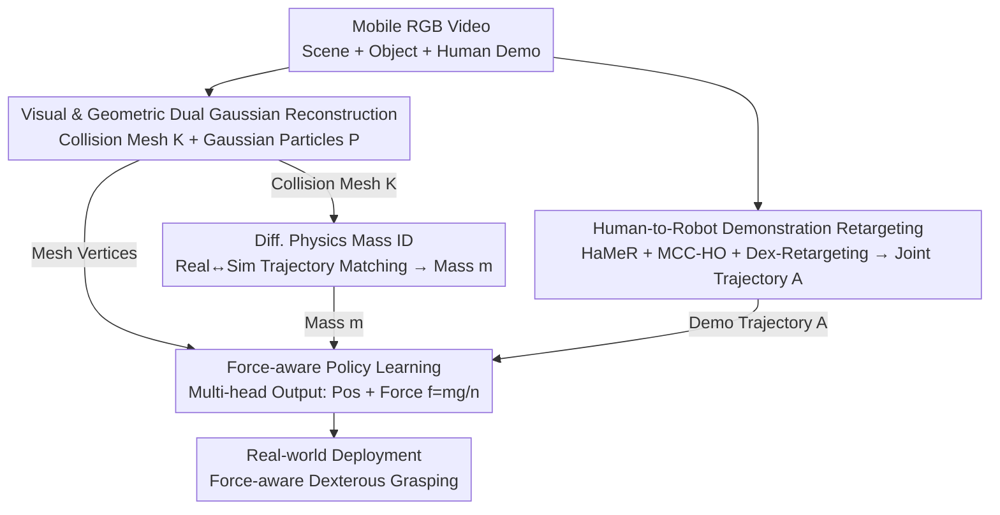

# D-REX: Differentiable Real-to-Sim-to-Real Engine for Learning Dexterous Grasping

**Conference**: ICLR 2026  
**arXiv**: [2603.01151](https://arxiv.org/abs/2603.01151)  
**Code**: [drex.github.io](https://drex.github.io)  
**Area**: 3D Vision / Robotic Manipulation  
**Keywords**: real-to-sim-to-real, differentiable physics simulation, system identification, dexterous grasping, Gaussian representation

## TL;DR
This paper proposes D-REX, a differentiable real-to-sim-to-real engine based on Gaussian representation. It performs end-to-end object mass identification through visual observations and robot control signals, and utilizes the identified mass for force-aware dexterous grasping policy learning, effectively narrowing the sim-to-real gap.

## Background & Motivation

**Background**: Simulation serves as a core platform for robot policy learning, yet the sim-to-real gap remains a fundamental challenge. Existing approaches, including domain randomization, system identification, domain adaptation, and digital twin construction, each have specific limitations.

**Limitations of Prior Work**:
   - Constructing precise digital twins requires integrating multiple pipelines such as geometric reconstruction and parameter identification, which is highly complex.
   - Estimating physical properties (e.g., mass) from visual observations is extremely difficult; initial estimates from SAM2/VLM typically deviate significantly from ground truth.
   - Existing grasping policies often rely solely on position control while ignoring force control—the same grasping pose can have vastly different outcomes for objects of different masses.
   - Non-differentiable simulators limit parameter optimization via backpropagation.

**Key Challenge**: High-fidelity physical simulation requires accurate physical parameters, yet these parameters are difficult to obtain from visual observations; grasping policies require force control, but the magnitude of force depends on unknown object mass.

**Goal**: (1) Identify object mass from robot-object interaction videos; (2) Use identified mass for force-aware dexterous grasping policy learning.

**Key Insight**: Leverage a differentiable physics engine to backpropagate through simulation trajectories, optimizing mass parameters to match simulated trajectories with real-world trajectories.

**Core Idea**: Construct digital twins using differentiable simulation and Gaussian representation, identify mass via trajectory matching, and subsequently learn a hybrid force-position grasping policy based on the identified mass.

## Method

### Overall Architecture
D-REX addresses the contradiction where the same grasping pose yields different results for objects of different masses, while mass itself cannot be directly "read" from vision. It establishes a real-to-sim-to-real closed loop from a mobile RGB video through four stages: first, reconstructing the video into a collision-capable and renderable digital twin (Visual and Geometric Dual Gaussian Reconstruction); second, having the robot perform the same pushing action in both reality and simulation, using a differentiable physics engine to fit simulation trajectories to real ones to solve for mass (Mass Identification); third, retargeting human demonstration videos into robot-executable joint trajectories (Demonstration Retargeting); and finally, training a force-aware policy that outputs both joint positions and grasping forces calculated based on identified mass (Policy Learning) for real-world deployment.

### Key Designs

**1. Visual and Geometric Dual Gaussian Reconstruction: Separating modeling for accurate collision and realistic rendering**

Collision detection requires clean and precise geometry, while visual supervision necessitates realistic rendering. These requirements for representation often conflict; forcing both into a single set of Gaussians can degrade performance. D-REX trains two sets of Gaussian primitives for mobile-captured videos: one set of 2D Gaussians with normal estimation to extract precise collision meshes $\mathcal{K}$, and another set of 3D Gaussians for high-fidelity rendering to output Gaussian particles $\mathcal{P}$. The former is used for contacts in the physics engine, while the latter provides visual supervision for trajectory matching.

**2. Differentiable Physics Engine + Trajectory Matching for Mass Identification: Aligning simulated trajectories to real ones for direct gradient descent on mass**

Mass is the basis for grasping force, but initial estimates from SAM2/VLM are often inaccurate (e.g., guessing 500g for a 125g object). Instead of "looking" at mass, D-REX "tests" it: the same pushing action is performed in the real world and simulation to collect object trajectories $\{\mathbf{s}_t^{real}\}$ and simulation trajectories $\{\mathbf{s}_t^{sim}(m)\}$ parameterized by mass. Real-world 6-DoF poses are provided by FoundationPose. The per-frame MSE between trajectories is then minimized:

$$\min_{m>0}\ \mathcal{L}_{traj}(m) = \sum_{t=1}^T \|\mathbf{s}_t^{sim}(m) - \mathbf{s}_t^{real}\|_2^2$$

Internally, the simulation uses semi-implicit Euler integration for state updates $G([\mathbf{s}_t, \mathbf{u}_t], m, \theta)$ and a compliant penalty-based model for contact. This makes the entire computation graph end-to-end differentiable, allowing gradients to propagate back to the mass parameter via automatic differentiation:

$$\frac{\partial \mathcal{L}}{\partial m} = \sum_t \frac{\partial \mathcal{L}}{\partial \mathbf{s}_t^{sim}} \cdot \frac{\partial \mathbf{s}_t^{sim}}{\partial \mathbf{M}_t} \cdot \frac{\partial \mathbf{M}_t}{\partial m}$$

Unlike methods like GradSim that require manually specified external forces, D-REX directly reuses consistent robot control signals to model external forces, effectively removing the need to estimate unknown external forces and allowing for clean mass optimization from interaction data.

**3. Human-to-Robot Demonstration Retargeting: Translating hand videos into robot-hand executable joint trajectories**

Policy learning requires demonstrations, but the kinematics of human and robot hands differ. D-REX uses HaMeR + MCC-HO to reconstruct human hand joints and 6-DoF object poses from video frames, then maps human hand movements to the robot hand's degrees of freedom via Dex-Retargeting. This outputs joint angle action sequences $\mathbf{A}_t \in \mathbb{R}^{J_r}$ that can be directly executed, transforming human manipulation videos into learnable robot demonstrations.

**4. Force-aware Policy Learning: Outputting grasping force derived from mass alongside position**

Grasping policies controlled only by position are insensitive to mass changes; heavy objects often fall. D-REX designs a policy $\pi_\phi$ that takes position-encoded object collision mesh vertices as input. A multi-head network simultaneously predicts joint positions $\hat{\mathbf{A}} \in \mathbb{R}^{16}$, contact constraints $\hat{\mathbf{r}} \in \mathbb{R}^2$, and grasping force constraints $\hat{\mathbf{f}} = \frac{m \cdot g}{n_{active}}$. The force constraint is directly calculated from the mass $m$ identified in step 2, distributing gravity among $n_{active}$ active contact points. Thus, the physical quantity of mass is explicitly injected into the grasping force. Training occurs in two stages: first, position control is learned to converge the grasping pose, followed by retraining with force control constraints to avoid instability during dual-objective optimization.

### Loss & Training
Mass identification uses trajectory MSE loss with Adam optimization for approximately 200 epochs (5–20 minutes). Policy training uses supervised learning on retargeted demonstration data with additional contact constraint losses.

## Key Experimental Results

### Mass Identification

| Object | VLM Inferred Mass | Identified Mass | Ground Truth | Error % |
|------|-----------|---------|------|-------|
| Letter U | 500g | 110g | 125g | 12.0% |
| Letter A | 500g | 145g | 134g | 9.0% |
| Lego | 300g | 53g | 59g | 8.6% |
| Cookie | 500g | 200g | 210g | 4.8% |
| Ketchup | 1000g | 667g | 726g | 8.1% |

Experiments with different densities for the same geometry showed identification errors within 13g across three densities.

### Grasping Experiments

| Method | Overall Performance |
|------|---------|
| DexGraspNet 2.0 | Low success rate with high variance |
| Human2Sim2Robot | Significant performance degradation as object mass increases |
| **D-REX** | High success rate and low variance across all 8 objects |

Cross-evaluation demonstrates that the policy achieves optimal performance only when training and evaluation masses match (75-95% when matched vs. 15-40% when mismatched), proving the necessity of force control.

### Ablation Study
- Force-conditioned policy vs. Position-only policy: Force conditioning consistently performs better across all objects.
- Identified mass vs. GT mass: Policies using identified mass perform comparably to those using ground truth mass and significantly outperform those using random mass.
- Pushing task design (virtual pivot + reduced friction) is critical for accurate mass identification.

## Highlights
- First to integrate differentiable physical simulation and Gaussian representation for mass identification in a real-to-sim-to-real framework.
- The hybrid force-position policy learning is a significant complement to purely position-based policies, with compelling experimental results.
- Large discrepancies between VLM-inferred mass and ground truth (e.g., 500g vs. 125g) demonstrate the necessity of physical identification.
- An end-to-end pipeline from video to digital twin to policy deployment that is complete and practically usable.

## Limitations & Future Work
- Mass identification relies on simple pushing interactions, which may not apply to all object types.
- The reconstruction process takes 30-35 minutes per object, and mass identification takes 5-20 minutes, limiting immediate deployment.
- Only mass is identified; other physical parameters like friction coefficients are not addressed.
- Demonstration retargeting depends on the quality of hand estimation from HaMeR/MCC-HO, which may not be robust in heavily occluded scenes.
- Only tabletop grasping scenarios were tested; more complex manipulation tasks (e.g., pouring, tool use) remain unverified.
- Stiffness and damping parameters in the compliant contact model still require manual setting.

## Related Work & Insights
- vs. GradSim: Also performs system identification via differentiable simulation, but D-REX is more practical by utilizing robot control signals directly rather than manual external forces.
- vs. DexGraspNet 2.0: Trained on large-scale simulation data but lacks force control, leading to sensitivity to mass changes.
- vs. Human2Sim2Robot: Learns from human videos but only uses position control, causing high-mass objects to drop easily.
- vs. Gaussian-based digital twin methods: Most focus only on visual reconstruction, while D-REX further identifies physical parameters.

## Rating
- Novelty: ⭐⭐⭐⭐ (Complete pipeline of diff-sim + Gaussian + force-aware policy)
- Experimental Thoroughness: ⭐⭐⭐⭐ (Real-world validation + multi-dimensional ablation)
- Writing Quality: ⭐⭐⭐⭐
- Value: ⭐⭐⭐⭐ (Practical advancement for the sim-to-real field)

<!-- RELATED:START -->

## Related Papers

- [\[ICLR 2026\] RobotArena ∞: Scalable Robot Benchmarking via Real-to-Sim Translation](robotarena_infty_scalable_robot_benchmarking_via_real-to-sim_translation.md)
- [\[ICLR 2026\] Latent Adaptation of Foundation Policies for Sim-to-Real Transfer](latent_adaptation_of_foundation_policies_for_sim-to-real_transfer.md)
- [\[CVPR 2026\] RoboWheel: A Data Engine from Real-World Human Demonstrations for Cross-Embodiment Robotic Learning](../../CVPR2026/robotics/robowheel_a_data_engine_from_real-world_human_demonstrations_for_cross-embodimen.md)
- [\[CVPR 2026\] VIRAL: Visual Sim-to-Real at Scale for Humanoid Loco-Manipulation](../../CVPR2026/robotics/viral_visual_sim-to-real_at_scale_for_humanoid_loco-manipulation.md)
- [\[ICLR 2026\] DemoGrasp: Universal Dexterous Grasping from a Single Demonstration](demograsp_universal_dexterous_grasping_from_a_single_demonstration.md)

<!-- RELATED:END -->
